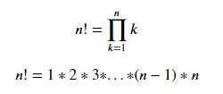

###  재귀 함수(recursive function)

재귀 함수는 함수 내부에서 자기 자신을 호출하는 함수를 뜻한다.

### 실습 문제 - 팩토리얼 계산

> `팩토리얼(factorial)`을 계산하는 함수 `fact(n)`를 작성해봅시다.
>
> n은 1보다 큰 정수라고 가정하고, 팩토리얼을 계산한 값을 반환합니다.



----

예시)

​	fact(5) #=> 120

```python
def fact(n):
    result = 1
    for i in range(1, n+1):
        result *= i
    return result
```

```python
print(fact(5))
120
```

### 예제 문제 - 재귀를 이용한 팩토리얼 계산

예시)

 	1! = 1

​	2! = 1 * 2 = 1!  * 2

​	3! = 1 * 2 * 3 = 2! * 3

```python
def factorial(n):
    if n == 0:
        return 1
    else:
        return n * factorial(n-1)
```

```python
print(factorial(5))
120
```

### 실습문제 - 피보나치 수열

> 피보나치 수열은 다음과 같은 점화식이 있다.
>
> 피보나치 값을 리턴하는 두가지 방식의 코드를 모두 작성해보자.


```python
def fib(n):
    if n ==1 or n ==0:
        return 1
    else:
        return fib(n-2)+fib(n-1)
print(fib(10))
```

- 반복문으로도 짜보자

```python
def fib_loop(n):
    a=[1,1]
    for i in range(0,n):
        a += [a[i]+a[i+1]]
    return a[-1]
print(fib_loop(0))
```

### 실습문제 - 하노이의 탑

> 다음은 하노이의 탑이다.
>
> 하노이의 탑을 풀이하는 해법(한쪽 탑의 원판을 다른 탑으로 모두 옮기는 법을 출력하는 함수를 만드세요.)

1. 한 번에 한 개의 층만을 다른 기둥으로 옮길 수 있다.
2. 옮기려는 기둥에는 아무것도 없거나 옮기려는 층보다 큰 층이 있을 경우에만 옮길 수 있다.
3. 옮기려는 기둥에 옮기려는 층보다 작은 층이 이미 있을 경우 그 기둥으로 옮길 수 있다.
4. 가능한 적은 회수로 전체 탐을 다른 기둥으로 옮긴다.

```python
# 아래에 코드를 작성해주세요.
def top(n):
    if n == 1:
        return 1
    else:
        return 2**(n-1) + top(n-1)
print(top(4))

#선생님
def hanoi(n, start, tmp, end):
    if n:
        hanoi(n-1, start, end, tmp)
        print(f'{n}번째 원판을 {start}에서 {end}로')
        
		hanoi(n-1, tmp, start, end)
        
print(hanoi(4, 'a','b','c'))
```

```python
15
1번째 원판을 a에서 b로
2번째 원판을 a에서 c로
1번째 원판을 b에서 c로
3번째 원판을 a에서 b로
1번째 원판을 c에서 a로
2번째 원판을 c에서 b로
1번째 원판을 a에서 b로
4번째 원판을 a에서 c로
1번째 원판을 b에서 c로
2번째 원판을 b에서 a로
1번째 원판을 c에서 a로
3번째 원판을 b에서 c로
1번째 원판을 a에서 b로
2번째 원판을 a에서 c로
1번째 원판을 b에서 c로
None
```

### 실습문제 - Palindrome

```python
def Palindrome(n):
    if len(n)==1 or len(n) == 0:
        return True
    elif n[0] == n[-1]:
        return Palindrome(n[1:len(n)-1])
    elif n[0] != n[-1]:
        return False
print(Palindrome('asda'))
print(Palindrome('asasa'))
print(Palindrome('assa'))
print(Palindrome('acasa'))
```

```python
False
True
True
False
```

