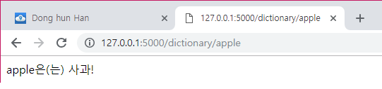
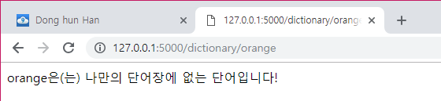

# Flask

> Background

```
Web, Request, Response
Flask
```

> Goal

```
Flask 기본 구조의 이해
```

> Problem

- Flask에서 Dictionary 자료형을 이용하여 다음 조건을 만족하는 '나만의 영어 단어장' 페이지를 만들어보세요.

| 주소(route)          | /dictionary/<string:word> |
| -------------------- | ------------------------- |
| 페이지에 표시할 내용 | 예) apple은 사과          |

- 실행 결과

  

  
