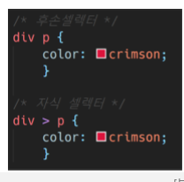

# CSS

```
학습해야 할 내용
- CSS Syntax
- CSS Seclector
```

1. CSS은 무엇의 약자인가? [**2**]

   (1) Creative Style Sheets

   (2) Cascading Style Sheets

   (3) Computer Style Sheets

   (4) Colorful Style Sheets


2. 다음 중 맞으면 T, 틀리면 F를 기입 하시오.
   - HTML과 CSS는 각자 문법을 갖는 별개의 언어이다. [**T**]
   - 웹 브라우저는 내장 기본 스타일이 있어 CSS가 없어도 작동한다. [**T**]
   - 자식요소 프로퍼티는 부모의 프로퍼티를 모두 상속 받는다. [**T**]


3. 크기 단위 em은 요소에 지정된 상속된 사이즈나 기본 사이즈에 대해 상대적인 사이즈를 설정한다. 즉, 상속의 영향으로 사이즈가 의도치 않게 변경될 수 있는데 이를 예방하기 위해 HTML 최상위 요소의 사이즈를 기준으로 삼는 크기 단위는 무엇인가?

   `rem`

4. 다음 예제를 통해 "후손 셀렉터"와 "자식 셀렉터"의 차이를 설명하시오.



- 후손 셀렉터

  후손 셀렉터는 특정 요소의 하위에 있는 요소를 선택합니다. 위와 같은 예시에선 `div` 요소의 하위에 있는 `p` 요소를 선택했습니다. 이때 `div`와 `a` 사이에 요소가 더 있어도 선택이 됩니다.

  ```css
  <div>
  	<p></p>
  </div>
  ```

  이렇게 되도 `<p></p>`태그가 선택되고

  ```css
  <div>
  	<aside>
  		<p></p>
  	</aside>
  </div>
  ```

  이런 식으로 선택해도 `<p></p>`태그가 선택됩니다.

- 자식 셀렉터

  자식 셀렉터는 특정 요소의 자식 요소를 선택합니다. 위의 사진에서는 `div` 요소의 자식 요소 중 `p`요소를 선택합니다. 주의할 점은 한 단계 아래에 있는 요소만 선택합니다.

  ```css
  <div>
  	<p></p>
  </div>
  ```

  이럴 땐 `<p></p>`태그를 선택하지만

  ```css
  <div>
  	<aside>
  		<p></p>
  	</aside>
  </div>
  ```

  일 때는 `<p></p>`태그를 선택하지 않습니다.

