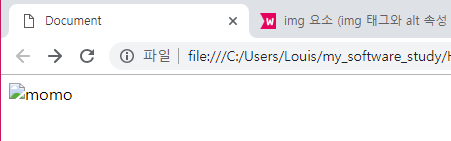
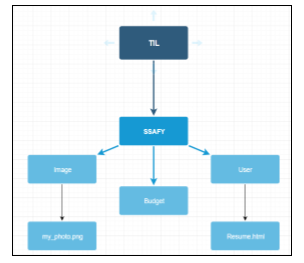

# HTML

> Background

```python
Semantic Web
```

> Goal

```
HTML tag를 이해한다.
Layout 구조를 이해한다.
```

>Problem

- 클릭하면 https://www.ssafy.con/ 로 이동하는 버튼을 만드시오.

  ```html
  <!DOCTYPE html>
  <html lang="en">
  <head>
      <meta charset="UTF-8">
      <meta name="viewport" content="width=device-width, initial-scale=1.0">
      <meta http-equiv="X-UA-Compatible" content="ie=edge">
      <title>Document</title>
  </head>
  <body>
      <a href="https://www.ssafy.com/"><button>SSAFY</button></a>
  </body>
  </html>
  ```

- 다음 태그에서 잘못된 부분을 찾으시오.

  ```html
  
  ```

  ``태그에서 `href`  속성을 사용한 것이 잘못된 부분입니다 !

  ``태그에선 `src`속성에 이미지 주소를 넣어 사용한다.

  ```html
  <body>
      
  </body>
  ```

  

   `alt`속성은 Alternate(대체하다)의 줄임 말로서 `src`속성에서 부른 이미지를 못 읽어 온다면, alt 속성의 내용이 이미지를 대체하여 나타낸다.

  

- 당신은 현재 Resume.html에서 작업중이다. "내 사진"이라는 링크를 누르면 Image 폴더 안에 my_photo를 띄워주는 a 태그 경로를 넣으시오.



```html
<!DOCTYPE html>
<html lang="en">
<head>
    <meta charset="UTF-8">
    <meta name="viewport" content="width=device-width, initial-scale=1.0">
    <meta http-equiv="X-UA-Compatible" content="ie=edge">
    <title>Document</title>
</head>
<body>
    <a href="C:\Users\Louis\my_software_study\Homeworks\1월21일\image\my_photo.jpg">내 사진</a>
</body>
</html>
```

