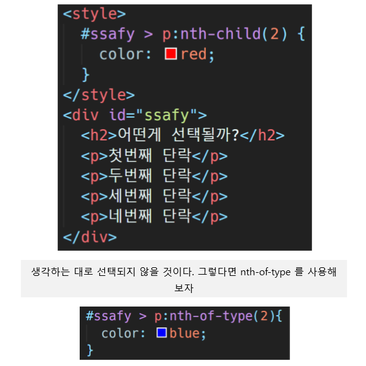

# CSS

> Background

```
HTML
```

> Goal

```
CSS Selector를 이해한다.
CSS 프로퍼티를 이해한다.
```

> Problem

- Selector를 활용한 DOM 탐색 실습.

  

- 둘의 차이점 !
  - nth-child(n)
    - 부모 엘리먼트의 모든 자식 엘리먼트중 n번째
  - nth-of-type(n)
    - 부모 엘리먼트의 특정 자식 엘리먼트중 n번째

- 예제

  ```html
  <div class="box">
      <p>1. p태그1</p>
      <span>2. span태그1</span>
      <p>3. p태그2</p>
      <span>4. span태그2</span>
      <p>5. p태그3</p>
  </div>
  ```

  ```css
  .box > p:nth-child(5){
      color:red;
  }
  ```

  이렇게하면 5번 `5. p태그3`이 빨간색이 된다.

  ```css
  .box > p:nth-of-type(3){
      color:blue;
  }
  ```

  이렇게하면 5번 `5. p태그3`이 파란색이 된다.


### nth-child는 p와 span태그 두개다 순서에 포함시켰기에 p:nth-child(5)

### nth-of-type은 p태그만을 순서에 포함시켰기에 p:nth-child(3)

