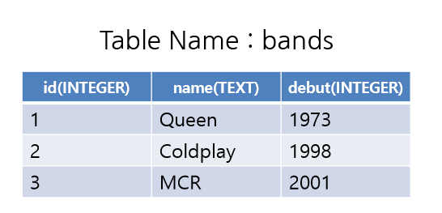

# Django Web Framework

> Background

```
SQL
DB
```

> Goal

```
테이블의 생성
데이터의 Create, Retrieve
```

> Problem

- 아래 표와 같은 스키마를 가진 DB 테이블을 생성하고, 아래와 같이 Data를 입력해 봅시다.

  - create_bands.sql

    ```sql
    CREATE TABLE bands(
        id INTEGER PRIMARY KEY AUTOINCREMENT,
        name TEXT NOT NULL,
        debut INTEGER NOT NULL
    );
    ```

  - workspace

    ```
    $ sqlite3 bands.sqlite3
    sqlite> .read create_bands.sql
    sqlite> .mode column
    sqlite> .header on
    sqlite> INSERT INTO bands VALUES (1, 'QUEEN', 1973);
    sqlite> INSERT INTO bands VALUES (2, 'Coldplay', 1998);
    sqlite> INSERT INTO bands VALUES (3, 'MCR', 2001);
    ```




- bands 테이블에서 모든 데이터 레코드의 id 와 name 만 조회하는 Query를 작성하라.

  ```
  sqlite> SELECT id, name FROM bands;
  id          name      
  ----------  ----------
  1           QUEEN     
  2           Coldplay  
  3           MCR     
  ```

- bands 테이블에서 debut가 2000보다 작은 밴드들의 이름만을 조회하는 Query를 작성하라.

  ```
  sqlite> SELECT name FROM bands WHERE debut>2000;
  name      
  ----------
  MCR   
  ```
