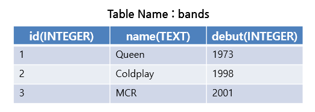
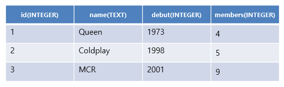

# Django Web Framework

> Background

```
- SQL
- DB
```

> Goal

```
- 테이블의 수정
- 데이터의 Update, Destroy
```

> Problem

- 저번 워크샵에서 아래 표와 같은 DB를 제작한 상태다.



> create_bands.sql

```sql
CREATE TABLE bands(
	id INTEGER PRIMARY KEY AUTOINCREMENT,
    name TEXT NOT NULL,
    debut INTEGER NOT NULL
);
```

```
$sqlite3 bands.sqlite3
```

```
sqlite>.read create_bands.sql
sqlite>INSERT INTO bands VALUES(1,Queen,1973);
sqlite>INSERT INTO bands VALUES(2,Coldplay,1998);
sqlite>INSERT INTO bands VALUES(3,MCR,2001);
```

- 해당 테이블을 수정하여, 다음과 같이 칼럼을 추가하고, 데이터를 삽입하라.



- 멤버 열을 추가했다.

```sql
sqlite>ALERT TABLE bands ADD COLUMN members INTEGER;
```

-  멤버 수를 넣어봅시다.

```SQL
sqlite>UPDATE bands SET members=4 WHERE id = 1;
sqlite>UPDATE bands SET members=5 WHERE id = 2;
sqlite>UPDATE bands SET members=9 WHERE id = 3;
```

- Id가 3인 레코드의 members를 5로 수정합시다.

```sql
sqlite>UPDATE bands SET members=5 WHERE id = 3;
```

- Id가 2인 레코드를 삭제합시다.

```sql
sqlite>DELETE FROM bands WHERE id = 2;
```

