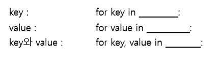

# 함수

- 학습해야 할 내용
  - 조건문 및 반복문
  - 함수

1. List는 for문을 실행하면 모든 요소를 순차적으로 돌면서 반복문을 수행합니다. 임의의 리스트 my_list의 값을 하나씩 출력하는 코드를 아래에 작성하시요.

   ```python
   my_list = ['a','b','c','d','e','z']
   for i in my_list:
       print(i)
   #결과
   a
   b
   c
   d
   e
   z
   ```

2. 위에 작성한 코드를 인덱스(index) 값과 함께 출력하는 코드로 변경하시오.

   ```python
   my_list = ['a','b','c','d','e','z']
   for index,value in enumerate(my_list,2):
       print("index : {}, value : {}".format(index, value))
   #결과
   index : 0, value : a
   index : 1, value : b
   index : 2, value : c
   index : 3, value : d
   index : 4, value : e
   index : 5, value : z
   ```

3. 딕셔너리는 key, value로 구성되어 있다. 따라서, 딕셔너리 my_dict 각각의 상황에 따라 반복문을 수행할 수 있도록 빈칸을 채우시오.

   

   ```python
   my_dict = {"A":1,"B":2,"C":3,"Z":26}
   #key만 출력
   for key in my_dict.keys():
       print("키값 : {}".format(key), end=' ')
   print('')
   #value만 출력
   for value in my_dict.values():
       print("밸류값 : {}".format(value), end=' ')
   print('')
   #key, value 출력
   for key,value in my_dict.items():
       print("키 : {},밸류 : {}".format(key,value), end=' ')
   ```

4. result에 저장된 값은?

   ```python
   def my_func(a,b):
       c=a+b
       print(c)
   result =  my_func(1,5)
   #결과
   6
   ```
