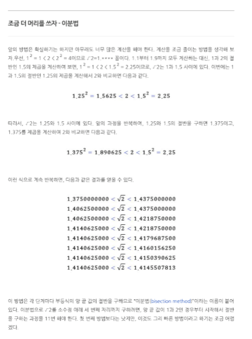

# 함수

> Background

- 조건문 및 반복문
- 함수

> Goal

- 함수에 대한 이해

> Problem

- 양의 정수 x를 입력 받아 제곱근의 근사값의 결과를 반환하는 함수를 작성하세요.
- sqrt() 사용 금지



```python
def function(x):
    count = 0
    b = 1
    while b**2<x:
        b+=1
    a=b-1
    while count != 10:
        if ((a+b)/2)**2>x:
            b=(a+b)/2
        else:
            a=(a+b)/2
        count+=1
    return a,b
print(*function(10))

#선생님
def my_sqrt(n):
    x,y = 0, n
    answer = 0
    
    while abs(answer ** 2 - n) > 0.0001:
        answer = (x + y)/2
        if answer ** 2 < n:
            x = answer
        else:
            y = answer
    return answer

print(my_sqrt(2))

#선생님 2
def my_sqrt(n):
    minimum, maximum = 0, 1
    while 1:
        if n == maximum **2:
            return maximum
        elif minimum ** 2 < n < maximum ** 2:
            guess = (minimum + maximum) /2
            
            if round(minimum, 5) == round(maximum, 5):
                return round(guess, 5)
            elif guess ** 2 > n:
                maximum = guess
            else:
                minimum = guess
        else:
            minimum += 1
            maximum += 1
            
print(my_sqrt(5))
```

