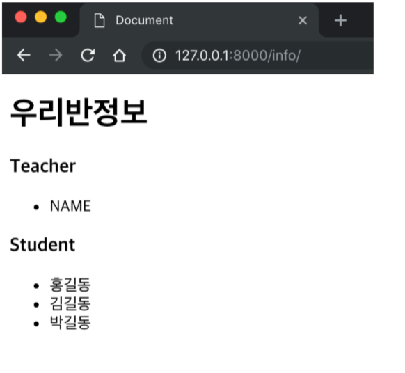
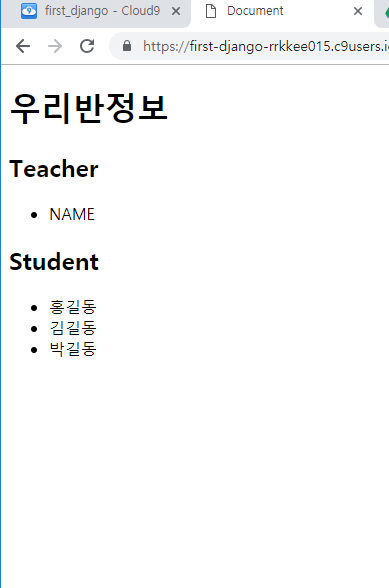
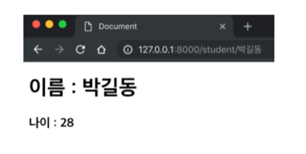

# Django Web Framework

> Background

```
> Web framework
> Django
```

> Goal

```
> Web framework에 대한 이해
> Django 프로젝트 생성
```

> Problem

### 이름이 frist_workshop인 프로젝트를 생성해주세요.

----

>  zzu.li/install-pyenv

```python
git clone https://github.com/pyenv/pyenv.git ~/.pyenv
echo 'export PYENV_ROOT="$HOME/.pyenv"' >> ~/.bashrc #환경변수 제작
echo 'export PATH="$PYENV_ROOT/bin:$PATH"' >> ~/.bashrc #경로변수에 넣어주고
echo -e 'if command -v pyenv 1>/dev/null 2>&1; then\n  eval "$(pyenv init -)"\nfi' >> ~/.bashrc
exec "$SHELL"

git clone https://github.com/pyenv/pyenv-virtualenv.git $(pyenv root)/plugins/pyenv-virtualenv
echo 'eval "$(pyenv virtualenv-init -)"' >> ~/.bashrc
exec "$SHELL"
```

- 위의 모든 코드를 한 줄씩 c9 workspace에 복사 붙여넣기 합시다.
- 다 하고 나서 확인을 위해 `pyenv --version`을 입력합시다. `pyenv 1.2.9-2-g6309aaf2`가 떴다면 성공입니다.
- 이제 아래와 같은 절차를 합니다.

> workspace

```python
$ pyenv install 3.6.7
$ python global 3.6.7
```

- 드디어 first_workshop인 프로젝트를 만들어 봅시다. 우선 똑같은 이름의 First_workshop 폴더를 생성하고 그 폴더 안에서 아래와 같은 명령어를 실행합니다.

> workspace

```python
$ cd/First_workshop
workspace/First_workshop $ pyenv virtualenv 3.6.7 First_workshop-venv
workspace/First_workshop $ pyenv local First_workshop-venv
```

- 드디어 장고를 설치합니다.

> workspace

```python
$ pip install django
```

- 이제 프로젝트를 시작하면 됩니다.

> workspace

```python
$ django-admin startproject first_workshop intro .
```

----

### `http://<your-server-url>/info`의 경로로 들어갔을 때 다음과 같이 반 정보를 보여주는 페이지를 만들어 주세요.



---

1. 만들기 위해서 app을 만들어 봅시다.

> workspace

```python
workspace/First_workshop $ python manage.py startapp pages
```

2. 그러고 views.py에 함수를 정의합시다.

> pages/views.py

```python
from django.shortcuts import render

# Create your views here.

def info(request):
    return render(request, 'info.html')
```

3. 그 뒤엔 문지기 urls.py에 가서 문을 `info`를 받으면 문을 열어놔라고 명령을 해줍시다.

> first_workshop/urls.py

```python
from django.contrib import admin
from django.urls import path
from pages import views #보다 편히 불러오기 위해서 from ... import ...를 사용합니다.

urlpatterns=[
    path('admin/',admin.site.urls),
    path('info/',views.info)
]
```

4. 이젠 `info.html`이라는 집을 만들어 봅시다.

> pages/templates/info.html

```html
<!DOCTYPE html>
<html lang="en">
<head>
    <meta charset="UTF-8">
    <meta name="viewport" content="width=device-width, initial-scale=1.0">
    <meta http-equiv="X-UA-Compatible" content="ie=edge">
    <title>Document</title>
</head>
<body>
    <h1>우리반정보</h1>
    <h2>Teacher</h2>
    <ul>
        <li>NAME</li>
    </ul>
    <h2>Student</h2>
    <ul>
        <li>홍길동</li>
        <li>김길동</li>
        <li>박길동</li>
    </ul>
</body>
</html>
```

- 이렇게 하면 아마 페이지가 열리지 않을 것입니다. 그 이유는 `settings.py`에서 미리 절차를 안 했기 때문입니다.

> first_workshop/settings.py

```python
...
ALLOWED_HOSTS = ["first-django-rrkkee015.c9users.io"] #서버를 처음 실행했을 때 뜨는 url에서 http://를 지우고 마지막 /를 지운 알짜배기만 넣어 줍니다.
...
INSTALLED_APPS = [
    ...
    ...
    'django.contrib.staticfiles',
    'pages.apps.PagesConfig' #얘를 추가해줍시다.
]
```

- 이러고 출력하면 완료 !



---

### `https://<your-server-url>/student/<학생이름>`의 경로로 들어갔을 때 다음과 같이 학생의 이름과 나이를 보여주는 페이지를 만들어 주세요



----

1. views.py에서 새로운 함수를 선언합니다. 길동이의 나이는 모르니 임의로 정했습니다.

> pages/views.py

```python
from django.shortcuts import render

# Create your views here.

def info(request):
    return render(request, 'info.html')
    
def student(request, name):
    students={"홍길동":27,"박길동":28,"김길동":29}
    return render(request, 'student.html', {'name':name,'age':students[name]})
```

- 이름과 나이를 동시에 건내주었습니다.

2. 문지기에게 이런 친구가 있다고 말해줍시다.

> first_workshop/urls.py

```python
from django.contrib import admin
from django.urls import path
from pages import views

urlpatterns = [
    path('admin/', admin.site.urls),
    path('info/',views.info),
    path('student/<str:name>/',views.student) #이름을 url로 받는데 그 이름의 형태는 str이 되어야 합니다.
]
```

3. 이제 `student.html`을 꾸며줍시다.

> pages/templates/student.html

```html
<!DOCTYPE html>
<html lang="en">
<head>
    <meta charset="UTF-8">
    <meta name="viewport" content="width=device-width, initial-scale=1.0">
    <meta http-equiv="X-UA-Compatible" content="ie=edge">
    <title>Document</title>
</head>
<body>
    <h1>이름 : {{name}}</h1> <!--parameter로 name를 넘겼으니 받을 수 있습니다.-->
    <h2> 나이 : {{age}}</h2> <!--parameter로 age를 넘겼으니 받을 수 있습니다.-->
</body>
</html>
```

