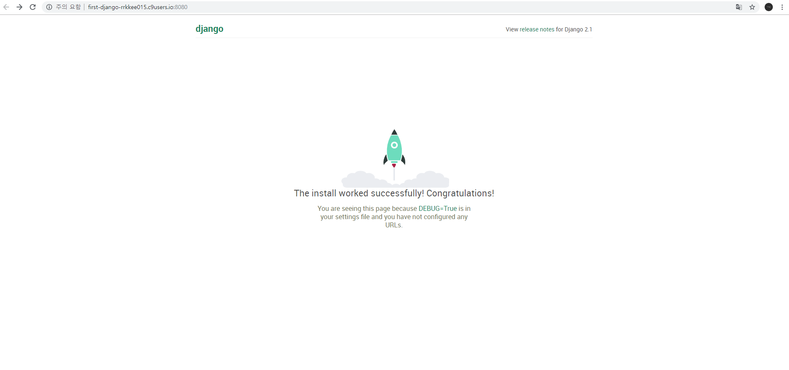
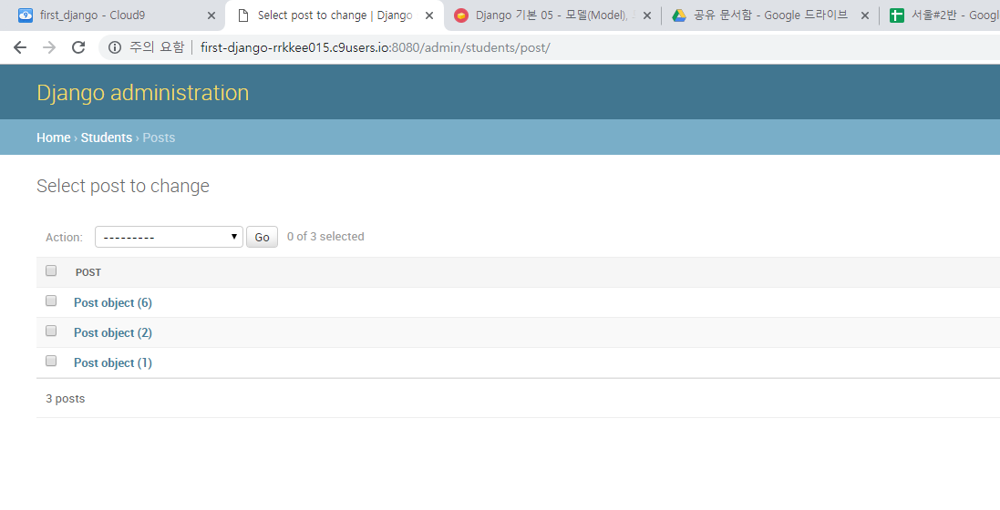
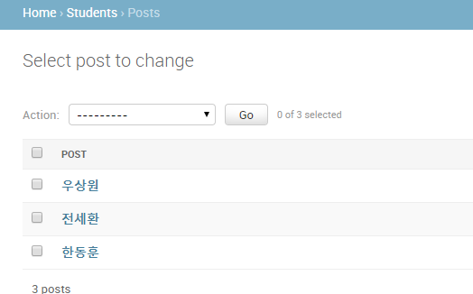

# Python활용 SQL

> Background

```
- SQL
- Django Model
```

> Goal

```
- Django Modeling
```

> Problem

- 자신의 반에 있는 사람들의 데이터를 저장하는 Student 모델을 생성합니다.

  Student 모델이 가져야 할 필드는 아래와 같습니다.


- name(이름) : CharField

  email(이메일):CharField

  birthday(생년월일):dateField

  age(나이):IntegerField


- 모델 마이그레이션 작업을 거친 후

  Admin페이지에서 주변 학생들의 이름을 세명 저장합니다.


- 저장 후 Admin페이지에서 학생들의 목록을 보기 쉽게 만들기 위해서 `__str__`메소드를 오버라이드 하여 name이 출력되게 만듭니다.


## 과정

- 우선 내가 사용할 app을 만들어 봅니다.

> workspace

```shell
> mkdir STUDENT
> cd STUDENT
> pyenv virtualenv 3.6.7 student-venv
> pyenv local student-venv
> pip install django #django 설치
> django-admin startproject student .
> python manage.py startapp students
```

- `settings.py`를 손 봐줍니다.

> settings.py

```python
INSTALLED_APPS = [
    'django.contrib.admin',
    'django.contrib.auth',
    'django.contrib.contenttypes',
    'django.contrib.sessions',
    'django.contrib.messages',
    'django.contrib.staticfiles',
    'students'
]
```

- models.py에서 class를 정의합니다.

> models.py

```python
from django.db import models

class Post(models.Model):
    name = models.CharField(max_length=100)
    email = models.CharField(max_length=100)
    birthday = models.DateField()
    age = models.IntegerField()
```

- 정의를 했으면 migrate 과정을 걸칩니다.

> workspace

```shell
> python manage.py makemigrations
> python manage.py migrate
```

- 이제 shell 실행을 해봅시다.

> workspace

```shell
> python manage.py shell
```

- 여기까지 했으면 서버를 실행해서 start url을 `ALLOWED_HOSTS = []` 값에 넣어주고 admin 페이지를 실행하기 위해서 `admin.py`에서 추가로 명령어를 삽입합니다.

> workspace

```python
> python manage.py runserver $IP:$PORT
```

> settings.py

```python
ALLOWED_HOSTS = ["first-django-rrkkee015.c9users.io"]
```

> admin.py

```python
from django.contrib import admin
from .models import Post

admin.site.register(Post)
```

> workspace

```shell
> python manage.py createsuperuser
> Username : admin
> Email address : #무시
> Password : 12341234
> Password (again) : 12341234
```

- 여기까지 하고 서버를 다시 실행하고 URL로 들어가보면 로켓이 날고 있습니다.



- 주소창에 `/admin`을 추가하여서 관리자 URL을 실행합니다. 방금 입력한 ID와 비밀번호를 입력합니다.  이제 주변 학생들의 이름을 세명 저장하도록 합니다.



- Admin 페이지에서 학생들의 목록을 보기 쉽게 만들기 위해서 `__str__` 메소드를 오버라이드 하여 name이 출력되게 만듭니다.

> models.py

```python
from django.db import models

class Post(models.Model):
    name = models.CharField(max_length=100)
    email = models.CharField(max_length=100)
    birthday = models.DateField()
    age = models.IntegerField()

    def __str__(self):
        return f'{self.name}'
```

