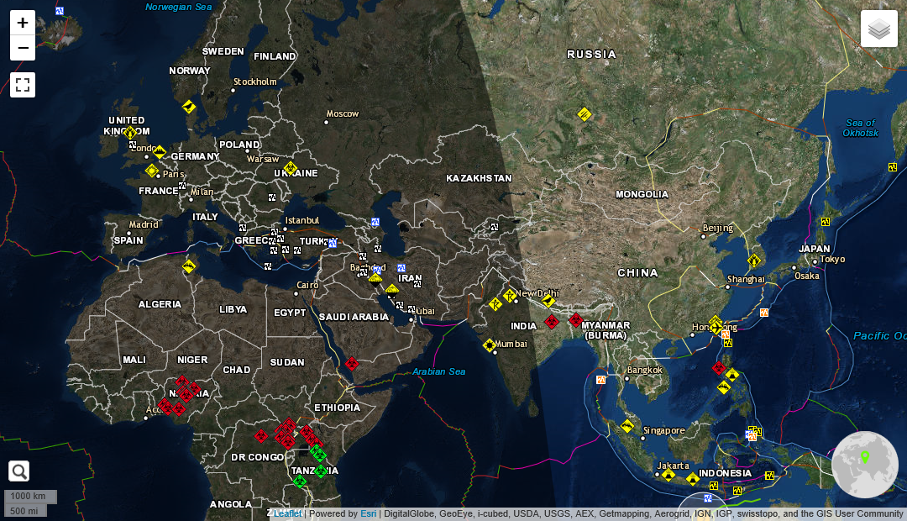
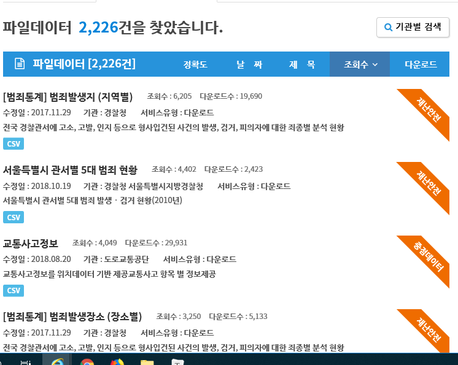

# 재난 안전 데이터 포털

지도에 우리나라 지난 1년 동안의 재난 종류 (산불, 지진, 건물붕괴, 홍수, 가뭄 등)를 종합하여 지도에 표시하는 포털 사이트

목적 : 원인 규명과 사람들의 경각심을 깨우기 위함

현재 있는 데이터들 하지만, 지도로 한 눈에 볼 수 없음. (csv 엑셀 파일로 적혀있기 때문에)

필요한 것 : 한 눈에 볼 수 있는 UI (예를들어, 산불, 범죄, 홍수 카테고리 전부 분류하기)

할 것 : 주의하는 재난을 체크하면 거기에 대한 알림을 받을 수 있도록 함

ex) 농부 = > 홍수와 가뭄에 민감, 어부 = > 해일

대구 광역시 2014년 화재통계 예시

| 구분   | 실화(건) | 자연적 요인(건) | 방화(건) | 미상(건) | 실화(%) | 자연적 요인(%) | 방화(%) | 미상(%) | 인명피해 사망(명) | 인명피해 부상(명) | 재산피해 부동산(천원) | 재산피해 동산(천원) | 소실면적(수,㎡)(동수) | 소실면적(수,㎡)(면적(㎡)) |
| ------ | -------- | --------------- | -------- | -------- | ------- | -------------- | ------- | ------- | ----------------- | ----------------- | --------------------- | ------------------- | --------------------- | ------------------------- |
| 중구   | 5        | 0               | 0        | 3        | 62.5    | 0              | 0       | 37.5    | 0                 | 0                 | 105,746               | 220,047             | 2                     | 1273.88                   |
| 동구   | 24       | 0               | 3        | 9        | 66.67   | 0              | 8.33    | 25      | 0                 | 0                 | 5,793                 | 21,997              | 6                     | 1,308                     |
| 서구   | 17       | 0               | 1        | 1        | 89.47   | 0              | 5.26    | 5.26    | 0                 | 1                 | 12,864                | 13,480              | 8                     | 178.8                     |
| 남구   | 5        | 0               | 0        | 5        | 50      | 0              | 0       | 50      | 1                 | 2                 | 11,190                | 10,087              | 4                     | 126                       |
| 북구   | 38       | 0               | 5        | 8        | 74.51   | 0              | 9.8     | 15.69   | 1                 | 1                 | 66,375                | 115,348             | 12                    | 709                       |
| 수성구 | 14       | 0               | 0        | 0        | 100     | 0              | 0       | 0       | 1                 | 6                 | 25,426                | 32,988              | 6                     | 133                       |
| 달서구 | 17       | 0               | 1        | 2        | 85      | 0              | 5       | 10      | 0                 | 0                 | 16,793                | 15,654              | 10                    | 89                        |
| 달성군 | 31       | 0               | 0        | 1        | 96.88   | 0              | 0       | 3.13    | 0                 | 1                 | 32,435                | 29,887              | 10                    | 413.00                    |