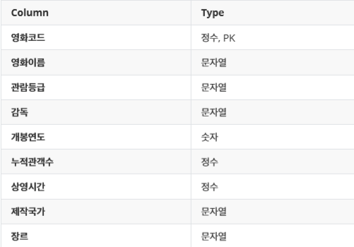
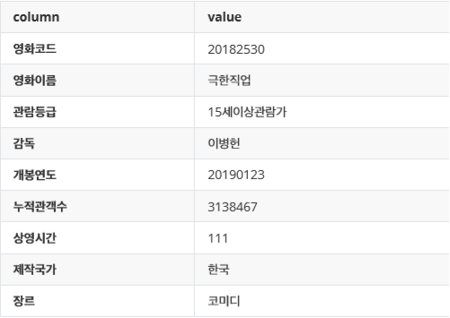

# Project_3

## 1. 목표

- 영진위 API를 활용하여 수집한 데이터를 데이터베이스에 반영하기
- SQL을 통한 데이터베이스 조작
- 단일 테이블에서의 데이터 조작
- 영화추천서비스와 관련된 다양한 검색 쿼리 작성하기

## 2. 준비 사항

1. (필수) SQL 활용 환경 설정
2.  영화 데이터 베이스
   - 100주간 박스오피스 TOP10에 들어간 적이 있었던 영화 총 360개의 정보가 포함된 `boxoffice.csv`를 활용합시다.

## 3. 과정 및 결과

1. 테이블 구성 

   - 요구된 스키마를 가진 `movies` 테이블 생성합시다.

     

   > 01_create_table.sql

   ```sql
   CREATE TABLE movies(
       영화코드 INTEGER PRIMARY KEY,
       영화이름 TEXT,
       관람등급 TEXT,
       감독 TEXT,
       개봉연도 INTEGER,
       누적관객수 INTEGER,
       상영시간 INTEGER,
       제작국가 TEXT,
       장르 TEXT
   );
   ```

   - `boxoffice.csv`파일을 `import`하기 위해서 `.mode csv`를 해줍시다.

   > workspace

   ```sql
   sqlite> .mode csv
   sqlite> .import boxoffice.csv movies
   ```

   - `import`가 제대로 됐는지 출력을 해봅시다.

   > workspace

   ```sql
   sqlite> SELECT * FROM movies;
   ```

   여기까지 모든 내용은 `01_create_table.sql` 파일에 있습니다.

2. 기본 CRUD 조작하기

   - 극한직업이 누락되어 있습니다. 해당 레코드를 테이블에 추가 해봅시다.

     

   > 02_crud.sql

   ```sql
   INSERT INTO movies 
   VALUES (20182530,'극한직업','15세이상관람가','이병헌',20190123,3138467,111,'한국','코미디');
   ```

   - 영화코드 20040521인 데이터를 출력하고, 해당 데이터를 삭제해주세요.

   > workspace

   ```sql
   sqlite> SELECT * FROM movies WHERE 영화코드 = 20040521;
   sqlite> DELETE FROM movies WHERE 영화코드 = 20040521;
   ```

   - 영화코드 20185124인 데이터를 출력하고, 공란으로 되어 있는 칼럼에 값을 '없음'으로 수정하세요. 그리고 확인을 해보세요.

   > workspace

   ```sql
   sqlite> SELECT * FROM movies WHERE 영화코드 = 20185124;
   sqlite> UPDATE movies SET 감독 = '없음' WHERE 영화코드 = 20185124;
   sqlite> SELECT * FROM movies WHERE 영화코드 = 20185124;
   ```

   여기까지 모든 내용은 `02_crud.sql` 파일에 있습니다.

3. 원하는 데이터 찾기

   1. 상영시간이 150분 이상인 영화이름만 출력하세요.

      > workspace

      ```sql
      sqlite> SELECT 영화이름 FROM movies WHERE 상영시간 >= 150;
      ```

   2. 장르가 애니메이션인 영화코드와 영화이름을 출력하세요.

      > workspace

      ```sql
      sqlite> SELECT 영화코드, 영화이름 FROM movies WHERE 장르 = '애니메이션';
      ```

   3. 제작국가가 덴마크이고 장르가 애니메이션인 영화이름을 출력하세요.

      > workspace

      ```sql
      sqlite> SELECT 영화이름 FROM movies WHERE 장르 = '애니메이션' and 제작국가 = '덴마크';
      ```

   4. 누적관객수가 백만이 넘고, 관람등급이 청소년관람불가인 영화이름과 누적관객수를 출력하세요.

      > workspace

      ```sql
      sqlite> SELECT 영화이름, 누적관객수 FROM movies WHERE 관람등급 = '청소년관람불가' and 누적관객수 > 1000000;
      ```

   5. 개봉연도가 2000년 1월 1일 ~ 2009년 12월 31일 사이인 영화를 출력하세요.

      > workspace

      ```sql
      sqlite> SELECT * FROM movies WHERE 개봉연도 BETWEEN 20000101 AND 20091231;
      ```

   6. 장르를 중복 없이 출력하세요.

      > workspace

      ```sql
      sqlite> SELECT DISTINCT 장르 FROM movies;
      ```

   여기까지 모든 내용은 `03_select.sql` 파일에 있습니다.

4. Expression 활용하기

   1. 모든 영화의 총 누적관객수 출력하세요.

      > workspace

      ```sql
      SELECT SUM(누적관객수) FROM movies;
      ```

   2. 가장 많은 누적관객수인 영화이름과 누적관객수를 출력하세요.

      > workspace

      ```sql
      SELECT 영화이름, MAX(누적관객수) FROM movies;
      ```

   3. 가장 상영시간이 짧은 영화의 장르와 상영시간을 출력하세요.

      > workspace

      ```sql
      SELECT 장르, MIN(상영시간) FROM movies;
      ```

   4. 제작국가가 한국인 영화의 평균 누적관객수를 출력하세요.

      > workspace

      ```sql
      SELECT ROUND(AVG(누적관객수), 2) FROM movies WHERE 제작국가 = '한국';
      ```

   5. 관람등급이 청소년관람불가인 영화의 개수를 출력하세요.

      > workspace

      ```sql
      SELECT COUNT(*) FROM movies WHERE 관람등급 = '청소년관람불가';
      ```

   6. 상영시간이 100분 이상이고 장르가 애니메이션인 영화의 개수를 출력하세요.

      > workspace

      ```sql
      SELECT COUNT(*) FROM movies WHERE 장르 = '애니메이션', 상영시간>=100;
      ```

   여기까지 모든 내용은 `04_expression.sql` 파일에 있습니다.

5. 정렬하기

   1. 누적관객수 상위 5개 영화의 모든 데이터를 출력하세요.

      > workspace

      ```sql
      SELECT * FROM movies ORDER BY 누적관객수 DESC LIMIT 5;
      ```

   2. 장르가 애니메이션인 영화를 제작국가(오름차순), 누적관객수(내림차순)순으로 정렬하여 10개만 출력하세요.

      > workspace

      ```sql
      SELECT * FROM movies WHERE 장르 = '애니메이션' ORDER BY 제작국가 ASC, 누적관객수 DESC LIMIT 10;
      ```

   3. 상영시간이 긴 영화를 만든 감독의 이름을 10개만 출력하세요.

      > workspace

      ```sql
      SELECT 감독 FROM movies ORDER BY 상영시간 DESC LIMIT 10;
      ```

## 4. 프로젝트 후기

- 비록 csv 파일 하나만으로 테이블을 만들고 했지만, 데이터베이스를 관리, 수정, 삭제 등 많은 작업을 할 수 있었던 시간이었습니다.
- sql 파일을 통해 데이터베이스를 조작법을 터득하는 좋은 시간이었습니다.
- 다음번엔 단일 테이블이 아닌 다중 테이블에서 조작을 해본다면 더 좋은 시간을 가질 수 있을거 같습니다.