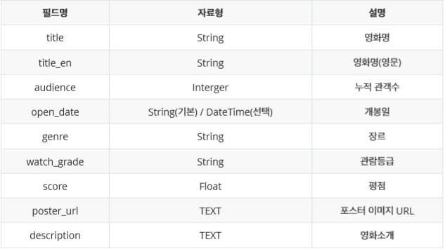

# Project4_CRUD

## 1. 목표

- 데이터를 생성, 조회, 삭제, 수정할 수 있는 Web Application 제작
- Python Web Framework를 통한 데이터 조작

- Object Relational Mapping에 대한 이해
- Template Variable을 활용한 Template 제작
- 영화 추천 사이트의 영화 정보 데이터 관리


## 2. 준비 사항

1. **(필수)** Python Web Framework 선택
   - Flask
2. **(필수)** Python Web Framework 사용을 위한 환경 설정
   - Local, C9 등 개발 가능 환경


## 3. 과정

### 1. 데이터베이스

- Framework 사용을 위해서 필요한 코드와 flask를 install 합니다.

```python
$ sudo pip3 install flask
$ sudo pip3 install flask-sqlalchemy
```

- zzu.lit/flask-alchemy에서 코드를 복사해봅시다.

```python
from flask import Flask, render_template, request
from flask_sqlalchemy import SQLAlchemy

app = Flask(__name__)

app.config['SQLALCHEMY_DATABASE_URI'] = 'sqlite:///db_flask.sqlite3'
app.config['SQLALCHEMY_TRACK_MODIFICATIONS'] = False

db = SQLAlchemy(app)
```

- ORM을 통해서 작성 될 클래스와 테이블을 만들어 봅시다.

```python
class Movie(db.Model):
    __tablename__="movies"
    id = db.Column(db.Integer, primary_key=True, autoincrement=True) #id키
    title = db.Column(db.String, nullable=False) #영화명
    title_en = db.Column(db.String, nullable=False) #영화명(영문)
    audience = db.Column(db.Integer, nullable=False) #누적 관객수
    open_date = db.Column(db.DateTime, nullable=False, default=datetime.utcnow) #개봉일
    genre = db.Column(db.String, nullable=False) #장르
    watch_grade = db.Column(db.String, nullable=False) #관람등급
    score = db.Column(db.Float, nullable=False) #평점
    poster_url = db.Column(db.String, nullable=False) #포스터 이미지 URL
    description = db.Column(db.String, nullable=False) #영화소개

db.create_all() #class 선언한 애들 다 db에 추가하는 것입니다.
#빈 값이 들어갈 수 없도록 nullable=False를 했습니다.
```

### 2. 페이지

1. 영화 목록

   

   1. URL은 `/movies`입니다.
   2. 각 영화의 `title`, `score`가 나열되어 있는 페이지입니다.
   3. `title`을 클릭 하면, 해당 `영화 정보 조회` 페이지로 이동합니다.
   4. 영화 목록 최상단에 `새 영화 등록` 링크가 있으며, 클릭 시 `영화 정보 생성 Form` 페이지로 이동합니다.

> app.py

```python
@app.route('/movies')
def movies():
    movies = Movie.query.all() #SELECT * FROM movies과 같습니다.
    return render_template('movies.html', movies=movies)
```

> movies.html

```html
<!DOCTYPE html>
<html lang="en">
<head>
    <meta charset="UTF-8">
    <meta name="viewport" content="width=device-width, initial-scale=1.0">
    <meta http-equiv="X-UA-Compatible" content="ie=edge">
    <title>Document</title>
</head>
<body>
    <a href="/movies/new">새 영화 등록</a>
    
    <p>
        제목 : <a href="/movies/{{i.id}}">{{i.title}}</a>, 평점 : {{i.score}}
    </p>
    
</body>
</html>
```

2. 영화 정보 생성 Form

   1. 해당 페이지에 접근하는 URL은 `/movies/new` 입니다.

   2. 영화 정보를 작성할 수 있는 Form이 표시 되며, 다음과 같은 input들을 가지고 있습니다.

      

   3. Form에 작성된 정보는 Submit 버튼 클릭 시 `영화 정보 생성` 페이지로 생성 요청(request)과 함께 전송됩니다.

   4. `score`는 사용자로부터 최소 0점에서 최대 5점까지 0.5 점 간격으로 받을 수 있도록 합니다.

> app.py

```python
@app.route('/movies/new')
def new():
    return render_template('new.html')
```

> new.html

```html
<!DOCTYPE html>
<html lang="en">
<head>
    <meta charset="UTF-8">
    <meta name="viewport" content="width=device-width, initial-scale=1.0">
    <meta http-equiv="X-UA-Compatible" content="ie=edge">
    <title>Document</title>
</head>
<body>
    <form action="/movies/create">
        <input type="text" name="title" placeholder="title"/>
        <input type="text" name="title_en" placeholder="title_en"/>
        <input type="number" min="0" name="audience" placeholder="audience"/>
        <input type="date" name="open_date" placeholder="date"/>
        <input type="text" name="genre" placeholder="genre"/>
        <input type="text" name="watch_grade" placeholder="watch_grade"/>
        <input type="number" min="0" max="5" step="0.5" name="score" placeholder="score"/>
        <input type="text" name="poster_url" placeholder="poster_url"/>
        <textarea name="description" rows="4" cols="50" placeholder="description"></textarea>
        <input type="submit" value="Submit"/>
    </form>
</body>
</html>
```

3. 영화 정보 생성
   1. 해당 페이지에 접근하는 URL은 `/movies/create/` 입니다.
   2. 이전 페이지로부터 전송 받은 데이터를 데이터베이스에 저장합니다.
   3. 해당 페이지에서 저장한 영화 정보를 조회하는 `영화 정보 조회` 페이지로 Redirect 합니다.

> app.py

```python
@app.route('/movies/create')
def create():
    title = request.args.get('title') #new.html에서 입력한 값들을 가져옵니다.
    title_en = request.args.get('title_en')
    audience = request.args.get('audience')
    
    open_date = request.args.get('open_date') #type이 datetime이라서 년, 월, 일만 출력하기 위해서 아래와 같이 명령어를 추가했습니다.
    year=int(open_date[:4])
    month=int(open_date[5:7])
    date=int(open_date[8:10])
    dt = datetime(year, month, date)
    
    genre = request.args.get('genre')
    watch_grade = request.args.get('watch_grade')
    score = request.args.get('score')
    poster_url = request.args.get('poster_url')
    description = request.args.get('description')
    
    movie = Movie(title=title, title_en=title_en, audience=audience, open_date=dt, genre=genre, watch_grade=watch_grade, score=score, poster_url=poster_url, description=description) #각자 맞는 변수에다가 알맞게 집어넣었습니다.
    db.session.add(movie)
    db.session.commit() #db의 내용이 바뀌었으니 commit을 해주었습니다.
    
    idx = Movie.query.order_by(Movie.id.desc()).first().id #추가된 정보 중 가장 최신의 정보가 새로운 정보이니 그 정보의 id값을 가져올 수 있도록 코드를 짰습니다.
    return redirect('/movies/{}'.format(idx)) #그 id값을 idx에 담아서 redirect를 했습니다.
```

4. 영화 정보 조회
   1. 해당 페이지에 접근하는 URL은 `/movies/1`, `/movies/2` 등 이며, 동적으로 할당되는 부분이 존재합니다. 동적으로 할당되는 부분에는 데이터베이스에 저장된 영화 정보의 Primary Key가 들어갑니다.
   2. 해당 Primary Key를 가진 영화의 모든 정보가 표시됩니다.
   3. 영화 정보의 최하단에는 `목록`, `수정`, `삭제` 링크가 있으며, 클릭 시 각각 `영화 목록`, 해당 `영화 정보 수정 Form`, 해당 `영화 정보 삭제` 페이지로 이동합니다.

> app.py

```python
@app.route('/movies/<int:movie_id>') #동적으로 Primary key를 받기 위해 <>를 이용했습니다.
def detail(movie_id):
    movie = Movie.query.get(movie_id) #그 id값의 모든 정보를 movie에 담아서
    return render_template('detail.html', movie=movie) #detail.html에 보냈습니다.
```

> detail.html

```html
<!DOCTYPE html>
<html lang="en">
<head>
    <meta charset="UTF-8">
    <meta name="viewport" content="width=device-width, initial-scale=1.0">
    <meta http-equiv="X-UA-Compatible" content="ie=edge">
    <title>Document</title>
</head>
<body>
    <p>{{movie.title}}</p>
    <p>{{movie.title_en}}</p>
    <p>{{movie.audience}}</p>
    <p>{{movie.open_date}}</p> <!--.strftime('%Y-%m-%d')--> <!--이 코드를 붙히면 시간을 제외한 년, 월, 일만 출력이 됩니다.-->
    <p>{{movie.genre}}</p>
    <p>{{movie.watch_grade}}</p>
    <p>{{movie.score}}</p>
    <p>{{movie.poster_url}}</p>
    <p>{{movie.description}}</p>
    <p><a href='/movies'>목록</a>,<a href='/movies/{{movie.id}}/edit'>수정</a>,<a href='/movies/{{movie.id}}/delete'>삭제</a></p>
</body>
</html>
```

5. 영화 정보 수정 Form
   1. 해당 페이지에 접근하는 URL은 `/movies/1/edit`,`/movies/2/edit`등 이며, 동적으로 할당되는 부분이 존재합니다. 동적으로 할당되는 부분에는 데이터베이스에 저장된 영화 정보의 Primary Key가 들어갑니다.
   2. 해당 Primary Key를 가진 영화 정보를 수정할 수 있는 Form이 표시 되며, 이전 정보가 입력된 채로 표시됩니다.
   3. Form에 작성된 정보는 Submit 버튼 클릭 시 `영화 정보 수정` 페이지로 수정 요청(request)과 함께 전송됩니다.

> app.py

```python
@app.route('/movies/<int:movie_id>/edit')
def edit(movie_id):
    movie = Movie.query.get(movie_id) # id 값을 이용해서 그 값의 정보를 가져와서
    return render_template('edit.html', movie=movie) #edit.html에 넘깁니다.
```

>edit.html

```html
<!DOCTYPE html>
<html lang="en">
<head>
    <meta charset="UTF-8">
    <meta name="viewport" content="width=device-width, initial-scale=1.0">
    <meta http-equiv="X-UA-Compatible" content="ie=edge">
    <title>Document</title>
</head>
<body>
    <form action="/movies/{{movie.id}}/update">
        <input type="text" name="title" value="{{movie.title}}" placeholder="title"/>
        <input type="text" name="title_en" value="{{movie.title_en}}" placeholder="title_en"/>
        <input type="number" name="audience" value="{{movie.audience}}" placeholder="audience"/>
        <input type="date" name="open_date" value="{{movie.open_date}}" placeholder="open_date"/>
        <input type="text" name="genre" value="{{movie.genre}}" placeholder="genre"/>
        <input type="text" name="watch_grade" value="{{movie.watch_grade}}" placeholder="watch_grade"/>
        <input type="number" name="score" value="{{movie.score}}" placeholder="score"/>
        <input type="text" name="poster_url" value="{{movie.poster_url}}" placeholder="poster_url"/>
        <textarea name="description" rows="4" cols="50" placeholder="description">{{movie.description}}</textarea>
        <input type="submit" value="Submit"/>
    </form>
</body>
</html>
```

6. 영화 정보 수정
   1. 해당 페이지에 접근하는 URL은 `/movies/1/update`, `/movies/2/update` 등 이며, 동적으로 할당되는 부분이 존재합니다. 동적으로 할당되는 부분에는 데이터베이스에 저장된 영화 정보의 Primary Key가 들어갑니다.
   2. 해당 Primary Key를 가진 영화 정보를 이전 페이지로부터 전송 받은 데이터로 변경하여 데이터베이스에 저장합니다.
   3. 해당 페이지에서 수정한 영화 정보를 조회하는 `영화 정보 조회` 페이지로 Redirect 합니다.

> app.py

```python
@app.route('/movies/<int:movie_id>/update')
def update(movie_id):
    title = request.args.get('title') #edit.html에서 보낸 값들을 새로 다 담습니다.
    title_en = request.args.get('title_en')
    audience = request.args.get('audience')
    
    open_date = request.args.get('open_date')
    year=int(open_date[:4])
    month=int(open_date[5:7])
    date=int(open_date[8:10])
    dt = datetime(year, month, date)
    
    genre = request.args.get('genre')
    watch_grade = request.args.get('watch_grade')
    score = request.args.get('score')
    poster_url = request.args.get('poster_url')
    description = request.args.get('description')
    
    movie = Movie.query.get(movie_id) # 담았던 값들을 담기 위해서 id 값으로 원하는 값을 불러옵니다.
    movie.title=title
    movie.title_en=title_en
    movie.audience=audience
    movie.open_date=dt
    movie.genre=genre
    movie.watch_grade=watch_grade
    movie.score=score
    movie.poster_url=poster_url
    movie.description=description 
    db.session.commit() #새로 다 담고나서 commit을 합니다.
    return redirect('/movies/{}'.format(movie_id)) #영화 정보 조회 페이지로 돌아가기 위해서 movie_id를 이용하여 URL에 삽입합니다.
```

7. 영화 정보 삭제
   1. 해당 페이지에 접근하는 URL은 `/movies/1/delete`, `/movies/2/delete`등 이며, 동적으로 할당되는 부분이 존재합니다. 동적으로 할당되는 부분에는 데이터베이스에 저장된 영화 정보의 Primary Key가 들어갑니다.
   2. 해당 Primary Key를 가진 영화 정보를 데이터베이스에서 삭제합니다.
   3. `영화 정보 목록` 페이지로 Redirect합니다.

> app.py

```python
@app.route('/movies/<int:movie_id>/delete')
def delete(movie_id): #해당 값을 삭제하기 위해서 detail.html에서 id값을 가져옵니다.
    movie=Movie.query.get(movie_id)
    db.session.delete(movie) #해당 값을 삭제하고
    db.session.commit() #커밋을 합니다.
    return redirect('/movies')
```


## 4. 결과

```
Project_4/
	README.md
	app.py
	db_flask.sqlite3
	04_crud.pdf
	data.xlsx
	images/
		1.png
		2.png
	templates/
		detail.html
		edit.html
		movies.html
		new.html
		index.html
```

> app.py

```python
from flask import Flask, render_template, request, redirect
from flask_sqlalchemy import SQLAlchemy
from datetime import datetime


app = Flask(__name__)

app.config['SQLALCHEMY_DATABASE_URI'] = 'sqlite:///db_flask.sqlite3'
app.config['SQLALCHEMY_TRACK_MODIFICATIONS'] = False

db = SQLAlchemy(app)

class Movie(db.Model):
    __tablename__="movies"
    id = db.Column(db.Integer, primary_key=True, autoincrement=True) #id키
    title = db.Column(db.String, nullable=False) #영화명
    title_en = db.Column(db.String, nullable=False) #영화명(영문)
    audience = db.Column(db.Integer, nullable=False) #누적 관객수
    open_date = db.Column(db.DateTime, nullable=False, default=datetime.utcnow) #개봉일
    genre = db.Column(db.String, nullable=False) #장르
    watch_grade = db.Column(db.String, nullable=False) #관람등급
    score = db.Column(db.Float, nullable=False) #평점
    poster_url = db.Column(db.String, nullable=False) #포스터 이미지 URL
    description = db.Column(db.String, nullable=False) #영화소개

db.create_all()

@app.route('/')
def index():
    return render_template('index.html')
    
@app.route('/movies')
def movies():
    movies = Movie.query.all()
    return render_template('movies.html', movies=movies)
    
@app.route('/movies/new')
def new():
    return render_template('new.html')
    
@app.route('/movies/create')
def create():
    title = request.args.get('title')
    title_en = request.args.get('title_en')
    audience = request.args.get('audience')
    
    open_date = request.args.get('open_date')
    year=int(open_date[:4])
    month=int(open_date[5:7])
    date=int(open_date[8:10])
    dt = datetime(year, month, date)
    
    genre = request.args.get('genre')
    watch_grade = request.args.get('watch_grade')
    score = request.args.get('score')
    poster_url = request.args.get('poster_url')
    description = request.args.get('description')
    
    movie = Movie(title=title, title_en=title_en, audience=audience, open_date=dt, genre=genre, watch_grade=watch_grade, score=score, poster_url=poster_url, description=description)
    db.session.add(movie)
    db.session.commit()
    
    idx = Movie.query.order_by(Movie.id.desc()).first().id
    return redirect('/movies/{}'.format(idx))
    
@app.route('/movies/<int:movie_id>')
def detail(movie_id):
    movie = Movie.query.get(movie_id)
    return render_template('detail.html', movie=movie)
    
@app.route('/movies/<int:movie_id>/edit')
def edit(movie_id):
    movie = Movie.query.get(movie_id)
    return render_template('edit.html', movie=movie)

@app.route('/movies/<int:movie_id>/update')
def update(movie_id):
    title = request.args.get('title')
    title_en = request.args.get('title_en')
    audience = request.args.get('audience')
    
    open_date = request.args.get('open_date')
    year=int(open_date[:4])
    month=int(open_date[5:7])
    date=int(open_date[8:10])
    dt = datetime(year, month, date)
    
    genre = request.args.get('genre')
    watch_grade = request.args.get('watch_grade')
    score = request.args.get('score')
    poster_url = request.args.get('poster_url')
    description = request.args.get('description')
    
    movie = Movie.query.get(movie_id)
    movie.title=title
    movie.title_en=title_en
    movie.audience=audience
    movie.open_date=dt
    movie.genre=genre
    movie.watch_grade=watch_grade
    movie.score=score
    movie.poster_url=poster_url
    movie.description=description
    db.session.commit()
    return redirect('/movies/{}'.format(movie_id))
    
@app.route('/movies/<int:movie_id>/delete')
def delete(movie_id):
    movie=Movie.query.get(movie_id)
    db.session.delete(movie)
    db.session.commit()
    return redirect('/movies')
```

> movies.html

```html
<!DOCTYPE html>
<html lang="en">
<head>
    <meta charset="UTF-8">
    <meta name="viewport" content="width=device-width, initial-scale=1.0">
    <meta http-equiv="X-UA-Compatible" content="ie=edge">
    <title>Document</title>
</head>
<body>
    <a href="/movies/new">새 영화 등록</a>
    
    <p>
        제목 : <a href="/movies/{{i.id}}">{{i.title}}</a>, 평점 : {{i.score}}
    </p>
    
</body>
</html>
```

> index.html

```html
<!DOCTYPE html>
<html lang="en">
<head>
    <meta charset="UTF-8">
    <meta name="viewport" content="width=device-width, initial-scale=1.0">
    <meta http-equiv="X-UA-Compatible" content="ie=edge">
    <title>Document</title>
</head>
<body>
    <a href='/movies'>입장</a>
</body>
</html>
```

> new.html

```html
<!DOCTYPE html>
<html lang="en">
<head>
    <meta charset="UTF-8">
    <meta name="viewport" content="width=device-width, initial-scale=1.0">
    <meta http-equiv="X-UA-Compatible" content="ie=edge">
    <title>Document</title>
</head>
<body>
    <form action="/movies/create">
        <input type="text" name="title" placeholder="title"/>
        <input type="text" name="title_en" placeholder="title_en"/>
        <input type="number" min="0" name="audience" placeholder="audience"/>
        <input type="date" name="open_date" placeholder="date"/>
        <input type="text" name="genre" placeholder="genre"/>
        <input type="text" name="watch_grade" placeholder="watch_grade"/>
        <input type="number" min="0" max="5" step="0.5" name="score" placeholder="score"/>
        <input type="text" name="poster_url" placeholder="poster_url"/>
        <textarea name="description" rows="4" cols="50" placeholder="description"></textarea>
        <input type="submit" value="Submit"/>
    </form>
</body>
</html>
```

> edit.html

```html
<!DOCTYPE html>
<html lang="en">
<head>
    <meta charset="UTF-8">
    <meta name="viewport" content="width=device-width, initial-scale=1.0">
    <meta http-equiv="X-UA-Compatible" content="ie=edge">
    <title>Document</title>
</head>
<body>
    <form action="/movies/{{movie.id}}/update">
        <input type="text" name="title" value="{{movie.title}}" placeholder="title"/>
        <input type="text" name="title_en" value="{{movie.title_en}}" placeholder="title_en"/>
        <input type="number" name="audience" value="{{movie.audience}}" placeholder="audience"/>
        <input type="date" name="open_date" value="{{movie.open_date}}" placeholder="open_date"/>
        <input type="text" name="genre" value="{{movie.genre}}" placeholder="genre"/>
        <input type="text" name="watch_grade" value="{{movie.watch_grade}}" placeholder="watch_grade"/>
        <input type="number" name="score" value="{{movie.score}}" placeholder="score"/>
        <input type="text" name="poster_url" value="{{movie.poster_url}}" placeholder="poster_url"/>
        <textarea name="description" rows="4" cols="50" placeholder="description">{{movie.description}}</textarea>
        <input type="submit" value="Submit"/>
    </form>
</body>
</html>
```

> detail.html

```html
<!DOCTYPE html>
<html lang="en">
<head>
    <meta charset="UTF-8">
    <meta name="viewport" content="width=device-width, initial-scale=1.0">
    <meta http-equiv="X-UA-Compatible" content="ie=edge">
    <title>Document</title>
</head>
<body>
    <p>{{movie.title}}</p>
    <p>{{movie.title_en}}</p>
    <p>{{movie.audience}}</p>
    <p>{{movie.open_date}}</p> <!--.strftime('%Y-%m-%d')-->
    <p>{{movie.genre}}</p>
    <p>{{movie.watch_grade}}</p>
    <p>{{movie.score}}</p>
    <p>{{movie.poster_url}}</p>
    <p>{{movie.description}}</p>
    <p><a href='/movies'>목록</a>,<a href='/movies/{{movie.id}}/edit'>수정</a>,<a href='/movies/{{movie.id}}/delete'>삭제</a></p>
</body>
</html>
```

*BootStrap 적용을 하지 않은 코드입니다.*


## 5. 프로젝트 후기

- Python 코드만으로 `db`, `sqlite3`등과 같은 데이터베이스 파일을 다룰 수 있다는 점이 신기했습니다.
- ORM을 이해하여서 좀 더 `cursor`로 접근하는 방법보다 간단하게 `CRUD`를 하는 법을 알 수 있었습니다.

