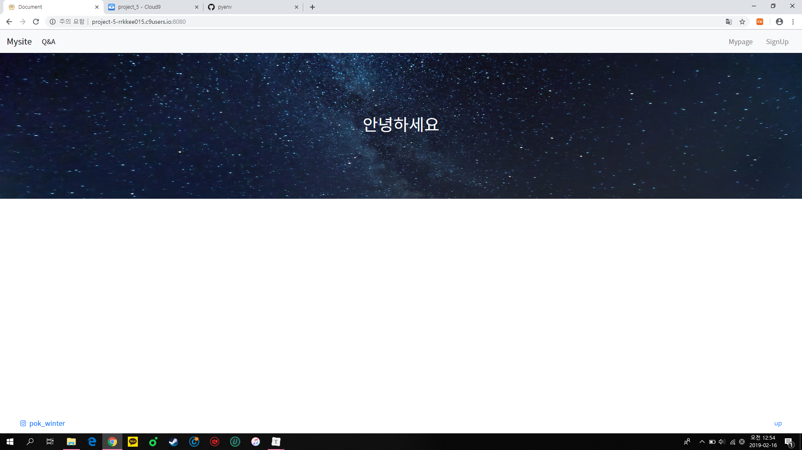
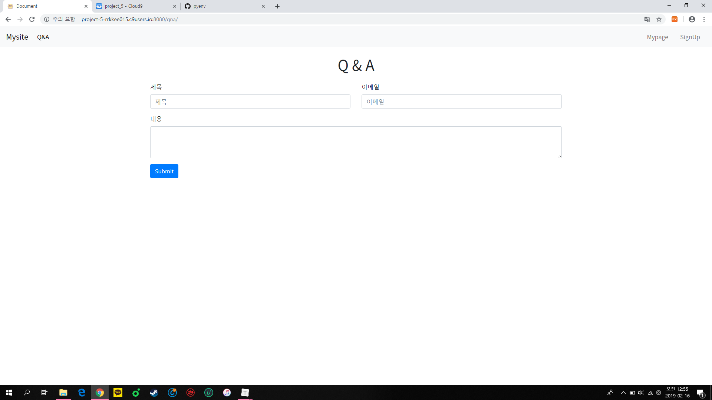
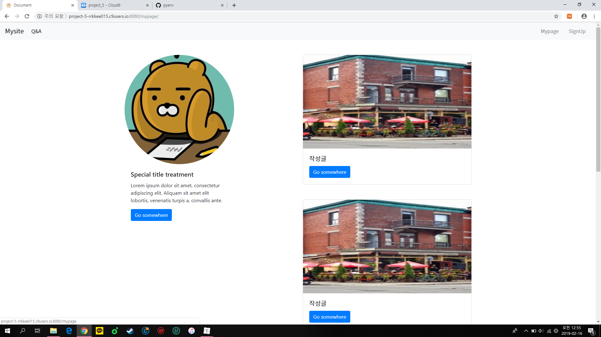
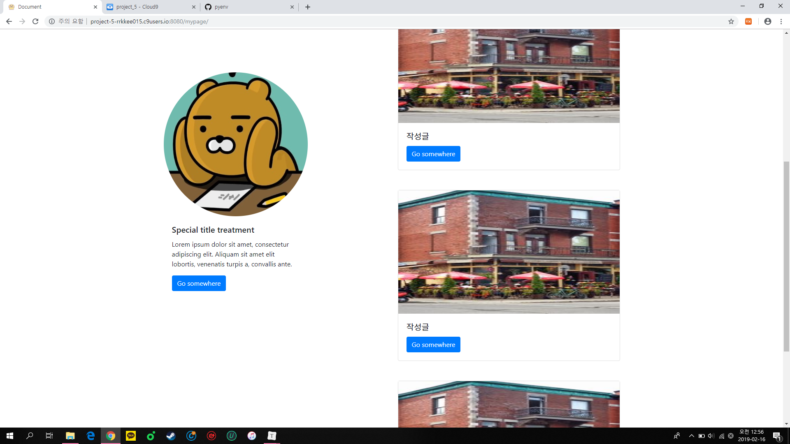
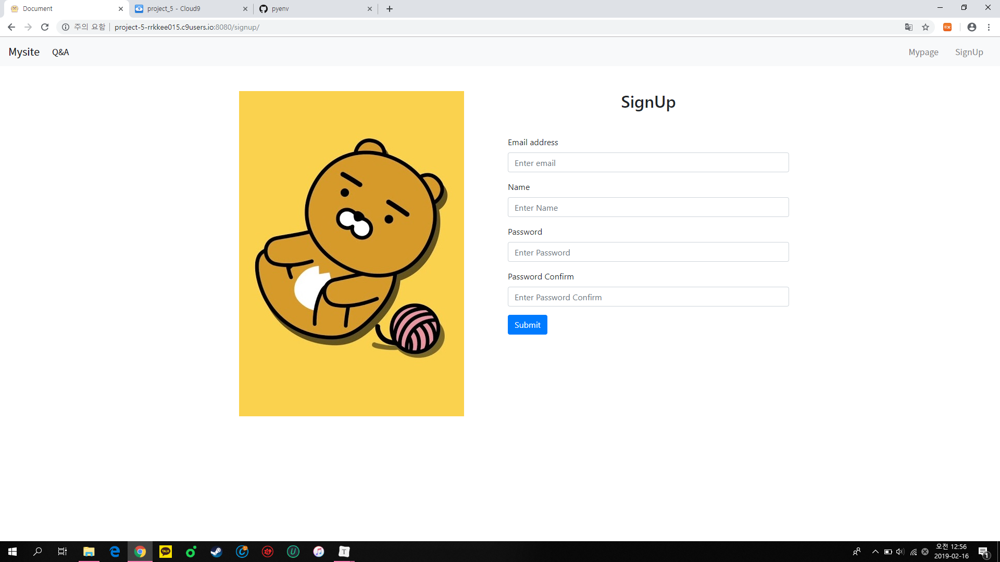

# Project5_detail

## 1. 목표

- 영화 추천 사이트의 세부 페이지 구성
- Template Variable을 활용한 Template 제작

## 2. 준비 사항

1. (필수)

   Django Web Framework 사용

   - Local, C9 등 개발 가능 환경 (자유)

# 3. 요구 사항

1. **Django Setting**

   1. 우선 **C9**에서 **Python**을 설치합니다. `zzu.li/install-pyenv`에서 코드를 복사합니다.

      ```shell
      git clone https://github.com/pyenv/pyenv.git ~/.pyenv
      echo 'export PYENV_ROOT="$HOME/.pyenv"' >> ~/.bashrc
      echo 'export PATH="$PYENV_ROOT/bin:$PATH"' >> ~/.bashrc
      echo -e 'if command -v pyenv 1>/dev/null 2>&1; then\n  eval "$(pyenv init -)"\nfi' >> ~/.bashrc
      exec "$SHELL"
      
      git clone https://github.com/pyenv/pyenv-virtualenv.git $(pyenv root)/plugins/pyenv-virtualenv
      echo 'eval "$(pyenv virtualenv-init -)"' >> ~/.bashrc
      exec "$SHELL"
      ```

   2. 가상환경을 설정합니다.

      ```shell
      mkdir 05_detail
      cd 05_detail
      pyenv virtualenv 3.6.7 05_detail-venv
      pyenv local 05_detail-venv
      pip install django
      django-admin startproject project5
      ```

   3. 앱을 실행합니다.

      ```shell
      python manage.py startapp detail
      ```

   4. django 설정 중 `언어`를 한국어로 설정합니다.

      > settings.py

      ```python
      LANGUAGE_CODE = 'ko-kr'
      ```

   5. ALLOWED_HOSTS 설정에 `"*"`를 추가합니다.

      > settings.py

      ```python
      ALLOWED_HOTS = ['*']
      ```

2. **base.html 구성**

   1. base.html 내부에 `Bootstrap css, js`를 추가하세요.

      > base.html

      ```html
      <!DOCTYPE html>
      <html lang="en">
      <head>
          <meta charset="UTF-8">
          <meta name="viewport" content="width=device-width, initial-scale=1.0">
          <meta http-equiv="X-UA-Compatible" content="ie=edge">
          <link rel="stylesheet" href="">
          <link rel="stylesheet" href="https://stackpath.bootstrapcdn.com/bootstrap/4.3.1/css/bootstrap.min.css" integrity="sha384-ggOyR0iXCbMQv3Xipma34MD+dH/1fQ784/j6cY/iJTQUOhcWr7x9JvoRxT2MZw1T" crossorigin="anonymous">
          <script src="https://code.jquery.com/jquery-3.3.1.slim.min.js" integrity="sha384-q8i/X+965DzO0rT7abK41JStQIAqVgRVzpbzo5smXKp4YfRvH+8abtTE1Pi6jizo" crossorigin="anonymous"></script>
          <script src="https://cdnjs.cloudflare.com/ajax/libs/popper.js/1.14.7/umd/popper.min.js" integrity="sha384-UO2eT0CpHqdSJQ6hJty5KVphtPhzWj9WO1clHTMGa3JDZwrnQq4sF86dIHNDz0W1" crossorigin="anonymous"></script>
          <script src="https://stackpath.bootstrapcdn.com/bootstrap/4.3.1/js/bootstrap.min.js" integrity="sha384-JjSmVgyd0p3pXB1rRibZUAYoIIy6OrQ6VrjIEaFf/nJGzIxFDsf4x0xIM+B07jRM" crossorigin="anonymous"></script>
          <title>Document</title>
      </head>
      <body>
      </body>
      </html>
      ```

   2. <3.페이지 구성>에 들어가는 링크들이 모두 들어있는 `Nav Bar`를 구성하세요.

      > base.html

      ```html
      ...
      ...
          <nav class="navbar navbar-expand-lg navbar-light bg-light">
              <a class="navbar-brand noto" href="/">Mysite</a>
              <div class="navbar-collapse" id="navbarText">
                  <ul class="navbar-nav mr-auto">
                  <li class="nav-item active">
                  <a class="nav-link noto" href="/qna">Q&A<span class="sr-only">(current)</span></a>
                </li>
              </ul>
              <a class="navbar-text nav-link noto" href="/mypage">Mypage</a>
              <a class="navbar-text nav-link noto" href="/signup">SignUp</a>
            </div>
          </nav>
      ...
      ```

   3. `favicon`을 추가하세요

      - templates 폴더와 같은 레벨에 static 폴더를 만들어서 그 안에 'favicon.png'를 만듭니다. 그리고 base.html 최 상단에 을 추가하고 <link rel='icon' href=''>를 추가하여 favicon을 완성합니다.

      > base.html

      ```html
      
      ...
      ...
      <link rel="icon" type="image/png" sizes="96x96" href="">
      ```

3. **페이지 구성**

   1. 나머지 html 파일은 base.html을 `extends`하여서 사용했습니다.

      > view.py

      ```python
      from django.shortcuts import render
      
      # Create your views here.
      
      def index(request):
          return render(request, 'index.html')
          
      def qna(request):
          return render(request, 'qna.html')
          
      def mypage(request):
          return render(request, 'mypage.html')
          
      def signup(request):
          return render(request, 'signup.html')
          
      def not_found(request,not_found):
          return render(request, 'not_found.html', {"not_found":not_found})   
      ```

      > urls.py

      ```python
      """project5 URL Configuration
      
      The `urlpatterns` list routes URLs to views. For more information please see:
          https://docs.djangoproject.com/en/2.1/topics/http/urls/
      Examples:
      Function views
          1. Add an import:  from my_app import views
          2. Add a URL to urlpatterns:  path('', views.home, name='home')
      Class-based views
          1. Add an import:  from other_app.views import Home
          2. Add a URL to urlpatterns:  path('', Home.as_view(), name='home')
      Including another URLconf
          1. Import the include() function: from django.urls import include, path
          2. Add a URL to urlpatterns:  path('blog/', include('blog.urls'))
      """
      from django.contrib import admin
      from django.urls import path
      from detail import views
      
      urlpatterns = [
          path('admin/', admin.site.urls),
          path('', views.index),
          path('qna/', views.qna),
          path('mypage/', views.mypage),
          path('signup/', views.signup),
          path('<str:not_found>/', views.not_found)
      ]
      
      ```

      > base.css

      ```css
      header{
          color:white;
          background-image:url(/static/ocean.jpg);
      }
      
      footer{
          display:flex!important;
          justify-content:space-between;
          height:50px;
          align-items:center;
      }
      
      a{
          text-decoration: none!important;
      }
      
      .pok_winter{
          margin-left:.5rem;
      }
      
      .content{
          height:50px!important;
      }
      
      .fixed_position{
          position: fixed;
      }
      
      .card_line{
          border: 1px solid rgba(0, 0, 0, 0)!important;
      }
      
      .image{
          height:350px;
          width:350px;
      }
      ```

   2. `/`

      > index.html

      ```html
      
      
      <header class="noto d-flex justify-content-center align-items-center" style="height:350px">
          <h1>안녕하세요</h1>
      </header>
      <footer class="fixed-bottom pl-5 pr-5" stlye="height:50px">
          <a class="noto "href="https://www.instagram.com/pok_winter"><i class="fab fa-instagram"></i><span class="pok_winter">pok_winter</span></a>
          <a href="#head">up</a>
      </footer>
      
      ```

      - `<header>`의 `수직/수평 가운데 정렬 위치`를 찾기 위해서 Bootstrap class를 사용하였습니다. (`d-flex justify-content-center align-items-center`)
      - `<footer>`의 좌우 패딩을 주기 위해서 Bootstrap class를 사용하였습니다. (`pl-5 pr-5`)

   3. `qna/`

      > qna.html

      ```html
      
      
      <h1 class="noto d-flex justify-content-center mt-4 mb-4">Q & A</h1>
      <form class="container">
          <div class="row">
              <div class="form-group col-12 col-lg-6">
                  <label for="exampleInputEmail1">제목</label>
                  <input type="email" class="form-control" id="exampleInputEmail1" aria-describedby="emailHelp" placeholder="제목">
              </div>
              <div class="form-group col-12 col-lg-6">
                  <label for="exampleInputPassword1">이메일</label>
                  <input type="password" class="form-control" id="exampleInputPassword1" placeholder="이메일">
              </div>
          </div>
          <div class="form-group">
              <label for="exampleFormControlTextarea1">내용</label>
              <textarea class="form-control" id="exampleFormControlTextarea1" rows="3"></textarea>
          </div>
          <button type="submit" class="btn btn-primary">Submit</button>
      </form>
      
      ```

      - 반응형 웹 디자인을 위해서 `col-12 col-lg-6`을 사용하였습니다.
      - 내용은 `textarea`를 이용하였습니다.

   4. `mypage/`

      >mypage.html

      ```html
      
      
      <h1 class="noto d-flex justify-content-center mt-4 mb-4">Q & A</h1>
      <form class="container">
          <div class="row">
              <div class="form-group col-12 col-lg-6">
                  <label for="exampleInputEmail1">제목</label>
                  <input type="email" class="form-control" id="exampleInputEmail1" aria-describedby="emailHelp" placeholder="제목">
              </div>
              <div class="form-group col-12 col-lg-6">
                  <label for="exampleInputPassword1">이메일</label>
                  <input type="password" class="form-control" id="exampleInputPassword1" placeholder="이메일">
              </div>
          </div>
          <div class="form-group">
              <label for="exampleFormControlTextarea1">내용</label>
              <textarea class="form-control" id="exampleFormControlTextarea1" rows="3"></textarea>
          </div>
          <button type="submit" class="btn btn-primary">Submit</button>
      </form>
      
      ```

      - 사용자 이미지를 원형으로 표시하기 위해 Bootstrap class `.rounded-circle`을 적용하기 위하였습니다.
      - 사용자의 정보를 그대로 유지하기 위해서 Bootstrap class `.position-fixed`를 사용했습니다.
      - 사용자의 정보와 작성글을 나누기 위해서 `<div>`로 구분을 하여서 2 구역으로 나누었습니다.

   5. `signup/`

      > signup.html

      ```html
      
      
      <div class="container mt-5">
          <div class="row">
              <div class="col-sm-6" style="text-align:center">
                  
              </div>
              <div class="col-sm-6">
                  <div class="mb-5" style="text-align:center">
                      <h2>SignUp</h2>
                  </div>
                  <form>
                      <div class="form-group">
                          <label for="exampleInputEmail1">Email address</label>
                          <input type="email" class="form-control" id="exampleInputEmail1" aria-describedby="emailHelp" placeholder="Enter email">
                      </div>
                      <div class="form-group">
                          <label for="exampleInputPassword1">Name</label>
                          <input type="password" class="form-control" id="exampleInputPassword1" placeholder="Enter Name">
                      </div>
                      <div class="form-group">
                          <label for="exampleInputPassword1">Password</label>
                          <input type="password" class="form-control" id="exampleInputPassword1" placeholder="Enter Password">
                      </div>
                      <div class="form-group">
                          <label for="exampleInputPassword1">Password Confirm</label>
                          <input type="password" class="form-control" id="exampleInputPassword1" placeholder="Enter Password Confirm">
                      </div>
                      <button type="submit" class="btn btn-primary">Submit</button>
                  </form>
              </div>
          </div>
      </div>
      
      ```

      - 사진을 `<div>`내에서도 가운데 정렬을 하기 위해서 `style="text-align:center"`을 사용하였습니다.

   6. `<str:not_found>`

      > not_found.html

      ```html
      
      
      <header class="noto d-flex justify-content-center align-items-center" style="height:350px">
          <h1>{{ not_found }}/ 는 없는 경로입니다.</h1>
      </header>
      
      ```

      - not_found를 변수로 사용하기 위해서 `path('<str:not_found>/', views.not_found)`을 사용했습니다.

## 4. 결과 예시

```shell
05_detail/
	images/
		1.png
		2.png
		...
	project5/
		__init__.py
		settings.py
		urls.py
		wsgi.py
	detail/
		...
		static/
			base.css
			...
		templates/
			base.html
			index.html
			mypage.html
			not_found.html
			qna.html
			signup.html
		__init__.py
		...
		views.py
	README.md
```











## 5. 프로젝트 후기

- Bootstrap class 활용법과 정렬에 대해서 보다 심도있게 알 수 있었다.
- Django에서 사용하는 css 방법을 숙달할 수 있었고, base.html로 보다 간단한 웹 디자인을 할 수 있는 법을 알 수 있었다.