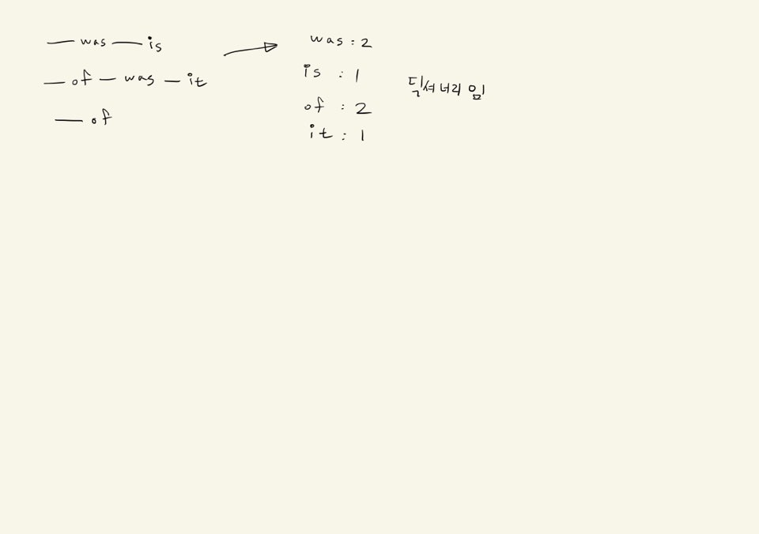

# 1월 월말평가 풀이

## 1번 (사전 만들기)

```python
class Word:
    def __init__(self):
        self.wordbook = {}
        
    def add(self, en, ko):
        self.wordbook[en] = ko #혹은 self.wordbook.update({en:ko})
        
    def delete(self, en):
        if en in self.wodbook:
            self.wordbook.pop(en)
            return True
      	else:
            return False
        
    def print(self):
        for en, ko in self.wordbook.items():
            print(f'{en} : {ko}')
```

```python
if __name__=="__main__":
    mybook = Word()
    mybook.add('apple','사과')
    mybook.add('banana','바나나')
    mybook.add('cherry','체리')
    mybook.add('durian','두리안')
    mybook.print()
    print(mybook.delete('cherry'))
    print(mybook.delete('egg')) #얘는 들어가 있는 친구가 아니니까 False가 떠야한다.
	mybook.print()
```


## 2번(사각형 문제)

```python
class Point:
    def __init__(self, x, y):
        self.x=x
        self.y=y
        
class Rectangle:
    def __init__(self, p1, p2):
        self.p1=p1
        self.p2=p2
        
    def get_area(self):
        return (self.p2.x - self.p1.x) * (self.p1.y - self.p2.y)
    
    def get_perimeter(self):
        return 2*((self.p2.x-self.p1.x) + (self.py.y-self.p2.y))
    
    def is_square(self):
        if (self.p2.x - self.p1.x) == (self.p1.y - self.p2.y):
            return True
        else:
            return False
        #return (self.p2.x-self.p1.x) == (self.p1.y-self.p2.y)
```

```python
if __name__='__main__':
    p1 = Point(1,3)
    p2 = Point(3,1)
    r1 = Rectangle(p1, p2)
    print(r1.get_area())
    print(r1.get_perimeter())
    print(r1.is_square())
```


## 3번 (Word Count 문제, 많은 사람들이 list로 풀었다)



```python
def alphabet_count(word):
    result = {}
    for c in word:
        if c in result:
            result[c] +=1
        else:
            result[c] = 1
    return result
```

```python
def alphabet_count(word):
    result = {}
    for c in word:
        if c in result:
            result[c] +=1
        else:
            result[c] = 1
    #return result

    max_count = max(result.values()) #value의 max값을 알 수 있다.
    
    for char, count in result.items():
        if count == max_count:
            return char
    
   	# return max(result.items(), key=lambda x: x[1])x[0] #이렇게도 쓸 수 있다.
```

```python
if __name__=="__main__":
    print(alphabet_count('hello'))
```


## 4번 (암호 풀기)

```python
def cipher(word, n):
    result = ''
    
    n = n % 26
    
    for c in word:
        w = ord(c) + n
        
        if w > 122:
            w = w - 26
        
       	result += chr(w)
        
    return result

	#result += chr((ord(c) - 97 + n) % 26  + 97)
    #return ''.join([chr(ord(c) - 97 + n) % 26 + 97 for c in word])
```

```python
if __name__=="__main__":
    print(cipher('apple',1))
    print(cipher('apple',27))
    print(cipher('zoo',2))
```

