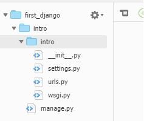
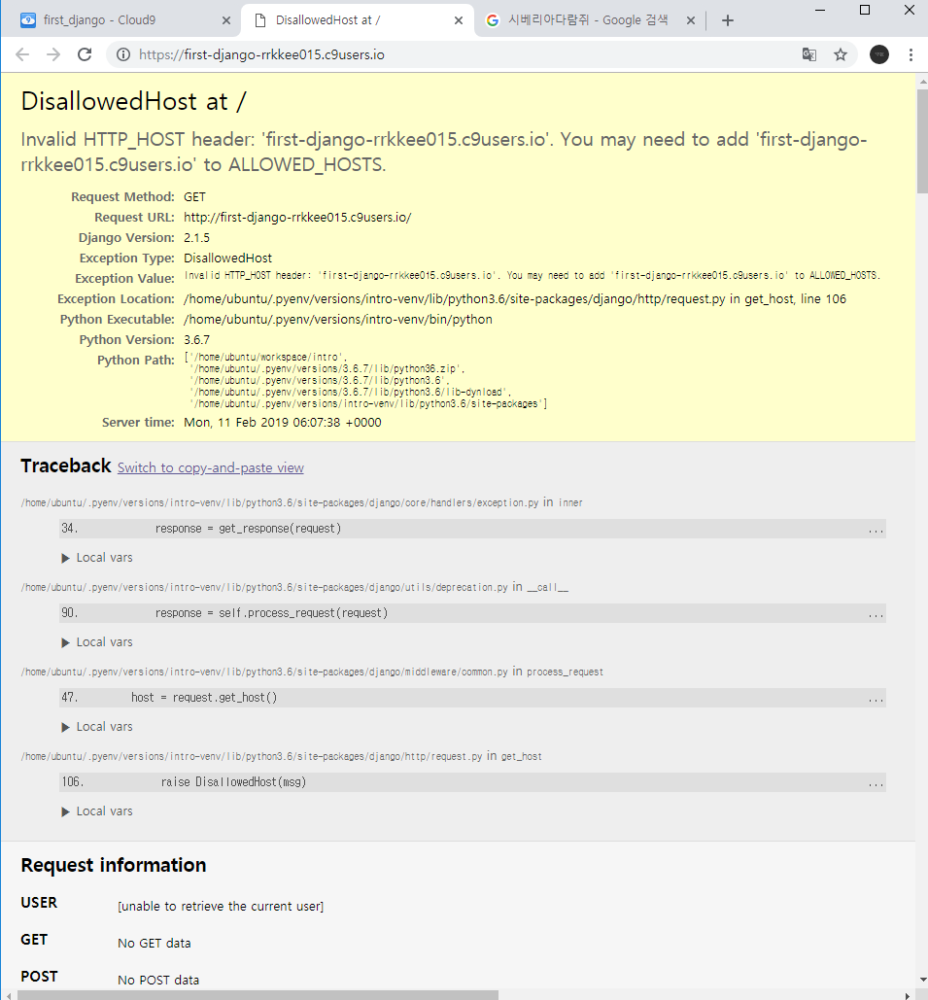
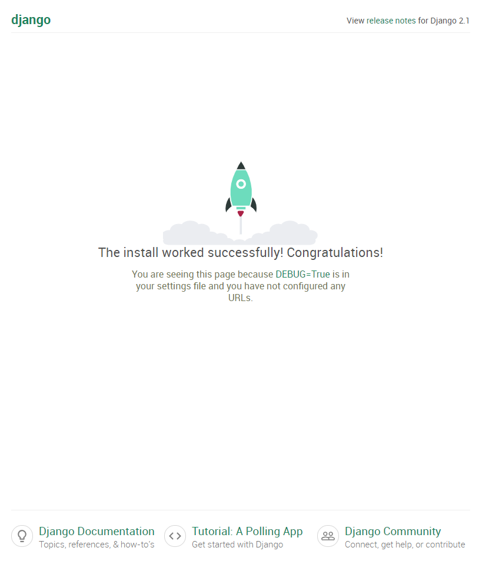
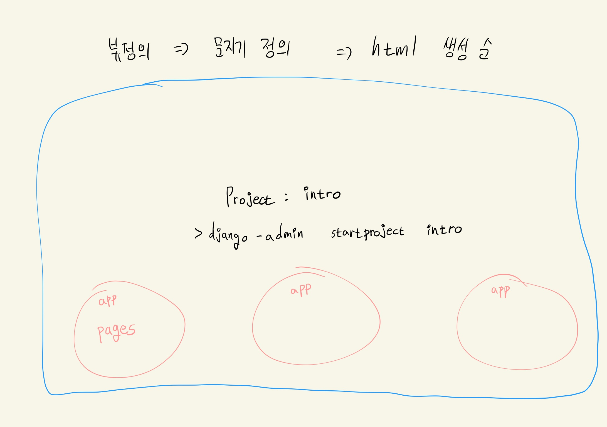

# 2019-02-11

- 알고리즘 시험이 변경 되었다.
  - 따라서 다음 주부터 알고리즘을 공부하게 될 거 같다.

## Project 풀이

- flask와 flask-sqlalchemy를 다운 받자

> workspace

```python
$ sudo pip3 instal flask flask-sqlalchemy #이렇게 하면 한꺼번에 다운 가능
```

- zzu.li/flask-alchemy에서 코드 복사 해오자

> app.py

```python
from flask import Flask, render_template, request, redirect
from flask_sqlalchemy import SQLAlchemy

app = Flask(__name__)

app.config['SQLALCHEMY_DATABASE_URI'] = 'sqlite:///blog2.db'
app.config['SQLALCHEMY_TRACK_MODIFICATIONS'] = False

db = SQLAlchemy(app)
```

- Movie라고 하는 테이블을 생성하자

> app.py

```python
db.init_app(app) #얘는 app이 실행이 됐을 때 먼저 똭 해줘야 하니까 위에다가 집어 넣음

class Movie(db.Model):
    __tablename__='movies'
    __table_args__={'sqlite_autoincrement':True} #얘는 됨
    id = db.Column(db.Integer, primary_key=True) #얘를 붙혀도 안됨(,autoincrement=True)
    title = db.Column(db.String, nullable=False)
    title_en = db.Column(db.String, nullable=False)
    audience = db.Column(db.Integer, nullable=False)
    open_date = db.Column(db.String, nullable=False)
    genre = db.Column(db.String, nullable=False)
    watch_genre = db.Column(db.String, nullable=False) #아마 watch_grade가 아닌가 싶은데 강사님이 watch_genre를 씀
    score = db.Column(db.Float, nullabe=False)
    poster_url = db.Column(db.String, nullable=False)
    description = db.Column(db.String, nullable=False)
    
    def __repr__(self): #클래스를 출력했을 때 아래와 같이 이쁘장하게 만들기 위한 틀
        return "<Movie {} : {}>".format(self.id, self.title) #"<Movie {아이디} : {제목}>"

db.create_all()
```

- 하나씩 만들자

> app.py

```python
@app.route('/')
def index():
    return render_template('index.html')
```

- templates 폴더 안에다가 `index.html`을 만들자. (`new.html`, `show.html`, `edit.html`도 만들자)

> index.html

```html
<!DOCTYPE html>
<html lang="en">
<head>
    <meta charset="UTF-8">
    <meta name="viewport" content="width=device-width, initial-scale=1.0">
    <meta http-equiv="X-UA-Compatible" content="ie=edge">
    <title>Document</title>
</head>
<body>
    <h1>영화 데이터베이스 !</h1>
</body>
</html>
```

- 근데 여기서 드는 의문증 우리가 bootstrap을 쓰려면 각 html 파일 모두에 bootstrap을 다 넣어줘야하는데 이걸 어떻게 한 방에 끝낼 수 있을까? 이걸 상속을 하여서 다른 템플릿에 적용 시킬 수 있다. 우선 새로운 html 파일을 만들어 주고, `index.html`의 모든 코드를 `base.html`에 집어 넣자

> base.html

```html
<!DOCTYPE html>
<html lang="en">
<head>
    <meta charset="UTF-8">
    <meta name="viewport" content="width=device-width, initial-scale=1.0">
    <meta http-equiv="X-UA-Compatible" content="ie=edge">
    <title>Document</title>
</head>
<body>
    <h1>영화 데이터베이스 !</h1>
</body>
</html>
```

- 이렇게 하면 `index.html`에 있는 모든 코드를 지워도 된다. 그리고 밑에와 같이 따라해보자

```html
 <!--base.html에 있는 내용을 가져와서 쓰렴-->
```

- 이 코드를 `new.html`, `show.html`, `edit.html`에도 넣어주자
  - 이렇게 하면 `base.html`의 모든 코드를 가져올 수 있지만 우리가 원하는 페이지마다 커스터마이징 하는 방법이 부족하다.
  - 이 방법을 배워보자

> 참고로 리눅스에서 $ cal을 하면 달력 뜸

- 만약 `new.html`에서 `<h1>`부분을 `영화 등록하기`로 하고 싶다면 `base.html`에서 `<h1>`사이에 구멍을 내면 된다.

> base.html

```html
<!DOCTYPE html>
<html lang="en">
<head>
    <meta charset="UTF-8">
    <meta name="viewport" content="width=device-width, initial-scale=1.0">
    <meta http-equiv="X-UA-Compatible" content="ie=edge">
    <title>Document</title>
</head>
<body>
     <!--block을 내는데 이름을 title로 지었다-->
    
</body>
</html>
```

- 구멍을 냈으니 각각의 페이지에서 알아서 정의해서 구멍을 채울 수 있다.

> index.html

```html
 <!--base.html을 상속 받았다.-->

 <!--base.html에서 title의 이름을 가진 block을 채웠다 -->
<h1>
   	영화 데이터베이스
</h1>

```

> new.html

```html


<h1>
    영화 추가하기
</h1>

```

- 또 구멍을 하나 더 만들어 보자

> base.html

```html
<!DOCTYPE html>
<html lang="en">
<head>
    <meta charset="UTF-8">
    <meta name="viewport" content="width=device-width, initial-scale=1.0">
    <meta http-equiv="X-UA-Compatible" content="ie=edge">
    <title>Document</title>
</head>
<body>
     <!--block을 내는데 이름을 title로 지었다-->
    
    <hr> <!--hr 태그는 구분선 태그-->
    
    
</body>
</html>
```

> index.html

```html
 <!--base.html을 상속 받았다.-->

 <!--base.html에서 title의 이름을 가진 block을 채웠다 -->
<h1>
   	영화 데이터베이스
</h1>



<p>
    영화 리스트
</p>

```

> new.html

```html
 <!--base.html을 상속 받았다.-->

 <!--base.html에서 title의 이름을 가진 block을 채웠다 -->
<h1>
   	영화 데이터베이스
</h1>



<p>
    영화를 추가해주세요.
</p>

```

- 이걸 하면 navbar, footer를 보다 간편하게 사용할 수 있다. `base.html`에만 적용해도 나머지 파일에서도 간단하게 수정할 수 있으니까. 한 번 해보자

> bootstrap

```html
<nav class="navbar navbar-expand-lg navbar-light bg-light">
  <a class="navbar-brand" href="#">Navbar</a>
  <button class="navbar-toggler" type="button" data-toggle="collapse" data-target="#navbarSupportedContent" aria-controls="navbarSupportedContent" aria-expanded="false" aria-label="Toggle navigation">
    <span class="navbar-toggler-icon"></span>
  </button>

  <div class="collapse navbar-collapse" id="navbarSupportedContent">
    <ul class="navbar-nav mr-auto">
      <li class="nav-item active">
        <a class="nav-link" href="#">Home <span class="sr-only">(current)</span></a>
      </li>
      <li class="nav-item">
        <a class="nav-link" href="#">Link</a>
      </li>
      <li class="nav-item dropdown">
        <a class="nav-link dropdown-toggle" href="#" id="navbarDropdown" role="button" data-toggle="dropdown" aria-haspopup="true" aria-expanded="false">
          Dropdown
        </a>
        <div class="dropdown-menu" aria-labelledby="navbarDropdown">
          <a class="dropdown-item" href="#">Action</a>
          <a class="dropdown-item" href="#">Another action</a>
          <div class="dropdown-divider"></div>
          <a class="dropdown-item" href="#">Something else here</a>
        </div>
      </li>
      <li class="nav-item">
        <a class="nav-link disabled" href="#" tabindex="-1" aria-disabled="true">Disabled</a>
      </li>
    </ul>
    <form class="form-inline my-2 my-lg-0">
      <input class="form-control mr-sm-2" type="search" placeholder="Search" aria-label="Search">
      <button class="btn btn-outline-success my-2 my-sm-0" type="submit">Search</button>
    </form>
  </div>
</nav>
```

얘를 `base.html`에 붙여넣자

```html
<!DOCTYPE html>
<html lang="en">
<head>
    <meta charset="UTF-8">
    <meta name="viewport" content="width=device-width, initial-scale=1.0">
    <meta http-equiv="X-UA-Compatible" content="ie=edge">
    <title>Document</title>
</head>
<body>
    <nav class="navbar navbar-expand-lg navbar-light bg-light">
      <a class="navbar-brand" href="#">Navbar</a>
      <button class="navbar-toggler" type="button" data-toggle="collapse" data-target="#navbarSupportedContent" aria-controls="navbarSupportedContent" aria-expanded="false" aria-label="Toggle navigation">
        <span class="navbar-toggler-icon"></span>
      </button>
    
      <div class="collapse navbar-collapse" id="navbarSupportedContent">
        <ul class="navbar-nav mr-auto">
          <li class="nav-item active">
            <a class="nav-link" href="#">Home <span class="sr-only">(current)</span></a>
          </li>
          <li class="nav-item">
            <a class="nav-link" href="#">Link</a>
          </li>
          <li class="nav-item dropdown">
            <a class="nav-link dropdown-toggle" href="#" id="navbarDropdown" role="button" data-toggle="dropdown" aria-haspopup="true" aria-expanded="false">
              Dropdown
            </a>
            <div class="dropdown-menu" aria-labelledby="navbarDropdown">
              <a class="dropdown-item" href="#">Action</a>
              <a class="dropdown-item" href="#">Another action</a>
              <div class="dropdown-divider"></div>
              <a class="dropdown-item" href="#">Something else here</a>
            </div>
          </li>
          <li class="nav-item">
            <a class="nav-link disabled" href="#" tabindex="-1" aria-disabled="true">Disabled</a>
          </li>
        </ul>
        <form class="form-inline my-2 my-lg-0">
          <input class="form-control mr-sm-2" type="search" placeholder="Search" aria-label="Search">
          <button class="btn btn-outline-success my-2 my-sm-0" type="submit">Search</button>
        </form>
      </div>
    </nav>
     <!--block을 내는데 이름을 title로 지었다-->
    
    <hr> <!--hr 태그는 구분선 태그-->
    
    
</body>
</html>
```

- 이렇게만 적용해도 다른 `html`파일에도 다 적용이 된다. 하나씩 수정을 하자

> new.html

```html
 <!--base.html을 상속 받았다.-->

 <!--base.html에서 title의 이름을 가진 block을 채웠다 -->
<h1>영화 데이터베이스</h1>



<p>영화를 추가해주세요.</p>
<form action="/create">
    영화명 :<input type="text" name="title"/><br>
    영화명(영문) :<input type="text" name="title_en"/><br>
   	누적 관객수 :<input type="number" name="audience"/><br>
    개봉일 :<input type="date" name="open_date"/><br> <!--이렇게 하면 달력 나옴-->
    장르 :<input type="text" name="genre"/><br>
    관람등급 :<input type="text" name="watch_genre"/><br>
    평점 :<input type="text" name="score" max="5" min="0" step="0.5"/><br>
    포스터 이미지 :<input type="text" name="poster_url"/><br>
    영화 소개 :<input type="text" name="description"/><br>
    <input type="submit" value="Submit"/>
</form>

```

- 그리고 `new.html`에서 보낸 정보를 받을 `app.py`에서 create를 만들어 보자.
  - 근데 원래 아래와 같이 다 파라미터를 다 일일이 넣어야 한다. 이걸 간단하게 만드는 법이 없을까?

> app.py

```python
@app.route('/create')
def create():
    title = request.args.get('title')
    title_en=request.args.get('title_en')
    ...
    # request.args
    # {'title':'극한직업', 'title_en':'3D', ...}
    # 이런 애들을 get을 사용하여서 value 값을 가져왔다.
    movie=Movie(title=title, title_en=title_en)
    db.session.add(movie)
    db.session.commit()
    return redirect('/')
```

- 이렇게 하면 줄일 수 있다.

> app.py

```python
@app.route('/create')
def create():
    # **request.args
    # title = '극한직업', 'title_en'='3D' ...
    # 딕셔너리를 해체해서 알아서 값들을 넣어준다.
    movie=Movie(**request.args) #unfolding 한다는 뜻. #이래서 우리가 파라미터랑 값의 이름을 같게 만들었다 !!!!!!!!!!
    db.session.add(movie)
    db.session.commit()
    return redirect('/')
```

- 근데 이렇게 하면 에러 뜬다. 그래서 score를 Float형이 아닌 Integer형으로 바꾸고 다시 해보자

> app.py

```python
db.init_app(app) #얘는 app이 실행이 됐을 때 먼저 똭 해줘야 하니까 위에다가 집어 넣음

class Movie(db.Model):
    __tablename__='movies'
    __table_args__={'sqlite_autoincrement':True} #얘는 됨
    id = db.Column(db.Integer, primary_key=True) #얘를 붙혀도 안됨(,autoincrement=True)
    title = db.Column(db.String, nullable=False)
    title_en = db.Column(db.String, nullable=False)
    audience = db.Column(db.Integer, nullable=False)
    open_date = db.Column(db.String, nullable=False)
    genre = db.Column(db.String, nullable=False)
    watch_genre = db.Column(db.String, nullable=False) #아마 watch_grade가 아닌가 싶은데 강사님이 watch_genre를 씀
    score = db.Column(db.Integer, nullabe=False)
    poster_url = db.Column(db.String, nullable=False)
    description = db.Column(db.String, nullable=False)
```

- 이래도 또 에러 뜨는데 왜냐면 sqlite3는 인자를 넘길 때 list로 넘긴다. 애들은 string , float, integer 형식으로 받고 싶은데 ㅠㅠ... 그래서 request.args를 출력해보면 `{title:['극한직업'], title_en:['3D'], ...}` 이렇게 뜬다 얘를 `args = {key:value[0] for key, value in dict(request.args).items()}` 작업을 해주고 `**args`를 해주면 해결이 된다. 혹은 `movie=Movie(**request.args.to_dict())`으로 해도 된다.
  - 참고로 `dict(request.args)`를 왜 하냐면 request.args 자체가 dict 형태가 아니고 dict 스러운 애임 그래서 dict을 또 해줘야한다.

## 오후

- 장고를 할 것이다. (새 슬라이드가 올라왔다.)
- c9.io에서 새로운 workspace를 만들자
- 그리고 파이썬을 3.6버전으로 올릴 것이다.
- 우선 zzu.li/install-pyenv에 들어가서 한땀한땀 복사해서 설치하도록 하자.(한 줄씩 해야함)

> zzu.li/install-pyenv

```python
git clone https://github.com/pyenv/pyenv.git ~/.pyenv
echo 'export PYENV_ROOT="$HOME/.pyenv"' >> ~/.bashrc #환경변수 제작
echo 'export PATH="$PYENV_ROOT/bin:$PATH"' >> ~/.bashrc #경로변수에 넣어주고
echo -e 'if command -v pyenv 1>/dev/null 2>&1; then\n  eval "$(pyenv init -)"\nfi' >> ~/.bashrc
exec "$SHELL"

git clone https://github.com/pyenv/pyenv-virtualenv.git $(pyenv root)/plugins/pyenv-virtualenv
echo 'eval "$(pyenv virtualenv-init -)"' >> ~/.bashrc
exec "$SHELL"
```

>여기서 virtualenv가 뭘까? 가상의 환경에서 내가 설치한 것들만 쓰겠다. 하고 싶을 때 쓰는 것

> workspace

```python
$ git clone https://github.com/pyenv/pyenv.git ~/.pyenv
$ echo 'export PYENV_ROOT="$HOME/.pyenv"' >> ~/.bashrc
...
...
```

- pyenv --version을 치면 `pyenv 1.2.9-2-g6309aaf2`가 나오면 잘 된거

- 여기까지하고 나서 아래와 같이 하면 된다.

> workspace

```python
$ pyenv install 3.6.7을 하면 된다.
```

> workspace

```python
$ python --version
Python 2.7.6
$ pyenv global 3.6.7 #pyenv에게 3.6.7버전을 전역에서 쓰겠다는 뜻
$ python --version
Python 3.6.7
```

- 그리고 이제 폴더를 하나 만들자 `intro`라는 그리고 `cd/intro`를 하고 아래와 같이 하자

> workspace

```python
$ pyenv virtualenv 3.6.7 intro-venv #pyenv에게 virtualenv에게 3.6.7 버전의 가상환경을 만들고 그 이름을 intro-venv를 해달라는 뜻
$ pyenv local intro-venv #pyenv에게 이 폴더(로컬 폴더)는 내가 이 폴더에 들어온다면 intro-venv가 가상환경으로 실행되게 해줘라는 뜻
```

- 여기까지하면 뭔가 이상한게 생긴다

> workspace

```python
(intro-venv) rrkkee015:~/workspace/intro $
#여기서는 내가 pip를 통해서 설치를 하더라도 바깥에 영향을 못 끼치고 역시나 밖에서도 안을 영향을 못 준다.
```

- 그리고 장고를 설치하자

> workspace

```python
$ pip install django #pip3를 왜 안하냐면 가상환경에는 python3를 대표로 했으니 pip 해도 됨
# 바깥에서는 pip3를 해야한다. 그 이유로는 python2가 기본으로 되어있기 때문(그냥 pip)에 python3를 하려면 pip3를 명시해줘야한다.
```

- 그리고 더 프로젝트를 시작하자

> workspace

```python
$ django-admin startproject intro . #장고 관리자에게 startproject를 해달라는 뜻인데, intro로 이름이 붙혀진 프로젝트이고(intro) 쩜은 리눅스에서 현재 폴더에 하겠다라는 뜻( .)
```

- 그러면 intro 폴더 안에 뭐 이상한게 많이 생겼다 !



- `__init__.py`파일은 내가 평생 건들 일 없는 파일이다.
- `settings.py`파일은 장고 앱의 설정이 들어가 있다. 우리가 건들 일이 많다. `LANGUAGE_CODE='en-us'` `LANGUAGE_CODE='ko-kr'`를 이렇게 바꿀 수도 있고 `TIME_ZONE='UTC'`를 `TIME_ZONE='Asia/Seoul'`로 건들 수 있고 `USE_I18N` (I18n은 internationalization의 줄임 말이다), 근데 한국어로 하면 깨질 수도 있다.
- `urls.py`는 가장 많이 건들 파일이다. (얘는 문지기 파일이다. @app.route하는 친구)
- `wsgi.py`는 한동안 볼 일이 없다. (배포할 때만 쓰는 애)
- 즉 `settings`랑 `urls`만 자주 쓸 것이다.
- `magage.py`는 서버 부를 때만 쓰이는 친구


## 이제 간단한 앱을 만들어 보자

- 처음엔 복잡한데 쓰다보면 더 편하다.
- 우선 서버를 한번 실행해 보자

> workspace

```python
$ python manage.py runserver $IP:$PORT #flask run 하는 것과 같음
```



- 당연히 에러가 뜸, 아무고토 안했으니까, 되게끔 하려면 `settings.py`에서 `ALLOWED_HOSTS=["first-django-rrkkee015.c9users.io"]` 서버 주소를 복사하고 앞에처럼 붙여넣기 하면 된다. 그렇게 하고 다시 실행하면 로켓이 뜬다.





- 이제 기본 파일에서 app을 만들어보자

>workspace

```python
workspace/intro $ python manage.py startapp pages #pages라는 app을 만들겠다.
```

- 이러면 폴더 하나가 생긴다. 한번 구성을 보자

> workspace

```python
$ tree .
.
├── db.sqlite3
├── intro
│   ├── __init__.py
│   ├── __pycache__
│   │   ├── __init__.cpython-36.pyc
│   │   ├── settings.cpython-36.pyc
│   │   ├── urls.cpython-36.pyc
│   │   └── wsgi.cpython-36.pyc
│   ├── settings.py
│   ├── urls.py
│   └── wsgi.py
├── manage.py
└── pages
    ├── __init__.py #건들일 없다.
    ├── admin.py #관리자용 페이지를 만들 수 있다.
    ├── apps.py #앱의 정보가 있는 파일, 거의 쓸 일 없다.
    ├── migrations #이상한 폴더가 생겼다.
    │   └── __init__.py
    ├── models.py #데이터를 관리하는 파일
    ├── tests.py #지금은 안 씀
    └── views.py #가장 중요한 파일
```

- 일단, views.py에 함수를 정의하자

> pages/view.py

```python
from django.shortcuts import render

# Create your views here.
def index(request): #flask에서는 request 썼는데 Django에서 쓰려면 얘를 인자로 넣어줘야한다.
    return render(request, 'index.html')

#얘를 플라스크 버전으로 쓰면
#@app.route('/') #얘는 없는데 나중에 만들어보자
#def index():
#    return render_template('index.html')
```

- `index.html`을 만들기 위해 `pages/templates`폴더를 만들어 주자 (flask랑 똑같다) 그리고 그 안에다가 글 넣자

> pages/templates/index.html

```html
<h1>
    장고의 첫번째 앱이다.
</h1>
```

- 이제 route 정의를 하는데 그거는 `intro/urls.py`에 정의를 한다.

> intro/urls.py

```python
from pages import views

urlpatterns = [
    path('admin/', admin.site.urls),
    path('index/', views.index)#앞에는 /가 없고 뒤에만 붙는다. #index라는 요청이 오면 views안에 index라는 함수를 찾게 해준다. (views는 pages/views.py의 파일을 가져옴 정확한 위치를 보내기 위해서 위에 from ... import ...를 사용했다.)
    #path(요청 받을 url, 넘겨줄 view)
]
```

- 그러고 아직 우리는 `/` URL을 정의 안 했으니 `/index` URL로 가보자. `https://first-django-rrkkee015.c9users.io/index/`
- 그리고 **`settings.py`**에서 INSTALLED_APPS에다가 우리가 다운 받은 것들을 추가해줘야한다.

> settings.py

```python
INSTALLED_APPS = [
    'django.contrib.admin',
    'django.contrib.auth',
    'django.contrib.contenttypes',
    'django.contrib.sessions',
    'django.contrib.messages',
    'django.contrib.staticfiles',
    'pages.apps.PagesConfig' #얘를 넣어줘야한다.
]
```

- 이제 로또를 만들어보자

> intro/urls.py

```python
urlpatterns = [
    path('admin/', admin.site.urls),
    path('index/', views.index),
    path('lotto/', views.lotto)
]
```

> pages/views.py

```python
from django.shortcuts import render
import random
# Create your views here.
def index(request):
    return render(request, 'index.html')

def lotto(request):
    lucky = random.sample(range(1,46),6)
    return render(request, 'lotto.html', {'lucky':lucky}) #flask는 lucky=lucky를 했다.

#얘는 역시
#@app.route('/lotto')
#def lotto():
#    import random
#    lucky = random.sample(range(1,46),6)
#    return render_template('lotto.html', lucky=lucky)
#얘랑 같다
```

- 이제 `templates`폴더에 `lotto.html`을 만들어 주자

> pages/templates/lotto.html

```html
<h1>{{ lucky }}</h1>
```

----

- 또 만들어보자, 지금까지 만든건 static web인데, dynamic을 만들어 보자

> pages/views.py

```python
from django.shortcuts import render
import random
# Create your views here.
def index(request):
    return render(request, 'index.html')

def lotto(request):
    lucky = random.sample(range(1,46),6)
    return render(request, 'lotto.html', {'lucky':lucky}) 

def hello(request, name): #request는 항상 있다고 생각하셈
    return render(request, 'hello.html',{'name':name})
    
#flask에서는 이렇게 짰다.
#@app.route('/hello/<name>')
def hello(name):
    return render_template('hello.html', name=name)
```

- 이제 문지기 `urls.py`를 손보자

> intro/urls.py

```python
urlpatterns = [
    path('admin/', admin.site.urls),
    path('index/', views.index),
    path('lotto/', views.lotto),
    path('hello/<str:name>/', views.hello) #flask처럼 누가 넘어오는지 알려면 <>를 썼다. 그리고 끝 부분은 항상 /를 붙혀야 한다.
]
```

- 이제 `hello.html`을 만들면 된다.

> hello.html

```html
<h1>{{name}}</h1>
```

- 근데 참고로 서버 껐다 킬 필요없다. `setting`과 `database` 건들지 않았다면 굳이 껐다 클 필요가 없다.

---

### 미니 프로젝트 (저녁 메뉴 추천하기, 뒤집기, 루트 구하기)

> 명세서

```
/dinner
-> dinner.html
저녁 메뉴를 추천해주는 view를 구성하세요.

/reverse/hello
-> reverse.html
olleh를 출력하는 view를 구성하세요.

/sqrt/4
-> sqrt.html
출력값이 2가 되도록
```

> views.py

```python
from django.shortcuts import render
import random
# Create your views here.
def index(request):
    return render(request, 'index.html')

def lotto(request):
    lucky = random.sample(range(1,46),6)
    return render(request, 'lotto.html', {'lucky':lucky})
    
def hello(request, name): #request는 항상 있다고 생각하셈
    return render(request, 'hello.html',{'name':name})
    
def dinner(request):
    dinners=['돈까스','김밥','라면','볶음밥']
    dinner=random.choice(dinners)
    return render(request, 'dinner.html', {'dinner':dinner})

def reverse(request, sentence):
    sentence= sentence[::-1]
    return render(request, 'reverse.html',{'sentence':sentence})
    
def sqrt(request, num):
    num=(num)**(1/2)
    return render(request, 'sqrt.html',{'num':num})
```

> urls.py

```python
from django.contrib import admin
from django.urls import path
from pages import views #이거 때문에 밑에 애가 실행됨

urlpatterns = [
    path('admin/', admin.site.urls),
    path('index/', views.index),
    path('lotto/', views.lotto),
    path('hello/<str:name>/', views.hello), #flask처럼 누가 넘어오는지 알려면 <>를 썼다. 그리고 끝 부분은 항상 /를 붙혀야 한다.
    path('dinner/', views.dinner),
    path('reverse/<str:sentence>/', views.reverse),
    path('sqrt/<int:num>/', views.sqrt)
]
```

> dinner.html

```html
<h1>{{ dinner }}</h1>
```

> reverse.html

```html
<h1>{{ sentence }}</h1>
```

> sqrt.html

```html
<h1>{{num}}</h1>
```


### 14번 workshop, homework.pdf를 하도록 하자

# 뷰 정의 ===> 문지기에서 path 설정 ===> html 파일 조작 순을 머리 속에 기억하자