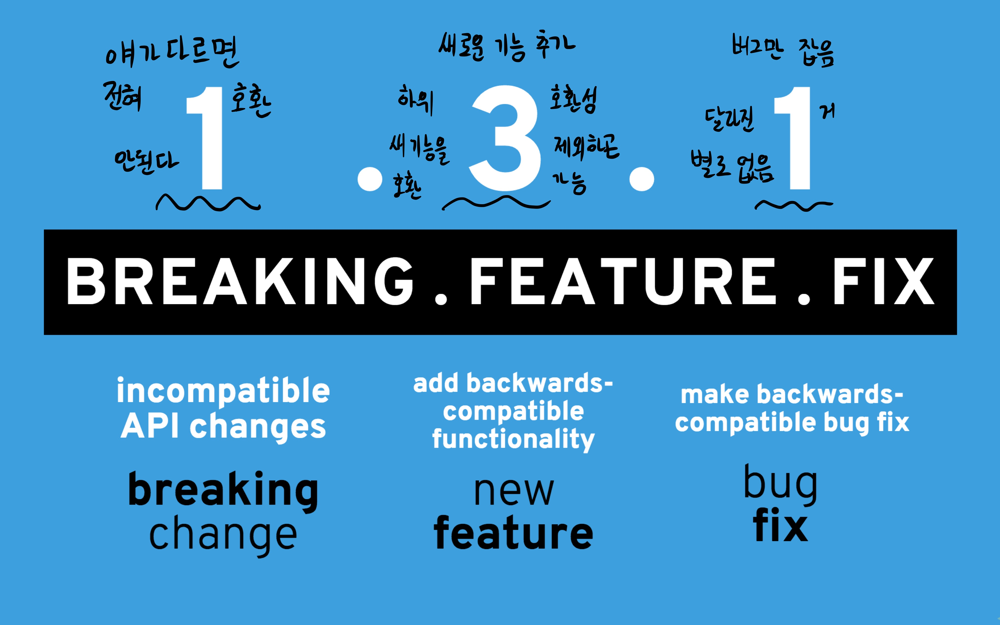

# 2019-02-12

## Workshop 풀이 (중요 ~!)

1. 프로젝트 진행할 폴더 생성 [TEST]
2. 해당 폴더로 이동(cd test)
3. 가상 환경 설정
   - pyenv virtualenv 3.6.7 [가상환경 이름]
   - pyenv local [가상환경 이름]
4. Django 설치
   - `pip install django`
5. Django 프로젝트 test 생성
   - `django-admin startproject text .`

- 여기까지가 항상 해야하는 일반적인 패턴

> workspace

```shell
> mkdir TEST
> cd TEST
> pyenv virtualenv 3.6.7 test-venv #가상환경 만들고
> pyenv local test-venv #가상환경에 들어간다.
> pip install django #django 설치
> django-admin startproject test .
```

----

- 옛날 애들과 충돌나면 안되니까 따로 객체를 만들어서 독립적인 공간을 두는 것이다.


### 갑자기 다른 얘기



- 위에 코드까지 했으면 아래와 같이 하면 된다

```shell
> python manage.py startapp solution
```

- 그리고 settings.py에 `INSTALLED_APPS`에 아래를 추가하자

```python
'solution.apps.SolutionConfig' #를 리스트에 추가하자
```

- 여기까지 했으면 아래와 같은 절차가 필요하다
  1. view 정의
  2. url
  3. template
- 해봅시다 !

> solution/views.py

```python
from django.shortcuts import render

# Create your views here.
def info(request):
    return render(request, 'info.html')
```

- 그리고 templates 폴더를 solution 폴더에 만들어 줍시다. 그 안에 `info.html`을 만듭시다.
- 그 뒤엔 문지기 url에 가서 urlpatterns에 우리가 만든 app의 정보를 넣어 줍시다.

> urls.py

```python
from solution import views.py
urlpatterns = [
    ...
    path('info/', views.info)
]
```

- 이제 `info.html`을 만들어 주면 된다.

> info.html

```html
<h1>
    우리반정보
</h1>
<h3>
    Teacher
</h3>
<ul>
    <li>NAME</li>
</ul>
<h3>
    Student
</h3>
<ul>
    <li>홍길동</li>
    <l1>박길동</l1>
    <li>김길동</li>
</ul>
```

- 그러고 서버를 돌려봅시다. 아마 안 돌아갈 것이다.

```shell
> python manage.py runserver $IP:$PORT
```

- settings.py 에서 ALLOWED_HOSTS에 새로운 url을 넣으면 된다. 아마 `"first-django-rrkkee015.c9users.io"` 얘일 것이다.

- 이젠 student를 넣어야한다. 다시 `views.py`에 갑시다

> views.py

```python
import random
...
...
def sutudent(request, name):
    age = random.randint(20,30)
    return render (request, 'student.html',{'name':name, 'age':age})
```

> urls.py

```python
...
...
urlspatterns=[
    ...
    path('student/<name>/',views.student),
]
```

> student.html

```html
<h1>
    이름 : {{name}}
</h1>
<h3>
    나이 : {{age}}
</h3>
```

### 갑자기 미션 ! 나 포함 양 옆의 사람을 포함해서 나이를 저장하고 출력이 되도록 해봅시다.

> views.py

```python
def student(request, name):
    students={'전세':27,'꼬동':27,'상원이형':29}
    return render (request, 'student.html',{'name':name,'age':students[name]})
```

> student.html

```html
<h1>
    이름 : {{name}}
</h1>
<h3>
    나이 : {{age}} <!--여기서 students dictionary 자체를 넘겨서 students[name]을 하려 했는데 그러면 안된다 name과 students 자체가 다른 폴더에 들어있는 것과 같아서 따로 보기 때문이다-->
</h3>
```

### 또션 ! Isit발렌타인데이를 만들어 봅시다.

> views.py

```python
def val(request):
    time=datetime.datetime.now()
    print(time)
    time=time.strftime("%Y-%m-%d")
    print(time)
    if time=="2019-02-14":
        result="예"
    else:
        result="아니요"
    return render (request, 'val.html',{'result':result})
```

> urls.py

```python
urlpatterns=[
    ...
    ..4
    path('val/',views.val)
]
```

> val.html

```html
{{result}}

<!--

<h1>예</h1>

<h1>아니요</h1>

-->
<!-- 이렇게 안에서 if 문을 만들어서 건내도 된다. 근데 html 파일은 되게 간단해야 좋으니 보낼 때부터 views.py에서 보내는 것이 좋다. -->
```

### 또션, D-day를 만들어보자

> views.py

```python
def grad(request):
    time=datetime.datetime.now()
    end=datetime.datetime(2019, 5, 19)
    time=end-time
    return render (request, 'grad.html', {'time':time.days}) #뒤에 days를 붙혀야 남은 일 수 만 나온다.
```

### 랜덤 이미지가 나오도록 만들어보자

> views.py

```python
def image(request):
    return render(request, 'image.html')
```

> image.html

```html

```


- 여기까지 해봤다면 `urls.py`에 되게 많은 `urlpatterns`이 생겼는데 얘를 줄여봅시다.
  - solution 폴더에 `urls.py`라고 또 만들어주자. (얘는 solution이라는 app 안에만 있는 파일이다.)

  > solution/urls.py

  ```python
  from django.urls import path
  from . import views #.은 현재 폴더의 의미
  
  urlpatterns = [
      #path('admin/', admin.site.urls), #얘는 쓸 필요 없다.
      path('student/<str:name>/',views.student),
      path('val/',views.val),
      path('grad/',views.grad),
      path('image/',views.image),
  ]
  ```

- 여기까지 했으면 대장 문지기에게 뭔가를 추가해야한다.

  > first_workshop/urls.py

  ```python
  urlpatterns=[
      path('admin/',admin.site.urls),
      path('',include('solution.urls'))
  ]
  ```

  여기까지하면 똑같이 작동한다. 근데 아래와 같이 하면 어떻게 될까?

  > first_workshop/urls.py

  ```python
  urlpatterns=[
      path('admin/',admin.site.urls),
      path('home/',include('solution.urls')),
  ]
  ```

  이렇게 만들면 `home/image`처럼 home을 Url에 추가해줘야한다. 즉, 분리해서 관리가 가능한데, 이렇기 때문에 장고를 많은 사람들이 쓴다.

  이젠 우리 `index` 페이지를 만들어보자

  > solution/views.py

  ```python
  def index(request):
      return render(request, 'index.html')
  ```

  > solution/urls.py

  ```python
  urlpatterns=[
      ...
      ...
      path('',views.index)
  ]
  ```

- 이젠 여기다가 bootstrap을 만들고 싶다. 그러려면 어떻게 해야할까 ?

  > templates/base.html

  ```html
  <!DOCTYPE html>
  <html lang="en">
  <head>
      <meta charset="UTF-8">
      <meta name="viewport" content="width=device-width, initial-scale=1.0">
      <meta http-equiv="X-UA-Compatible" content="ie=edge">
      <link rel="stylesheet" href="https://stackpath.bootstrapcdn.com/bootstrap/4.3.0/css/bootstrap.min.css" integrity="sha384-PDle/QlgIONtM1aqA2Qemk5gPOE7wFq8+Em+G/hmo5Iq0CCmYZLv3fVRDJ4MMwEA" crossorigin="anonymous">
      <script src="https://code.jquery.com/jquery-3.3.1.slim.min.js" integrity="sha384-q8i/X+965DzO0rT7abK41JStQIAqVgRVzpbzo5smXKp4YfRvH+8abtTE1Pi6jizo" crossorigin="anonymous"></script>
      <script src="https://cdnjs.cloudflare.com/ajax/libs/popper.js/1.14.7/umd/popper.min.js" integrity="sha384-UO2eT0CpHqdSJQ6hJty5KVphtPhzWj9WO1clHTMGa3JDZwrnQq4sF86dIHNDz0W1" crossorigin="anonymous"></script>
      <script src="https://stackpath.bootstrapcdn.com/bootstrap/4.3.0/js/bootstrap.min.js" integrity="sha384-7aThvCh9TypR7fIc2HV4O/nFMVCBwyIUKL8XCtKE+8xgCgl/PQGuFsvShjr74PBp" crossorigin="anonymous"></script>
      <title>First Django</title>
  </head>
  <body>
      
      
  </body>
  </html>
  ```

  > templates/index.html

  ```html
  
  
  <h1>hello</h1>
  
  ```

- 이제는 정보를 보내고 받는 방법을 만들어 보자 html 내에서

  > templates/index.html (보낸다 ~)

  ```html
  
  
  <h1>hello</h1>
  <form action="/catch">
      <input type="text" name="message">
      <input type="submit" value="던지기">
  </form>
  
  ```

  > views.py (받는다 ~)

  ```python
  def catch(request):
      msg = request.GET.get('message') #중간에 args가 GET으로 변했다.
      return render(request, 'catch.html', {'msg':msg})
  
  #@app.route('/catch')
  #def catch():
  #	request.args.get('message')
  ```

  > catch.html

  ```html
  
  
  <h1>
      {{msg}}
  </h1>
  
  ```

## PAPAGO 번역기를 만들어 봅시다.

```
/translate
-> 한글 단어를 입력 받아

/result
-> (Papago NMT API) 번역 결과를 출력함
```

- 우선 우리는 파파고 NMT API 가이드를 참고할 것입니다.

  > developers.naver.com

  ```shell
  curl "https://openapi.naver.com/v1/papago/n2mt" \
  ```

- 그런 다음 환경변수를 설정하자

  > workspace

  ```shell
  > vi~/.bashrc #하고나서 o를 하고
  export naver_id="내 naver_id"
  export naver_secret="내 naver_secret"
  ```


## Django Model

- Model을 만드는 것은 간단합니다 ~! 하지만 일단 ORM 이라는 app을 새로 만들어 봅시다.

> workspace

```shell
> mkdir ORM
> cd ORM
> pyenv virtualenv 3.6.7 orm-venv
> pyenv local orm-venv
> pip install django #django 설치
> django-admin startproject orm .
> python manage.py startapp articles
```

> settings.py

```python
INSTALLED_APPS = [
	...
    ...
    'articles' #앱 만들것을 추가하는 것
]
```

- 원래라면 `views.py`를 건드렸지만 이제는 `models.py`를 건드려 봅시다. (참고로 우리가 ORM 미리 해봤었는데 그 때 좀 불편한 점(코드가 너무 길다던지)들이 하나가 아니었다, Django ORM은 그것보다 훨 편하다.)

> models.py

```python
from django.db import models

class Article(models.Model): #class Article(db.Model): 이었었음
    #__tablename__ = "articles" 이었었더랬지 하지만 django는 알아서 클래스명에서 복수형으로 바꿔준다. #id도 정의 안하면 알아서 만들어 준다. 올~
    title = models.TextField() # title = db.Column(db.String) 이었다.
    content = models.TextField()
```

> workspace

```shell
> python manage.py makemigrations
```

- migrations 폴더가 있는데 우리가 모델에서 만들어 놓은 db 설계도를 실제로 db에 적용하는 것을 migrate라고 표현한다. 어쨋든 이거 하면 됨

- 여기까지하면 `0001_initial.py` 파일이 생겼다. 안에 보면 `id`도 알아서 생기고 `primary_key`도 생기고 간단하게 알아서 만들어 주었다. 

> migrations/0001_initial.py

```python
# Generated by Django 2.1.7 on 2019-02-12 06:25

from django.db import migrations, models


class Migration(migrations.Migration):

    initial = True

    dependencies = [
    ]

    operations = [
        migrations.CreateModel(
            name='Article',
            fields=[
                ('id', models.AutoField(auto_created=True, primary_key=True, serialize=False, verbose_name='ID')),
                ('title', models.TextField()),
                ('content', models.TextField()),
            ],
        ),
    ]

```

- 이제 이 파일을 직접 db에 적용하기 위한 명령을 할 것이다.

> workspace

```shell
> python manage.py migrate
```

- 이제 어쩌구 저쩌구 shell을 해보는데 여기까지하면 이렇게 된다.

> workspace

```shell
> python manage.py shell
Python 3.6.7 (default, Feb 11 2019, 05:35:40) 
[GCC 4.8.4] on linux
Type "help", "copyright", "credits" or "license" for more information.
(InteractiveConsole)
>>> 
```

- 여기서 더 나아가보자

> workspace

```shell
> python manage.py shell
Python 3.6.7 (default, Feb 11 2019, 05:35:40) 
[GCC 4.8.4] on linux
Type "help", "copyright", "credits" or "license" for more information.
(InteractiveConsole)
>>> from articles.models import Article #articles 폴더에서 models.py 에서 Article 클래스를 불러왔당.
>>> article=Article(title="Happy",content="Hacking")
>>> article.save() # 내가 위에 넣은걸 저장한 것이다. #만들고 저장으로 하니 대단히 간단함.
<bound method Model.save of <Article: Article object (None)>>
>>> Article.objects.all() #sqlite에서는 이랬어 Aritcle.query.all()
<QuerySet []> #잉? 뭐징 ?
>>> articles = Article.objects.all()
>>> a=articles[0]
>>> a.title
'Happy'
>>> a.content
'Hacking'
>>> a = Article(title="두 번째 글",content="입니다.") #얘는 pk=2임
>>> a.save()
>>> articles = Article.objects.all()
>>> articles[1].title
'두번째 글'
>>> a=Article.objects.filter_by(title="Happy").first()
'Happy'
>>> a2=Article.objects.get(pk=1)
>>> a2.title
'Happy'
>>> a2.content
'Hacking'
>>> a1 = Article.objects.get(pk=1)
>>> a1.delete()
>>> len(Article.objects.all())
1
>>> a2 = Article.objects.get(pk=2)
>>> a2.delete()
>>> len(Article.objects.all()) #안에 있는 애들 다 지웠다.
0
```

- 이제 `CRD`를 했는데 `U`인 update를 해봅시다 !

> workspace

```shell
>>> article = Article(title="곧 수업이 끝난다.",content="아싸")
>>> article.save()
>>> article = Article(title="hey", content="it's done")
>>> article.save()
>>> articles = Article.objects.all()
>>> articles[0]
<Article: Article object (3)>
>>> Article.objects.get(title="hey")
<Article: Article object (4)>
>>> article = Article.objects.get(title="hey")
>>> article.title = "dong"
>>> article.save() #이렇게하면 UPDATE 끝 #찾아서 UPDATE하고 저장하기
>>> Article.objects.get(pk=4).title
'dong'
>>> Article.objects.get(pk=4).content
```

- 자, 이제 우리가 Django를 쓰는 큰 이유를 해봅시다. 그게 admin.py입니다. 얘는 뭐하는 애냐면..

> admin.py

```python
from django.contrib import admin
from .models import Article #.을 붙히는 이유는 현재 폴더이기 때문에 ㅎㅅㅎ.. #우리가 지금까지 만든 model 파일을 가져와보자
# Register your models here.

admin.site.register(Article) #뭘 등록하는 걸까?
```

> workspace

```shell
/workspace/ORM $ python manage.py createsuperuser
Username (leave blank to use 'ubuntu'): admin
Email address: #무시
Password: 12341234
$python manage.py runserver $IP:$PORT
```

> settings.py

```python
ALLOWED_HOSTS= ['first-django-rrkkee015.c9users.io']
```

- 이렇게하고 URL을 들어가고 URL에 `/admin`을 더해서 검색을 해보자. 그러면 Django 관리창이 떴다. 거기서 title과 content를 넣을 수 있는 창이 뜬다 ~!
- 우리가 썼던 데이터들이 정리된 상태로 보여주는 깔끔한 웹이 뜬다. 참고로 우리가 지웠던 아이템도 뜨고, 지울 수도 있고, UPDATE 할 수도 있다. 신기방기
- 이 이유가 앞 전에 `admin.site.register(Article)` 때문에 되는 것임
- **이게 장고를 쓰는 이유임**
- 물론 커스터마이징도 가능하다

> admin.py

```python
from django.contrib import admin
from .models import Article

class ArticleAdmin(admin.ModelAdmin):
    list_display = ('title', 'content',) #마지막 , 오류 안 뜸
    
admin.site.register(Article, ArticleAdmin)
```

- 이렇게까지 하고 서버를 껐다 켜서 다시 실행 해보고 `Articles`를 들어가면 게시판처럼 아예 보여준다.