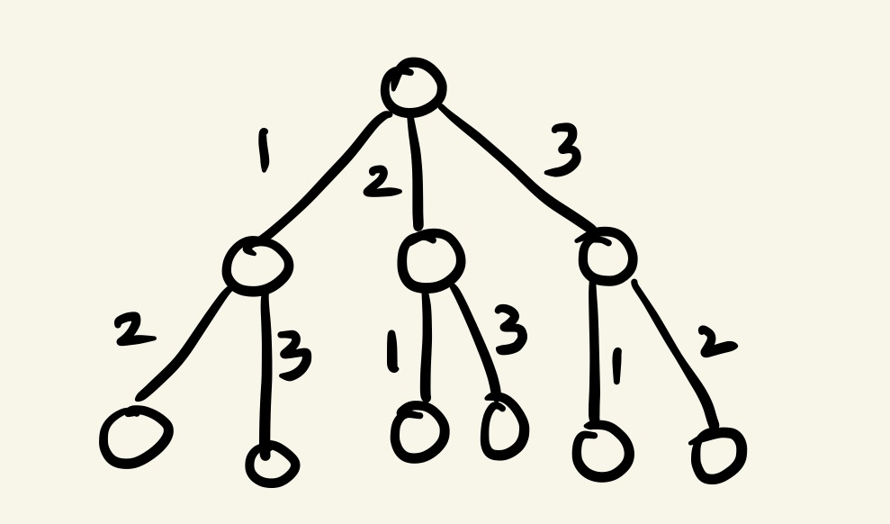

# 2019-02-25

## 시험 느낀 점

- 끝까지 좀 봐라, 빨리 푼다고 좋은거 없다. 문제 꼼꼼히 좀 읽고
- 그리고 자신을 너무 믿지 말고 끝까지 공부해

## 미로 리뷰

- 만약 돌다가 내가 원하는 위치에 도달 했을 땐, 전역 변수를 True로 바꾸고  함수를 멈춰야 한다. 굳이 다른 동작을 할 필요가 없으니까

## 토너먼트 리뷰

- 병합 정렬을 알면 쉽게 풀 수 있는 문제지만, 재귀로 한 번 생각을 해봐라는 의미로 냈던 문제다.

> 미로, 배열합 같은 경우는 advance 수준임, swexpertacademy에서 모의/연습문제 검색하면 문제 나오는데 그 정도 난이도가 ad+, 백준 문제에서 한국정보올림피아드 초등부 수준이 ad이다. 여기서 합격률이 높으면 IM이고(직사각형 네개의 합집합의 면적 구하기), 좀 낮은 문제는 ad 문제임(단지번호붙이기)

## 배열합

- 한 줄에 하나씩 선택할 수 있다. 경우의 수를 따지는 것인데, 한 번 그려봐야 큰 그림을 그릴 수 있다.

- 이렇게 그림을 그려보고 순서가 있고 중복이 안되면 그냥 순열, 중복이 있으면 순열, 순서가 없으면 조합이겠지?
- 근데 10!을 가지치기 안하면 시간 안나오니까 가지쳐야함, 그래서 항상 전역으로 구한 min 값과 계속 비교를 하면서 진행을 해야 시간을 줄일 수 있다. 이런 가지치기 구현 덕목이 AD+ 덕목이다.

## 큐