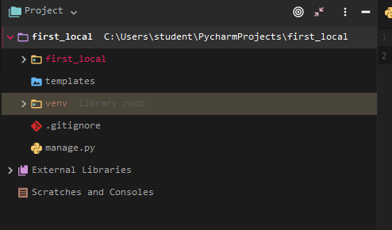

# 2019-03-11

- c9에서 하던 작업을 local에서 할 것이다 ! 그렇게 하기 위해서는 pycharm을 Pro 버전으로 업그레이드 해야하는데, cmd를 관리자 실행을 하고 choco (초코쨔응)을 치면 초콜라티가 있다. (싸피 컴퓨터에) 거기서

  ```cmd
  choco install pycharm
  ```

  을 하면 pycharm이 다운이 된다 !

- 그리고 각종 필요한 Plugins 와 테마를 바꿔주었고, project를 Django로 만들어 줬다.

- 이렇게 실행하면 많은 파일들이 많이 만들어 졌는데 `venv` 폴더는 필요가 없다.  따라서 `gitignore`를 하여서 그 파일에

  ```python
  # 가상환경 파일/디렉토리
  venv/
  
  # Python auto generated cache
  __pycache__/
  
  # Jetbrain auto generated cache
  .idea/
  
  # database에 유저 정보가 있는데 굳이 얘까지 github에 올릴 필요가 없지 않니
  *.sqlite3
  # migrate하는 순간 sqlite3 파일이 생긴다.
  ```

  를 추가하면 git add .을 해도 얘들은 배척되고 add 된다. git ignore는 프로젝트 디렉토리 바로 밑에 있어야 한다.

- 프로젝트 안은 이렇게 구성된다.

  

- 여기까지 했으면, `git init`하고 `git add .` 하고 `git commit -m 'Init project'`하면 된당.


## 게시판 앱을 만들어 보자

- `django-admin startapp board` board앱을 생성

- 여기는 가상환경이라서 다운 받아져 있는 pip list들이 적다. 따라서 새로운 것들도 다운을 받아줘야 한다.

  `pip install django-extensions ipython`

  얘들도 `INSTALLED_APPS`에 추가해주어야 합니다.

- local에서는 `ALLOWED_HOSTS`를 할 필요가 없다. `INSTALLED_APPS`에도 APP을 추가해주자. `board`와 `django-extensions`를 추가해주자. `LANGUAGE-CODE`는 `'ko-kr'`로 `Time-zone`은 `'Asia/Seoul'` `USE_TZ`은 `False`로 여기까지하면 `settings.py`는 끝

- templates 폴더를 생성하기 위해선 git bash 창에서 하면 된다.

  ```python
  student@M70214 MINGW64 ~/PycharmProjects/first_local (master)
  $  mkdir -p board/templates/board
  ```

- 그 다음은 urls.py에서 손을 보자

  > first_local/urls.py

  ```python
  from django.contrib import admin
  from django.urls import path, include
  
  urlpatterns = [
      path('admin/', admin.site.urls),
      path('board/',include('board.urls')),
  ]
  ```

  > board/urls.py

  ```python
  from django.urls import path
  from . import views
  
  app_name = 'board'
  
  urlpatterns = [
      path(''),  # list
      path('new/'),  # new.html
      path('create/'),  # create 액션
  
      path('<int:num>/'),  # detail.html
      path('<int:num>/edit'),  # edit.html
      path('<int:num>/update'),  # update action
  
      path('<int:num>/delete'),  # delete action
  ]
  ```

- 이젠 views를 손보면 된다.

  ```python
  from django.shortcuts import render
  
  # Create your views here.
  
  
  def article_list(request):
      pass
  
  
  def article_detail(request):
      pass
  
  
  def new_article(request):
      pass
  
  
  def create_article(request):
      pass
  
  
  def edit_article(request):
      pass
  
  
  def update_article(request):
      pass
  
  
  def delete_article(request):
      pass
  
  
  ```

- 여기까지 했으면 `Mapping`을 합시다.

  > board/urls.py

  ```python
  from django.urls import path
  from . import views
  
  app_name = 'board'
  
  urlpatterns = [
      path('', views.article_list, name='article_list'),  # list
      path('new/', views.article_detail, name='new_article'),  # new.html
      path('create/', views.create_article, name='create_article'),  # create 액션
  
      path('<int:article_id>/', views.article_detail, name='article_detail'),  # detail.html
      path('<int:article_id>/edit', views.edit_article, name='edit_article'),  # edit.html
      path('<int:article_id>/update', views.update_article, name='update_article'),  # update action
      path('<int:article_id>/delete', views.delete_article, name='delete_article'),  # delete action
  ]
  ```

  - `<int:num>`에서 바꿨다.

- `views.py`에서 `update, delete, detail, edit`은 인자를 추가로 받으니 `article_id` 을 인자로 추가하자

  ```python
  from django.shortcuts import render
  
  # Create your views here.
  
  
  def article_list(request):
      pass
  
  
  def article_detail(request, article_id):
      pass
  
  
  def new_article(request):
      pass
  
  
  def create_article(request):
      pass
  
  
  def edit_article(request, article_id):
      pass
  
  
  def update_article(request, article_id):
      pass
  
  
  def delete_article(request, article_id):
      pass
  ```

- 여기까지 했으면 `html` 파일을 만들어주자

  ```
  student@M70214 MINGW64 ~/PycharmProjects/first_local/board/templates/board (master)
  $ touch base.html list.html detail.html new.html edit.html
  ```

- 이제 Model 정의를 하자

  > models.py

  ```python
  from django.db import models
  
  # Create your models here.
  
  class Article(models.Model):
      title=models.TextField(default='')
      content=models.TextField(default='')
      like=models.IntegerField(default=0)
  
      def __str__(self): #클래스가 print(Article)로 된다면 지금 여기가 실행이 된다.
          return f'{self.id}: {self.title[:20]}'
  ```

  > admin.py

  ```python
  from django.contrib import admin
  from .models import Article
  
  admin.site.register(Article)
  # Register your models here.
  ```

- `makemigrations`, `migrate`하고 `python manage.py createsuperuser`를 하고 사용자 이름과 비밀번호를 입력하면 된다 !

- 서버 실행은 `crtl+alt+R` 하고 `runserver`만 입력 후 `enter`하면 실행이 되고 주소에 `/admin`을 붙히면 `admin` 사이트가 실행된다.


## 오후

- 우리는 항상 `def new(request)`와 `def create(request)`를 나누어서 코드를 짰다. 근데 이걸 하나로 통합하는 방법이 있는데 바로 `GET`방식과 `POST`방식을 이용하는 것이다.

  > views.py

  ```python
  # def new_article(request):
  #     # embed()
  #     # print(request.method)
  #     return render(request, 'board/new.html') #얘가 더이상 필요가 없다.
  
  def create_article(request):
      # print(request,method)
      if request.method == 'GET': # url을 통해서 들어오면 GET 방식이고
          return render(request, 'board/new.html')
      elif request.method == 'POST': # form 형식을 통해서 들어오면 POST 방식으로 넘어온다
          article = Article()
          article.title = request.POST.get('title')
          article.content = request.POST.get('content')
          # embed() # 디버깅을 할 때 사용하는 코드, 이걸 만나면 쉘이 켜진다.
          article.save()
          return redirect('board:article_detail', article.id)
  ```

  > new.html

  ```html
  
  
  
  <h1>New article</h1>
  <form method="POST">
      {# form 에 있어야하는  action="" 얘가 필요가 없어진다. #}
      
      <div>
          <label for="title">Title</label>
          <input type="text" name="title" id="title">
      </div>
      <div>
          <label for="content">Content</label>
          <textarea name="content" id="content" cols="30" rows="10"></textarea>
      </div>
      <div>
          <input type="submit">
      </div>
  </form>
  
  ```

  - 위에 적어놨듯이 `form에서 action 부분이 필요가 없다` 

  - 마찬가지로 `def update(request)`와 `def edit(request)`도 통합이 가능하다.

  > views.py

  ```python
  # def edit_article(request, article_id):
  #     pass
  
  
  def update_article(request, article_id):
      article = get_object_or_404(Article, id=article_id)
      if request.method == 'GET':
          return render(request, 'board/edit.html',{
              'article':article,
          })
      elif request.method == 'POST':
          article.title = request.POST.get('title')
          article.content = request.POST.get('content')
          # embed() # 디버깅을 할 때 사용하는 코드, 이걸 만나면 쉘이 켜진다.
          article.save()
          return redirect('board:article_detail', article.id)
  ```

  > edit.html

  ```html
  
  
  
  <h1>Edit article</h1>
  <form method="POST">
      {# form 에 있어야하는  action="" 얘가 필요가 없어진다. #}
      
      <div>
          <label for="title">Title</label>
          <input type="text" name="title" id="title" value="{{ article.title }}">
      </div>
      <div>
          <label for="content">Content</label>
          <textarea name="content" id="content" cols="30" rows="10">{{ article.content }}</textarea>
      </div>
      <div>
          <input type="submit">
      </div>
  </form>
  
  ```

- 이렇게까지하면 urlpatterns에서 했던 path 설정이 되게 간소화 된다.

  ```python
  from django.urls import path
  from . import views
  
  app_name = 'board'
  
  urlpatterns = [
      path('', views.article_list, name='article_list'),  # list
      # path('new/', views.new_article, name='new_article'),  # new.html
      path('create/', views.create_article, name='create_article'),  # create 액션
  
      path('<int:article_id>/', views.article_detail, name='article_detail'),  # detail.html
      # path('<int:article_id>/edit', views.edit_article, name='edit_article'),  # edit.html
      path('<int:article_id>/update', views.update_article, name='update_article'),  # update action
      path('<int:article_id>/delete', views.delete_article, name='delete_article'),  # delete action
  ]
  ```

## 댓글 기능도 추가하자

- models.py에서 댓글 기능을 추가해보자

  ```python
  from django.db import models
  
  # Create your models here.
  
  class Article(models.Model):
      title=models.TextField(default='')
      content=models.TextField(default='')
      like=models.IntegerField(default=0)
  
      def __str__(self):
          return f'{self.id}: {self.title[:20]}'
  
  class Comment(models.Model): #댓글기능 추가
      article = models.ForeignKey(Article, on_delete=models.CASCADE)
      content = models.CharField(max_length=100)
  
      def __str__(self):
          return f'{self.articcle.title}:{self.content}'
  ```

- database가 변경되는 요청이면 POST, 그게 아니면 GET 방식이다.

- views.py에도 comment 관련해서 추가하자

  ```python
  def create_comment(request, article_id):
      article = get_object_or_404(Article, id=article_id)
      if request.method == 'POST':
          comment = Comment() # import 해야합니다.
          comment.article = article
          comment.content = request.POST.get('comment')
          comment.save()
      return redirect('board:article_detail', article_id)
  
  
  def delete_comment(request, article_id, comment_id):
      if request.method == 'POST':
          comment = get_object_or_404(Comment, id=comment_id)
          comment.delete()
      return redirect('board:article_detail', article_id)
  ```

- 이 댓글들이 `detail.html`에 표시가 되어야하는데 그렇게 되면 `detail.html` 코드가 너무 지저분 해지기에 `include`를 사용하여 간단하게 만들어 볼 것입니다.

  > _comment.html / 앞에 _ 얘는 직접적으로 사용을 할 애가 아니고 include 할 애라고 표시를 해 놓는 것입니다.

  ```html
   <form action="" method="POST">
      
      <label for="comment">comment</label>
      <input type="text" name="comment" id="comment" autofocus>
  </form>
  
  
      <ul>
          
              <li>{{ comment.content }}</li>
          
      </ul>
  
  ```

  > detail.html

  ```html
  
  
      <h1>{{ article.title }}</h1>
      <p>
          {{ article.content }}
      </p>
      <p>
          {{ article.like }}
      </p>
  
      <a href=""><button>목록으로 가기</button></a>
      <a href=""><button>수정하러 가기</button></a>
      <form action="" method="POST">
          
          <button type="submit">삭제하러 가기</button>
      </form>
      <hr>
  
  
  ```

  - 마지막 두 줄을 주목 !!

- 이제 삭제하는 법은 어떻게 할까? => 버튼을 추가하자

  ```python
   <form action="" method="POST">
      
      <label for="comment">comment</label>
      <input type="text" name="comment" id="comment" autofocus>
  </form>
  
  
      <ul>
          
              <li>{{ comment.content }}</li>
              <form action="" method="POST">
                  
                  <button type="submit" onclick="return confirm('진짜 삭제하시겠어요?');">DEL</button>
              </form>
          
      </ul>
  
  ```

  `<form> </form>`을 추가하여서 삭제 버튼을 만들어 주었다. 굳이 form을 왜 만들었는지는 설명 안해도 되겠지? url로 접근하면 삭제되니까

  `onclick` 같은 경우에는 자바스크립트에서 인라인으로 쓰지 말아야한다. 그냥 인라인 태그 쓰지말자 자바스크립트든 html이든 style 태그도