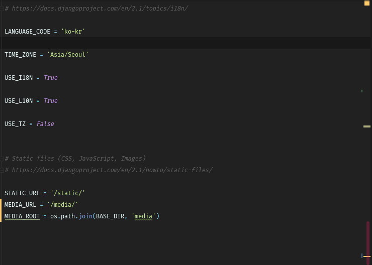
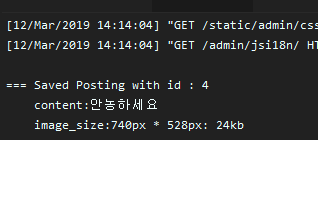
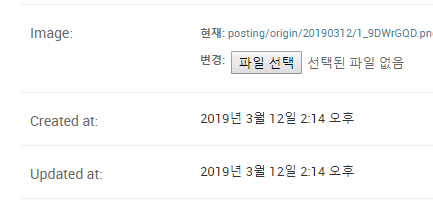
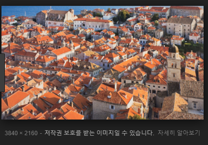
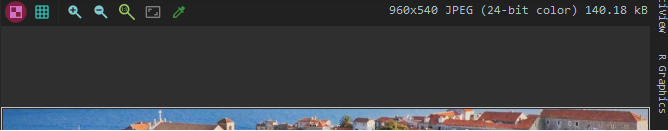

# 2019-03-12

- MEDIA_URL / MEDIA_ROOT는 `settings.py`에서 설정하는 상수이다.

  

  - 사용자가 이미지를 업로드 할 수 있다.

- sns라는 새로운 앱을 만들었으니, sns.urls를 include하자. 그리고 사진, 미디어 업로드 때문에 추가해야하는 세팅이 더 많은데

  ```python
  from django.contrib import admin
  from django.urls import path, include
  
  #upload setting #이 부분이 추가 되었다.
  from django.conf.urls.static import static
  from django.conf import settings
  
  urlpatterns = [
      path('admin/', admin.site.urls),
      path('board/',include('board.urls')),
      path('sns/',include('sns.urls')),
  ]
  
  # Dev Only (개발 서버에서 media/ 파일들을 서빙 미지원)
  # DEBUG = False 가 되면, 자동으로 static(...)이 빈 리스트 []를 반환한다.
  urlpatterns += static(settings.MEDIA_URL, document_root=settings.MEDIA_ROOT)
  ```

- 여기까지 하면 기본 세팅은 끝

씨발

- 이제 models.py / urls.py / admin.py 등등 설정을 했다.

  > sns/models.py

  ```python
  from django.db import models
  
  # Create your models here.
  
  class Posting(models.Model):
      content = models.TextField(default='')
      icon = models.CharField(max_length=20)
      # upload uniform resource locator(URL) => /media/posting/origin/20190312/ => 사용자가 이미지를 올리면 이 폴더에 올라간다.
      image = models.ImageField(blank=True, upload_to='posting/origin/%Y%m%d') # 이미지가 없어도 된다면 blank = True,
  
      created_at = models.DateTimeField(auto_now_add=True) # 저장된 시간을 자동으로 설정을 해준다.
      updated_at = models.DateTimeField(auto_now=True) # 저장과, 수정된 시간을 자동으로 설정 해준다.
  
      def __str__(self):
          return f'{self.id}: {self.content[:20]}'
  ```

  > sns/urls.py

  ```python
  from django.urls import path
  from . import views
  
  app_name = 'sns'
  
  urlpatterns = [
  
  ]
  ```

  > sns/admin.py

  ```python
  from django.contrib import admin
  from .models import Posting
  # Register your models here.
  admin.site.register(Posting)
  ```

- 여기까지 하면 이미지 파일을 포스팅할 수 있는데, 이미지 파일이 `/media/posting/origin/20190312/` 올라가는데 만약 같은 파일이 올라가더라도 덮여쓰여지는게 아니라, 한 번 변환이 일어나서 다른 파일이 올라간거처럼 분리가 된다.


## 오후

- 8K가 되는 사진을 사용자가 올리면 그걸 매번 사용자들에게 보여주는건 서버 입장에서 과부화가 걸린다. 따라서 카카오톡 메시지 보내는거 처럼 간소화해서 저장하는 법을 배워볼 것이다.

  > sns/models.py

  ```python
  from django.db import models
  
  # Create your models here.
  
  class Posting(models.Model):
      content = models.TextField(default='')
      icon = models.CharField(max_length=20)
      # upload uniform resource locator(URL) => /media/posting/origin/20190312/ => 사용자가 이미지를 올리면 이 폴더에 올라간다.
      image = models.ImageField(blank=True, upload_to='posting/origin/%Y%m%d') # 이미지가 없어도 된다면 blank = True,
  
  
  
      created_at = models.DateTimeField(auto_now_add=True) # 저장된 시간을 자동으로 설정을 해준다.
      updated_at = models.DateTimeField(auto_now=True) # 저장과, 수정된 시간을 자동으로 설정 해준다.
  
      def __str__(self):
          return f'{self.id}: {self.content[:20]}'
  
      def save(self, *args, **kwargs):
          super().save(*args, **kwargs)
          print()
          print(f'=== Saved Posting with id : {self.id}')
          print(f'    content:{self.content}')
          if self.image:
              print(f'    image_size:{self.image.width}px * {self.image.height}px: {round(self.image.size / 1024)}kb')
          print('==============================')
          print()
  ```

  이 상태에서 서버에 이미지를 저장하면

  

- 또한 admin에서 간단한 코드를 추가하면 추가적인 커스터마이징이 가능하다.

  > sns/admin.py

  ```python
  from django.contrib import admin
  from .models import Posting
  # Register your models here.
  
  class PostingModelAdmin(admin.ModelAdmin):
      readonly_fields = ('created_at', 'updated_at')
  
  admin.site.register(Posting, PostingModelAdmin)
  ```

  

  > sns/admin.py

  ```python
  from django.contrib import admin
  from .models import Posting
  # Register your models here.
  
  class PostingModelAdmin(admin.ModelAdmin):
      readonly_fields = ('created_at', 'updated_at') # 레코드 개별화면 확인
      list_display = ('id', 'content', 'created_at', 'updated_at') # 리스트에서 표시할 칼럼
      list_display_links = ('id','content') # 리스트에서 clickable 할 속성
  
  admin.site.register(Posting, PostingModelAdmin)
  ```

  커스터마이징 더 했다.

- 이번엔 imagekit이란 애를 다운 받을 것이다. `pip install django-imagekit` (포토샵이라고 생각하면 편하다), setting.py 에서 `imagekit` 이라고 작성해야한다.

  ```python
  INSTALLED_APPS = [
      'django.contrib.admin',
      'django.contrib.auth',
      'django.contrib.contenttypes',
      'django.contrib.sessions',
      'django.contrib.messages',
      'django.contrib.staticfiles',
      'imagekit'
      'board',
      'django_extensions',
      'IPython',
      'sns',
  ]
  ```

  > sns/models.py

  ```python
  from django.db import models
  
  #ImageKit
  from imagekit.models import ImageSpecField, ProcessedImageField
  from imagekit.processors import ResizeToFit
  
  # Create your models here.
  
  class Posting(models.Model):
      content = models.TextField(default='')
      icon = models.CharField(max_length=20)
      # upload uniform resource locator(URL) => /media/posting/origin/20190312/ => 사용자가 이미지를 올리면 이 폴더에 올라간다.
  
      # save as origin 원본을 저장하는 애
      # image = models.ImageField(blank=True, upload_to='posting/origin/%Y%m%d') # 이미지가 없어도 된다면 blank = True,
  
      # resize 하는 방법은? (8K 사진을 줄이는 방법)
      image = ProcessedImageField(
          upload_to = 'posting/resize/%Y%m%d', # 저장 경로
          processors = [ResizeToFit(width=960, upscale=False)], # upscale은 작은 애를 억지로 크게 만드는 것
          format = 'JPEG'
      ) #ImageField가 아님 # 이미지를 새로 받는다
  
      # thumbnail
      image_thumbnail = ImageSpecField(
          source = 'image', # 얘는 위에 변수 이름을 가져오는 거임
          processors = [ResizeToFit(width=320, upscale=False)],
          format = 'JPEG',
          options={'quality': 60}, # 굳이 고화질이 필요 없으니 100이 아닌 60
      ) # 기존 이미지를 다룬다
  ```

  이렇게 하면 아무리 높은 화질의 사진을 받더라도 resize를 하고 서버에 저장된다. 참고로 thumbnail 같은 경우엔 코드 상에서 thumbnail 메소드를 호출하는 순간 작동이 된다. 굳이, 입력 받은 모든 사진을 thumbnail로 바꿀 필요는 없으니까. thumbnail 같은 경우에는 image에서 사진을 **가져와서** 코드를 사용한다.

  - resizetofill은 크롭한다. resizetofit은 사이즈를 맞추고 나머지 부분 검은색으로 표시

- 이런 애가

  

  

  이렇게 됨

- 이제 댓글도 만드는데, models.py를 손보고 admin.py를 손 보는 순서이다.

  > sns/models.py

  ```python
  class Comment(models.Model):
      posting = models.ForeignKey(Posting, on_delete=models.CASCADE) #on_delete는 게시글 사라지면 댓글도 사라지게
      content = models.CharField(max_length=100)
      created_at = models.DateTimeField(auto_now_add=True)
      updated_at = models.DateTimeField(auto_now=True)
  
      def __str__(self):
          return f'{self.posting.content[:10]}:{self.content[:20]}'
  ```

  > sns/admin.py

  ```python
  from django.contrib import admin
  from .models import Posting, Comment
  # Register your models here.
  
  class PostingModelAdmin(admin.ModelAdmin):
      readonly_fields = ('created_at', 'updated_at') # 레코드 개별화면 확인
      list_display = ('id', 'content', 'created_at', 'updated_at') # 리스트에서 표시할 칼럼
      list_display_links = ('id','content') # 리스트에서 clickable 할 속성
  
  admin.site.register(Posting, PostingModelAdmin)
  
  class CommentModelAdmin(admin.ModelAdmin):
      readonly_fields = ('created_at', 'updated_at') # 레코드 개별화면 확인
      list_display = ('id', 'posting' 'content', 'created_at', 'updated_at') # 리스트에서 표시할 칼럼
      list_display_links = ('id','content') # 리스트에서 clickable 할 속성
  
  admin.site.register(Comment, CommentModelAdmin)
  ```

- 이제 views.py와 urls.py를 손 봐서 이용자들이 직접 볼 수 있는 웹을 만들 것이다.

- html에서 {# TODO : Comment form & list #}를 하면 나중에 해야 할 일을 안 까먹고 마무리 지을 수 있다.


- html에서 파일 올릴려면 `enctype="multipart/form-data"`를 `form`태그에 추가해야한다.
- 이유 없는 에러가 뜬다면 앱 상에 있는 데이터가 서로 충돌이 일어나서 그럴 수도 있다. 그래서 `python manage.py migrate '해당 앱' zero`를 하면 해당 앱의 데이터를 초기화 해준다.

- `gist.github.com/eduyu/`에 마지막 코드가 있다.