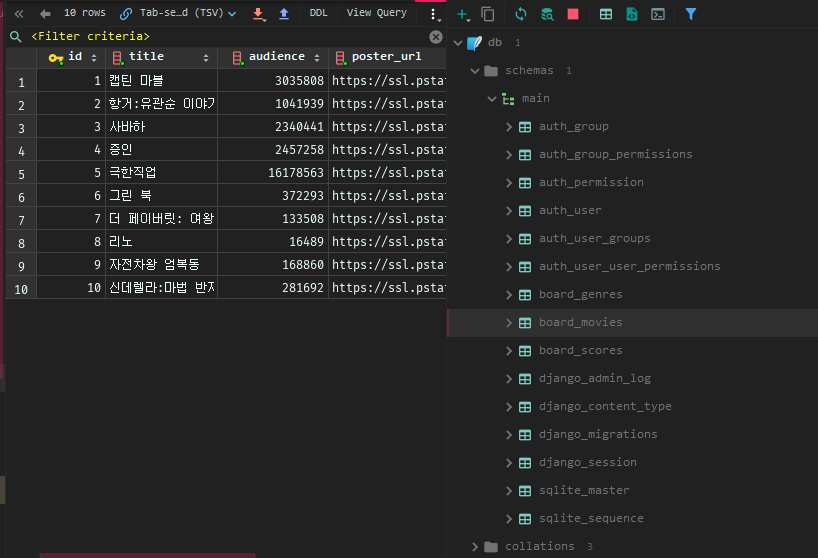

# 2019-03-15

## 파이프 문제 3가지 경우

1. 파이프 상태 좌표(x,y)와 모양(ㅡ, |, \ ) 이렇게 3가지가 있다.

- 대각으로 갈 때 3 군데에 벽이 있으면 가면 안됨
- 상태 공간 트리를 생각한다
- DFS, BFS 그래프를 모두 탐색하기 위한 목적 / 백 트래킹은 안 갈 곳은 안 가는 것이 목적


## DFS vs BFS

1. 경로가 있는지 없는지는 어떤 걸로 풀 든 상관없다.
2. 최단 경로 찾기 (미로의 거리) ==> BFS가 승 !
   1. 단, 가중치(간선 이동 할 때 비용이 다른 것이 가중치)가 있을 경우 BFS도 불가능 없으면 가능
3. 간선완화(edge relaxation)
   1. 다익스트라 관련, 간선완화를 통해 풀 수 없는 문제를 풀 수 있다.

4. 작업순서(DAG) 문제는 DFS가 더 편함 (위상 정렬, 싸이클 찾기, 강결합 컴포넌트) 


## 숙제

1987 알파벳 / 숨바꼭질 / 파이프 / (백준)

problems.kr 에 문제 많다 거기 풀자


## 프로젝트

### Models

```python
class postings:
    Pk
    Userid=Forignkey
class comments:
    Postingid=Forienkey
    Userid=Forignkey
class Users:
    Pk
```

- 댓글은 포스팅되는 애의 아이디와 유저의 아이디를 가지고 있어야한다.

- 유저에게 상세 정보를 추가하려면 밑에 인스턴스를 늘려도 되지만 그러기 보단 하나의 class를 만들어서도 가능하다. 얘는 1:1이다.

```python
class postings:
    Pk
    Userid=Forignkey
class comments:
    Postingid=Forienkey
    Userid=Forignkey
class Users:
    Pk
class Profile:
    id
    name
    email
```

- 위 설계를 위한 것이 개체-관계 다이어그램이다. 이거 없으면 설계도 없이 건축하는것과 같다. pdf 참고


## 시작

- 프로젝트 만들 때 Django를 선택하고 `Inherit` 어쩌구 체크하고 `CREATE`

- 그런 다음 터미널 열고 `touch .gitignore` 하고 파일 열고

  ```
  venv/
  
  __pycache__/
  
  .idea/
  ```

  을 넣으면 된다.

- 그 전에 알아야 하는건 csv를 넣으려면 c9에서 sqlite3를 썼어야 했다. 근데 윈도우엔 sqlite3가 없어서 ㅠㅠ.. 넣고 싶은 데이터 우 클릭하고 `import data from file` 어쩌구 하고 그거 넣으면 된다. (클릭 클릭으로 해결 가능하다)

- `django-admin startapp board`로 board 앱을 생성 `INSTALLED_APPS`에 추가

- `pip install django-extensions ipython`으로 새로운 것 다운, 얘들 역시 `INSTALLED_APPS`에 추가해야한다. `board`와 `django-extensions`를 추가해주자. `LANGUAGE-CODE`는 `'ko-kr'`로 `Time-zone`은 `'Asia/Seoul'` `USE_TZ`은 `False`로 여기까지하면 `settings.py`는 끝

## template과 urls 설정

- templates 폴더와 urls.py를 손 보도록 하자

  > workspace

  ```
  mkdir -p board/templates/board
  ```

  > project_07_db/urls.py

  ```python
  from django.contrib import admin
  from django.urls import path, include
  
  urlpatterns = [
      path('admin/', admin.site.urls),
      path('board/', include('board.urls'))
  ]
  ```

- include를 했으니 board/urls.py도 만들자

  > board/urls.py

  ```python
  from django.urls import path
  from . import views
  
  app_name = 'movies'
  
  urlpatterns = [
      path(''), # list
  
      path('<int:num>/'), # detail.html
  
      path('<int:num>/delete/'),
  
      path('<int:num>/scores/new/'),
      path('<int:num>/scores/<int:comment_id>/delete/'),
  ]
  ```

- 이제 views를 손봅시다.

  ```python
  from django.shortcuts import render
  
  def board_list(request):
      pass
  
  def board_detail(request):
      pass
  
  def board_delete(request):
      pass
  
  def scores_list(request): # 얘 필요없음
      pass
  
  def scores_create(request):
      pass
  
  def scores_delete(request):
      pass
  
  # Create your views here.
  ```

- 이젠 urls와 views를 이어주자

  > board/urls.py

  ```python
  from django.urls import path
  from . import views
  
  app_name = 'movies'
  
  urlpatterns = [
      path('', views.board_list, name='board_list'), # list
  
      path('<int:board_id>/', views.board_detail, name='board_detail'), # detail.html
  
      path('<int:board_id>/delete/', views.board_delete, name='board_delete'), # delete
  
      path('<int:board_id>/scores/new/', views.scores_create, name='scores_create'), # 평점 생성
      path('<int:board_id>/scores/<int:scores_id>/delete/', views.scores_delete, name='scores_delete'), # 평점 삭제
  ]
  ```

- `board_id`와 `scores_id`를 views.py에 필요한 애들 사이에 넣도록 하자

  > board/views.py

  ```python
  from django.shortcuts import render
  
  def board_list(request):
      pass
  
  def board_detail(request, board_id):
      pass
  
  def board_delete(request, board_id):
      pass
  
  def scores_list(request):
      pass
  
  def scores_create(request):
      pass
  
  def scores_delete(request, score_id):
      pass
  
  # Create your views here.
  ```

- 여기까지 했으면 `html` 파일을 만들자

  ```
  $ touch base.html list.html detail.html
  ```


## Models.py 정의하기

- Models.py 정의하자 `Genre`와 `Movie`끼리 1:N 관계이고 `Movie`와 `Score`끼리 1:N 관계이다.

  ```python
  from django.db import models
  
  class Genre(models.Model):
      name=models.TextField(default='')
  
  class Movie(models.Model):
      title=models.TextField(default='')
      audience=models.IntegerField(default=0)
      poster_url=models.TextField(default='')
      description=models.TextField(default='')
      genre_id=models.ForeignKey(Genre, on_delete=models.CASCADE)
  
  class Score(models.Model):
      content=models.CharField(max_length=100)
      score=models.IntegerField(default=0)
      movie_id=models.ForeignKey(Movie, on_delete=models.CASCADE)
  # Create your models here.
  ```

- 여기까지 하고 `makemigrations`와 `migrate`를 하면 됨 !

## csv 파일을 만든 table에 삽입하기



- 여기서 원하는 table 선택하고 우클릭 해서 `.csv `파일 넣으면 된다.

## templates 생성

> board/templates/board/base.html

```html
<!doctype html>
<html lang="en">
<head>
    <meta charset="UTF-8">
    <meta name="viewport"
          content="width=device-width, user-scalable=no, initial-scale=1.0, maximum-scale=1.0, minimum-scale=1.0">
    <meta http-equiv="X-UA-Compatible" content="ie=edge">
    <title>Moives</title>
</head>
<body>
    

    
</body>
</html>
```

> board/templates/board/detail.html

```html


    <p>{{ genre }}</p>
    <p>{{ movie.title }}</p>
    <p>{{ movie.audience }}</p>
    <p>{{ movie.description }}</p>
    

```

> board/templates/board/list.html

```html


    
        <p><a href="">{{ movie.title }}</a></p>
        
    

```

## List와 detail 만들기

```python
from django.shortcuts import render, get_object_or_404, redirect
from .models import Genres, Movies, Scores

def board_list(request):
    movies = Movies.objects.all()
    return render(request, 'board/list.html', {
        'movies' : movies,
    })

def board_detail(request, board_id):
    movie=Movies.objects.get(id=board_id)
    genre=movie.genre_id.name
    return render(request, 'board/detail.html', {
        'movie':movie,
        'genre':genre,
    })
```

## delete 만들기

> templates/board/detail.html

```html


    <p>{{ genre }}</p>
    <p>{{ movie.title }}</p>
    <p>{{ movie.audience }}</p>
    <p>{{ movie.description }}</p>
    
    <form action="" method="POST">
        
        <button type="submit">삭제하러 가기</button>
    </form>

```

> views.py

```python
def board_delete(request, board_id):
    if request.method=='POST':
        movie = get_object_or_404(Movies, id=board_id)
        movie.delete()
    return redirect('movies:board_list')
```

## 평점 생성

- 새로운 html을 만들어서 그 애를 detail.html에 삽입합시다.

  > board/_score.html

  ```html
  <form action="" method="POST">
      
      <label for="score">score</label>
      <input type="text" name="score_text" id="score_text" autofocus>
      <input type="number" name="score" id="score" min=0 max=5>
      <button type="submit">제출</button>
  </form>
  ```

  > board/detail.html

  ```html
  
  
      <p>{{ genre }}</p>
      <p>{{ movie.title }}</p>
      <p>{{ movie.audience }}</p>
      <p>{{ movie.description }}</p>
      
      <form action="" method="POST">
          
          <button type="submit">삭제하러 가기</button>
      </form>
      <hr>
  
      <p>한줄 평 평점</p>
      
          <p>{{ comment.content }}    {{ comment.score }}</p>
          <form action="" method="POST">
              
              <button type="submit">삭제</button>
          </form>
      
  
  ```

  > board/views.py

  ```python
  from django.shortcuts import render, get_object_or_404, redirect
  from .models import Genres, Movies, Scores
  
  def board_list(request):
      movies = Movies.objects.all()
      return render(request, 'board/list.html', {
          'movies' : movies,
      })
  
  def board_detail(request, board_id):
      movie=Movies.objects.get(id=board_id)
      genre=movie.genre_id.name
      comments = movie.scores_set.all()
      return render(request, 'board/detail.html', {
          'movie':movie,
          'genre':genre,
          'comments':comments,
      })
  
  def board_delete(request, board_id):
      if request.method=='POST':
          movie = get_object_or_404(Movies, id=board_id)
          movie.delete()
      return redirect('movies:board_list')
  
  def scores_create(request, board_id):
      if request.method=='POST':
          comment = Scores.objects.create(
              content=request.POST.get('score_text'),
              score=request.POST.get('score'),
              movie_id_id=board_id
          )
          return redirect('movies:board_detail', board_id)
  
  def scores_delete(request, board_id, score_id):
      if request.method=='POST':
          comment = get_object_or_404(Scores, id= score_id)
          comment.delete()
      return redirect('movies:board_detail', board_id)
  
  # Create your views here.
  ```


