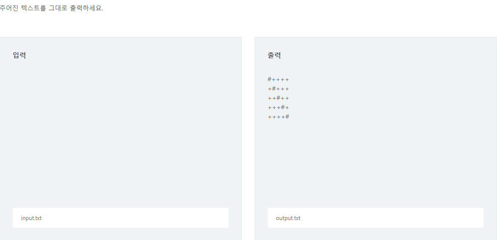

# Week4 - DAY 3

- 한국에는 백준, 외국에는 HackerRank !
- https://docs.python.org/3/는 python 자습서이다. 한국어도 있다.
- scratch는 mit에서 만든 언어인데, 초등학생 유치원생 수준이다. (블록 베이스임, 우리 레고 했던거 처럼)
- **cs50는 하버드, 예일 대학교의 수업인데 되게 쩌는 수업이다.**
- mooc는 대중에게 온라인을 통해 무료로 오픈한 강의
- coursera는 세계 유명한 학교가 모여서 강의를 오픈한 사이트 (미국 서부 학교)
- edx 역시 미국 학교가 모여서 강의를 오픈한 사이트 (미국 동부 학교), 여기서 **cs50 강의**가 가장 대표적인 강의이다.
- udacity 역시 코딩 플랫폼인데 짱 좋다. coursera, edx 플랫폼이 나오고 경쟁하고 있을 때 결국 대학 강의이다. 진짜 현업에서 맞는 플랫폼을 만들자 !! 해서 나온 것이 udacity이다. 별에 별 수업이 다 있다. (Flying car, VR 등등), DATA Sicence, Machine Learning에 관심 있으면 참고하는 것이 좋다.
- beauty and hoy of computing 이라고 버클리에서 하는 수업도 있다. 스크래치를 사용하지만 스크래치를 고대로 쓰지 않고 지 입맛대로 커스터마이징해서 사용한다. (snap이라 함)
- **python 수업도 있다.** edx.org에서 introduction to computer science라고 있는데 MITx가 수업을 진행한 것이다. 되게 어렵다. 괜히 MIT가 아니다.
  - https://www.youtube.com/watch?v=Q_itdXI3YeE&list=PLRJdqdXieSHN0U9AdnmwD-9QcR9hmw04d
- python tutor는 교수님 한 분이 만든 툴이다. 내가 입력한 명령 한 줄씩 내부적으로 어떻게 실행 되는지 시각화를 해주는 툴이다. (내가 짠 코드 혹은 다른 코드를 이해할 수 없을 때 사용하면 된다)


## edx 사용방법

1. 얘들 돈 내라고 한다. 근데 너무 비싸 ㅠㅠㅠㅠㅠ 어떻게 할까?
2. enroll을 하면 돈 내고 들을 수 있고 audit this course를 누르면 청강이 가능하다.
3. 그 다음 강의가 오픈된 수업은 들으면 되고 아닌 수업은 그 때 기다려서 들으면 된다.


## Jupyter Notebook 설치

1. git Bash에서 pip install jupyter + 엔터
2. 그럼 끝 !
3. notebook 킬땐 python_basic 폴더에서 jupyter notebook 하면된다. (기준 폴더가 어디있는지에 따라 열리게 된다),(jupyter notebook이 귀찮으면 jn이라고 하면 된다)
4. 얘들은 code block이 있는데 블록에다가 실행문 적고 crtl + enter를 하면 실행이 된다.
5. New에서 Python 3 노트북을 만들 수 있다.
   1. Untitiled를 클릭하면 제목을 바꿀 수 있다.
   2. 이렇게 하면 노트가 만들어지고 그 안에서 파이썬을 실행할 수 있다.

- 필요하면 google에다가 jupyter notebook 설명서 치면 많은 사람들이 가르쳐준다.
- 크롬으로 켤 땐 URL을 드래그만 하고(드래그만 해도 복사가 된다) 크롬 주소창에 넣으면 된다.


## Jupyter Notebook 단축키

- **crtl + enter : 실행하기 (마크다운에서도 마찬가지다)**
- alt + enter : 실행하고 다음 문단으로 넘어감
- shift + enter : 실행하고 다음 문단으로 넘어감
- esc + x : 셀 지우기
- esc + b : 셀 만들기
- esc + 방향키 : 셀 이동
- enter : 셀 수정


## github에서 파이썬 자료 데리고 오기

1. github에서 clone or download에서 URL 복사한 다음 git Bash에서 'git clone https://github.com/sspy2/python_basic.git' + 엔터 (위치 : C:\Users\student\python_basic)
2. 그리고 cd python_basic/ 하고나서 code .으로 하면 vs가 켜지면서 확인할 수 있다.


## Python

#### - 식별자 구분하기 -

```python
import keyword
print(keyword.kwlist)
```

이렇게 출력하면 예약어의 목록이 나오는데 얘들은 변수명으로 사용해선 안된다.

```python
class = "서울_2반"
```

얘를 출력하면 **SyntaxError**가 뜬다.

```python
sum([1,2,3])
print(sum)

sum = "Han Dong Hun" #sum 함수로서 기능을 없애버렸다.
print(sum)

sum([1,2,3]) #얘는 이제 총합 구하는 것으로 실행 못한다.
```

```python
str(1) #글자 '1'이 인식된다. 숫자 아님
1+1 #얘는 2이다
str(1)+str(1) #얘는 '11'임 숫자 아님

str="SSAFY" #이렇게 해버리면 str 기능을 잃어버린다.
str(2)
```

**이렇게 되면 python으로서 기능을 잃어버리니 예약어를 변수 설정으로 만들지말자**

*참고로 jupyter notebook은 print가 없어도 제일 마지막 값을 출력해준다*

*jupyter notebook에서 출력된 값들을 없애버릴려면 Kernel에서 Restart를 하는데 Output도 날려버리면 된다*


#### - 인코딩 선언 -

최근 파이썬은 UTF-8로 기본 설정이 되어 있다. 근데 그래도 안된다면 파일 상단에 아래와 같이 입력하면 된다.

```python
# -*- coding: encoding -*-
```


#### - 주석 -

```python
# #으로도 주석이 가능하지만, """  """으로도 주석이된다.

"""
이건 멀티라인 커멘트 또는 docstring
"""

def print_twice():
    """
    print_twice() 함수의 역할
    "hi"를 두 번 출력합니다.
    
    - created by Han dong hun
    """
    print("hi")
    print("hi")
    
print_twice()
print_twice.__doc__ #얘는 print_twice 함수 내부에 docstring을 출력한다.

#결과
hi
hi
'\n    print_twice() 함수의 역할\n    "hi"를 두 번 출력합니다.\n    \n    - created by Han dong hun\n    '
```


#### - 파이썬의 철학 -

```python
import this # 얘를 실행하면 파이썬의 철학이 실행된다.
```

파이썬은 한 줄에 하나만 써야한다. 두 줄을 쓰고 싶으면 ;(세미콜론)을 적으면된다.

```python
print("hi");print("python")
```

파이썬에서 코드 작성을 할 때 두 줄을 차지하고 싶으면 \을 사용하면 된다.

```python
[int(x) for x in input().\
split()]

#혹은

a = 0
if a \
==0: #이렇게 해도 실행 가능
    print(a)
    
#[], {}, ()는 \ 없이도 줄을 나눌 수 있다.
my_info = {
    "name":"한동훈",
    "major":"기계설계공학과",
    "age":27,
    "gender":"남"
}

#이런 애들이 한 줄로 표현되어 있으면 보기 불편하다.
my_info = {"name":"한동훈","major":"기계설계공학과","age":27,"gender":"남"}
```


#### - 변수 -

컴퓨터는 저장, 계산을 잘하는데 얘들을 다루는 것이 컴퓨터 프로그래밍이다. 그래서 어떻게 저장을 할 지, 어떻게 계산을 할 지 항상 생각해야한다.  세상에 모든 프로그래밍 언어에서 가장 중요하게 생각하는 것이 이 2가지 단어이다.

```python
x = 2019 #x에 2019를 넣는 것이다.(저장한다)
print(x)

#여러가지 값을 동시에 할당할 수 있다.
x=10
y=20
z=30

x,y,z=10,20,30 #위에 애랑 같다.
```

입력을 할 땐 input을 사용한다.

```python
a = input()
print(a)
b = input("메시지를 입력해주세요.")
print(b)
```

주의해야 할 점은 처음에 들어간 값은 모두 str 형태이다. int형으로 바꿔줘야 한다.

```python
a = input("숫자를 입력해주세요.")
print(a + 12)
#이렇게 실행하면 TypeError뜬다.
print(int(a)+12)
#이렇게 수정해주어야한다.
a = int(input("숫자를 입력해주세요."))
```

만약 숫자를 2개 입력을 받는다면?

```python
a,b = input("두 개의 숫자를 입력해주세요.").split(" ")
print(a)
print(b)

#split() 함수는 분리해주는 함수이다. "happy new year" =>["happy","new","year"]

a = input("두 개의 숫자를 입력해주세요.")
nums=a.split() #['10','20']
print(nums)
```


#### 연습문제

대각선 출력하기



```python
print("#++++")
print("+#+++")
print("++#++")
print("+++#+")
print("++++#")

#print 하나로도 조질 수 있다.
print("#++++\n+#+++\n++#++\n+++#+\n++++#")

print("""#++++
+#+++
++#++
+++#+
++++#
""")
```

Hello World!를 출력하시오.

```python
print("Hello World!")
```

A + B를 표현하시오.

```python
# 1 2 입력
# 1+2 출력

n = input()
# n => '1 2'
# n => '1 2'.split(" ") => ['1', '2']
nums = n.split(' ')

a= nums[0]
b= nums[1]

print(int(a)+int(b))
```

```python
# 위에 애를 줄여보자
nums = input().split(' ')
# 파이썬은 a, b = ["1","2"]하면 a="1", b="2"가 된다. 단, 인자 수가 같아야 한다. (디스트럭처링)
a,b = input().split(' ')
print(a+b)

# 맵을 사용해서 int로 바꾸자.
a,b = map(int, input().split(' '))
#혹은
a,b = [int(x) for x in input().split(' ')]
#한 줄로 바꿀 수 있다.

#즉, 앞에 코드를 두 줄로 줄일 수 있다.
a,b = list(map(int, input().split(' ')))
print(a+b)
```

*Map은 무엇일까요?*

```python
#map에는 두 가지 인자가 들어간다.
#map(내가 적용할 함수, iterable(list, tuple, dictionary))
 nm
numlist = ['1','2','3','4']
map(int,numlist) #쟈들 문자를 한 방에 숫자로 바꿀 수 있다.
#결과
map object가 뜬다. #그래서 list로 형변환을 실시하자.
list(map(int,numlist))
#결과
[1,2,3,4]
```

개 출력하기

```python
|\_/|
|q p|   /}
( 0 )"""\
|"^"`    |
||_/=\\__|

#얘를 한 줄씩 출력하면 안됨 \ 얘랑 / 이런 애들 때문에

print("""
|\_/|
|q p|   /}
( 0 )"""\
|"^"`    |
||_/=\\__|
""")

#이렇게 해버리면 중간에 """ 얘들 때문에 힘듬

print('''
|\_/|
|q p|   /}
( 0 )"""\\
|"^"`    |
||_/=\\\\__|
''')
#이러면 안됨

print('''|\_/|
|q p|   /}
( 0 )"""\\
|"^"`    |
||_/=\\\\__|''') #'''에 출력 문자를 붙여줘야 한다. 아니면 에러 뜸

#문장 마지막에 \가 있으면 안됨 ! 줄이 이어짐 !

#왜 귀에는 \ 이게 하나인가? \뒤에 문자가 어떤 문자에 따라서 이스케이프 역할을 하는거지 무조건 \가 이스케이프를 하는 것이 아니다. (ex : \n, \\, \" 이러면 이스케이프 역할을 하지만, \_ 이러면 그냥 문자이다)

#\\ 두개를 사용하자 그럼 온전한 \가 나왔어요
print("그는 말했다. \"새해 복 많이 받으세요.\"") # 결과 : 그는 말했다. "새해 복 많이 받으세요."
print("\\") # 결과 : \

print('|\_/|')
print('|q p|   /}')
print('( 0 )"""\\')
print('|"^"`    |')
print('||_/=\\\\__|')
#얘도 됨
```

그대로 출력하기

```python
#입력:Hello
#	 Baekjoon
#	 Online Judge

#출력:Hello
#	 Baekjoon
#	 Online Judge

#얘는 인풋 받는 속도를 엄청 줄여야한다. input을 사용해서 해도 틀렸습니다라고 뜸 왜냐면 시간이 오래걸려서 그래서 library를 사용한다.

import sys

for i in sys.stdin:
    print(i, end="")

#라이브러리 import 하는 건 레벨 좀 올리고 사용하자. 지금 할 필욘 없다.
```

등록

```python
#자신이 온라인 저지에서 맞은 문제의 개수와 아이디를 그대로 출력하는 프로그램을 작성하시오.
#출력 : 123
#	    Your_ICPI_Team_Name

print("4")
print("pok_winter")
```

print 붙여서 출력하기

```python
print("hello", end="")
print("Python")

#파이썬은 print하면 뒤에 항상 다음 줄로 넘어간다. 그 것을 막기 위해서 end를 쓰도록하자

menu = ["술","밥","국","반찬"]
for i in menu:
    print(i, end="")
```

