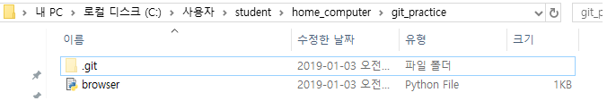
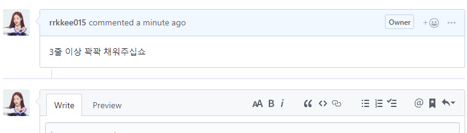

# Week4 - Day 4

- python에서 webbrowser를 다룰 수 있다.

```python
import webbrowser

webbrowser.open("https://www.daum.net")

# 모모랜드 모든 멤버들의 검색 페이지를 한 번에 여는 코드

webbrowser.open("https://search.daum.net/search?nil_suggest=btn&w=tot&DA=SBC&q=%EB%AA%A8%EB%AA%A8%EB%9E%9C%EB%93%9C+%EC%97%B0%EC%9A%B0") #모모랜드 연우 검색결과
webbrowser.open("https://search.daum.net/search?nil_suggest=sugsch&w=tot&DA=GIQ&sq=%EB%AA%A8%EB%AA%A8%EB%9E%9C%EB%93%9C+%EB%82%B8%EC%8B%9C&o=1&sugo=15&q=%EB%AA%A8%EB%AA%A8%EB%9E%9C%EB%93%9C+%EB%82%B8%EC%8B%9C") #모모랜드 낸시 검색결과
```

위 코드는 너무 무식해

```python
import webbrowser

webbrowser.open(url)

#webbrowser.open("https://search.daum.net/search?q=검색어") #다음 기존 검색 url
url = "https://search.daum.net/search?q=" + "연우"
```

근데 우리 input 배웠잖아

``` python
import webbrowser

keyword = "연우"
url = "https://search.daum.net/search?q="

webbrowser.open(url + keyword)
```

이러면 키워드 맨날 바꿔야 함. input 넣자

```python
import webbrowser

keyword = input("검색어를 입력해주세요: ")
url = "https://search.daum.net/search?q="

webbrowser.open(url + keyword)
```

모모랜드 모든 멤버들의 검색 페이지를 한 번에 여는 코드를 만들어보쟈, **반복문을 사용**

```python
import webbrowser

url = "https://search.daum.net/search?q="

momo = ["나윤","혜빈","낸시","연우","아인","주이","제인","데이지","태하"]
# momo라고 하는 리스트를 한 번씩 돌면서, 웹 브라우저를 연다.
for keyword in momo:
    webbrowser.open(url + keyword)
```

------

### 앞서 짠 파이썬 파일을 github에 올리는 법

1. gitbash에서 git init을 한다. (git init 위치는 git_practice 폴더 내부이다)



2. git add .browser.py (위에 짠 파일을 browser.py라고 만들었었다)

3. git commit -m "아무거나"

4. 새로 만든 레포지토리에서 주소 복사해서 넣자

5. git push하자

- **여기까지는 동일하다.**

### *이제 나는 이 깃 파일을 집에서도 관리를 하고 싶어 어떻게할까?*

**내 노트북이라고 가정**

1. clone or download를 해야한다. 그 주소를 home computer의 gitbash에서 git clone 하고 주소를 붙여넣으면 된다.
2. sublime text를 다운받아 실행한다. (집에서 쓰는 에디터라는 가정)
3. folder을 오픈한다. github에 올린 git_practice 그 폴더를 올린다.
4. 수정하고 싶은건 수정하자.
5. 그리고 수정한 폴더를 git add ./git commit -m "아무거나"/git push를 하면 수정 뿅
   - git push할 때 주의할 것은 git을 어디서 가져왔는지 이미 정보를 가지고 있기 때문에 따로 주소를 알려줄 필요가 없다. (remote add origin 얘)

**이제 다시 싸피 컴퓨터로 왔다**

1. 수정된 파일을 git으로 부터 받아야 한다. (그럴 땐 git pull을 사용 !)
2. gitbash에서 git_practice 폴더를 들어가서 (git init한 폴더에서) git pull을 하면 된다. 수정이 완료된다.


### 이거 할 땐 진짜 조심해야하는 건 !! 수정을 했으면 어느 컴퓨터에서든 작업시작 전에 git pull을 제일 먼저하고 수정을 해야한다 !!

-----

### 이제 github로 공동 프로젝트를 만들어보자

*팀장이 할 일*

1. 폴더 하나를 새로 만든다. (mkdir collabo) => (cd collabo) => (code .)로 vs를 연다.

2. 거기서 파일 README.md을 만들자

3. 그 다음 github에 올리자 (init, push 등등)

4. repository 올렸으면 clone 주소를 팀원들에게 주면서 말하자. 일 해라고

5. 근데 repository 세팅에서 팀원 권한을 미리 줘야한다. collaborators에서 팀원 아이디를 적으면 팀원에게 권한을 줄 수 있다.

6. 팀원이 수정을 마쳤으면 github에서 git pull origin master로 파일을 데리고오자.

   ```
   이제 여기서 두 갈래로 나뉜다
   
   1. 서로 동일한 파일을 수정할 때
   2. 서로 다른 파일을 수정할 때
      - 서로 다른 파일을 수정할 땐 내 컴퓨터, 싸피 컴퓨터 다루는 것과 같다고 생각하면된다.
   ```

*팀원이 할 일*

1. 팀장이 만들어 놓은 repository를 clone해서 하나의 폴더에 clone 해놓자.
   - 팀장이 준 권한을 받아야한다. repository 주소창에 invitaion을 추가해서 찾아가거나, github 이메일에서 확인해야한다.
2. 팀원은 sublimetext를 쓴다고 가정하자.
3. clone 받은 폴더를 sublimetext를 이용해서 열고 README.md 파일을 수정하도록 하자
4. 저장하고 add commit push를 하자.
5. git push origin master를 하자 (git push만 하지말자)


**상위 탭 Issues**

Issues는 팀원들에게 명령하거나, 팀원이 팀장에게 질문을 할 때 게시판처럼 활용하면 된다.



수정사항이 반영이 되면 Issues를 close하면 됨. 참고로 댓글 달 때도 마크다운으로 할 수 있다.


저기 위에 Close를 누르면 Issues를 닫을 수 있다. 이 history도 남는다.


-----------------

- **.gitignore라고 파일을 만들고 파일 안에서 .vscode/라고 하면 .vscode/ 하위 폴더들은 git에 안 올라간다. git에서 관리 안한다는 뜻**

---------------

- **Git Bash 글씨 깨지는 거 고치는 법** 

1. git bash 킨다.
2. 상태 표시줄을 우클릭한다.
3. Options 들어가서 Text로 들어간다.
4. 거기서 Locale은 ko_KR, Character set은 eucKR로 바꾸고 Apply => Save !