# Week4_day 5

- 포켓볼 인공지능 대회가 SSAFY내에서 5월 달에 열릴 것 같다.


## 어제 했던 것들을 이어서 하자

- 사용자가 입력을 넣을 수 있도록 해보자. (어제 했음 ㅋ)

  

  - 근데 이러면 json() 형식으로 파일이 날라와서 사용자가 복잡한 코드를 읽어야한다. 그래서 넣은 문구가 

    

    `res_j = res.json()`이다.

  - 근데 얘도 역시 넣는다고만 해서 딕셔너리 형태를 이쁘게 해주는게 아니다. 그래서 새로운 모듈을 사용한다. 

    ```python
    from pprint import pprint as pp
    #이쁘게 출력해주는 모듈
    #import pprint를 그냥 하게되면 pprint.pprint()로 써야한다.
    #from pprint import pprint를 하면 pprint()로 쓸 수 있다.
    #from pprint import pprint as pp로 하면 pp()로 간단히 쓸 수 있다.
    ```

  - 출력하면 이렇게 된다.

    

  - 그래서 딕셔너리 안으로 데이터를 파고들어보자

    - `res_j['message']['result']['translatedText']` 이렇게해서 피톤만 가져올 수 있고.
    - 혹은, `res_j.get('message').get('result').get('translatedText')`를 쓰기도 한다.

*ibm watson으로 나중에 챗봇을 만들어보자*


## 유명인 얼굴인식 만들어보기

- 편지 쓰는거와 같다고 했다. 그러니 우리는 인식시킬 사진을 clova API를 통해 요청을 보내고 인식 결과를 가져온다. 근데 파파고는 텍스트를 써서 보냈지만 얘는 파일을 보낼 것이다.

- 코드 짜는 순서

  ```python
  # 1. requests를 통해 clova API 주소에 요청을 보낸다.
  # 2. 응답 받은 json을 파싱하여 원하는 결과를 출력한다.
  ```

  

  *네이버에서 친히 예제를 만들어 놨다.*

  1. c9.io에 사진 넣으려면 그냥 apiapi 폴더에 드래그 하면된다.

     

  2. confidence는 신뢰성이다. (1에 가까우면 100%)

     

  3. 근데 사진을 직접 올리고 코드 짜는거 귀찮잖아? 링크로도 코드가 돌아가도록 짜보자

     - 예시 링크 : http://photo.hankooki.com/newsphoto/v001/2018/10/05/sol20181005170552_O_01_C_1.jpg

  4. 나머지는 밑에 짠 코드를 참고하도록 하자.

     

     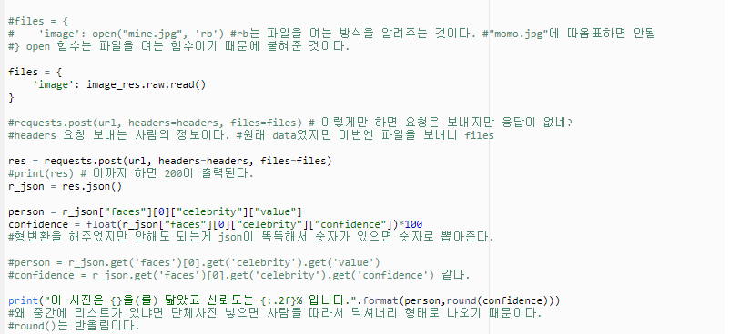


## 궁합찾기 만들어보기


- 여기서부터 시작하자. `<form>, <input> 은 검색창에 커서 깜빡이는거랑 같다.`

  - `<input> ==> <input type = "text">`로 변경해줘서 텍스트를 받도록 하자.

  - 그리고 여기서 우리가 검색을 했을 때 구글에서 값을 받아오도록 하자.

    - https://www.google.com/search?q=(원하는 검색어) 이게 구글 기본 검색 url이다.

    - `<form> ==> <form action = "...">`여기서 ... 부분에다가 검색 url을 넣어주도록 하자.

    - 그리고 input 받은 애를 상자로(q로) 포장하고 구글 폼에다가 날려주면 된다.

      

  - 여기까지 하면 내가 만든 사이트에서 검색을 실시하면 구글에서 열린다.

    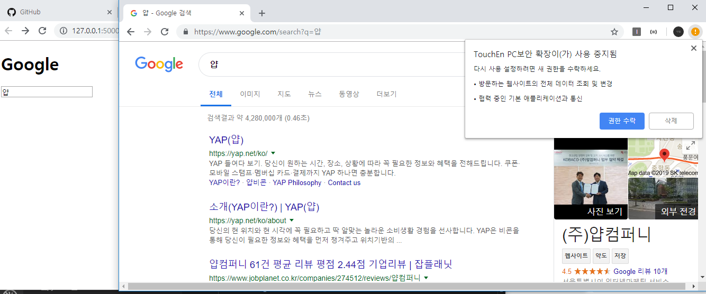

- 이제 fake 네이버를 만들어보자

  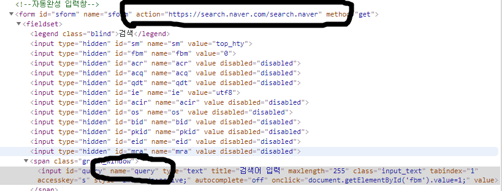

  - 여기서 action과 name에서 쟤만 건드리면 해결된다.

    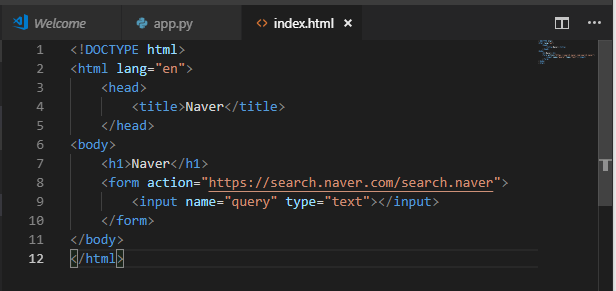

- 이제 궁합 사이트를 만들어보자.

  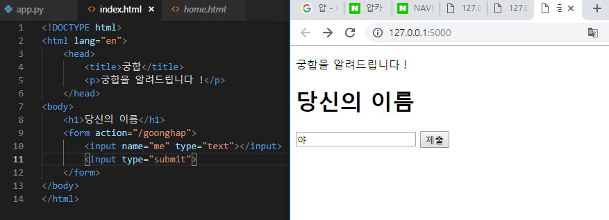

  - 여기서 submit은 제출 버튼을 만들어주는 양식이다.

  - name은 type을 받아서 상자로 만들어주고 담으면 parameter가되고 얘를 action url뒤에 ?와 함께 가져다 붙히는 것이다.

  - 근데 우리가 /goonghap url 페이지에서 어떤 일이 생기는 지 선언을 안했으니까 그것을 python으로 돌아가서 해주도록 하자.

    

    request는 새로운 페이지에서 자료를 긁어오고 명령어고, args는 파라미터 중 하나를 긁어 오는거고, me라는 박스에 담긴 내용물을 가져오는 것이다. 그 내용물은 '한도동훈'이다.

    

  - 이제 우리가 진짜 원하는 서비스를 만들어주자. 나와 상대방의 이름 + 궁합을 알려주고(60~99) + 이름을 저장하자.

    - 우리가 해야하는 건 render template을 이용하자 저 위에위에 사진 return을 바꿔주는 거다.

      ```python
      @app.route("/goonghap")
      def goonghap():
          me = request.args.get('me')
          return render_template('goonghap.html', me=me)
      ```

    - render_template에서 goonghap.html 파일을 불러오니까 goonghap.html을 templates 폴더에서 만들도록 하자.

      ```html
      <!DOCTYPE html>
      <html lang="en">
          <head>
              <title>궁합</title>
              <meta charset="utf-8">
          </head>
      <body>
          <h1>{{ me }}님과 xx님의 궁합은 xx%입니다.</h1>
      </body>
      </html>
      ```

      위에서 {{me}} 한 것이 python에서 정의한 변수를 받아오는 것이다.

    - 근데 이제 상대방의 이름도 받아야하니까 수정하도록 하자.

      ```html
      <!DOCTYPE html>
      <html lang="en">
          <head>
              <title>궁합</title>
              <p>궁합을 알려드립니다 !</p>
          </head>
      <body>
          <form action="/goonghap">
              <h1>당신의 이름</h1>
              <input name="me" type="text"></input>
              <h1>그분의 이름</h1>
              <input name="you" type="text"></input>
              <input type="submit">
          </form>
      </body>
      </html>
      ```

    - 검색결과의 url을 잘 살펴보면 &로 연결되어 있다.

      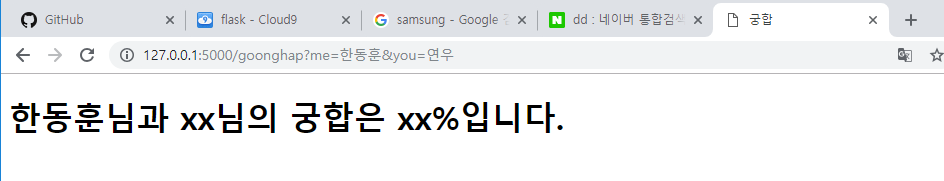

    - 이제 연우도 상자로 담았으니 python에서도 출력이 가능하도록 도비한테 알려주자.

      

      그리고 html에서 {{you}}를 추가하자.

    - 그러면 검색결과가 달라진다.

      

    - 이제 궁합을 알려주는데 60에서 100 사이의 값을 임의의 값을 넣어주도록하자.

      ```python
      def goonghap():
          me = request.args.get('me')
          you = request.args.get('you')
          rating=random.randint(60, 100)
          return render_template('goonghap.html', me=me, you=you, rating=rating)
      #import random을 사전에 해야한다.
      ```

      {{rating}}을 하면 결과가 뜬다.

      

    - 근데 우리는 여기서 끝이 아니고 검색한 친구들의 정보를 저장할 것이다.

      ```python
      ...
      people = [] #리스트를 넣어주고
      ...
      people.append([me,you]) #검색한 사람들의 정보를 얻자.
      ...
      ```

    - 그리고 이 정보를 나만 볼 수 있게 url을 따로 만들어 놓자

      ```python
      @app.route("/god")
      def god():
          return str(people)
      ```

      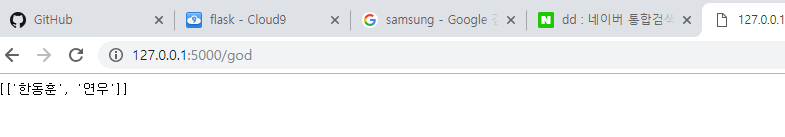

  - 근데 얘들 남겨놓은거 있잖아. 근데 얘들 웃긴게 서버 끄면 사라짐 ㅋ.. 이제 그걸 파일에 append를 하여서 파일로 남겨놓고 싶은데 그거는 다음시간에 할거얌.

### 결론

- 얘는 app.py로 어플리케이션을 만든것이다.

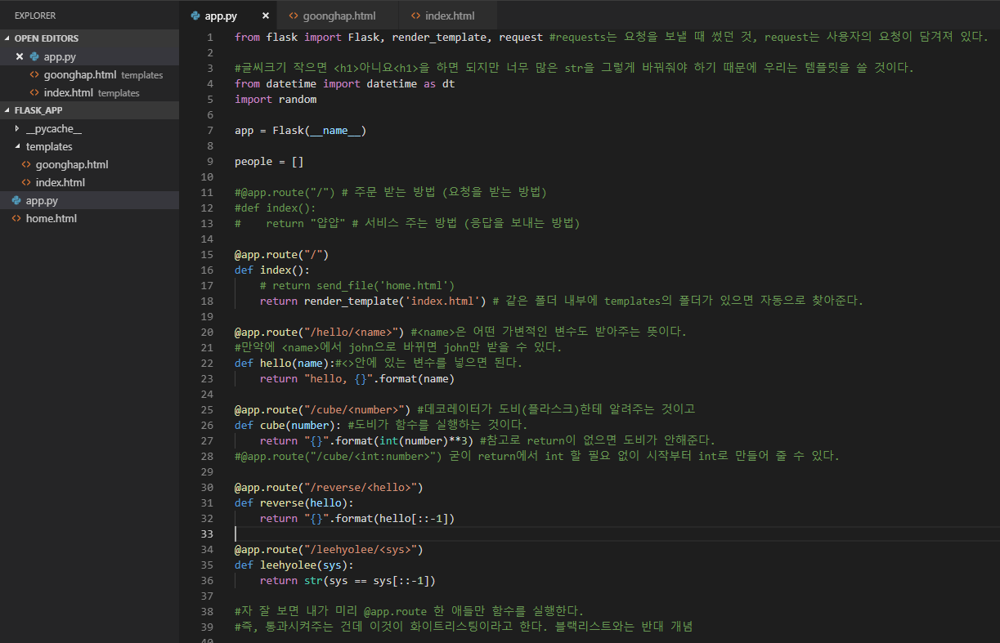


- 얘는 궁합이라는 url을 들어가면 뜨는 창을 꾸민 애다.


- 얘는 처음 들어가자마자 뜨는 화면을 꾸민 친구다.

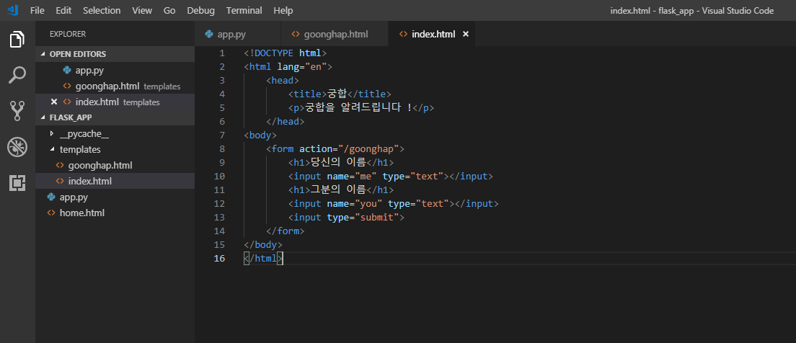


---

### string

```python
# 합체 : concatenation
"happy" + "hacking"
"PP" + "AP"

# 수술 : interpolation(보간법)
name = "john"
greeting = "Hello {}".format(name)
```

---

### Flask

1. c9.io에서 workspace를 하나 만들고 터미널에서 flask를 다운받자

   - sudo pip3 install flask (sudo는 관리자로 해주세요라는 뜻)

2. app.py를 하나 만들고 그 속에서 flask가 잘 돌아가는지 밑에 홈페이지에서 문구를 복사하고 붙여넣자

   - 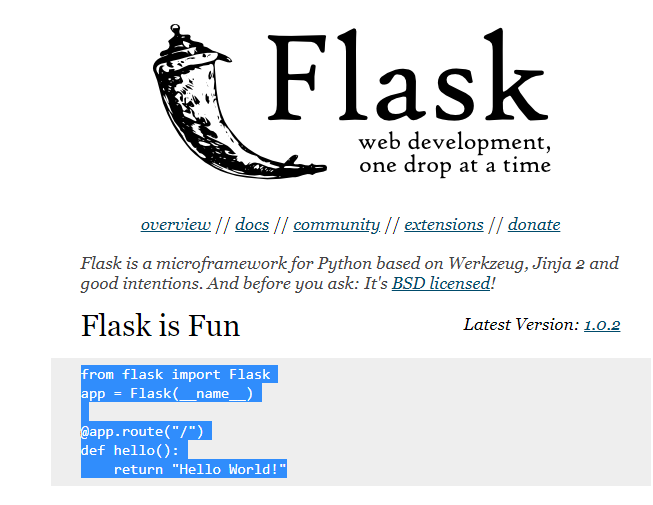

3. 그리고 서버를 돌려보자

   - 터미널에 flask run --host =0.0.0.0 --port=8080을 타이핑해서 넣으면 된다. 그리고 실행하면 밑에 처럼 뜬다.

     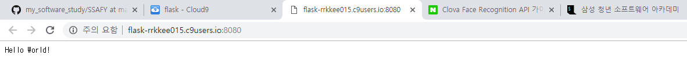

   ---

   ***참고로 로컬에서도 서버를 돌릴 수 있다.***

   1. git bash를 키고 mkdir flask_app을 하자

   2. cd flask_app에 들어가서 code . 을 하여 vs를 열자

   3. 그리고 우리는 git bash에서 pip install flask를 해준다.

   4. 다시 vs로 돌아가서 flask_app에서 app.py를 만들고 내용을 채워주자.

   5. 그리고 gitbash에서 flask run을 해서 서버를 돌리도록 하자.

   6. 그리고 그 주소를 복사해서 붙여넣으면 뜬다.

      

      

   ----

4. 이제 우리는 네이버를 이용하는 사람에서 네이버 서비스를 제공하는 사람이 되야한다. 이제 우리는 요청을 받고 응답을 보내야하는 방법을 찾아야한다.

5. 나머지 자세한건 아래 사진을 참고하자

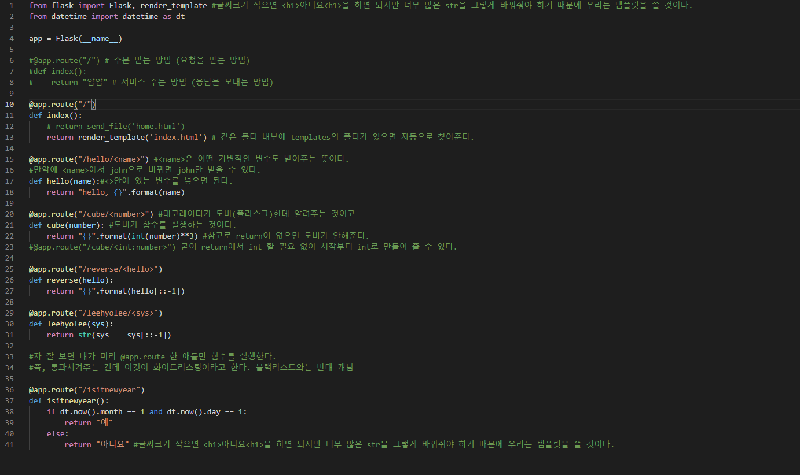

-----

### 잡기술

- emmet의 기능을 활용하면 html 파일에서 `! 탭`을 하면 템플릿이 자동적으로 생긴다.

  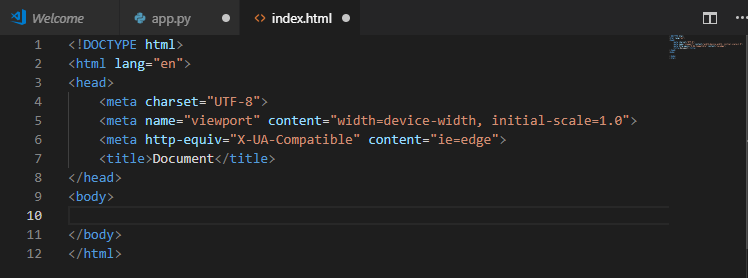


---

### render_template이란?

- send.file()을 하면 바로 파일을 보내줄 수 있다.

  `send_file('home.html')` 이런식으로

  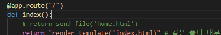

  물론 `from flask import send_file` 해주어야한다.

  아 얘는 app.py랑 같은 폴더에 위치해야한다. 'index.html'과는 다르게 templates 폴더에 있으면 안된다.

  

- 그렇다면 render_template은 뭐죠?

  동적으로 렌더 시켜주는 친구. send_file은 내가 원하는 입맛대로 바꿀 수가 없지만 `render_template`을 쓰게되면 html 파일 안에다가 python 코드도 집어넣을 수 있고 데이터도 집어넣을 수 있다.

  예를 들어서 app.py 안에다가 로또 코드를 넣고 render_template 인자로 index.html와 템플릿에서 받을 인자를 넣어주면 index.html에서 luck으로 로또 코드를 사용 할 수 있다.

  `return render_template('index.html', luck(얘는 html 파일 변수)=lotto(얘는 파이썬 변수))`

-------

### 과정을 통해 취업도 취업이지만 내가 써보고 싶었던 서비스를 만들면서 배우는 것이 참 많을 것이다. 그게 큰 경험이 될 수 있을 것이다. 일회용 카메라 어플 만든 사람 (약 30개국 앱스토어 1위), 축구 분석 서비스 제공한 사람(레알 마드리드에서 명함 받은) 모두 뭐 별 다른 사람 아니었는데 자기가 쓰고싶은 서비스를 제공하면서 크게 성공할 수 있었다고 한다.

### 메르스 맵이라고 만들고 하루만에 100만 명이 들어왔다고 한다. (비전공자임) 그리고 어떤 서비스를 가공해서 재 서비스를 하면 소송이 걸릴 수 있다. 근데 일단 유명해지는게 짱임 그냥 소송 걸리셈 ㅋ

### *그렇다면 내가 쓰고 싶은 서비스는 뭘까 ?*

### ssafy가 현재 전국에서 최고의 교육을 가르쳐 주니까, 그 속에서 코딩 말고도 많은 것을 얻기 위해 노력하도록 하자

https://ryan-han.com/post/2018/essay/memoirs2018/ 비전공자(체대생)가 2018년동안 노력한 글


