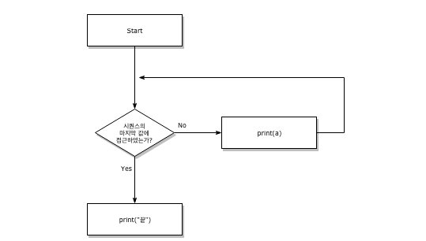

# 조건문

- 제어문이라고 크게 반복문과 조건문으로 나눌 수 있는데, 이는 순서도로 표현이 가능하다.

  

  ```python
  a=5
  if a > 5:
      print("5 초과")
  else:
      print("5 이하")
  print(a)
  ```

### 조건문 문법

1. `if` 문은 반드시 일정한 참/거짓을 판단할 수 있는 `조건식`과 함께 사용해야한다.
2. `<조건식>`이 참인 경우 `:` 이후의 문장을 수행한다.
3. `<조건식>`이 거짓인 경우 `else:` 이후의 문장을 수행한다.
   - 이때 반드시 들여쓰기를 유의해야한다. 파이썬에서는 코드 블록을 C언어의 `{}`와 달리 `들여쓰기`로 판단하기 때문이다.

> 실습문제1 - 조건문 기초 활용
>
> > 조건문을 통해 변수 num의 값과 홀수/짝수 여부를 출력하세요.

```python
num = int(input('숫자를 입력하세요'))
if num % 2 ==0:
    print("안녕, 짝수")
else:
    print("안녕, 홀수")
```

### 복수 조건문

- 2개 이상의 조건문을 활용할 경우 `elif <조건식>:`을 활용한다.

  ```python
  if dust > 150:
      print("매우나쁨")
  elif <조건식>:
      print("나쁨")
  elif <조건식>:
      print("보통")
  else:
      print("좋음")
  ```

> 실습문제2 - 조건식 2개 이상 활용하기
>
> > 조건문을 통해 변수 score에 따른 평점을 출력하세요.

```python
score = int(input('점수를 입력하세요:'))
if 90<=score:
    print('A')
elif 80<=score<90:
    print('B')
elif 70<=score<80:
    print('C')
elif 60<=score<70:
    print('D')
else:
    print('F')
```

> 실습문제3 - 95점 이상이면, "참 잘했어요"를 함께 출력하기 (중첩 조건문 활용)

```python
score = int(input('점수를 입력하세요:'))
if 90<=score:
    if 95<=score:
        print('A\n참잘했어요')
    else:    
    	print('A')
elif 80<=score<90:
    print('B')
elif 70<=score<80:
    print('C')
elif 60<=score<70:
    print('D')
else:
    print('F')
```

### 조건 표현식(Conditional Expression)

- 조건문과 유사하다. `true_value if <조건식> else false_value`

  ```python
  a=int(input("숫자를 입력하세요 : "))
  print('3맞음') if a ==3 else print('3아님')
  ```

  ```python
  num=int(input('숫자를 입력하세요: '))
  value = num if num >= 0 else 0
  print(value)
  ```

> 실습문제4 - 조건표현식과 동일한 `if`문 작성하기
>
> > 다음의 코드와 동일한 `if`문을 작성해보세요.

```python
num = -5
value = num if num >=0 else 0
print(value)

0
```

```python
#답
num = -5
if num>=0:
    value=num
else:
    value=0
print(value)
```

> 실습문제 5 - 반대로 하는 날

```python
num = 2
print('홀수입니다.') if num % 2else print('짝수입니다.') #0이면 False이니까
```


# 반복문

### while 문

- `while`문은 조건식이 참(True)인 경우 반복적으로 코드를 실행한다.

- **while 문은 종료조건을 반드시 설정해주어야 한다.**

  

### for 문

- `for`문은 정해진 범위 내(시퀀스)에서 순차적으로 코드를 실행한다.

  

- **set이랑 dictionary도 집어넣을 순 있는데 결국 얘들은 순서가 정해진 애들이 아니라서 매번 반복문을 돌릴 때마다 순서가 바뀐다.**

> 실습문제 - 반복문과 조건문만 활용하여 1~30까지 숫자 중에 홀수만 담긴 리스트를 만드세요옷

```python
li = []
for i in range(31):
    if i%2 !=0:
        li.append(i)
print(li)
```

### index와 함께 `for`문 활용하기

- `enumerate()`를 활용하면, 추가적인 변수를 활용할 수 있다.

  ```python
  menu = ["짜장","초밥","마라훠궈","꿔바로우","냠냠"]
  for i in enumerate(menu):
      print(i[0],i[1])
  #혹은
  for idx,value in enumerate(menu):
      print(idx, value)
  ```

  *`eunumerate()`는 파이썬 표준 라이브러리의 내장함수 중 하나이며, 다음과 같이 구성되어 있다.*

  > enumerate(iterable, start=0)
  >
  > 열거 객체를 돌려줍니다. iterable은 시퀀스, 이터레이터 또는 이터레이션을 지원하는 다른 객체여야 합니다. enumerate()에 의해 반환된 이터레이터의 __next__() 메서드는 카운트 (기본값 0을 갖는 start부터)와 iterable을 이터레이션 해서 얻어지는 값을 포함하는 튜플을 돌려줍니다.

  **뭔 소리지**

  > dcitionary도 된다. 대신 key만 나옴
  >
  > set도 됨

- 뒤에 인덱스 시작 숫자를 수정할 수 있다.

  ```python
  list(enumerate(menu,start=2))
  #결과
  [(2, '짜장'), (3, '초밥'), (4, '마라훠궈'), (5, '꿔바로우'), (6, '냠냠')]
  ```

### dictionary 반복문 활용하기

- 기본적으로 dictionary를 `for`문을 시행하면 다음과 같이 시행된다.

  ```python
  friends={
      "coolguy":"동훈",
      "옴므파탈":"혜희",
      "듬직 그 자체":"준혁"
  }
  friends.keys()
  for i in friends:
      print(i)
  #결과
  coolguy
  옴므파탈
  듬직 그 자체
  ```

  ```python
  friends={
      "coolguy":"동훈",
      "옴므파탈":"혜희",
      "듬직 그 자체":"준혁"
  }
  print(friends.values())
  for i in friends:
      print(friends[i])
  #결과
  동훈
  혜희
  준혁
  ```

> 실습문제 - 한번 직접 4가지 반복문을 활용해보고 출력되는 결과를 확인해보세요옷 !

```python
for key in friends:
    print(key)
for key in friends.keys():
    print(key)
for val in friends.values():
    print(val)
for key, val in friends.items():
    print(key, val) #dict의 개체를 쪼개어주어서 값을 반환해줌
```

### break, continue, else

- `break`

  - `break`문은 반복문을 종료하는 표현인디요

    ```python
    #break 문을 활용해봅시다.
    for i in range(10):
        if i != 0:
            break
        print(i)
    #결과
    0
    ```

> 실습문제 - 조건문과 반복문, break를 통해서 아래의 코드와 동일한 코드를 작성하세요.
>
> (3이 있을 경우 True를 print하고, 아닐 경우 False를 print 합니다.)

```python
numbers=[1,5,10]

for idx, num in enumerate(numbers):
    if num == 3:
        print(True)
        break
    elif idx == (len(numbers)-1):
        print(False)
```

- `continue`

  - `contine`문은 continue 이후의 코드를 수행하지 않고 다음 요소를 선택해 반복을 계속 수행합니다.

    ```python
    for i in range(11):
        if i % 2 == 0:
            continue
        print('{}는 홀수다.'.format(i))
    ```

- `else`

  - `else`문은 끝까지 반복문을 시행한 이후에 실행됩니다. (`break`를 통해 중간에 종료되면 실행 안함)

    ```python
    #break가 안되는 상황을 만들어보자
    for i in range(3):
        if i ==3:
            print('{}에서 break'.format(i))
        	break
    else:
        print("break 안됨.")
        
        
    #break가 되는 상황을 만들어보자
    for i in range(3):
        if i ==3:
            print('{}에서 break'.format(i))
        break
    else:
        print("break 안됨.")
    ```

