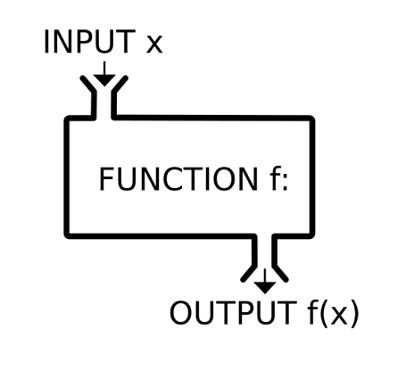
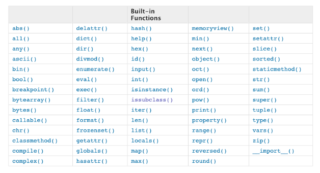
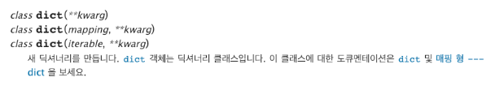

# week5_day2

### 함수의 기초



- 입력값은 여러가지가 있을 수 있고 출력값은 하나이다.
- 함수는 어떤 값을 받아서 함수 안에 써놓은 행위를 하고 함수를 불렀던 위치에 값을 돌려주는 역할을 한다.

----

### 들어가기전에

> 직사각형의 둘레와 면적을 구하는 코드를 작성해주세요.

```python
height = 30
width = 20
dul=2*(height+width)
meon=height*width
```

- 앞선 코드를 매번 많은 사각형에 변수를 바꿔서 넣기엔 너무 귀찮다.
- 코드 많아지면 유지 보수도 힘들고 문제도 많다.

------

### 개요

**활용법**

```python
def func(parameter1, parameter2):
    code line1
    code line2
    return value
```

- 함수 선언은 `def`로 시작하여 `:`으로 끝나고, 다음은 `4spaces 들여쓰기`로 코드 블록을 만듬
- 함수는 `매개변수(parameter)`를 넘겨줄 수도 있다. (parameter가 없을 수도 있다. 매번 똑같은 일을 시킬 함수이면)
- 함수는 동작후에 `return`을 통해 결과값을 전달 할 수도 있다. **(`return`값이 없으면, None을 반환한다)**, (굳이 return 값이 필요없으면 없어도 된다)
- 함수는 호출을 `func(val1, val2)`와 같이 합니다.

> 위의 사각형 코드를 rectangle() 함수를 만들어 보세염

```python
def rectangle(height,wide):
    nullbe=height*wide
    doolle=2*(height+wide)
    return "넓이:{}, 둘레:{}".format(nullbe,doolle)
```

> 너비 30, 높이 100일 때 호출 해보셈

```python
height = 100
wide = 30
print(rectangle(height,wide))
```


> 우리가 활용하는 print문도 파이썬에 지정된 함수이다.
>
> 아래에서 'hi'는 parameter로 넘어가고 출력을 하게된다.

```python
print('hi')
```

- 파이썬 내장 함수



> 내장함수 목록을 직접 볼 수도 있다.

```python
dir(__builtins__)
```

----

### 함수의 return

- 함수는 반환되는 값이 있으며 어떤 종류의 객체여도 상관없다.
- 단, 오직 한 개의 객체만 반환된다.
- 함수를 반환 할 수도 있다.

*실습문제*

> 아래의 코드와 동일한 `my_max`함수를 만들어주세요.
>
> 정수를 두개 받아서, 큰 값을 반환합니다.

```python
def my_max(x,y):
    if x>y:
        return x
    elif x == y:
        return "SSAM-SSAM"
    else:
        return y
```

```python
print(my_max(1,5))
```

*실습문제*

> 함수는 모든 객체를 리턴할 수 있습니다.
>
> 리스트 두개를 받아 각각 더한 결과를 비교하여 값이 큰 리스트를 반환합니다.

```python
def my_list_max(x,y):
    if sum(x)>sum(y):
        return x
    elif sum(x)==sum(y):
        return '더한 값이 서로 같습니다.'
    else:
        return y
```

```python
print(my_list_max([10,3], [5,9]))
```

----

### 함수의 인자/인수

- 함수는 `인자(parameter)`를 받을 수 있습니다.

----

### 위치 인수

- 함수는 기본적으로 인수를 위치로 판단합니다.

> 알고 있는 수학 공식의 함수를 하나만 만들어보세요.

```python
def my_sum(a,b):
    return a+b

my_sum(3,6)
```


- 이처럼 함수는 서순대로 인자를 집어 넣는다.

----

### 기본 값(Default Argument Values)

- 함수가 호출될 때, 인자를 지정하지 않아도 기본 값을 설정할 수 있습니다.

**활용법**

```python
def func(p1=v1):
    return p1
```

> 기본 인자 값이 설정되어 있더라도 기존의 함수와 동일하게 호출 가능합니다.

```python
def my_sum(a, b=0):
    return a+b
my_sum(3,5)
#결과
8
```

> 호출시 인자가 없으면 기본 인자 값이 활용됩니다.

```python
def my_sum(a,b=0):
    return a+b
my_sum(3)
#결과
3
```

> **기본 값을 받는 인자는 제일 뒤에 써주어야한다.**

```python
def my_sum(a=0,b):
    return a+b
my_sum(3)
#결과
Error
```

- 기본 매개변수 이후에 기본 값이 없는 매개변수를 사용할 수는 없습니다.

---

### 키워드 인자(Keyword Arguments)

- 키워드 인자는 직접적으로 변수의 이름으로 특정 인자를 전달할 수 있습니다.

> 키워드 인자 예시

```python
def greeting(age, name='ssafy'): #기존 값은 파라미터 값이 없을 때 대신 쓰이는 친구
    print("{}는 {}살입니다".format(name,age))
greeting(27,'동훈')
greeting(name='동훈', age=27) #age=27이 뒤에 있어야함
greeting(27, name='동훈')
greeting(27)
greeting(age=27,'동훈') #age=27이 뒤에 있어야 함

동훈는 27살입니다
동훈는 27살입니다
동훈는 27살입니다
ssafy는 27살입니다.
Error
```

- `print` 얘도 함수다 파라미터를 넣어줘야하는 근데 파리미터 갯수가 정해지지 않은 친구이다.


```python
print('hi', end='_')
print('hello', end='_')

hi_hello_
```

---

### 가변 인자 리스트

- 앞서 설명한 print()처럼 정해지지 않은 임의의 숫자의 이나를 받기 위해서는 가변인자가 필요하다.
- 가변인자는 `tuple`형태로 처리가 되며, `*`로 표현된다.

**활용법**

```python
def func(*args):
```

> 가변 인자 예시 (print문은 *objects를 통해 임의의 숫자의 인자를 모두 처리한다.)

```python
print('hi','안녕','guten tag',sep='.')
```

> args는 tuple임을 확인해보자

```python
def my_func(*args):
    print(type(args))
my_func(1,2,3)
my_func(1,2,3,4,5,6,7,8,9) #인자값을 몇개 줘도 상관없다.

<class 'tuple'>
<class 'tuple'>
```

*실습문제*

> 정수를 여러 개 받아서 가장 큰 값을 반환(return)하는 `my_max()`을 만들어주세요.

```python
my_max(10,20,30,50)
```

```python
def my_max(*x):
    a=max(list(x))
    return a

my_max(10,20,30,50)
#혹은
def my_max(*x):
    a=list(x)
    a.sort()
    print(a[-1])
my_max(10,50,20,40)

#나만의 방법
def my_max(*x):
    result = x[0]
    for i in range(0,len(x)-1):
        if x[i+1]>result:
            result = x[i+1]
    return(result)

print(my_max(10,50,28,60))

#선생님 방법
def my_max(*args):
    result = 0
    for idx, value in enumerate(args):
        if idx == 0:
            result = value
        else:
            if result < value:
                result = value
   	return result
```

---

### 정의되지 않은 인자들 처리하기

- 정의되지 않은 인자들은 `dict`형태로 처리가되며, `**`로 표현한다.

- 주로 `kwagrs`라는 이름을 사용하며, `**kwargs`를 통해 인자를 받아 처리할 수 있다.

  **활용법**

```python
def func(**kwargs):
```

- 우리가 dictionary를 만들 때 사용할 수 있는 `dict()` 함수는 파이썬 기본 내장함수 이며, 다음과 같이 구성되어 있다.



*실습문제*

> `my_dict()`함수를 만들어 실제로 dictionary 모습으로 출력 함수를 만들어보세요.

```python
#예시 출력)
한국어: 안녕, 영어: hi
```

```python
def my_fake_dict(**args):
    return args

my_fake_dict(한국어='안녕', 영어='hi', 독일어='Guten Tag')
{'한국어':'안녕','영어':'hi','독일어':'Guten Tag'}
```

---

### dictionary를 인자로 넘기기(Unpacking arguments list)

`**dict`를 통해 함수에 인자를 넘길 수 있습니다.

> user 검증(유사 회원가입)을 작성해보세요.
>
> username, password, password_confirmation을 받아서 비밀번호 일치 여부를 판단해보세요

```python
def user(username, password, password_confirmation):
    if password == password_confirmation:
        return "{} 회원가입 완료".format(username)
    else:
        return "다시 입력하세여"
```

```python
my_account = {'username':'rrkkee015','password':'1234','password_confirmation':'1234'}
print(user(**my_account))
```

---

### 이름공간 및 스코프(Scope)

- 파이썬에서 사용되는 이름들은 이름공간(napespace)에 저장되어 있다. 그리고, LEGB Rule을 가지고 있다.
- 변수에서 값을 찾을 때 아래와 같은 순서대로 이름을 찾아나갑니다.
  - `L`ocal scope : 정의된 함수
  - `E`nclosed scope : 상위 함수
  - `G`lobal scope : 함수 밖의 변수 혹은 import된 모듈
  - `B`uilt-in scope : 파이썬안에 내장되어 있는 함수 또는 속성

> 만약 str을 변수로 쓰면?

- `str=4`를 선언한 뒤

- `str()` 코드가 실행되면
- str을 Global scope에서 먼저 찾아서 `str=4`를 가져오고
- 이는 함수가 아니라 변수이기 때문에 `not callable`하다라는 오류를 내뱉게 된다.
- 우리가 원하는 str()은 Built-in scope에 있기 때문이다,.

> 이름공간은 각자 수명이 있다.

- built-in scope : 파이썬이 실행된 이후부터 끝까지
- Global scope : 모듈이 호출된 시점 이후 혹은 이름 선언된 이후부터 끝까지
- Local/Enclosed scope : 함수가 실행된 시점 이후부터 리턴할때 까지