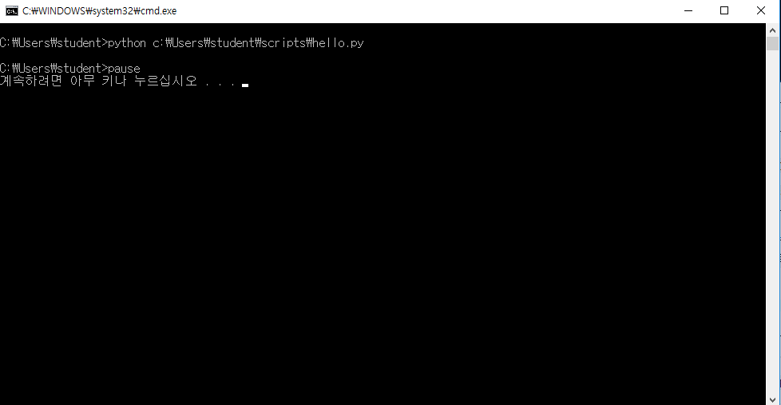
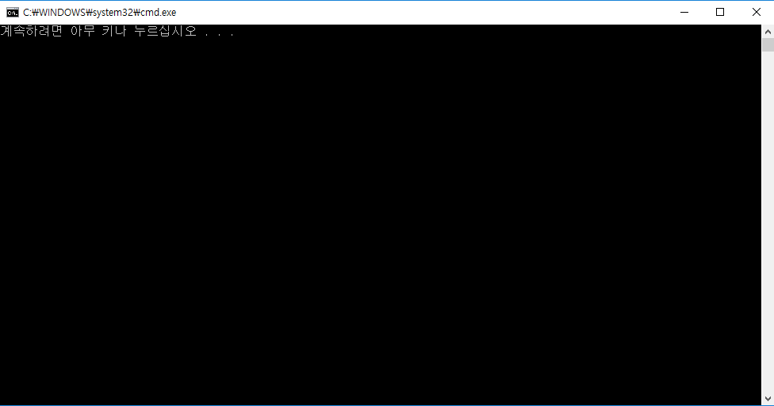
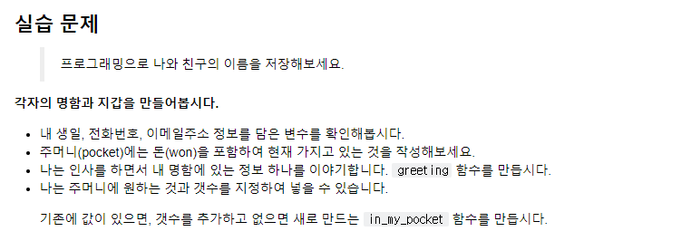

# week6 day1

- 시험이 있슴니다. (주간, 월간 있음) 주간은 그냥 week5에서 하던대로 하면 됩니다. 꼼꼼히 읽어서 함정 문제를 피하도록 합시다.

- 온라인으로 시험을 봅니다.

- 이제는 git lab을 쓸겁니다. (git hub와 같이 써야함) 귀찮은게 `push` 두 번 해야함

- github는 origin(origin master 기억하시죠? github의 별명임)이고 gitlab은 second임

- gitlab에서 `git remote rename *origin* old-origin` `origin` 말고 `lab`으로 별명을 지어주자

- git init 된 폴더에서 아래와 같이 작성하자

  ```
  git remote add lab https://lab.ssafy.com/pok_winter/gitlab_practice.git
  git push lab master
  ```

- **근데 우리 git init을 사용하여 처음부터 새로 만든 애를 넣어보도록하자** (해봤다)

- `zzu.li/python3`을 들어가면 선생님이 정리한 파일이 있는데 그 repository를 `clone`하여 사용하면 된다. (아래쪽에 있는 애) `git clone https://lab.ssafy.com/seoul2/python2.git`

- 그리고 얘들을 jn으로 실행하면 된다. (그 중에 OOP라는 파일을 시작하면 된다) 그리고 **Chapter 5**를 참고하자

---

- git bash에서 파일을 실행하는 방법도 있지만 windows + R키에서도 실행이 가능하다.
  - git bash에서 `code .`을 하면 visual이 시작된다.
- windows + R에서 사용하는 많은 명령어가 있는데 여러 명령어를 한 번에 실행할 수 있는 batch script가 있다.

---

### Chapter 1

1. students 폴더에 `mkdir scripts`를 하자
2. scripts 폴더에서 `code .`을 하자 (이 곳에서 파이썬 자동화 코드를 만들 것이다.)
3. `hello.bat` 파일을 만들어 주자 (이 곳에선 windows 명령어 모음이 들어갈 것이다.)
   - python 커맨드 (python 파일 경로를 입력해야 그 파일을 읽는다.`python c:\Users\student\scripts\hello.py %*`) `%*`의 의미는 추후에 공부하자.
     - 같은 위치에 `hello.py`파일을 만들어 주도록 하자.
   - pause 커맨드
     - python 파일을 실행하면 켰다가 바로 꺼지는데 pause 명령어를 추가하도록하자.

```
python c:\Users\student\scripts\hello.py %*
pause
```

*참고로 주석처리는 `::`을 쓴다*

4. 이제 windows + R키로 BAT 파일을 실행하면 저 안에 코드를 실행해준다.

```python
c:\Users\student\scripts\hello.bat
```


5. python 코드는 실행되었고 pause로 인해 멈췄다. 

**즉, bat script는 처리하면 윈도우즈 커맨드들을 모아서 한꺼번에 실행해주는 스크립트이다**

6. 이제 `hello.py`에 자동화할 기능들을 파이썬으로 구현하면 된다.
7. 근데 `c:\Users\student\scripts\hello.bat` 이거 다 적기 싫은데 앞에 경로를 **환경변수**로 바꿔넣어 간단하게 할 것이다. (참고로 윈도우는 똑똑해서 .bat을 없애도 한 번 실행한 친구를 실행해준다.)
8. 내 PC에 우클릭하고 `고급 시스템 설정`에서 `환경 변수`를 들어가서 시스템 변수를 건들 것이다. `시스템 변수`에서의 `Path`라는 놈 `편집`에서 `새로 만들기`를 한다. `C:\Users\student\scripts`를 입력한다. (귀찮은 앞에 부분을 환경변수로 처리한다.)
9. 그런 다음 다시`windows + R`을 실행하고 `hello`만 쳐도 아까 실행한 코드가 실행된다!!
10. 이젠 파이썬으로 `webbrowser`을 이용해서 바로 웹창이 뜨도록 만들자 !

---

### Chapter 2

1. hello.py에 `import webbrowser`을 사용해서 다음과 같은 코드를 짜자

   ```python
   # 자동화할 기능들을 파이썬으로 구현하기
   import webbrowser
   
   url = "https://search.naver.com/search.naver?sm=tab_hty.top&where=nexearch&query=%EB%AA%A8%EB%AA%A8%EB%9E%9C%EB%93%9C+%EC%97%B0%EC%9A%B0&oquery=%EC%97%B0%EC%9A%B0&tqi=UvYk0spVuE4ssvf9ah8ssssstes-213019"
   webbrowser.open(url)
   ```

2. 이렇게 하고 `windows + R`에서 `hello`를 하면 앞서 했던 url 웹 창이 뜬다.

3. `hello.bat`에서 문장 앞에 @를 붙이면 프롬포터가 깔끔해진다.

   ```python
   @python c:\Users\student\scripts\hello.py %*
   @pause
   ```

   

   

   ```python
   # 자동화할 기능들을 파이썬으로 구현하기
   import webbrowser
   
   url = "https://search.naver.com/search.naver?&query=미세먼지"
   webbrowser.open(url)
   ```

4. 위 파일을 실행하면 미세먼지 url이 실행된다. (week4에서 했던거 복습한거임)

5. 자 그럼 앞에서 했던 `%*`이 뭐냐면 사용자로부터 인풋 값을 받는 것이다. (이걸 하기 위해서는 아래와 같이 사용해야한다)

   ```python
   # 자동화할 기능들을 파이썬으로 구현하기
   import webbrowser
   import sys
   print(sys.argv)
   ```

   이제 검색을 `hello han`이라고 하면 결과값으로 이렇게 뜬다.

   

   즉, sys.argv는 우리가 입력한 명령어들이 다 들어간 친구다.

   => hello han 이라고 하면

   => ["hello 파일 전체 경로", "han"], 리스트로 저장되있다.

6. 만약, 입력으로 `windows + R키`에서  `hello han`라고 입력을 하면 출력으로 `hello han`이라고 출력되게 만들어 보자.

   ```python
   import webbrowser
   import sys
   
   print("hello "+sys.argv[1])
   ```

   

---

### Chapter 3

1. 이제는 `windows + R키`에서 검색어를 입력하여 동적으로 웹창이 뜨도록 만들자. (구글이다)

   - `google.bat` 파일을 만들고 입력받은 명령어가 google이고 `google ssafy`라고 검색했을때 ssafy의 구글 검색결과를 브라우저로 띄워주는 스크립트를 만들어 볼 것이다.

2. `google.py`의 파일을 만들어서 내부엔 아래와 같이 코드를 넣어주자

   ```python
   import webbrowser
   import sys
   
   url = "https://www.google.com/search?&q="
   keyword = sys.argv[1]
   webbrowser.open(url+keyword)
   ```

   `google.bat`에는 이렇게 넣자

   ```python
   @python c:\Users\student\scripts\google.py %*
   ```

   그리고 `Windows + R키`에서 `google ssafy`를 입력하면 구글에서 ssafy 검색 결과가 뿅하고 뜬다!

---

### Chapter 4

1. python에서의 `import`의 역할을 세세하게 알아보도록 하자. 우선 git bash에서 `student 하위 폴더`를 만들도록하자.(`mkdir module` ,`cd module`, `code .`)

2. `a.py`라는 파일을 만들자. 여기엔 두 개의 함수를 정의한다. 하나는 `cube()`라는 함수와 `squar()`함수를 만들자

   ```python
   def cube(m):
       return m**3
   def squar(m):
       return m**2
   print(cube(2))
   print(square(2))
   ```

3. 그 다음 `b.py`를 만들고 거기서 `cube()`함수와 `square()` 함수를 돌려보도록 하자. 당연히 안된다.

   ```python
   $ python b.py
   Traceback (most recent call last):
     File "b.py", line 1, in <module>
       print(cube(2))
   NameError: name 'cube' is not defined
   ```

4. 그러면 `a.py`에서 정의한 걸 어떻게 쓸 수 있을까?? 그 때 `import`를 쓰면된다.

   ```python
   import a
   print(cube(2))
   print(square(3))
   ```

5. 사실 이래도 안됨 `a.`을 써야함

   ```python
   import a
   
   print(a.cube(2))
   print(a.square(3))
   ```

   - `print(dir(a))`를 해보면 아래와 같이 뜨는데 안에 `cube`와 `square`가 있는 것을 확인할 수 있다. 즉, a 안에서 이 두개를 쓰겠다는 것을 명시해야한다.

     ```python
     ['__builtins__', '__cached__', '__doc__', '__file__', '__loader__', '__name__', '__package__', '__spec__', 'cube',
     'squar']
     ```

6. 근데 이것도 귀찮으면 `from`을 쓰면 된다. 근데 뒤에 함수가 많으면 다 명시하기 귀찮은데 `*`를 하면 a에 있는 모든 놈들을 데리고온다. 근데 이름 충돌이 날 수 있어서 안쓰는게 좋다.

   ```python
   from a import cube,square
   #from a import *
   print(cube(2))
   print(square(3))
   ```

*참고로 어떤 코드를 `import`를 하면 그 파일의 코드를 한번 실행하고 가져오게 되어서 조건문이 필요하다. (`__name__`)*

7. `a.py`를 수정하도록 하자.

   ```python
   def cube(m):
       return m**3
   def square(m):
       return m**2
   
   if __name__ == "__main__":
       print(cube(2))
       print(square(2))
   ```

8. 얘를 심층적으로 알아보자 `a.py`에서

   ```python
   print(__name__)
   ```

   을 하면 아래와 같이 결과값이 뜬다.

   ```python
   __main__
   ```

   하지만 `b.py`를 실행하면 아래와 같이 결과값이 뜬다. (`a.py` 내부에 있는 `print(__name__)`을 실행했을 때)

   ```python
   a #파일 이름임
   ```

   - 즉, 파일이 직접 실행되면(`a.py`) => `__main__`

     파일이 불려오게 되면(`import`) => `파일이름`

 **결과적으로 `if __name__=="__main__"`은 직접 실행했을 때만 그 코드를 사용하고 싶을때 응용하면 된다.**

9. `import requests`를 하면 어딘가에 있는 `requests.py`라는 파일 코드를 사용했던 것이다. `requests.get`을 썼다면 `requests.py` 파일에서 `def get():` 함수를 불러온 것이다.
10. 근데 아직 풀리지 않은 궁금증 `BeautifulSoup`는 이상함. 왜냐면 우리는 `bs4.BeautifulSoup()`, `flask.Flask()` 사용했고 얘들은 뒤에 전부 `대문자`가 있다. 이 것들은 `class`를 실행한 것이다. 즉 `bsk4.py`라는 파일에서`class BeautifulSoup()`라는 클래스를 가져온 것이다.

---

### Chapter 5

#### 객체 지향 프로그래밍(OOP) => 시험에 나옴

- 컴퓨터는 저장, 계산 밖에 못한다. 얘들한테 지시를 하는게 프로그래밍이다. 프로그래밍의 3형식이 있는데 아래와 같다.
  - 저장
  - 계산 - 조건, 반복
  - **저장, 조건, 반복** = Turing complexe (튜링 완전 언어)
- 옛날에는 이 3가지로 다 해결 가능한데 오늘 날에는 그렇지가 않다. 왜냐면 오늘날엔 제공해야할 서비스가 너무 많고 인간은 생각할 때 알고리즘대로 생각하지 않기 때문이다. 그렇기 때문에 최대한 인간이 보기 간편한 것이 필요하다.
  - 그러기 위해선 주어(주부,Subject)와 동사((서)술부, Predicate)로만 표현하는 것이 좋다.
  - 프로그램으로 말하면 **Object & Method** (어떤 Object(주어)가 Method(동사,**행위**)하다)
- 그래서 **Object**는 세상에 존재하는 모든 물체, 사물, thing 인 것들이다. **Object**는 분류 체계 속의 예시이다. 이 말이 무슨 말이냐면 나무라는 분류체계에서 예시를 통해 공통점을 찾아서 나무를 인지할 수가 있다.
- **Object oriented programming**은 객체 지향 프로그래밍이라고 안 하는 것이 좋고 `세상 모든 것을 인간이 인식하는 형태로 프로그래밍 하는 법`, `상식적인 프로그래밍`, `OOP`이다. 즉, 순서도처럼 논리적인 사고보다는 상식적인 사고를 지향하겠다는 뜻이다.
- 어떤 개념을 프로그래밍을 할 때 공통점을 찾고 그 것들을 한 곳에 묶어서 **class**에 담도록 하자. 즉, 분류를 통해서 **class**를 통해 한 곳에 모은 것이다.
- **Instance**는 예시라는 뜻이다. 사람이라는 분류체계 안에서 한동훈, 연우, 조인성 모두 예시가 된다.

```python
a=3+2j
print(type(a))
```

```python
<class 'complex'>
```

- `dir(a)`로 확인을 해보면 아래와 같이 뜨는데 **imag, real**가 뜨는데 imag는 허수, real은 실수이다. 얘들은 a를 조작할 수 있는 **Method**들이다.

  ```python
  ['__abs__', '__add__', '__bool__', '__class__', '__delattr__', '__dir__', '__divmod__', '__doc__', '__eq__', '__float__', '__floordiv__', '__format__', '__ge__', '__getattribute__', '__getnewargs__', '__gt__', '__hash__', '__init__', '__init_subclass__', '__int__', '__le__', '__lt__', '__mod__', '__mul__', '__ne__', '__neg__', '__new__', '__pos__', '__pow__', '__radd__', '__rdivmod__', '__reduce__', '__reduce_ex__', '__repr__', '__rfloordiv__', '__rmod__', '__rmul__', '__rpow__', '__rsub__', '__rtruediv__', '__setattr__', '__sizeof__', '__str__', '__sub__', '__subclasshook__', '__truediv__', 'conjugate', 'imag', 'real']
  ```

  ```python
  print(a.real, a.imag)
  ```

  ```python
  3.0 2.0
  ```

- class 'comlex'라고 적혀있는데 a는 class에서 복소수에 분류된 친구이다.

```python
nums = [5, 7, 6 , 2, 9] #얘를 정렬하는 법은 2개가 있다.
print(sorted(nums))
nums.sort()
#이 2개는 2개의 차이가 있다.
#1.반환값이 다르다. 처음은 정렬된 리스트와 None이다.
#2.위에거는 원본을 건들지 않고, 밑에거는 원본을 건든다.
#3.그래서 우리는 위에걸 쓰도록 할 것이다. 원본 건들면 안되니까.

#reverse도 마찬가지
print(reversed(nums)) #내장 함수
nums.reverse() #nums에 reverse라는 Method를 적용하는 것이다.

#시험에 나옴
```

- `dir([])`을 해보면 역시나 list에 적용할 수 있는 **Method**들의 종류가 나온다.

  ```python
  ['__add__', '__class__', '__contains__', '__delattr__', '__delitem__', '__dir__', '__doc__', '__eq__', '__format__', '__ge__', '__getattribute__', '__getitem__', '__gt__', '__hash__', '__iadd__', '__imul__', '__init__', '__init_subclass__', '__iter__', '__le__', '__len__', '__lt__', '__mul__', '__ne__', '__new__', '__reduce__', '__reduce_ex__', '__repr__', '__reversed__', '__rmul__', '__setattr__', '__setitem__', '__sizeof__', '__str__', '__subclasshook__', 'append', 'clear', 'copy', 'count', 'extend', 'index', 'insert', 'pop', 'remove', 'reverse', 'sort']
  ```

*Method를 부를땐 항상 `()`를 붙여야 한다. 아닌 애들은 어트리뷰트라고 멤버 변수이다*

> 예시



```python
my_name = "Han Dong Hun"
my_birthday = "1213"
my_phone = "01051910337"

your_name = "Jang Jun Hyok"
your_birthday = "0123"
your_phone = "01023456788"
```

- 이거 사람들 만들 때마다 너무 귀찮지 않니? 딕셔너리 버전으로도 만들어보자

```python
me = {"name":"HDH","birthday":"1213","phone":"01051910337"}
you = {"name":"JJH","birthday":"0123","phone":"01023456788"}
```

- 좀 나을 줄 알았는데 이래도 귀찮다. 어쨋든 지갑상황도 적어보자

```python
my_pocket = {"manwon":5,"card":3,"id":2}
your_pocket = {"manwon":2,"card":1,"id":1}
```

- 이렇게 적으면 똑같은 구조를 매앤날 해야한다. 너무 귀찮어 ㅠㅠ 어쨋든 me랑 pocket을 합쳐보자

```python
me = {
    "name":"HDH",
    "birthday":"1213",
    "phone":"01051910337",
    "pocket":{
        "manwon":5,
        "card":3,
        "id":2
    }
}

you = {
    "name":"JJH",
    "birthday":"0123",
    "phone":"01023456788",
	"pocket":{
        "manwon":2,
        "card":1,
        "id":1}
}
```

- 깔끔해진거 같은데 새로 사람이 들어올 때마다 사람들이 많아질수록 맨날 새로 만들어야 하는데 어유 너무 귀찮아 진심. 근데 우리가 무엇을 적는지 공통점을 한번 찾아보자 이름도 있고 생일도 있고 폰번호 지갑 등등 많은 공통점이 있는데 이 것들을 싸잡아서 **class**를 담아서 **method**를 활용하는 것이 **OOP**이다
- 이젠 인사하는 함수를 만들어보자 (이전엔 `format`형식을 썼는데 이젠 다른 아래 방식을 지향하도록 하자.)

```PYTHON
def greeting():
    #print("안녕, 나는 {}이야 내 생일은 {}".format(my_name,my_birthday))
    print(f"안녕, 나는 {my_name}야, 내 생일은 {my_birthday}야.")
    
greeting()
```

- 위의 함수는 아직 미완성 되어있다. 우리는 사람을 넣었을 때 `그 사람`이 인사하는 것을 만들어 볼 것이다.

```python
def greeting(name, birthday):
    #print("안녕, 나는 {}이야 내 생일은 {}".format(my_name,my_birthday))
    print(f"안녕, 나는 {name}야, 내 생일은 {birthday}야.")
    
greeting()
```

- 근데 이러면 에러나겠지 당연히? `argument`를 넣지 않았으니까! 넣어주도록 하자

```python
def greeting(name, birthday):
    #print("안녕, 나는 {}이야 내 생일은 {}".format(my_name,my_birthday))
    print(f"안녕, 나는 {name}야, 내 생일은 {birthday}야.")
    
greeting(my_name,my_birthday)

def in_my_pocket(person):
    print(person["pocket"])
    
in_my_pocket(me)
```

- 근데 우리는 깔끔하게 만들고 싶다. 굳이 인자를 넣지 않아도 `me.greeting()`, `you.greeting()`, `me.in_my_pocket()`,`you.in_my_pocket()`만으로 실행이 가능하도록 즉, 정보의 공통점을 찾아서 하나의 분류체계로 구별하는 것이다.

---

### Chapter 6

- 앞서 했던 것을 하나의 분류체계를 만들어 보자. 우선 Person이라는 클래스를 선언하고, 안에 내용을 채우자.

```python
class Person:
    name = "HDH"
    birthday = "1213"
    phone = "01051910337"
    
    def greeting(self): #class 내에서는 self라는 애를 첫번째 인자로 받게 되는데 인스턴스가 사용하는 메소드이다.
     	print(f"안녕, 나는 {self.name}야, 내 생일은 {self.birthday}야.") #self.name,self.birthday로 바꿔줘야한다.
  
me = Person() #이 과정을 intantiate이라고 하는 것인다 Person class의 속성을 가진 me라는 인스턴스를 만드는 것이다.  즉, 붕어빵 틀에서 붕어빵을 만들어 내는 과정 혹은 사람에서 '한동훈'을 만들어 내는 과정, 설계도에서 건물을 만들어내는 과정이다.
print(me.name)
print(me.phone)
print(me.greeting())
```

```python
HDH
1213
안녕, 나는 HDH야, 내 생일은 1213야.
```

- 근데 이렇게하면 안 좋은 것은 `you=Person()`을 통해 새로운 애를 만들어내도 `you.name`해도 `HDH`라고 뜬다. 우리가 원한건 이게 아니다. 여러 사람이 공통점(이름, 폰번호, 생일)을 가지고 있지만 전부 다 다르다. 즉, 원하는 값을 넣을 수 있도록 하자. 바로 `__init__`을 사용해서

```python
class Person:
    def __init__(self,name,birthday,phone):#얘도 self를 붙여준다. 그리고 name, birthday,phone을 받아서 초기화를 하도록 할 것이다. 즉, 틀에서 여러 사람을 만들어 낼 수 있는 것이다.
        self.name = name
        self.birthday = birthday
        self.phone = phone 
        
    def greeting(self):
        print(f"안녕, 나는 {self.name}야, 내 생일은 {self.birthday}야.")
        
me=Person('HDH','1213','01051910337') #각각에 할당되는 인자를 넣는 것이다.
you=Person('JJH','0123','01023456788')#즉 같은 틀에서 다른 애들이 탄생하는 것이다.
print(me.name)
print(you.name)
me.greeting()
you.greeting()
```

```python
HDH
JJH
안녕, 나는 HDH야, 내 생일은 1213야.
안녕, 나는 JJH야, 내 생일은 0123야.
```

- 이렇게하면 클래스를 쓴 코드와 안 쓴 코드의 차이를 보자. 혹여 클래스를 활용 안했으면 항상 사람들이 늘어날 때마다 딕셔너리 틀을 귀찮게 만들었을 것이다. 클래스를 통해 공통점을 묶고 행위(Method)를 할 수 있도록 만들어 놨기 때문에 더 편리해졌다. 이것이 **OOP**이다.
- 앞으론 **OOP**를 활용할 수 있도록 할 것이고 장고에서는 **OOP**가 주체적으로 사용되기 때문에 많은 숙달이 필요하다.

---

### Chapter 7

> 예시

```python
#iu라는 Person 클래스의 인스턴스를 만들어보자
iu = Person('이지은','0516','01051910337')
```

```python
#인사하는 메서드를 호출해봅시다.
iu.greeting()
#결과
안녕, 나는 이지은야, 내 생일은 0516야.
```

```python
#iu의 이름을 확인해봅시다.
iu.name
#결과
이지은
```

```python
#iu로 이름을 바꿔주세요
iu.name = "아이유"
```

```python
#iu가 인사를 합니다.
iu.greeting()
#결과
안녕, 나는 아이유야, 내 생일은 0516야.
```

```python
#iu와 Person이 같은지 확인해보겠습니다.
iu == Person
#결과
False
iu is Person
#결과
False
```

```python
#그렇다면 Type을 비교해봅시다
type(iu)
#결과
__main__.Person #Person이라고 우리가 정의한 클래스에서 나온 친구가 iu이다.
#좀 이쁘게 만들어보자
print(iu.name)
#결과
아이유

print(iu)
#결과
<__main__.Person object blah blah> #좀 더럽다 그지? 아래 예시를 참고하자

isinstance(iu, Person) #iu가 Person의 인스턴스인지 알 수 있다.
#결과
True

isinstance(Person, iu)
#결과
Type Error
```

```python
#앞서 짠 class에서 메서드를 추가하면 좀 깨끗해진다.
#def __str__(self): #represent의 줄임말
#	return f"안녕하세요, 저는 {self.name}입니다."
#얘를 추가하고 다시하면

cr=Person("호날두","1213","01012134122")
print(cr)
#결과
안녕하세요, 저는 호날두입니다.
```

- `self`는 뭔놈이냐?

```python
cr.greeting() #하면 결과값대로 인사할 것인데
Person.greeting(cr) #해도 결과값이 똑같다. 이걸 사용하려면 매개변수의 오브젝트 타입이 person클래스와 같거나 하위 개념이여야 한다.
```

---

### 중간 정리

- Person이라는 클래스안에 **속성(self.name, self.phone, self.birthday)**을 나누어서 정리했다. 얘들은 인스턴스(예제)의 공통적인 부분이다. (반복적으로 작성하기 싫어서) 그리고 Person 클래스에 속성 뿐만 아니라 **행위(Method, 멤버함수, 멤버메소드,메소드)**를 작성하기도 했다. (greeting(), sleep(), eat(), study())
- 이렇게 만들어진 친구가 IU, CR, HDH, JJH이다.
- Car라는 클래스를 만들어보면 속성은 **(self.brand, self.model, self.yunbi, self.color)**이 될 것이다. 얘들을 주어파트로서 **속성, attribute, Car라는 class(멤버)가 가지고 있는 멤버변수이다.** 그리고 행위를 만들어 보자 **(drive(), stop())** 얘들은 동사파트이고  **Method, 멤버함수, 멤버메소드,메소드**라고 한다.
- 이제 예시를 만들어 보면 속성은 `내차(인스턴스), 람보르기니(name), 우르스(model), 7.9(yunbi), yellow(color)`를 만들어 봤다. 얘들은 당연하지만 **Method(행위)**를 사용할 수도 있다.

> 이제 위의 Car class를 명시한대로 코드를 직접 짜보자

```python
class Car:
    def __init__(self,brand,model,yunbi,color):
        self.brand=brand
        self.model=model
        self.yunbi=yunbi
        self.color=color
    def drive(self):
        return "부릉부릉"
    def stop(self):
        return "끼익"

my_car=Car('쉐보레','카마로','연비모름','흰색')
my_car.drive()
my_car.stop()
my_car.model
my_car.color
your_car.yunbi
your_car=Car('테슬라','모델X',15,'흰색')
#결과
부릉부릉
끼익
카마로
흰색
15
```

> 이제 자유롭게 표현을 해보자 !

```python
import turtle

window = turtle.Screen()
window.bgcolor('green')#background color임

ggobugi = turtle.Turtle()
ggobugi.color("black")
ggobugi.shape("turtle")
ggobugi.forward(100)
ggobugi.right(90)
ggobugi.forward(100)
ggobugi.right(90)
ggobugi.forward(100)
ggobugi.right(90)
ggobugi.forward(100)#여기까지하면 거북이가 네모를 그린다.

window.exitonclick()
```

```python
import turtle

window = turtle.Screen()
window.bgcolor('green')

ggobugi = turtle.Turtle() #Turtle은 클래스이다. ggobugi는 인스턴스이다.
ggobugi.color("black") #ggobugi의 color method를 사용했다.
ggobugi.shape("turtle") #주어 동사 형식으로 프로그램을 짰다.
ggobugi.speed(10) #거북이(주어)의 속도는 100으로 하다.(동사)

for i in range(100): #각도를 꺾을 것이다.
	for i in range(4): #네모를 그린다.
    	ggobugi.forward(100)
		ggobugi.right(90)
	ggobugi.right(20)
    
window.exitonclick()
```

- 남들이 짜놓은 클래스를 그냥 나는 몇 자 적었을 뿐인데 사용이 가능했다. 우리가 **OOP**를 해야하는 이유이다. 오늘 날은 혼자 코딩을 하지 않기 때문에
- 참고로 클래스를 만들어 놓으면 코드 내에서 파일을 따로 만들어 놓은 것과 같아서 아예 별개이다. `import a`를 통해서 a.py를 불러오는 것과 같은 개념

---

### Chapter 8

##### 용어 정리

```python
class Person: #클래스 선언 : 클래스 객체 생성
    name = '호날두' #멤버 변수(데이터 어트리뷰트)
    def greeting(self): #멤버 메서드(메서드)
        print(f'{self.name}')
iu = Person() #인스턴스 객체 생성
daniel = Person() #인스턴스 객체 생성
iu.name #데이터 어트리뷰트 호출
iu.greeting() #메서드 호출
```

- 클래스 변수 설명

```python
class Person:                    
    species = '인간' #클래스 변수임 init 밖에 있어서 즉, 각각의 인스턴스는 다 다르지만 클래스 내의 모든 인스턴스는 이 변수를 공유해야 한다. 클래스 내에서 공유하게 되기 때문에 클래스 변수이다.
    def __init__(self,name): #인스턴스 변수임, 여기 안에 있는 애들은 인간이지만 특성이 다르다. 얘들은 인스턴스 각각마다 공유하지 않고 지들끼리 짜짝궁 한다.
        #클래스 변수, 인스턴스 변수 둘다 멤버 변수의 하위 개념이다.
        self.name = name
    def greeting(self):         
        print(f'{self.name}')
        
cr=Person('호날두')
iu=Person('아이유')

print(cr.name)
print(cr.species)

print(iu.name)
print(iu.species) #자기는 클래스 변수를 가지고 있지 않지만 일단 자기가 가지고 있는 변수를 찾고(iu는 없음) 없으면 에러를 띄우는게 아니라 class 안에서 speicies가 있는지 한 번 더 확인을 시키고 출력해준다.

isinstance(iu,Person)
isinstance(cr,Person)
```

```python
호날두
인간
아이유
인간
True
True
#즉, 각각의 인스턴스는 이름은 다르지만 똑같은 종인 인간이다. 왜냐면 같은 클래스이기 때문에
```

- `self` : 인스턴스 객체 자기자신, 인스턴스만 가지고 있는 친구 (굳이 self 안해도 된다. me도 되고 you도 되고 handonghun도 된다. 무조건 첫 번째 인자가 자기를 가르키는 것이다. 첫 번째 인자의 이름은 상관없다.)

  - **특별한 상황을 제외하고는 무조건 메서드에서 `self`를 첫번째 인자로 설정해야한다 !**

  - 왜냐면 메서드는 인스턴스 객체가 함수의 첫번째 인자로 전달되도록 되어 있기 때문에

    ```python
    iu.greeting() #객체를 이용해서 사용한 것이다. Person.greeting()는 Person 파일을 켜서 함수를 실행한 것이랑 같다.
    cr.greeting()
    Person.species #얘랑 비슷함 => #import a 하고 a.cube() a라는 파일(이름공간 = 클래스)에 있는 cube() 함수를 실행하겠다. #즉 Person이라는 공간에 있는 species라는 변수의 값을 확인할래라는 뜻이다.
    #결과
    아이유
    호날두
    인간
    
    Person.greeting()#cr.greeting()은 되는데 왜 안돼 ! => #인스턴스가 실행을 하면 알게모르게 cr.greeting(cr)이 들어가있다. greeting의 첫 번째 인자로(self) 근데 Person.greeting()은 어떤 인스턴스가 불렀는지 모른다. 
    Person.greeting(iu)#그래서 iu라는 인스턴스를 집어넣으니까 뿅하고 나오는것이다. 즉 Person.greeting(iu)랑 iu.greeting()랑 같다.
    #결과
    Error
    아이유
    ```

- 파이썬 이름 공간 법칙(말 안듣는 중2병 찐따 법칙) => 왜 이렇게 이름을 지었을까? 집에 동생 방이 있을 텐데 동생 방에 있는 건 함부로 못 쓰는데 동생은 집에 있는거 다 씀. 즉, 함수는 지 멋대로임 지는 밖을 보면서 밖은 안을 못본다.

  - 아래와 같이 함수를 만들었을 때 

    ```python
    def hello():
        name = "john"
        print (name)
        
    hello()
    #결과
    john
    ```

    ```python
    def hello():
        name = "john" #이렇게 함수 안으로 들어오는 순간 이 변수는 함수에서만 유효하다. 즉 폴더를 따로 담은 것과 같다.
        
    print(name)
    #결과
    Error
    ```

    ```python
    name = "john"
    def hello():
        print(name) 
    #결과
    john
    ```

  - 이 법칙은 class에서도 적용된다.

    ```python
    #예시1
    class Person:
        name = "john"
    print(name) #에러 뜸
    print(Person.name) #이름 공간을 타고 들어가서 조회는 됨. 즉 방문 열고 들어간거임 함수에서는 안됨
    #결과
    Error
    john
    ```

    ```python
    #예시2
    name = '?'
    
    class Person:
        name = '호날두'
        
        def greeting(self):
            print(f'{name}') #self가 없으면 class (파일) 밖에서 찾는다.
            print(f'{self.name}') #self가 있으면 class (파일) 안에서 찾는다.
    
    cr=Person()
    cr.greeting()
    ```

    ```python
    ?
    호날두
    ```


