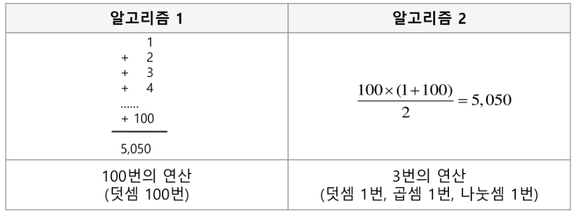
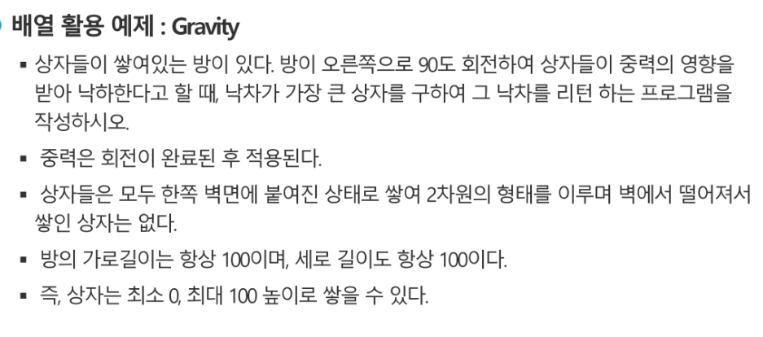
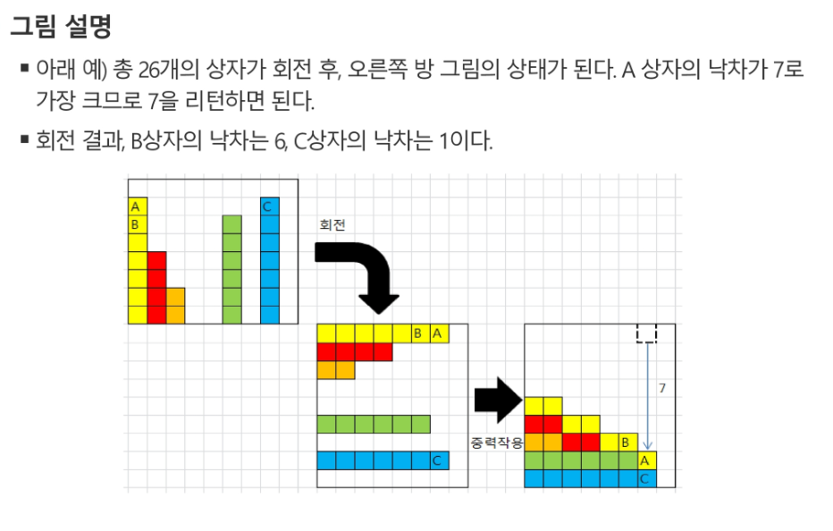
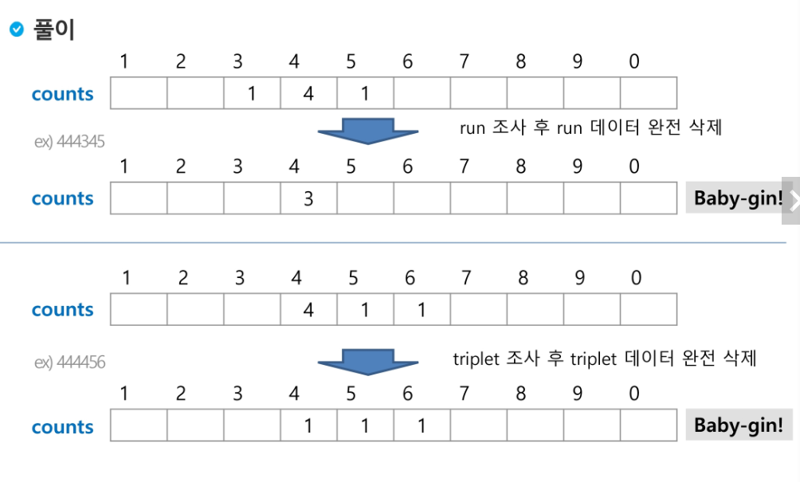
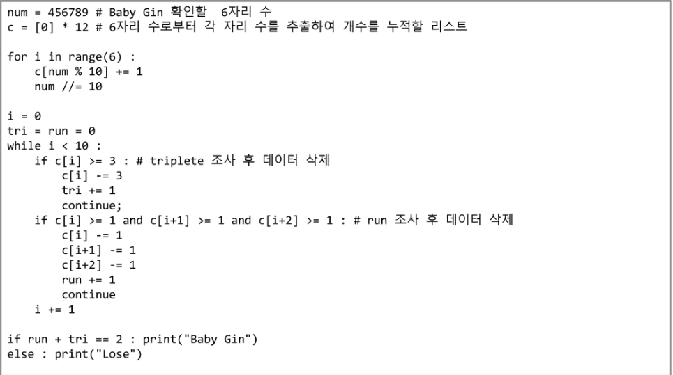
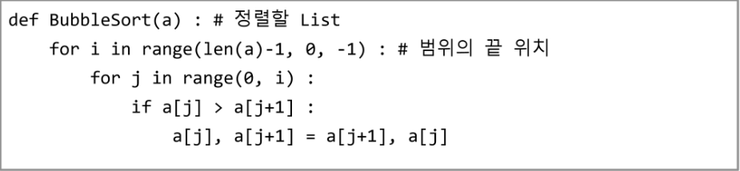

```python
#info의 staticmethod 질문
class Dog:
    nums=0
    def __init__(self, name, age):
        self.age = age
        self.name = name
        Dog.nums += 1
    
    def bark(self):
        print(f'멍멍 나는 {self.name}이고, {self.age}살 입니다.')
    @staticmethod    
    def info():
        print(f'이 친구는 {name} 강아지입니다.')
    
    def count(self):
        print(f'총 강아지 수는 {self.num}마리 입니다.')
        
york=Dog('요크',4)
poodle=Dog('푸들',7)
maltiz=Dog('말티즈',2)

Dog.info()
york.info()
```

```python
# #붙은 애들 전부 에러, 밑에서 4번째 질문
class Dog:
    nums=0
    def __init__(self, name, age):
        self.age = age
        self.name = name
        Dog.nums += 1
    
    def bark(self):
        print(f'멍멍 나는 {self.name}이고, {self.age}살 입니다.')
    @staticmethod    
    def info():
        print(f'이 친구는 강아지입니다.')
    @classmethod
    def count(cls):
        print(f'총 강아지 수는 {cls.nums}마리 입니다.')
        
york=Dog('요크',4)
poodle=Dog('푸들',7)
maltiz=Dog('말티즈',2)

york.bark()
poodle.bark()
maltiz.bark()
#Dog.bark()
Dog.bark(york)
#york.info()
#poodle.info()
#maltiz.info()

Dog.info()
york.info() #static이 붙기 전엔 얘가 안됐음

york.count() #된다. 그렇다면 얘 인자는 어떤 방식으로 받는 것일까?
#Dog.count(york) #class가 붙기 전엔 얘가 안됐음
#Dog로 클래스를 첫번째 인자로 집어넣었는데 york 하나 더 있네? 
#근데 걔는 넣을 곳이 없다. 그래서 에러
Dog.count() 
```


# Week6_day3

- 이론 + 실습으로 구성된 APS 기본 과정이 삼성전자 신입사원한테 적용되었는데, 우리한테 그 교육 과정을 진행할 것이다. 참고로 APS 기본 다음에 APS 응용(Pro 초입까지 가르쳐 줌)이 있다. 참고로 Expert는 진짜 재능임. Pro따면 삼성전자 회사생활 편함. Pro 문제 스타일은 구현을 잘해야한다.
- 삼성 시험 IM,ADV,PRO,EX 이 단계로 있다. 우리는 ADV를 목표를 삼을 것이다. SSAFY 목적으로 전체 교육생 중 50% ADV를 목표로 삼고있다.
- Pro 사전과정 Pro 본 과정 Pro 심화과정 이렇게 강의가 있는데 사원들이 이 걸 참고해서 프로 자격을 따려고 한다.
- 만약 내가 검정 시험을 준비하려고 하는 것은 마라톤과 같다. 실력보단 의지가 중요하다. 다들 찐도찐개임. 누가 먼저 도착하는걸 생각하지말고 내가 언제 도착할 수 있는지를 생각하자.

---

> ### 로드뷰 (6개월 간의)

1. language

   - BASIC이라는 문자가 있었는데 `go` `to` 문으로 만들어져있다. 유지보수가 힘들고, 가독성이 안 좋았다.

     - 그래서 만든 것이 절차 지향 프로그래밍을 만들었다.

   - type (문자 이런거)

   - 제어

     - 순차구조

       - ```
         x=10
         x=20
         #결과
         x=30
         ```

     - 선택구조

       - if문 조건으로 무슨 코드를 짤건지

     - 반복구조

   - 즉, 세상의 문제를 변환해서 제어한다가 기본이다.

- 이정도까지 물어보는 것이 IM 수준이다.
- 논리가 깊진 않지만 논리가 넓어서 방향을 잡는 것이 중요하다. 아무 문제나 풀려하면 안됨(실생활의 논리가 중요하다.)

-------------

2. 자료구조

   - IM 문제를 풀다보니 패턴이 생겼는데 그 것을 이용하는 것이 중요해졌다.
   - 자료구조
     - STACK : 제일 마지막에 쌓인 애가 출력되야하고 `top`이라고 변수 지정하고 사용한다.
   - 연산
     - 자료를 저장했다가 필요할 때 쓰는 것이 자료구조인데 그 삽입, 삭제를 하는데 얘들이 논리 구조는 유지되어야 한다.
   - 프로젝트, 상품을 만들 때, 시험을 볼 때 등 얘들은 구현이 되게 되는데 구현은 선택이다. 스택을 만들면 배열로도 만들 수 있고 linked list로도 만들 수 있다. 이 방향을 잡는 것이 Pro level 이다. 기본이 탄탄해야 Pro를 할 수 있다.

3. 자료구조는 2가지로 또 분류된다.

   1. 선형자료구조

      - 자료구조를 구성하고 있는 요소들의 관계가 1:1의 관계인 것들 (배열(list), 스택, 큐, 문자열 등), 우리가 IM 시험을 본다면 선형자료구조 정도만 알면 된다.

   2. 비선형자료구조

      - 요소들의 관계가 1:(다수)인 관계인 것들이 비선형 자료구조

      1. 트리
         - 1차배열로 표현할 것이냐? 링크드 리스트로 표현할 것이냐?
         - 트리는 BFS, DFS보다 in, pre, post라고 있음.
         - 트리는 그래프의 부분집합임. 가끔 트리가 간소화 될 수 있으니 그래프로만 풀기 보단 트리로도 푸는 것도 좋다.
      2. 그래프

      - ADV 정도 되려면 표현하는 방법이 달라야하고, 고를 수 있어야한다. 인정행렬, 인접리스트라고 이 것들이 있는데 구현을 해야할 정도?
      - 순회(traversal)라고 있는데 요소들이 빠짐없이 중복없이 조사할 수 있는 방법이다.
        - 배열이라고 생각한다면 0에서 n-1까지 순회하면됨 (선형일때)
        - 비선형일 땐 어떻게 돌리지? 그래프에서(BFS(너비우선탐색), DFS(물결 파장이 퍼져나가 듯이 중심에서 부터 마지막까지 전부 차례로 훑어보는))라는 놈들이 있다. 얘들 중 효율적인 것을 골라야지 ADV를 딸 수 있다.

- ADV는 여기까지는 해내야 한다.

---

3. 이진트리, 이진탐색트리, AVL트리, B+트리, 트라이, 세그먼트 트리, 인덱스 트리, 펜윅 트리, 허프만 트리 등
   - 이진 탐색 트리를 삽입하다보면은  선형 탐색을 하게되는데, 얜 느리다. 우리가 사전에서 people을 찾을 때 a부터 찾지 않는다. p를 찾아가지 그러면 탐색 공간을 줄일 수 있다. 이런 것이 이진 탐색이다. 근데 이 문제점이 쓸데없는 메모리 소모가 있는데 그 것을 보완하는 방법이 이진 탐색 트리이다.
   - 이렇게 서로서로 보완을 하는 많은 방법이 있는데 공부할 때 이 history를 인지하면서 공부하는 것이 중요하다.
   - 여행자 경로 문제(TSP)라고 있다. 이런 문제는 순열로 접근해야한다. 3개짜리는 6개, 6개는 720개(6x5x4x3x2x1) 등등.. 
   - AOE, AOV 문제도 있다.

---

4. 알고리즘 설계 기법

   - 그리드
   - 분할정복 (아까 사전 단어 찾는 것이 분할 정복 같은 개념)
   - 백트래킹 (상태공간트리(재귀함수가 얘임)를 DFS로 보는 것, 가지치기) **(빈도 수가 높은 ADV 문제)**
   - DP (재귀적 DP, 반복적 DP)

5. 잠만 근데 우리 이거 전에 완전 검색(모든 경우의 수를 따졌니)을 충분히 이해해야한다. **(딱 ADV 수준)**

   - 순열 (중복순열)
   - 조합 (중복조합)
   - 부분집합 (특히 부분집합에선 배낭문제가 유명한 문제이다)
   - 보통 백트래킹(재귀)로 이해를 하려한다.

   > `n**k(k는 보통 2,3)` => P클래스 문제 `n!, 2**n` => NP클래스 문제(사람의 수명 내에선 계산이 안되는 문제)

   - 공부를 할 때 그리드 공부했다가 조금 이해하고, DP 공부했다가 조금 이해하고, 백트래킹 공부했다가 이런 짓 ㄴㄴ 무엇 하나를 제대로 알고 사용이 가능하면 넘어가도록 하자.

### 여기까지의 로드뷰를 다 이해하고 무엇을 사용할 지 파악이 된다면 Pro

### 완전 검색을 통해서 모든 경우의 수를 통해서 문제를 해결하면 ADV

### 자료를 넣어놓고 제어를 통해 선형 자료를 조사가 가능한 지를 알면 IM

---

> ### 수업 운영방식

1. 오리엔테이션
2. 이론 + 연습문제(간단한) = > 이해 했는지 안했는지, 잠깨기
3. 점심먹자
4. 이론 + 연습문제(간단한) = > 이해 했는지 안했는지, 잠깨기
5. 집 가서 workshop (sw expert academy에서 solving club에 가입신청 해야함 **가입사유란에 이름적기**) 여기다가 Daily 문제를 풀고 올려놓으면 된다.

> 다음날

1. 실습으로 시작 ! (IM 볼 때까지 4+1(solving club 내의 문제)문제정도) (sw expert academy에 이러닝에 인강 뒤에 문제가 있다. 이것을 풀 것이다.)
2. 쟤들 풀고 (4문제만) 해당 날 자정까지 코드만 mail로 선생님한테 보내야한다. (제목 : 서울2반 1월17일 한동훈)
3. 전날 workshop 문제는 아침에 리뷰를 한다. 그 중 학생 중 랜덤으로 한 명을 꼽아서 시킨다. (목적 : 프레젠테이션 목적을 늘리기 위해서) 선생님이 review 한 코드는 solving club 게시판에 올려주겠다.
4. 점심먹자
5. 남은 문제 풀자 (점심 전 2문제, 점심 후 3문제 예상)

> 검정 시험 전 2주 전

1. 죽은 듯이 문제만 풀자
2. 다 풀면 IM 가능

- 원래라면 이론 + 실습(처음엔 어려울 수도 있으니 연습문제로 단련하자)인데 하루에 하면 힘드니까 이틀에 걸쳐서 하겠다.
- 실습문제를 풀면 빨리 풀 수도 있는데 나머지 시간은 IM은 정보올림피아드 가서 문제를 풀자(기본문제부터)
- ADV를 목표로 삼으면 SW Expert 사이트에 가면 Learn에서 Solving club이 있는데 거기 컨텐츠들을 보고, 풀도록하자 (기존의 ADV 문제에서 어려운 수준을 올려 놨음)

---


# APS Python 기본

- 한 챕터당 이틀이 거친다.

### Chapter 1 - 배열 1

- 알고리즘이란?

  - 어떤 문제를 유한한 단계 내에서 해결하기 위한 절차나 방법

  - 알고리즘을 표현할 때 2가지가 있다

    - 슈더코드(가짜코드)

      ```python
      def CalcSum(n):
          sum <- 0
          for i in range(1, n+1):
              sum <- sum + i
      ```

      *화살표에 `=`이 들어가면 코드가 됨*

    - 순서도

      

      *요소가 많아지면 한 화면에 표현했다고 해도 굉장히 복잡해진다.*

- APS 과정의 목표 중의 하나는 좋은 알고리즘을 이해하고 활용하는 것이다.

  - 무엇이 좋은 알고리즘인가?

    - 정확성
    - **작업량 : 얼마나 적은 연산으로 결과를 얻었는가 (시간과 관계됨)**
    - 메모리 사용량
    - 단순성 : 가독성이 높나?
    - 최적성 : 더 이상 개선할 여지가 없는가

    

  - 작업량을 측정하는 방법엔 2가지가 있다.

    - 실제 시간 재기 (OS에 따라 달라지고, 환경에 따라 달라진다.)
    - 디자인을 할 때 대충 계산한다. (위에 사진을 보면 당연히 2번이 효율적임)

    

- 시간 복잡도 = 빅-오(O) 표기법

  - 시간 복잡도 함수 중에서 **가장 큰 영향력을 주는 n에 대한 항만**을 표시 **(계수는 생략)**
  - `O(3n+2)`라고 있을 때 `O(3n)` 최고차항(3n)만 선택 `O(n)` 계수 3제거
    - n개의 데이터를 입력 받아 저장한 후 각 데이터에 1씩 증가시킨 후 각 데이터를 화면에 출력하는 알고리즘의 시간복잡도는 어떻게 되나? (O(n)) => 입력값 n에 의존된다.
    - `O(2n**2 + 10n + 100) = O(n**2)` / `O(4) = O(1)`
    - O(17) = O(3) = O(6) 다 개찐도찐이다. 전부 O(1)과 같다. 즉, 최고차항에 붙은 기울기는 의미가 없다.

- **배열**

  - 일정한 자료형의 변수들을 하나의 이름으로 열거해 사용하는 구조

    

  - 개별 요소로 해버리면 전부를 체크하기 힘들다.

  - 1차원 배열의 선언

    - `Arr = list()` `Arr[]`
    - **IM이 주의해야하는 건 리스트의 경계가 `0~n-1`까지인 것을 계속 체크해야한다. (문제마다 꼼꼼하게 생각하면 된다.**

  - **연습문제 1**

    

    

    

    *벽까지의 거리를 계산하고 블록과 벽 사이에 또 블록이 있는지를 생각하자* 

    1. 바닥에 있는 블록보단 제일 꼭대기에 있는 블록이 가장 멀리 움직인다. 앞에 가려있으면 그 만큼 빼야겠다 !
    2. 높이가 7인 블록이 있으면 7 이상의 블록만 방해를 받게 된다. 그림상에는 7이상인 블록이 하나 더 있으니 걔로 인해 꼭대기 블록이 한번 방해를 받는다. (IM은 정답만 나오면 된다)
    3. [7,4,2,0,0,6,0,7,0]이라면 7 오른쪽에 7이상의 수가 하나밖에 없으니 8-1 해서 7임

  - **Baby-gin Game**

    - 뉴저지 고등학교 문제 중 하나임

    

    - 입력 예
      - `667767` 두 개의 triplet 이므로 baby-gin
      - `054060`은 한개의 run 한 개의 triplet이므로 baby-gin
      - `101123`은 triplet은 존재하나, 023이 run이 아니므로 baby-gin (123을 run 하면 011이 rung이나 triplet이 아님)
    - 경우의 수를 다 따지는 문제임 (완전검색)

- **완전 검색(Exaustive Search)**

  - Brute-force 혹은 generate-and-test 기법이라고도 불린다.
  - 일반적으로 경우의 수가 상대적으로 작을 때 유용하다.
  - 백트래킹이 완전 검색과 궁합이 잘 맞다.
  - 순열, 조합, 부분집합
    - `n!`
    - `nCr`
    - `2**n`
    - 조금만 숫자가 커지면 시간 복잡도가 커진다.
  - 모든 경우의 수를 생성하고 테스트하는 것이 완전 검색이지만 어떻게든 답을 찾을 수 있다.
  - 완전 검색으로 문제를 초벌구이 하는게 좋고**(ADV)**, 성능 개선을 위해 다른 알고리즘을 사용하고 해답을 찾는 것**(Pro)**이 중요하다.
  - Baby-gin 문제 같은 경우엔 6개 숫자를 받아서 순열을 다 만들어보고 앞에거 3개가 같다면 뒤에거만 비교하면된다. 그리고 triplet + run = 2가되면 Baby-gin 를 출력하면된다.

- **순열 (Permutation)**

  - 서로 다른 것들 중 몇 개를 뽑아서 한 줄로 나열하는 것

  - 서로 다른 n개 중 r개를 택하는 순열 `nPr`

  - `nPr = n*(n-1)*(n-2)*...*(n-r+1)`

  - `n! = n*(n-1)*(n-2)*...*2*1`

  - 간단한 코드

    ```python
    for i1 in range(1,4):
        for i2 in range(1,4):
            if i2 != i1:
                for i3 in range(1,4):
                    if 13 != i1 and i3 != i2:
                        print(i1, i2, i3)
    ```

- **탐욕(Greedy) 알고리즘 (정확히는 방법론임)**

  - 탐욕 알고리즘은 최적해`(1,2,3 중에서 최댓값이 무엇입니까? => 3 (최적해) / 1,2,3 중에서 3이 최댓값 입니까? = > Yes (결정문제))`를 구하는 데 사용되는 근시안적인 방법 `(p,np 클래스 문제를 풀 때 최적해로 풀면 오래 걸리니 결정문제로 만들어서 풀어버린다)`
  - 최종적인 해답이 항상 최적이라는 보장은 없다. => 증명을 해야함
  - 머릿속의 생각을 검증 없이 바로 구현하면 Greedy 접근이 된다.
  - 틀릴 가능성이 많지만(내가 생각지도 못한 부분에서 코드 에러가 뜰 수 있으니), 대신 속도가 빠르다. 

  1. 해 선택
  2. 실행 가능성 검사
  3. 해 검사 => 전체 해 검사가 완성되지 않았다면 1로 다시 돌아간다.

  - 제일 대표적인 예가 **동전 거스름돈 문제**
    - [5000, 1000, 500, 100, 50, 10]
    - 1700원을 거슬러 줘야한다. (1000,500,100,100) 4개 ! 직관적으로 생각했다면 그건 Greedy 알고리즘 돌린거임. 제일 큰 수를 골라버렸기 때문에 그 안에서 놀면 된다. 즉, 문제의 범위를 줄여놨으니까 생각할게 줄어들었다. 이거시 Greedy 알고리즘
    - 5000원 (해 선택), 5000원 너무 큼(실행 가능성 검사) / 1000원 (해 선택), 1700-1000 = 700 (실행 가능성 검사), 500원 (해 선택), 700-500 (실행 가능성 검사) .... 총 4개 (해 검사)
    - 근데 이거 좀 위험함 (1,4,5) 숫자 중에서 8원을 고르고 싶으면 어떻게 해야할까? (5,1,1,1)이라고 한다면 (Greedy를 썼음) 틀린거임 !! **정답은 (4,4)임**
    - 그러니까 이런 위험성 때문에 **완전 검색**을 해야한다.
    - 참고로 (1,4,5)나 (1,5,4)가 같다. (조합임)
  - **Greedy 알고리즘**이 성능은 좋다. 그리고 이를 통해 증명된 문제가 많다. 그 증명을 외워서 비슷한 문제에 접근하는 것은 크게 나쁘지 않다. (증명이 되어 있으니까)

- Baby-gin은 Greedy로 접근할 수 없을까?

  

  - 연이어 있는 애가 연속적으로 있으면 **Run** 그 나머지는 나중에 생각하겠다. 숫자가 **3**보다 크면 **triplet** 나머지는 나중에 생각하겠다 !! (둘 중 하나만 해당된 것을 빼고 나머지는 뒤에 생각하는 것임)

  - 구현 코드

    

  - 참고로 run 문이 앞에 있고 tri가 뒤에 있으면 안됨 ([3,1,1,1]이면 [2,0,0,1]이 되고 안됨 / 반대면 [3,1,1,1]에서 [0,1,1,1]이되고 [0,0,0,0]이 되겠지)

  - c=[0]*10이면 c[i+2]가 인덱스 넘어가버리니까 안됨

  - [6,4,4,5,4,4]를 정렬하면 [4,4,4,4,5,6] 가능 ! / [1,2,3,1,2,3]를 정렬하면 [1,1,2,2,3,3] 안됨

- 대표적인 정렬 방식의 종류

  - 버블 정렬
  - 카운팅 정렬
  - 선택 정렬
  - 퀵 정렬
  - 삽입 정렬
  - 병합 정렬

- **버블 정렬**

  - 인접한 두 개의 원소를 비교하며 자리를 계속 교환하는 방식

    - 예를 들어 (5,4)를 (4,5)로 바꿈 그리고 거기서 3이 추가되면 (4,5,3)을 또 정렬하는 것이다. 

  - 교환하며 자리를 이동하는 모습이 물 위에 올라오는 거품 모양과 같다고 하여 버블 정렬이라고 한다.

  - 시간 복잡도

    - `O(n**2)`

  - 예시 [55,7,78,12,42]

    

    1. i = 4가되고 그 나머지 j는 0부터 3까지 돈다. i의 범위가 중요하다. *(i의 범위가 달라지면 j+1이 인덱스 에러가 뜰 수도 있다)*
    2. 그리고 앞에게 더 크면 자리바꾸겠다. 그렇게 [7,55,12,42,78]로 되었다. (여기서 78은 정렬된 원소)
    3. i = 3이 되고 또 반복 (여기서 78,55는 정렬된 원소)
    4. i = 2가 되고 또 반복 (여기서 78,55,42는 정렬된 원소)
    5. 반복...
    6. 끝
    7. 얘도 물론 재귀로 가능하다.

    - 얘 for문이 5+4+3+2+1 이렇게 도는데 `(n+1)*n/2`인데 `O(n**2)`인 이유이다.
    - 똑같은 배열에서 역전된 쌍을 구하라라고 하면 총 5개가 된다. 저 위의 문장에서 맨 마지막 줄 `a[j], a[j+1] = a[j+1], a[j]을` `count +=1`으로 바꾸면 구해지는 것이다. 결국 논리는 똑같다.
    - 만약 1,000개짜리 데이터면 몇 번 돌까요?  => `O(n**2)` 이니까 1,000,000이겠지

- **카운팅 정렬**

  - 항목들의 순서를 결정하기 위해 집합에 각 항목이 몇 개씩 있는지 세는 작업을 하여, 선형 시간에 정렬하는 효율적인 알고리즘

  - 연결되는 정수형이야한다(각 항목이 인덱스가 되어야하기 때문에). 범위가 정해져있어야한다. 이 두가지가 만족되어야 사용할 수 있다.

  - 카운트를 위한 충분한 공간을 할당하려면 집합 내의 가장 큰 정수를 알아야 한다.

  - 시간복잡도

    - `O(n+k)`  n은 리스트의 길이, k는 정수의 최대값 (k가 n보다 겁나 작으면 k가 상관없는데 n와 k가 인접하면 n+k를 적게된다) (범위가 k = 100이고 실제로 n = 10 잡는 수가 k가 상관있음 ?)

  - 예시 [0, 4, 1, 3, 1, 2, 4, 1]

    - 8개 데이터이다. 0~4까지 가지고 있다. 정수형이다. => 카운팅 정렬을 하면 되겠다.

      

      `C[i] += C[i-1]` 이건 마지막 그 숫자의 위치를 알려주기 위한 코드이다.

    - sorting을 하면 보이는 외관 숫자만을 sorting을 하는 것이 아니라 이 전의 위치 순서를 유지해주는 sorting이다. **버블 정렬**도 마찬가지

