# Week7_Day2 2019-01-22

## 어제 복습

1. `inline` `style 태그 설정` `파일을 따로 만들기`

2. `h1 {color:blue;font-size:15px;}` 

## Font - style


- 위에처럼 폰트는 웹 디자인에서 가장 중요한 부분을 차지한다. 위에 애는 `serif`체라고 하고 밑에건 `san-serif`체라고 한다.
- `serif`같은 경우엔 깨지기도 하고 무겁기도 하다. 왜냐면 곡선이 많아서
- `san-serif`체는 곡선이 적어서 깔끔하고 가볍고 사용하기 적합해서 요즘 날 사용하고 있는 폰트이다.

- Google fonts라고 검색하면 거기서 많은 fonts를 사용할 수 있다.

  - 거기서 원하는 fonts를 + 누르면 `<link href="https://fonts.googleapis.com/css?family=Anton" rel="stylesheet">`이런 링크를 복사할 수 있다. 그 링크를 `<head></head>`사이에 추가하면 된다. (단, style.css 선언한 곳보다 위에다가 해야한다.)

    

    

    이렇게 뒤에 (sans-serif, serif, cursive) 어떤 애들로 명시해야 할 지 알려준다.

- **em** 단위는 배수 단위로 상대 단위이다. (픽셀, 키워드가 있다) 요소에 지정된 사이즈(상속된 사이즈나 디폴트 사이즈)에 상대적인 사이즈를 설정한다.

  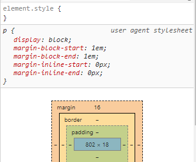

- **rem** 단위도 있다. em의 기준은 상속의 영향으로 바뀔 수 있다. (고등학생이 고등학교 법을 받지 한국 법을 크게 따지진 않는다) 즉, 상황에 따라 1.2em은 각기 다른 값을 가질 수 있다. rem은 최상위 요소(html)의 사이즈를 기준으로 삼는다. (절대단위화 시킨다) r은 root의 r

- **viewport**단위도 있다. 디바이스마다 다른 크기의 화면을 가지고 있기 때문에 상대적인 단위인 viewport를 기준으로 만든 단위이다. (IE, Edge는 지원이 완전하지 않는다)

*색상 표현 단위는 day1에서 했었다*


## Box model

- 이런 애들이 박스 모델이다.

  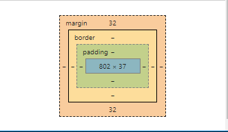

- box를 이해하기 위해서 box.html 파일을 새로 만들어보자. 그리고 아래와 같이 코드를 짠다면

  ```html
  <!DOCTYPE html>
  <html lang="en">
  <head>
      <meta charset="UTF-8">
      <meta name="viewport" content="width=device-width, initial-scale=1.0">
      <meta http-equiv="X-UA-Compatible" content="ie=edge">
      <title>Document</title>
  </head>
  <body>
      <p>박스1</p>
      <p>박스2</p>
      <p>박스3</p>
  </body>
  </html>
  ```

  이렇게 되면 박스1, 박스2, 박스3의 텍스트가 각기 다른 박스에 들어가 있다고 생각하면된다.

1. **margin**은 박스 사이끼리 어느 정도의 간격을 가지고 있는지 알려주는 애이다. margin의 위에 32를 0으로 하면 윗 부분의 빈 간격이 사라진다.


참고로 margin이 윗 박스 아랫 박스가 16/16으로 겹쳐도 32가 되는 것이 아니라 16으로 겹친다.

- **깜짝 미션** : 로컬 코드에서 margin을 0으로 줄여보자

  ```html
  <!DOCTYPE html>
  <html lang="en">
  <head>
      <meta charset="UTF-8">
      <meta name="viewport" content="width=device-width, initial-scale=1.0">
      <meta http-equiv="X-UA-Compatible" content="ie=edge">
      <title>Document</title>
      <style>
          .a{
              margin-top: 0px;
              margin-bottom: 0px;
              margin-left: 0px;
              margin-right: 0px
          }
      </style>
  </head>
  <body>
      <p class='a'>박스1</p>
      <p class='a'>박스2</p>
      <p class='a'>박스3</p>
  </body>
  </html>
  ```

  참고로 아래와 같이 사용해도 똑같은 것이다.

  ```html
      <style>
          .a{
              margin:16px #top bottom left right 다 적용 됨
          }
      </style>
      <style>
          .a{
              margin:16px 32px #top bottom은 16px left right는 32px 다 적용 됨
          }
      </style>
  ```

  이렇게 하면 가운데 정렬이 된다.

  ```css
  .a{
      width: 50%;
      margin:auto;
      text-align:center; #얘는 텍스트 박스에서도 가운데 정렬로 해줌
  }
  ```

2.  **border**는 박스 사이의 경계선이라고 이해하면 된다.

   ```css
   .a{
       width: 50%;
       margin:16px;
       border-style:dotted; #점으로 만들었음
       border-width:8px; #둘러쌓여진 애들의 크기다. (border-width:8px 4px 1px 16px)로 따로따로 줄 수도 있다.
   }
   ```

   ```css
   .a{
       width: 50%;
       margin:16px;
       border:2px dotted pink; #한줄로 표현가능
   }
   ```

   *border는 특이하게 크기 스타일 색깔을 한줄로 표현이 가능하다. 가장 중요한건 스타일이다. 스타일이 없으면 아예 표현되지가 않는다.* 

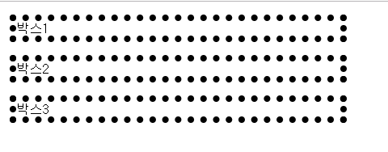

3. **padding**

   padding은 `border`라는 경계선이 있고 `박스1`라는 텍스트가 있는데 그 사이가 `padding`이다.

   ```css
   .a{
       width: 50%;
       margin:16px;
       border:2px dotted pink;
       padding-top:10px;
       padding-right:10px;
       padding-left:10px;
       padding-bottom:10px;
   }
   ```

   

   ```css
   #얘도 마찬가지로 한줄로 할 수 있다.
   .a{
       width: 50%;
       margin:16px;
       border:2px dotted pink;
       padding:10px 20px: # top bottom은 10px left right는 20px
   }
   ```


## a 태그

```css
<body>
    <a href="https://edu.ssafy.com">SSAFY</a>
    <a href="https://www.naver.com">Naver</a>
    <p class='a'>박스1</p>
    <p class='a'>박스2</p>
    <p class='a'>박스3</p>
</body>
```

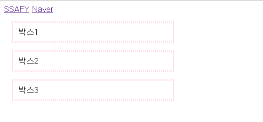

- a태그는 옆으로 쌓이고 p태그는 아래로 쌓인다. 이 차이는 **인라인 레벨 태그**, **블락 레벨 태그**의 차이이다.

- **블락 레벨 태그**

  - 항상 새로운 라인에서 시작한다.

  - 화면 크기 전체의 가로폭을 차지한다.

  - block 레벨 요소 내에 inline 레벨 요소를 포함할 수 있다. *아래와 같이*

    ```css
    .b{
        margin:20px;  #20px로 했지만 상하는 적용되지 않는다.
        padding:10px;
    }
    <body>
        <p class='a'>박스1<a class='b' href="https://www.naver.com">Naver</a><a class='b' href="https://www.naver.com">Naver</a></p>
        <p class='a'>박스2</p>
        <p class='a'>박스3</p>
    </body>
    ```

    

    ```css
    #p태그 안에 p태그를 넣는건 들어간게 아니고 그냥 쌓이는 것이다.
    <body>
        <p class='a'>박스1<a class='b' href="https://www.naver.com">Naver</a><a class='b' href="https://www.naver.com">Naver</a></p>
        <p class='a'>박스2<p>박스2 안에 한동훈</p></p>
        <p class='a'>박스3</p>
    </body>
    #블락 두개는 중첩이 될 수 없기에 그냥 이상하게 되버림
    ```

    

  - div, h1~h6, p, ol, ul, li, hr(줄바꿈), table, form

- **인라인 레벨 태그**

  - 새로운 라인에서 시작하지 않으며 문장의 중간에 들어갈 수 있다.
  - content의 너비만큼 가로폭을 차지한다.
  - width, height, margin-top,bottom 프로퍼티를 지정할 수 없다. (옆으로는 가능)
  - 상, 하 여백은 line-height로 지장한다.
  - span, a, strong(bold임), img, br, input, select, textarea, button
  - 한 줄에 많이 들어가야 하는 애들이 **인라인 태그**이다.

- **깜짝 퀴즈** 블락 레벨 태그임에도 불구하고 옆으로 쭉 늘려진 코드를 짤 수가 있다.

  ```css
  .c{
      display:inline
  }
  
  <body>
      <p class='c' class='a'><strong><s>박스1</s></strong>은 강하다<a class='b' href="https://www.naver.com">Naver</a><a class='b' href="https://www.naver.com">Naver</a></p>
      <p class='c' class='a'>박스2</p>
      <p class='c' class='a'>박스3</p>
  </body>
  ```

  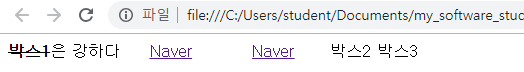

  물론 인라인 레벨 태그도 블락처럼 사용 가능하다.

  ```css
  <body>
      <p class='c' class='a'><strong><s>박스1</s></strong>은 강하다<a class='b' href="https://www.naver.com">Naver</a><a class='b' href="https://www.naver.com">Naver</a></p>
      <p class='c' class='a'>박스2</p>
      <p class='c' class='a'>박스3</p>
      <a style='display:block' href="https://www.naver.com">네이버</a> #인라인을 블락으로 했다.
      <span>이건 스팬이다.</span>
      <span>이건 스팬1이다.</span>
      <span>이건 스팬2이다.</span> #얘는 인라인 요소다.
  </body>
  ```

  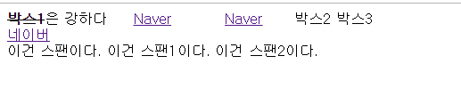

- **인라인 블락 (Liger랑 비슷한 친구)**

  - block과 inline 레벨 요소의 특징을 모두 갖는다.
  - inline 레벨 요소처럼 한 줄에 표시 되면서 block에서의 width, height, margin(top, bottom) 속성을 모두 지정할 수 있다.
  - 특별히 안 씀

  ```css
  .d{
      display:inline-block;
      margin-top:10px;
      margin-bottom:20px;
      width:20px; #이렇게 해버리면 오른쪽으로 더 갈 수 없으니까 땅굴파고 밑으로 들어가는 것이다.
      height:40px;
  }
  
  <body>
      <p class='c' class='a'><strong><s>박스1</s></strong>은 강하다<a class='b' href="https://www.naver.com">Naver</a><a class='b' href="https://www.naver.com">Naver</a></p>
      <p class='c' class='a'>박스2</p>
      <p class='c' class='a'>박스3</p>
      <a style='display:block' href="https://www.naver.com">네이버</a>
      <span class='d'>이건 스팬이다.</span>
      <span class='d'>이건 스팬1이다.</span>
      <span class='d'>이건 스팬2이다.</span>
  </body>
  ```

  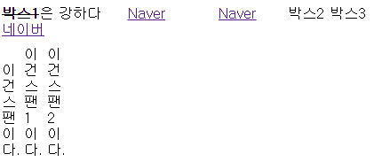

- **None**

  - 해당 요소를 화면에 표시하지 않는다. (공간조차 사라진다.)

  ```css
  .e{
      display:None
  }
  
  <body class='e'> #None을 적용했다.
      <p class='c' class='a'><strong><s>박스1</s></strong>은 강하다<a class='b' href="https://www.naver.com">Naver</a><a class='b' href="https://www.naver.com">Naver</a></p>
      <p class='c' class='a'>박스2</p>
      <p class='c' class='a'>박스3</p>
      <a style='display:block' href="https://www.naver.com">네이버</a>
      <span class='d'>이건 스팬이다.</span>
      <span class='d'>이건 스팬1이다.</span>
      <span class='d'>이건 스팬2이다.</span>
  </body>
  ```

  

- **visibility**

  ```css
  .d{
      visibility: hidden; #이렇게하면 공간은 있는데 보이지 않는다.
      display:inline-block;
      margin-top:10px;
      margin-bottom:20px;
      width:20%;
      height:50%;
  }
  
  <body>
      <p class='c' class='a'><strong><s>박스1</s></strong>은 강하다<a class='b' href="https://www.naver.com">Naver</a><a class='b' href="https://www.naver.com">Naver</a></p>
      <p class='c' class='a'>박스2</p>
      <p class='c' class='a'>박스3</p>
      <a style='display:block' href="https://www.naver.com">네이버</a>
      <span class='d'>이건 스팬이다.</span> #hidden 넣음
      <span class='d'>이건 스팬1이다.</span> #hidden 넣음
      <span class='d'>이건 스팬2이다.</span> #hidden 넣음
  </body>
  ```

  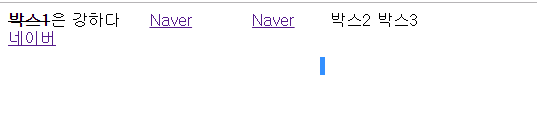


## Bootstrap

- Bootstrap이란?

  하나의 웹 템플릿이라고 생각하면 된다. PC, 모바일, 태블릿 다 알아서 적용을 해준다. (Bootstrap 말고 material design과 같은 곳이 있다)

- freecodecamp, codecademy란?

  HTML 강의를 해주는 codecademy와 비슷한 곳이다. *활용하는 것이 좋다 !*

  freecodecamp에서 커리큘럼에 들어가서 Bootstrap 파트를 찾을 수 있다. 여기서 lesson을 통해서 갖가지 실습을 할 수 있다.

- Bootstrap을 쓰면 무엇을 만들 수 있을까??

  1. 구글에서 Bootstrap을 검색해서 download source를 하자. 압축도 풀자. 그 폴더 중에 dist 폴더=>css=>bootstrap 코드만 사용할 것이다. 이걸 복사해서 로컬 폴더로 가져가자

  2. 그 파일을 찾아보면 기본으로 속성이 다 부여되어있다. 이것들을 ` <link rel="stylesheet" href="bootstrap.csss">태그를 이용해서 가져오자` 밑에 사진 보다시피 기본 속성이 달라진다. (밑에 애가 bootstrap 적용한 것)

     

     얘는 위에 놈이 버튼에다가 부트스트랩 적용한 것

     ```html
     <button class="btn btn-primary">부트스트랩 버튼!</button>
     
     #primary를 warning으로 바꾸면 노란색, danger면 빨간색이 되고, success를 하면 초록색이 나온다.
     
     #참고로 btn btn-primary라고 명시하면 bootstrap.css 파일에서 언제 선언이 되었는지가 중요하다. 내가 뭐라고 적었는지는 중요하지 않다. 선언을 늦게 하는 애가 짱임 호출은 상관없음
     
     #겹치는 애들만 덮어쓰여지는거지 덮여쓰지 않는 애들은 클래스 속성이 적용된다.
     ```

     ```css
     #bootstrap.css에 이미 클래스를 만들어 놓았기 때문이다.
     
     .btn-primary {
       color: #fff;
       background-color: #007bff;
       border-color: #007bff;
     }
     ```

     

  - 근데 왜 얘들은 warning, danger를 쓰는 걸까? 색깔은 하지 않았을까? 그 이유는 우리가 원하는 색깔을 직접 지정할 수 있기 때문에 warning, danger 이런식으로 저장했기 때문이다.

    

  - 보다시피 button은 **인라인 블락 레벨**이다.


## Bootstrap 실습

- Bootstrap을 다운받아서 쓰면 귀찮음. 그래서 CDN 활용을 통해서 Bootstrap에 작성된 CSS, JS를 활용할 것이다. 오전에 **구글 폰트** 가져온 것과 같다. 장점도 있다.

  1. 속도가 빠르다.
  2. 외부 서버를 활용해서 본인 서버의 부하가 적어짐
  3. 적절한 수준의 캐시 설정으로 빠르게 로딩이 가능하다.

- 따라서 Bootstrap에서 특정 코드를 복사해오도록 하자.

  

- 그리고 bootstrap에 미리 만들어놓은 코드를 복사해 넣으면 웹페이지를 꾸밀 수 있다.

  

- lorempixel.com에 들어가면 엑박 뜨는 걸 없앨 수 있다. 거기서 다양한 주소가 있는데 그 주소를 imag 값에다가 삽입하면 임시 방편으로 image를 채울 수 있다.

  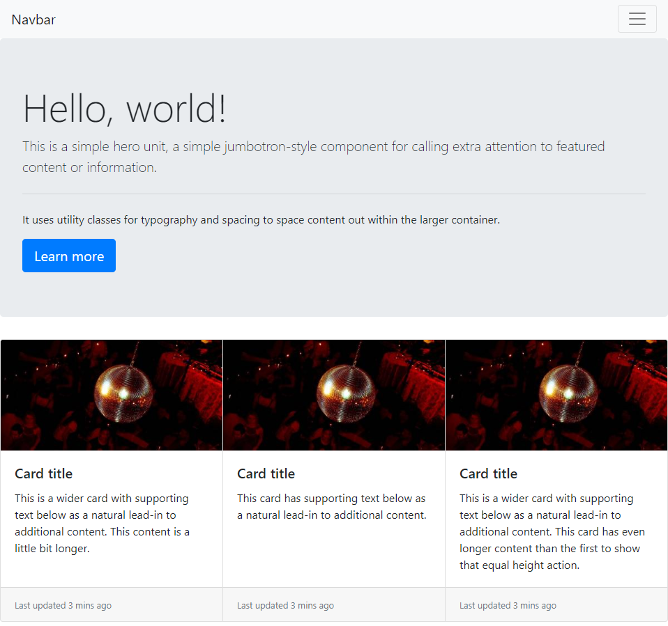

- Bootstrap의 특징

  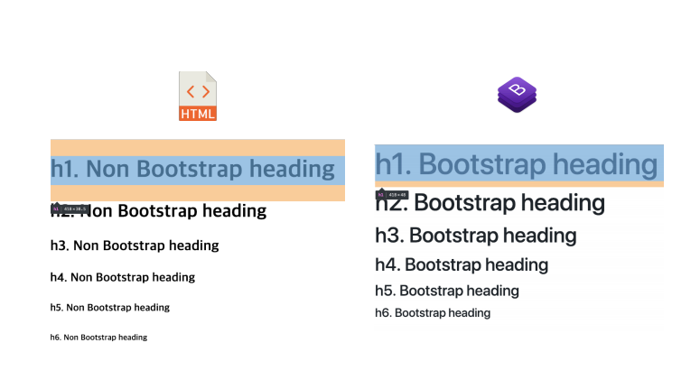

  

  같은 듯 다른 Bootstrap


- Bootstrap의 클래스를 활용하자

  1.  **공간을 편하게 확보**

     1. `.m-0`

        - margin을 0으로 두겠다.

        - `m-1`은 4정도 되는 margin이 생긴다 `m-2`는 8정도 되는 margin이 생긴다.

          `<h1 class='m-0'>부트스트랩으로 적용하는 box 스타일</h1>`

        - 즉 우리가 직접 `margin=18px` 할 필요가 없다.

        - x축 y축은 `my-4 mx-0` 이렇게 하면 된다.

     2. `.mr-0`,`.mt-0`,`.mb-0`,`.ml-0`

        - 얘는 상하좌우 margin을 삽입할 수 있다. 뒤에 숫자에 따라서 픽셀 수치가 다르다.
        - 1 =4
        - 2 =8
        - 3 =16
        - 4 =24
        - 5 =48
        - 이렇게 증가한다.

     3. `.py-0`

        - padding의 y축을 0으로 만들겠다는 소리다.
        - 참고로 브라우저 기본 rem은 16px

     4. 참고로 음수도 가능하다.

        

  2. **Color**

     1. 키워드로 되어있는 컬러들은 되게 눈이 아프다. 하지만 이런 애들이 Bootstrap을 거치면 되게 이쁘게 나온다.

        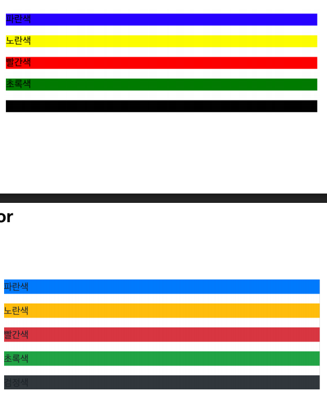

        색상 키워드는 색깔로 알려주지 않는다.

        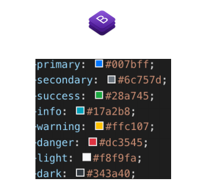

     2. `.bg-primary` 백그라운드의 색을 바꿀 수 있다. `navbar-dark .bg-primary`라고 한다면 Navbar의 백그라운드 색이 바뀐다.

  3. **border**

  4. **rounded**

     1. 각진 블록을 둥구스르므하게 바꿔주는 것이다.

        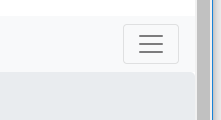

        ```css
            <div class='bg-info rounded-pill'>
                radius-test
            </div>
        ```

  5. **display**

     1. `.d-block`

        ```css
        <body>
            <button class='btn btn-info d-block'>
                버튼 1
            </button>
            <button class='btn btn-primary'>
                버튼 2
            </button>
        ```

     2. `.d-inline`

        - 얘는 블락을 inline으로 해주는 친구이다.

     3. `.d-none`

        - 다 사라지게 함

     4. `.d-sm-none` (lg는 창의 크기가 덜 줄어도 뿅 뜬다)

        - 화면을 줄이면 튀어나오는 친구이다. 즉 반응형 디자인이다.
        - grid 시스템이 필요하고 미디어 어쩌구가 필요하다.

  6. **position** 얘는 머리아프니까 나중에 하도록 하자

  7. **text**

     1. `.text-center`
        - 가운데 정렬
     2. `.font-weight-bold`
        - 글자 Bold화

### 컴포넌트는 공식문서로 확인하자 밑에 애는 외워놓도록하자


## 그리드 시스템

- 오늘날 가장 중요한 건 균형과 사이징이 딱딱 맞는 것이다. 그게 안 맞으면 안 이쁨, 그래서 우리는 그리드를 제대로 잡아주고 사이즈를 딱딱 맞게 레이아웃을 잡아줘야한다.

  

  이렇게 격자를 맞춰서 컨텐츠를 배열해야한다.

- 예전엔 이걸 활용하기 어려웠는데 Bootstrap이 이 서비스를 제공한다.

- 그래서 grid.html 파일을 생성하자. 그리고 기본적인 코드를 설정하면 준비 끝

  ```css
  <!DOCTYPE html>
  <html lang="en">
  <head>
      <meta charset="UTF-8">
      <meta name="viewport" content="width=device-width, initial-scale=1.0">
      <meta http-equiv="X-UA-Compatible" content="ie=edge">
      <!-- Bootstrap files-->
      <link rel="stylesheet" href="https://stackpath.bootstrapcdn.com/bootstrap/4.2.1/css/bootstrap.min.css">
      <script src="https://code.jquery.com/jquery-3.3.1.slim.min.js" integrity="sha384-q8i/X+965DzO0rT7abK41JStQIAqVgRVzpbzo5smXKp4YfRvH+8abtTE1Pi6jizo" crossorigin="anonymous"></script>
      <script src="https://cdnjs.cloudflare.com/ajax/libs/popper.js/1.14.6/umd/popper.min.js" integrity="sha384-wHAiFfRlMFy6i5SRaxvfOCifBUQy1xHdJ/yoi7FRNXMRBu5WHdZYu1hA6ZOblgut" crossorigin="anonymous"></script>
      <script src="https://stackpath.bootstrapcdn.com/bootstrap/4.2.1/js/bootstrap.min.js" integrity="sha384-B0UglyR+jN6CkvvICOB2joaf5I4l3gm9GU6Hc1og6Ls7i6U/mkkaduKaBhlAXv9k" crossorigin="anonymous"></script>
      <title>Document</title>
  </head>
  <body>
      <!-- container 생성 -->
      <div class="container">
          <!-- row 생성 -->
          <div class="row">
  
              
          </div>
      </div>
  </body>
  </html>
  ```

- 이제 우리의 컨텐츠를 배열해보자. 그리드에서 가장 많이 사용하는 칼럼 수가 **12개**이다. 그 이유로는 약수가 많아서 조율하기가 쉽다.

  ```css
  <body>
      <!-- container 생성 -->
      <div class="container">
          <!-- row 생성 -->
          <div class="row">
              <div class='bg-primary'>
                  글 1
              </div>
              <div class='bg-success'>
                  글 2
              </div>
              <div class='bg-warning'>
                  글 3
              </div>
          </div>
      </div>
  </body>
  #이렇게 div로 넣었는데 왜 블락으로 display가 block으로 표시안되고 inline으로 표시될까?
  #왜냐면 row의 flex라는 이유 때문이다.
  ```

- 참고로 display 표현 방법 중에서 Block, inline, flex, float 등등이 있다.

- 글1, 글2, 글3의 컨텐츠가 3개 있으니 이걸 12개 칼럼을 서로 차지해야한다. 그래서 즉 4개의 칼럼이 필요하다. 그걸 명시해야한다.

  ```css
  <div class='bg-primary col-4'>
  	글 1
  </div>
  <div class='bg-success col-4'>
  	글 2
  </div>
  <div class='bg-warning col-4'>
  	글 3
  </div>
  ```

  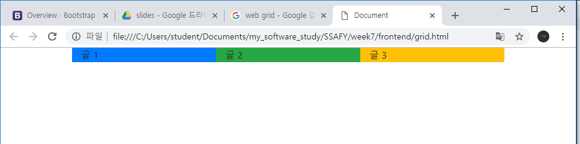

- 우리가 화면을 줄일 때 글도 작아지면 안되니까. sm을 적용시켜줘야한다.

  ```css
              <div class='bg-primary col-sm-2'>
                  글 1
              </div>
              <div class='bg-success col-sm-2'>
                  글 2
              </div>
              <div class='bg-warning col-sm-2'>
                  글 3
              </div>
              <div class='bg-danger col-sm-2'>
                  글 4
              </div>
              <div class='bg-light col-sm-2'>
                  글 5
              </div>
              <div class='bg-secondary col-sm-2'>
                  글 6
              </div>
  ```

  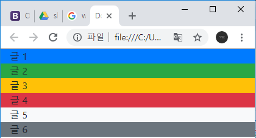

- 근데 글들과의 사이 공간을 늘리고 싶어서 클래스 `mx-1`을 사용해보자. 근데 `mx-1`으로 조절하면 튕겨져 나가버린다.

  ```html
  <div class='bg-primary col-sm-2 mx-1'>
      글 1
  </div>
  <div class='bg-success col-sm-2 mx-1'>
      글 2
  </div>
  <div class='bg-warning col-sm-2 mx-1'>
      글 3
  </div>
  <div class='bg-danger col-sm-2 mx-1'>
      글 4
  </div>
  <div class='bg-light col-sm-2 mx-1'>
      글 5
  </div>
  <div class='bg-secondary col-sm-2 mx-1'>
      글 6
  </div>
  ```

  

- 근데 얘가 지 스스로 가운데 정렬을 했는데 우리가 만약 꽉 채우고 싶으면 어떻게 할까?

  ```html
  <div class="container-fluid"> #-fluid를 추가하면 된다.
      <!-- row 생성 -->
      <div class="row">
          <div class='bg-primary col-sm-2 px-1'>
              글 1
          </div>
          <div class='bg-success col-sm-2 px-1'>
              글 2
          </div>
          <div class='bg-warning col-sm-2 px-1'>
              글 3
          </div>
          <div class='bg-danger col-sm-2 px-1'>
              글 4
          </div>
          <div class='bg-light col-sm-2 px-1'>
              글 5
          </div>
          <div class='bg-secondary col-sm-2 px-1'>
              글 6
          </div>
      </div>
  </div>
  ```

  

  이렇게 하면 전체를 꽉 채울 컨텐츠를 제공할 때 하면된다.