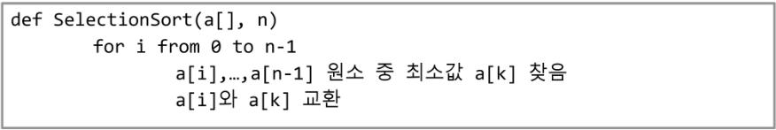
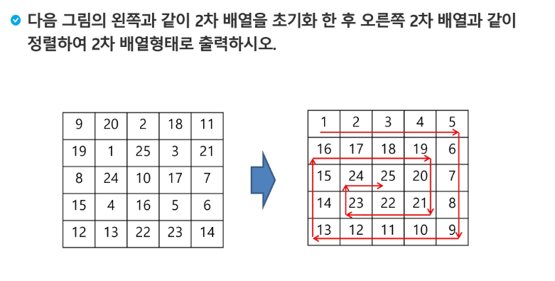

# Week7_Day3 2019-01-23

- 문제 리뷰(4828) `최대-최소`

  ```python
  def find(a, n):
      
      max_value=a[0]
      min_value=a[0]
      
      for i in range(1, n):
          if a[i] > max_value:
              max_value = a[i]
          if a[i] < min_value:
              min_value = a[i]
              
      return max_value-min_value
  
  T = int(input())
  ```

- 문제 리뷰(4831) `전기버스`

  ```python
  T=int(input())
  cnt = cur = 0 #cur는 버스의 위치
  while(True):
      pre = cur #하나씩 돌아오다가 자기 자신을 다시 만났다면 그건 그 사이에 충전소가 없었다는 의미이기 때문에 그 전 위치를 저장해놓았다.
      cur += K
      if cur >= N: #도착점에 도착하거나 지나친다면 종료
          break
      if stations[cur] == 1: #그 곳에 station이 있는지 확인
          cnt += 1
      else: #충전소가 없다면
          for i in range(1, K+1)
              if stations[cur - i] == 1: #K가 3이라면 1번 2번 3번 돌아와 봐야한다.
                  cur -= i
                  cnt += 1
                  break
              if cur == pre: #만약 원래 위치로 돌아왔다면 카운트 세는걸 종료하고 멈춘다.
                  cnt = 0
                  break
  ```

  10개면 11개를 잡아서 충전기가 설치되어 있는 곳들은 1이라고 설정을 했다. k=3이라면 3만큼 갔다가 충전기 있으면 충전하고 충전기 없으면 하나씩 뒤로 빽한다. 뒤로 돌아오면서 가장 가까운 곳에서 충전 했다면 다시 출발 그리고 `j>=N`이 되면 끝을 내야한다.

- 문제 리뷰(4834)`숫자카드`

  카운팅 정렬을 사용했어야 했다는 알고리즘 선생님의 말씀

- 문제 리뷰`구간합`

  0부터 4까지 인덱스가 있다면, 3구간을 합하려면 3가지 방법이 있다. 근데 전체를 다 따지려고 하면 5,6 인덱스에 0을 추가하여 하는 방법도 있다.(에러가 뜰 수도 있으니 짤 때 생각을 많이 해야한다)

  3개의 구간을 잡고 인덱스를 늘려가면서 max를 갱신하면서 나아가면 된다.

  1억개가 있고, 구간이 만약 1000개이면  뒤에꺼 더하고 앞에꺼 빼면 됨. 반복 한번만 돌리면 됨

- 문제 리뷰`Flatten`

  이게 횟수가 많아지면 의미없는 짓을 할 수도 있으니 (왔따리 갔다리) break를 걸어주면 좋다.

  만약 데이터가 천만개 들어온다면, 카운팅 소트를 해서 숫자가 적은 부분과 숫자가 많은 부분을 똑 떼어놓고 볼 수 있다.(가운데를 생각할 필요가 없다) 그럼 그만큼 시간이 적게 듬


## 파이참 다운

- 특별한거 없고 64bit, add "open", .py, add launchers 체크 4개 해주자
- settings에서 `change font size (Zoom) with Ctrl+Mouse Wheel`을 해놓자

## 배열 2(Array 2)

- 배열 순회

  - n X m 배열의 n*m개의 모든 원소를 빠짐없이 조사하는 방법

- **행 우선 순회**

  ```python
  # i 행의 좌표
  # j 열의 좌표
  for i in range(len(Array)):
      for j in range(len(Array[i])): #i번째 행을 말해준다.
          Array[i][j] #필요한 연산 수행
          #바깥 for문이 행을 잡고있고
          #안쪽 for문이 열을 잡고있다.
  ```

- **열 우선 순회**

  ```python
  # i 행의 좌표
  # j 열의 좌표
  for j in range(len(Array[0])):
      for i in range(len(Array)):
          Array[i][j] #필요한 연산 수행
  ```

- **지그재그 순회**

  ```python
  # i 행의 좌표
  # j 열의 좌표
  for i in range(len(Array)):
      for j in range(len(Array[0])):
          Array[i][j + (m-1-2*j) * (i %2)] #i가 짝수면 0 곱하니까 [i][j]임
          #i가 홀수에서 m-1은 길이다. 만약에 m-1-j가 되버린다면 짝수일때는 고려할 수 없으니 j만 따로 빼놓고 일반항을 만들었다.
          #필요한 연산 수행
  ```

- **델타를 이용한 2차 배열 탐색**

  - 2차 배열의 한 좌표에서 4방향의 인접 배열 요소를 탐색하는 방법

  ```python
  ary[0...n-1][0...n-1]
  dx[] <= [0,0,-1,1]
  dy[] <= [-1,1,0,0]
  
  for x in range(len(ary)):
      for y in range(len(ary[x])):
          for I in range(4):
              testX <= x+dx[mode]
              testY <= y+dy[mode]
              test(ary[testX][testY])
  ```

  (x,y)의 인접한 4방향은 `(x-1,y),(x+1,y),(x,y-1),(x,y+1)`이다.

  x는 가감치가 `dx=[-1,+1,0,0]`이다.

  y는 가감치가 `dy=[0,0,-1,+1]`이다.

  `(2,2)`를 따진다면 `(1,2),(3,2),(2,1),(2,3)`

- **전치 행렬**

  ```python
  # i : 행의 좌표, len(arr)
  # j : 열의 좌표, len(arr[0])
  arr = [[1,2,3],[4,5,6],[7,8,9]] # 3*3 행렬
  
  for i in range(3):
      for j in range(3):
          if i < j: #이게 없이 그냥 바꾸면 바꾸고 또 바꾸면 결국 같은 값이니까 한번만 뒤집어준다.
              arr[i][j], arr[j][i] = arr[j][i],arr[i][j]
  ```

  어떤 문제에 대해서 행으로 물어보고 다시 열을 물어본 경우 전치를 해도 된다. 행에 대해서 solution을 구하고나서 전치를 하고나서 행을 다시 구하면 열에 대해 구한거다.

- **연습문제 1**

  ```python
  inp = [[25,42,35,46,10],[33,45,16,8,0],[42,27,30,37,2],[16,43,30,47,33],[25,33,22,47,14]]
  print(inp)
  dx=[-1,1]
  dy=[1,-1]
  
  result=0 #결과값 달기 위한 result
  
  def my_abs(a): #절댓값 구하는 함수
      if a==0:
          return a
      elif a<0:
          return -a
      else:
          return a
  
  for i in range(len(inp)):
      for j in range(len(inp[i])): #2차원 순회
          re=0 #예비 결과
          for x in dx:#좌표의 상하를 다니는 for 문
              i_=i+x #i_값에 i+x를 하여서 다른 좌표를 들린다.
              if not 0<=i_<=4:#i_값이 행렬을 벗어나면 계산을 할 필요가 없으니 continue
                  continue
              else:#i_값이 행렬에 포함되면
                  re+=my_abs(inp[i][j]-inp[i_][j]) #기준값과 달라진 값의 차이의 절대값을 예비 결과에 더한다.
          for y in dy: #좌표의 좌우를 다니는 for 문
              j_=j+y
              if not 0<=j_<=4:
                  continue
              else:
                  re+=my_abs(inp[i][j]-inp[i][j_])
          result+=re
          i_=0
          j_=0
  print(result)
  ```

- **부분집합 합 문제**

  `{1,2,3}`의 부분집합은 총 8개 1,2,3이라 `n=3`이고 `2^n`이라서 `8`개이다.

  `{1,2,3,4}`면 4개니까 `16`개이다.

  이것을 for문으로 만들어 본다면

  ```python
  bit = [0,0,0,0]
  for i in range(2):
      bit[0] = i #0번째 원소
      for j in range(2):
          bit[1]=j #1번째 원소
          for k in range(2):
              bit[2] = k #2번째 원소
              for l in range(2):
                  bit[3] = l #3번째 원소
                  print(bit) #생성된 부분집합 출력
  #만약 6개 짜리가 된다면
  #for문을 2개 더 넣으면 된다.
  ```

  근데 굳이.. 이렇게 써야할까 싶기도 하다.

- 비트연산자

  - **&**

    - 비트 단위로 AND 연산을 한다.

    - 두개의 비트가 `(1,1)`이면 `1`, `(1,0)`은 `0`, `(0,1)`이면 `0`, `(0,0)`이면 `0`  즉,`(1,1)` 만 `1`이고 전부  `0`이다.

      ```python
      >>>6&10
      2
      ```

  - **|**

    - 비트 단위로 OR 연산을 한다.

    - 두개의 비트가 `(1,1)`이면 `1`, `(1,0)`은 `0`, `(0,1)`이면 `0`, `(0,0)`이면 `0` 즉, `(0,0)`만 `0`이고 전부 `1`이다.

      ```python
      >>>6|10
      14
      ```

  - **~**

    - 비트 단위로 Not 연산을 한다.
    - `1`은 `0`으로, `0`은 `1`로 바꾼다.

  - **<<**

    - 피연산자의 비트 열을 왼쪽으로 이동시킨다.

    - 시프트 연산이라고 생각하면 된다.

    - 왼쪽으로 시프트를 한번 하면은 2배 곱해지는것이다.

      ```python
      >>> 6 << 1
      12
      ```

  - **>>**

    - 피연산자의 비트 열을 오른쪽으로 이동시킨다.

    - 오른쪽으로 시프트를 한번 하면 2배 나눠지는 것이다.

      ```python
      >>> 8 >> 1
      4
      ```

    - 근데 정확히 말하면 정수 나누기이다.

      ```python
      >>> 12 >> 1
      6
      >>> 5 >> 1
      2 #1은 없어짐
      ```

  - 이걸 왜 하는 걸까?

  - 예시)

    - `i&(1<<j)` : i의 j번째 비트가 1인지 아닌지를 리턴한다. (왜냐면 서로서로 1,1이 되어야 1을 뱉으니까)
    - `1<<n`: `2**n` 즉, 원소가 n개일 경우의 모든 부분집합의 수를 의미한다.

- 보다 간결하게 부분집합을 생성하는 방법

  ```python
  arr = [3,6,7,1,5,4]
  
  n = len(arr) # n : 원소의 개수
  
  for i in range(1<<n): # 1<<n : 부분 집합의 개수
      for j in range(n): # 원소의 수만큼  비트를 비교함-
          if i & (1<<j): # i의 j번째 비트가 1이면 j번째 원소 출력
              print(arr[j], end=", ")
      print()
  print()
  ```

  앞서했던 for 문 32개 만드는 것보다 편하다.

- **연습문제 2**

  ```python
  import random
  arr = [-3, 3, -9, 6, 7, -6, 1, 5, 4, -2]
  
  n= len(arr)
  
  
  result=[]
  count=0
  for i in range(1<<n): #공집합 빼려면 for i in range(1, 1<<n):
      for j in range(n+1):
          if i & (1<<j):
              result.append(arr[j])
      if sum(result)==0:
          count+=1
      result=[]
  print(count-1)
  ```


- **검색(Search)**

  - 저장되어 있는 자료 중에서 원하는 항목을 찾는 작업 `시간복잡도 = O(n)`
  - 목적하는 탐색 키를 가진 항목을 찾는 것
    - 탐색 키 (search key): 자료를 구별하여 인식할 수 있는 키
  - 검색의 종류
    - 순차 검색
    - 보간 검색
    - **이진 검색** => 중요 !
    - 해쉬

- **순차 검색**

  - 일렬로 되어 있는 자료를 순서대로 검색하는 방법
    - 가장 간단하고 직관적인 검색 방법
  - 2가지 경우
    - 정렬되어 있는 경우
    - 정렬되어 있지 않은 경우

- **보간 검색**

  - 사전에서 어느 단어를 찾을 때 대충 여기서 찾는 것 이런 느낌이 보간 검색

- **이진 검색**

  - `O(log2(n))`이다. 계속 반반 줄여나가니까

  - 정렬된 데이터가 있어야한다.

  - 중앙을 가서 왼쪽, 오른쪽 두리번 두리번

  - 그리고 다시 왼쪽 중앙 가서 두리번 두리번

  - 있다면 그쪽으로 감

  - 없으면 탐색에 실패함

  - 끝

    

  - 중간을 가르는 기준 변수(start,end)를 만든다.

  - 중간 값(mid)이 찾는 값이랑 같으면 종료 / 아니면 크거나 작거나 구분지어서 왼쪽 오른쪽 중 하나를 버린다.

  - 그러면 왼쪽으로 기준을 삼아야하는데, end가 (mid-1)이 된다. 만약 오른쪽이 된다면 start가 (mid+1)값이 된다.

  - start랑 end가 같아지는 순간은 mid가 start, end와 같은 값이되고 그 값이 찾는 값과 같으면 True

  - start랑 end가 같아지는 순간엔 mid가 start, end와 같은 값이 된다. 근데 찾는 값보다 mid가 더 크면 end를 -1로 옮기는데 그 순간 start와 end가 역전되니까 말이 안됨. 그 순간 False

  - **재귀함수**로도 표현 가능함

    

    재귀랑 반복문은 서로 비슷함. 근데 굳이? (서로서로 특성에 맞는 순간이 있다)

    생각해보면 버블 정렬도 재귀로 가능하다. 근데 굳이?

- **인덱스**

  - 뭔소린지 모르겠다.
  - 이름으로 검색할 일이 많으면 인덱스 테이블을 만든다고한다.

- **셀렉션(선택) 알고리즘**

  - 예를 들어 선형 데이터가 있다고 가정하자.

  - 정렬을 한 후에 K번째 값이 뭐냐라고 묻는다면 생각하기엔 간단함

  - 근데 이게 10억개면? ==> 골 때림

  - 근데 꼭 정렬해야해? 

  - 0번째 인덱스에 있는 value를 최솟 값으로 정하고 최솟값을 찾아서 그 최솟값이 가지고 있는 index를 가져오자

  - 그 다음은 1번째 인덱스로 넘어가서 또 최솟값이 가지고 있는 index를 가져오자

  - 이걸 K번째 하면 K번째의 인덱스에 있는 값을 가지고 올 수 있다.

  - 시간복잡도가 `O(kn)`이 된다.

    

  - 여기서 k가 n-1이 되면 결국엔 전부 정렬이 되는 것이다.(이렇게하면 `O(n**2)`) 기준위치가 마지막으로 오면 진짜 마지막에 있는 값은 자동으로 바뀜

    

- **연습문제**

  
