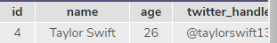
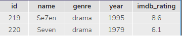
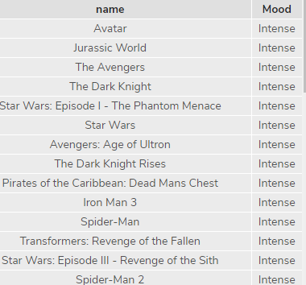

# 2019-01-29

## Codecademy (SQL)

- Codecademy에서 SQL 수업 3개 있는데 그거 하면 된다. (SQLite을 사용한다)

> Alter

- 열을 추가해준다.

```sql
ALTER TABLE celebs ADD COLUMN twitter_handle TEXT;
```

- 이렇게 하면 기존의 행과 열에다가 `twitter_handle` 열을 추가해 주었다.

> DELETE

- 해당 행을 삭제한다.

  

  이런 친구가 아래의 문장을 거치게 되면

```SQL
DELETE FROM celebs WHERE twitter_handle IS NULL;
SELECT * FROM celebs;
```

​	

​	이런애가 남는다.

> AS

- 해당 열의 이름을 바꿔주는 친구이다.


member라는 테이블을 가진 친구가 있고 아래 문장을 거치면

```sql
SELECT user_id as uid, user_pwd as pwd from member;
```


- 이렇게 바뀐다. 근데 얘 원본을 건드는 것이 아니고 임시로 바꾸는 애이다.

> DISTINCT

```sql
SELECT DISTINCT column1, column2, ...
FROM table_name;
```

- 중복된 값은 없애고 출력해주는 친구 (Python의 SET과 비슷하다)

> Like

- 중간에 빈 값, 어림 짐작하는 값을 데리고 올 때 쓰는 친구

  ```sql
  SELECT *
  FROM movies
  WHERE name LIKE 'Se_en'
  ```

  

- 첫글자만 안다면?

  ```SQL
  SELECT *
  FROM movies
  WHERE name LIKE 'A%';
  ```

- man이 들어가는 영화만 찾고 싶다면?

  ```sql
  SELECT *
  FROM movies
  WHERE name LIKE '%man%'
  ```

> Between

- 내가 지정한 사이 값 다 들고온다.

  ```sql
  SELECT *
  FROM movies
  WHERE year BETWEEN 1990 AND 1999;
  ```

  1990부터 1999를 포함한 영화를 데리고 온다. (숫자일 경우)

  ```SQL
  SELECT *
  FROM movies
  WHERE name BETWEEN 'D' AND 'G';
  ```

  'G'를 제외한 'D','E','F'를 가지고 온다. (문자일 경우)

> ORDER BY

- DESC, ASC (내림차순, 오름차순)으로 정렬시켜준다.

  ```SQL
  SELECT *
  FROM movies
  WHERE imdb_rating > 8
  ORDER BY year DESC;
  ```

> LIMIT

- 자기가 원하는 갯수의 결과만 보여준다.

  ```SQL
  SELECT *
  FROM movies
  ORDER BY imdb_rating DESC
  LIMIT 3;
  ```

  이러면 최고 점수의 TOP3만 보여준다.

> CASE

- IF문이랑 비슷하다고 생각하면 된다.

  ```sql
  SELECT name,
  CASE
  WHEN genre = 'romance' THEN
  'Chill'
  WHEN genre = 'comedy' THEN
  'Chill'
  ELSE 'Intense'
  END AS 'Mood'
  FROM movies;
  ```

  

> COUNT

- 내가 지정한 값의 갯수를 알려준다.

  ```sql
  SELECT COUNT(*)
  FROM fake_apps
  WHERE pirce=0.0;
  ```

  값이 0원인 친구들의 갯수를 알려준다.

> SUM

- 합을 알려줌

  ```sql
  SELECT SUM(downloads)
  FROM fake_apps;
  ```

> MAX, MIN

- 최대, 최소 알려준다.

> AVG

- 평균을 알려준다.

> ROUND

- 반올림 해주는 친구다.

  ```SQL
  SELECT ROUND(AVG(price),2)
  FROM fake_apps;
  ```

## SQL이랑 Python 같이 쓰기

- SQL을 콘솔에서만 쓰면 수정이 힘드니까 이것을 편하게 파이썬 코드로 만들어서 해결을 하려고 한다.

- c9.io에 `db.py`를 만들었다.

- python 내부에는 sqlite3를 다룰 수 있는 모듈이 내장되어 있다.

  `import sqlite3`

- 콘솔에서 우리가 `sqlite3 파일명.sqlite3`를 사용하여서 데이터베이스에 접속했다.

  그리고  `SELECT * FROM users`  이렇게 SQL 쿼리를 사용했다. 마지막으론 `.exit`으로 나왔고

  이 패턴을 코드로 만들어 보겠다.

> db.py

```python
import sqlite3

#sqlite3.connect('데이터베이스 파일명') #connect는 접근한다는 뜻임
db = sqlite3.connect('test.sqlite3')
cur = db.cursor() # cursor라는 뜻은 db의 상태를 알려주는 메소드, 즉 db 조작을 할 수 있는 커서를 만든 것이다.
#cur.execute('SQL query 문장') #여기서 SQL 명령을 한다.
cur.execute('SELECT * FROM users LIMIT 10')
data = cur.fetchall() #fetch라는 애는 가져옴이라는 뜻이다. 간단히 말하면 execute를 통해 받아온 데이터를 튜플형식으로 반환을 해주는 친구다.
# cur.fetchone()
print(data)
```

이 결과는 아래와 같을 것이다. 튜플안에 튜플

```python
# ((1,강동주,01012345678,서울),(2,한동훈,01011111111,창원))
```

한 줄 씩 뽑을거면 for문을 돌리면 된다.

> db.py

```python
import sqlite3

db = sqlite3.connect('test.sqlite3')
cur = db.cursor()
cur.execute('SELECT * FROM users LIMIT 10')
data = cur.fetchall()
for row in data:
    print(row)
```

> 결과

```python
('1', '정호', '유', '40', '전라북도', '016-7280-2855', '370')
('2', '경희', '이', '36', '경상남도', '011-9854-5133', '5900')
('3', '정자', '구', '37', '전라남도', '011-4177-8170', '3100')
('4', '미경', '장', '40', '충청남도', '011-9079-4419', '250000')
('5', '영환', '차', '30', '충청북도', '011-2921-4284', '220')
('6', '서준', '이', '26', '충청북도', '02-8601-7361', '530')
('7', '주원', '민', '18', '경기도', '011-2525-1976', '390')
('8', '예진', '김', '33', '충청북도', '010-5123-9107', '3700')
('9', '서현', '김', '23', '제주특별자치도', '016-6839-1106', '43000')
('10', '서윤', '오', '22', '충청남도', '011-9693-6452', '49000')
```

접속 = > 커서 만들고 => SQL 문을 주입하고 => SQL 주입한 것을 실행하고 반환 이 4가지 루트가 이루어 진 것이다 !

- 사용자로부터 요청을 받고나서 데이터를 주는 형태를 만들어보자

- 파이썬에서는 어떻게 할까?

  ```python
  import sqlite3
  
  word = input("검색할 성(씨)을 입력해 주세요 : ")
  
  db = sqlite3.connect('test.sqlite3')
  cur = db.cursor()
  cur.execute('SELECT * FROM users WHERE last_name == "{}" LIMIT 10' .format(word)) #얘는 따옴표 안에서도 연산자를 적용을 시킬 수 있다. 그리고 (=, ==, is) 다 똑같다.
  data = cur.fetchall()
  for row in data:
      print(row)
  ```

  ```python
  ('8', '예진', '김', '33', '충청북도', '010-5123-9107', '3700')
  ('9', '서현', '김', '23', '제주특별자치도', '016-6839-1106', '43000')
  ('11', '서영', '김', '15', '제주특별자치도', '016-3046-9822', '640000')
  ('14', '영일', '김', '35', '전라남도', '011-4448-6198', '720')
  ('16', '옥자', '김', '19', '경상남도', '011-1038-5964', '720')
  ('18', '광수', '김', '17', '충청북도', '016-4058-7601', '94000')
  ('19', '성민', '김', '26', '충청남도', '011-6897-4723', '6100')
  ('20', '정수', '김', '17', '경기도', '016-1159-3227', '590')
  ('23', '서준', '김', '26', '강원도', '02-4610-2333', '6900')
  ('32', '은주', '김', '38', '전라북도', '016-3075-6557', '950000')
  ```

- 여기까지 한 애를 search라는 함수로 다 묶자. (플라스크로 만들어 보자) 얘는 db에서 검색어를 받아 검색을 해주는 친구이다. (참고로 CRUD를 다 함수로 만들 것이다)

  ```python
  import sqlite3
  db = sqlite3.connect('test.sqlite3') #얘는 어찌됐건 한번만 접속하면 되니까 제일 위로 올렸다.
  word = input("검색할 성(씨)을 입력해 주세요 : ")
  
  def search(keyword):
      cur = db.cursor()
  	cur.execute('SELECT * FROM users WHERE last_name == "{}" LIMIT 10'.format(keyword))
  	data = cur.fetchall()
      return data
  
  result = search(word)
  
  for row in result:
      print(row)
  ```

  박씨가 몇 명인지 알고 싶다면?

  ```python
  import sqlite3
  db = sqlite3.connect('test.sqlite3') #얘는 어찌됐건 한번만 접속하면 되니까 제일 위로 올렸다.
  word = input("검색할 성(씨)을 입력해 주세요 : ")
  
  def search(keyword):
      cur = db.cursor()
  	cur.execute('SELECT COUNT(*) FROM users WHERE last_name == "{}" LIMIT 10'.format(keyword))
  	data = cur.fetchall()
      return data
  
  print(search(word))
  ```

  그렇다면 박씨 성을 가진 사람의 수와 명단을 뽑아보자 즉, 2개

  ```python
  import sqlite3
  db = sqlite3.connect('test.sqlite3')
  word = input("검색할 성(씨)을 입력해 주세요 : ")
  
  def search(keyword):
      cur = db.cursor()
      cur.execute('SELECT * FROM users WHERE last_name == "{}" LIMIT 10'.format(keyword))
      data = cur.fetchall()
      cur.execute('SELECT COUNT(*) FROM users WHERE last_name == "{}" LIMIT 10'.format(keyword))
      total = cur.fetchone()
      return data,word,total[0]
  
  data,word,total=search(word)
  print("{}씨 성을 가진 사람은 {}명입니다.".format(word, total), "명단은 다음과 같습니다.")
  for i in data:
      print(i)
  ```

  **fetchone() **을 하면 0번째 인덱스 하나만 나오고, **fetchall()** 하면 다 나옴

## 오후

- 여기까지 sql 따로 python 따로 하다보니까 머리가 너무 복잡하다. 그래서 우리는 하나로 python으로 통합을 해서 사용해 볼 것이다.

- 데이터를 관리하는 많은 버전이 있다.

  - CSV, Nested-list Version

    ```python
    #csv version
    [
        ['id','name','phone','address'],
        [1,'강동주','01012345678','서울'],
        [2,'김지수','01011111111','대구']
    ]
    ```

  - dictionary Version, json

    ```python
    [
        {'id':1,'name':'강동주','phone':'01012345678','address':'서울'},
        {'id':2,'name':'김지수','phone':'01011111111','address':'대구'}
    ]
    ```

  - object version (이렇게 object로 데이터베이스 구축하는 것이 Object-relational mapping, ORM 이다)

    ```python
    class student:
        def __init__(self, id_, name, phone, address):
            self.id_=id_
            self.name=name
            self.phone=phone
            self.address=address
    
    object1=student(1,'강동주','01012345678','서울')
    object2=student(2,'김지수','01011111111','대구')
    
    [
        object1,object2
    ]
    ```

    이걸 쓰게되면 코드 안에 sql 문장이 없어도 되고, 객체화 하여 사용하게 된다. 한 예로 sql 문장을 쓰지 않고 객체지향 프로그래밍 처럼 아래와 같이 간단하게 표현이 가능하다.

    ```python
    # Create
    Student.new()
    # Read
    Student.get()
    # Update
    Student.update()
    # Delete
    Student.destroy()
    ```

- 어제 했던 csv 파일을 활용하여 만든 `app.py`를 orm 방식으로 바꿔 볼 것이다. 구글에 SQLAlchemy라고 검색하면 두 번째에 예시가 있는데 `db=SQLAlchemy(app)`까지 그걸 복사해오자.

  > app.py

  ```python
  from flask import Flask, render_template, request
  from flask_sqlalchemy import SQLAlchemy #sql을 간단하게 쓸 수 있도록 연금술 부렸다. #근데 얘 쓰려면 설치해야한다. #아래에 있다.
  
  app = Flask(__name__)
  
  app.config['SQLALCHEMY_DATABASE_URI'] = 'sqlite:///test.db' #얘가 우리가 만든 database이다.
  app.config['SQLALCHEMY_TRACK_MODIFICATIONS'] = False
  
  db = SQLAlchemy(app)
  ```

  > workspace (sqlalchemy 다운)

  ```python
  $ sudo pip3 install flask-sqlalchemy
  ```

- 이어나가보자

  > app.py

  ```python
  from flask import Flask, render_template, request
  from flask_sqlalchemy import SQLAlchemy
  
  app = Flask(__name__)
  
  app.config['SQLALCHEMY_DATABASE_URI'] = 'sqlite:///test.db'
  app.config['SQLALCHEMY_TRACK_MODIFICATIONS'] = False
  db = SQLAlchemy(app)
  
  db.init_app(app) #SQLAlchemy가 가지고 있는 메소드 중 하나이다.
  
  class Quest(db.Model):
      __tablename__="questions"
      id = db.Column(db.Integer, primary_key=True)
      content = db.Column(db.String, nullable=False) #sql에서 Create_table했던것과 비슷하다. #nullable=False는 NOT NULL과 똑같은 친구
      
  db.create_all() #이러면 완성
  ```

- 그리고 이전에 했던 친구를 가져와서 안에다가 넣어보자

  ```python
  from flask import Flask, render_template, request
  from flask_sqlalchemy import SQLAlchemy
  
  app = Flask(__name__)
  
  app.config['SQLALCHEMY_DATABASE_URI'] = 'sqlite:///test.db'
  app.config['SQLALCHEMY_TRACK_MODIFICATIONS'] = False
  db = SQLAlchemy(app)
  
  db.init_app(app)
  
  class Quest(db.Model):
      __tablename__="questions"
      id = db.Column(db.Integer, primary_key=True)
      content = db.Column(db.String, nullable=False)
      
  db.create_all()
  
  @app.route('/')
  def index():
      return render_template('index.html')
  
  @app.route('/ask')
  def ask():
      return render_template('ask.html')
  ```

  어제는 csv에다가 저장했는데 이제는 orm에 저장 할 것이다.

  ```python
  from flask import Flask, render_template, request
  from flask_sqlalchemy import SQLAlchemy
  
  app = Flask(__name__)
  
  app.config['SQLALCHEMY_DATABASE_URI'] = 'sqlite:///test.db'
  app.config['SQLALCHEMY_TRACK_MODIFICATIONS'] = False
  db = SQLAlchemy(app)
  
  db.init_app(app)
  
  class Quest(db.Model):
      __tablename__="questions"
      id = db.Column(db.Integer, primary_key=True)
      content = db.Column(db.String, nullable=False)
      
  db.create_all()
  
  @app.route('/')
  def index():
      return render_template('index.html')
  
  @app.route('/ask')
  def ask():
      #데이터베이스에 저장
      q = request.args.get('question')
      #INSERT INTO questions (id, content) VALUES (1, 사용자가 입력한 값)
      #ORM을 통해 DB에 데이터를 저장하는 방법
      quest = Quest(content = q)
      db.session.add(quest)
      db.session.commit() #모든 ORM 마지막엔 commit으로 끝난다.
      return render_template('ask.html')
  ```

  근데 저장을 했는데 어디다가 저장했는지 모르는데 이걸 불러와보도록 하자

  ```python
  from flask import Flask, render_template, request
  from flask_sqlalchemy import SQLAlchemy
  
  app = Flask(__name__)
  
  app.config['SQLALCHEMY_DATABASE_URI'] = 'sqlite:///test.db'
  app.config['SQLALCHEMY_TRACK_MODIFICATIONS'] = False
  db = SQLAlchemy(app)
  
  db.init_app(app)
  
  class Quest(db.Model):
      __tablename__="questions"
      id = db.Column(db.Integer, primary_key=True)
      content = db.Column(db.String, nullable=False)
      
  db.create_all()
  
  @app.route('/')
  def index():
      # db에 저장된 모든 질문들을 불러온다.
      quests = Quest.query.all()
      # 얘들은 객체라서 인스턴스 변수를 부르려면 이렇게 하면 된다.
     	# content_ = quest[0].content
      return render_template('index.html', quests=quests)
  
  @app.route('/ask')
  def ask():
      q = request.args.get('question')
      quest = Quest(content = q)
      db.session.add(quest)
      db.session.commit()
      return render_template('ask.html')
  ```

  quests를 index.html에서 쓸 수 있도록 parameter로 담았다.

  > index.html

  ```html
  <!DOCTYPE html>
  <html lang="en">
  <head>
      <meta charset="UTF-8">
      <meta name="viewport" content="width=device-width, initial-scale=1.0">
      <meta http-equiv="X-UA-Compatible" content="ie=edge">
      <title>Document</title>
  </head>
  <body>
      <h1>익명 질문 앱</h1>
      <p>익명으로 질문하세요.</p>
      <form action='/ask'>
          <input type="text" name="question"/>
          <input type="submit" value="Submit"/>
      </form>
      <!--quests(리스트) 안에 담긴 모든 질문 객체들을 보여준다.-->
      
      <p>
          {{q.id}} : {{q.content}}
      </p>
      
  </body>
  </html>
  ```

  근데 질문하고 다시 홈페이지로 돌아가기엔 너무 귀찮다. 그래서 flask의 redirect를 사용 할 것이다.

  ```python
  from flask import Flask, render_template, request, redirect
  ...
  ...
  @app.route('/ask')
  def ask():
      q = request.args.get('question')
      quest = Quest(content = q)
      db.session.add(quest)
      db.session.commit()
      return redirect('/')
  ```

  이렇게하면 입력하면 바로 밑에 내가 쓴 것이 바로 업로딩 된다.

  우리가 여기까지 C,R을 해봤는데 이제는 본 게임인 U,D를 해볼 것이다.

## UPDATE, DELETE

- 게시글 옆에 삭제라는 버튼을 만들어서 버튼을 누르면 삭제가 되도록 만들 것이다.

  > index.html

  ```html
  <body>
      <h1>익명 질문 앱</h1>
      <p>익명으로 질문하세요.</p>
      <form action='/ask'>
          <input type="text" name="question"/>
          <input type="submit" value="Submit"/>
      </form>
      <!--quests(리스트) 안에 담긴 모든 질문 객체들을 보여준다.-->
      
      <p>
          {{q.id}} : {{q.content}}
      </p>
      <a href="#">[삭제]</a>
      
  </body>
  ```

  이러면 삭제 버튼이 p태그 아래에 있으니 안에 집어넣자

  > index.html

  ```html
  <body>
      <h1>익명 질문 앱</h1>
      <p>익명으로 질문하세요.</p>
      <form action='/ask'>
          <input type="text" name="question"/>
          <input type="submit" value="Submit"/>
      </form>
      <!--quests(리스트) 안에 담긴 모든 질문 객체들을 보여준다.-->
      
      <p>
          {{q.id}} : {{q.content}}<a href="#">[삭제]</a>
      </p>
      
  </body>
  ```

  자 그렇다면 삭제 버튼을 누르는 순간 db에서 1번 id를 삭제를 할 것이다. `DELETE FROM TABLE WHERE id =1;`으로 했었던 거처럼 삭제 버튼 누르면 하나의 URL로 넘어가도록 할 것이다. 따라서 app.py에서 코드를 추가할 것이다.

  > index.html

  ```html
  <body>
      <h1>익명 질문 앱</h1>
      <p>익명으로 질문하세요.</p>
      <form action='/ask'>
          <input type="text" name="question"/>
          <input type="submit" value="Submit"/>
      </form>
      
      <p> <!--동적 변화를 주기위해서 삭제 하나하나 마다 다른 url로 보낼 것이다.-->
          {{q.id}} : {{q.content}}<a href="/delete/{{q.id}}">[삭제]</a>
      </p>
      
  </body>
  ```

  이렇게 하면 아래와 같이 어느 URL로 갈지 정해졌다.

  

  이제 그 URL로 보냈을 때 어떻게 삭제를 할 건지 정해주면 된다.

  > app.py

  ```python
  @app.route('/delete/<int:id>') #어떤 삭제 버튼을 누르는 지에 따라서 동적으로 링크를 바꿔 줄 것이다.
  def delete(id):
      #특정 데이터 레코드를 지워준다.
      #sql 구문에서는 DELETE FROM questions WHERE id == <숫자>; 
      #Quest.query.get(Primary key)
      #Quest.query.filter_by(id=id).first()와 같다.
      q = Quest.query.get(id) #찾은 id의 객체를 q에다가 담았다.
      db.session.delete(q) #db에게 q에 담긴 친구를 삭제 해달라고 한 것이다.
      db.session.commit() #항상 마무리는 commit()
      #근데 얘도 크게 쓸모있는 페이지가 아니기 때문에 다시 '/'로 보냈다.
      return redirect('/')
  ```

  이까지 하면 글을 작성하고 삭제도 가능하다.

## ORM

- sql로 작성해야하는 복잡한 코드 대신 python 코드로 간단하게 표현을 할 수 있게 만드는 것이 ORM이다.
- 슬라이드를 참고하여서 공부합시다~


### 질문 !

import와 read는 뭘까여

이미 있는 database에다가 테이블을 추가할 때 쓴다.

1. import는 csv 파일을 테이블로 만들 때

2. Read는 sql파일 명령을 읽고 싶을 때 쓴다 !
