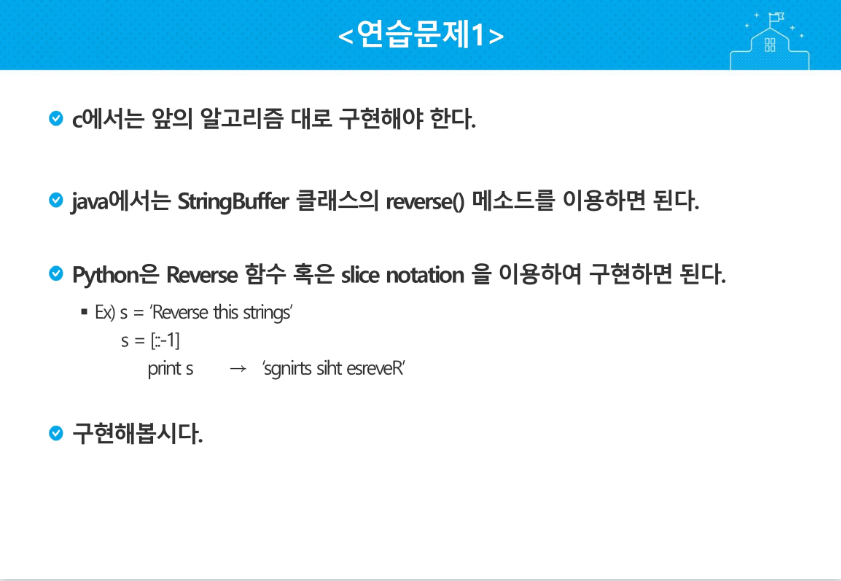
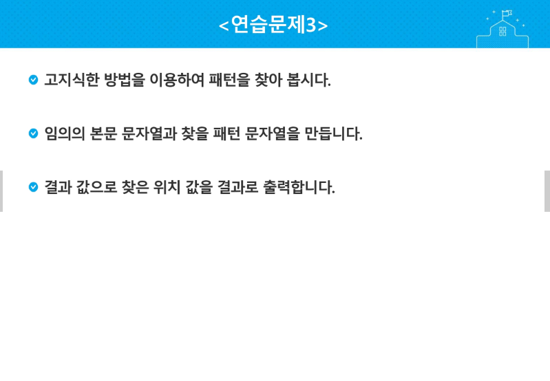

# 2019-01-30

## 저번 주 리뷰

### 색칠하기

1. 같은 색인 영역은 겹치지 않는다. 라고 문제에 명시되어서 쉬운 문제이다.
2. 전부 0으로 초기화 해놓고 해당하는 영역에 1로 정보를 기억하고 기존의 색깔이 있으면 누적을 해버리는 방법을 사용하면 된다.

### 부분 집합의 합

1. 반복문을 이용해서 풀 수 있다.
2. 선택 유무를 1,0으로 선택해서 부분집합으로 만들 수 있다. 선택해서 만든 정보가 바이너리 정보다.

### 이진 탐색

1. 선형 자료구조 안에 있는 원소들이 정렬되어 있어야 하고, START/END의 1/2 위치에서 비교해야한다. 그리고 그 값이랑 키 값이랑 비교하고 키 값이 더 큰 경우에는 (1/2+1) 위치를 START로 바꾸고 반복하면 된다. 반대의 경우에는 (1/2-1)이겠지?
2. 이런 식으로 나아가다가 START와 END가 엇갈리면 얘는 FAIL
3. 근데 얘는 문제 엄청 잘 읽어야하는게 위에대로만 풀다보면 틀릴 때가 있다. 이 문제가 그 문제임

### 특별한 정렬

1. 첫 번째 값을 maxIndex로 두고 나머지랑 전부 비교하고 큰 값의 인덱스를 교환하자.
2. 두 번째 값은 minIndex로 두고 나머지 애들이랑 전부 비교하고 작은 값의 인덱스와 교환하자.
3. 이 두개를 if 문으로 두고 하나는 maxIndex, 하나는 minIndex를 갱신하도록 만들면 된다.

### 금속 막대

1. 하나의 행렬에서 행이 나열된 다른 행렬의 열에 같은 값이 있다면 걔는 맨 앞에 못 온다. 만약 그게 없으면 맨 앞으로 올 수 있는 친구이다. 이 행렬을 나사의 암나사, 수나사라고 생각하면 된다.
2. 선생님은 이렇게 찾았다


## 문자열

- 컴퓨터는 문자를 비트로 저장한다. 근데 옛날에는 이런 비트로 저장한게 지역마다 달랐다. 나라마다 언어가 다르듯이 그래서 이 기준을 통일하기 위해서 ASCII라는 문자 인코딩 표준이 되었다.
- 확장아스키 코드가 있는데 얘는 특수문자, 도형 문자 등을 표현하려고 표준 아스키 7bit에서 8bit를 모두 사용하게 만들어 준거다. 근데 얘는 컴터랑 프린터가 호환이 되어야 해독이 가능하다.
- 근데 우리는 우리만의 한글 코드체계를 만들어 사용했다. 조합형, 완성형 두 종류를 가지고 있었다. 근데 이게 또 국가마다 통일이 또 안되니까 유니코드라고 표준을 또 만들었다.
- 근데 유니코드가 또오 두 가지로 나뉜다. 바이트 순서가 내림차순 오름차순으로 정렬되는 것에서 나뉜다. 이걸 또!! 통일 하기 위해서 유니코드 인코딩을 한다. 근데 이 것도 효율에 따라 나뉜다.
  - UTF-8 (in web)
  - UTF-16 (in windows, java)
  - UTF-32 (in unix)

- Python은 3버전은 UTF-8이고 생략가능, 2버전은 첫 줄에 명시해야함

- 여기까지 문자의 얘기고 문자열 얘기를 해보겠다. 문자열은 문자의 집합이다.

- 문자열의 길이에 따라서 길이가 변하는 가변길이가 있는데 여기서도 또 나뉜다

  - 마지막 널값을 기준으로 문자열을 만드는 것이 delimited (c 언어에서의 문자열)이다.
  - 마지막 널값 대신 문자의 갯수로 관리하는 것이 length controlled(java 언어에서의 문자열)이다.

- Python의 경우엔 어떨까?

  - char 타입 없고
  - 텍스트 데이터의 취급방법이 통일되어 있다. ('A' = "A")
  - 문자열의 연결(+) 반복(*)도 간단하게 가능하다. 
  - 문자열은 튜플과 같이 요소값을 변경 할 수 없다. (immutable) 바꾸지 말고 새로운 객체를 만들어야 한다.
  - 그래서 우리가 문자열을 리스트로 가져가서 수정하고 다시 문자열로 바꾸는 거임

- C와 JAVA의 string 처리의 기본적인 차이점

  

### 문자열 뒤집기

- 9개의 문자가 있으면 (9/2 = 4.5) 총 4회 반복한다.

- 파이썬에서는 어떻게 구현할까?

  ```python
  s = 'Reverse this strings'
  s = [::-1]
  or
  result = ''
  for i in range(len(s)-1,-1,-1):
      result+=s[i]
  ```



### 문자열 비교

- 각자 요소를 비교해야한다. 

- 파이썬에서는 어떻게 구현 할까?

  ```python
  a==b #간단
  ```

### 문자열 숫자를 정수로 변환하기

- 파이썬에서는 숫자와 문자변환 함수를 제공

  ```python
  int('123'), float('3.14'), str(123)
  ```

- ASCII코드로 구해보기

  문자열 '123'가 있다면 1의 ASCII코드와 0의 ASCII코드의 차이 (49-48)을하고 2를 할 땐  (50-48)을하고 앞에 수를 `*10`을 한다. 3을 할땐 51-48을 하고 앞에 수를 `*10`을 한다. 결국 `(((49-48)*10)+(50-48))*10+(51-48)`를 거치고 숫자 123이 나온다.

### 문자열 교체하기

- python에서는 새로운 객체를 만들어서 교체한다. c에서는 원본을 수정한다.

  123을 문자로 바꿀 땐 123%10--> 3이되고 그것을 ASCII '0' 값에 더해서 제일 앞에 가져와서 3이되고 123/10을 하고 12에서 %10-->2가 되어서 ASCII'0' 값에 2 더해서 '32' 을 만들고 이런식으로 '321' 만든다. 얘를 뒤집으면 문자열 '123'이 완성된다.

  ```python
  def itoa(x):
      sr=''
      while True:
          r = x%10
          sr = sr+chr(r+ord('0'))
          x//=10
          if == 0: break
     	s=''
      for i in range(len(sr)-1.-1,-1):
          s= s+sr[i]
   	return s
  print(itoa(1234))
  ```


```python
s = 1234
result = ''
real_result=''
i=1
while s != 0:
    result += chr(s%10+ord('0'))
    s=s//10
    i+=1
for i in range(len(result)-1,-1,-1):
    real_result+=result[i]
```

### 패턴매칭

- 문자열과 관련된 알고리즘은 대충 3가지가 있다. 문자열을 찾는 것(패턴매칭), 문자열 압축, 암호 이 중에서 가장 많이 연구되어있는 것이 패턴매칭이다.
- 고지식한 알고리즘(Brute Force)
  - `aaaabca`라는 문자에서 패턴 `abca`를 찾고 싶을 때 인덱스를 처음에 두고 패턴이 일치하는 지 확인하고 아니면 비교 시작 인덱스를 한 칸 늘리면서 반복하는 알고리즘이다.
  - 시간 복잡도는 O(MN)이다. 이걸 줄였으면 좋겠다



```python
a = 'This is a book'
b = 'is'
cnt = 0
for i in range(len(a)):
    for j in range(len(b)):
        if a[j+cnt]!=b[j]:
            cnt+=1
            break
    else:
        print(cnt)
        break
#내가 짠 것
#이 이후로는 수업에 있는 것
t = 'This is a book~!' #전체 텍스트
p = 'is' #찾을 패턴
N = len(t) # 전체 텍스트의 길이
M = len(p) # 찾을 패턴의 길이

def BruteForce(p, t):
    i = 0 # t의 인덱스
    j = 0 # p의 인덱스
    while j < M and i < N:
        if t[i] != p[j]
            i = i - j
            j = -1
     	i = i + 1
        j = j + 1
 	if j == M :
        return i - M # 검색 성공
    else:
        return -1 # 검색 실패
```

- 카프-라빈 알고리즘
  - 해쉬를 사용한다.
  - 중간에 있는 정보를 재 사용하는 것
  - O(M+N) 시간 복잡도인데 최악일 경우 O(MN)를 넘어간다.
- KMP 알고리즘
  - 본문과 패턴이 있다. 본문을 한 번 읽으면서 결과를 냈으면 좋겠다는 사람들이 고안한 알고리즘
  - abcd의 패턴엔 a,ab,abc,abcd가 있다. 또한 d, cd, bcd, abcd 
  - 시간 복잡도가 O(M+N)
  - 만약 abcdabcef라는 문자열과 찾으려는 패턴

- 보이어-무어 알고리즘
  - 맨 마지막 글자를 비교함
  - 만약 마지막 글자랑 패턴 내부의 글자랑 비교되면은 그 내부의 글자와 패턴의 글자와 맞춘다.
  - 빠른 편인데 최악의 경우 Brute Force와 같은 시간 복잡도를 가진다. 평균적으론 KMP 보다 빠르다.

