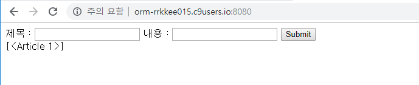
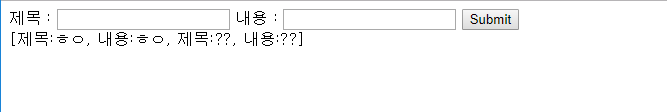

# Week9_Day5_2019-02-08

- Flask로 프로젝트를 하는 마지막 날

- ORM으로 CRUD하는 법 공부하고 프로젝트를 실시한다

## ORM

- c9.io에서 새로운 workspace를 만들었다.
- orm.py를 생성했다.

> 여기서 잠깐 우리가 했던 것을 종합해 보겠다.


- 3가지 저장 방법 (list, dict, object)로 articles를 만들어 보겠다.

> orm.py

```python
# articles(게시물)
# id, title, content, author (스키마)

# list / tuple #fetchall() 했을 때 리스트 안에 튜플이었다.
articles_list=[
    (1, '제목1', '내용1', '한동훈'),
    (2, '제목2', '내용2', '김소정')
]

#dict
articles_dict=[
    {"id":1,"title":"제목1","content":"내용1","author":"한동훈"},
    {"id":2,"title":"제목2","content":"내용2","author":"장준혁"}
]

#object
class Article:
    def __init__(self, id, title, content, author): #생성
        self.id=id
        self.title=title
        self.content=content
        self.author=author
    
articles_obj = [
	Article(1, '제목1', '내용1', '한동훈'),
    Article(2, '제목2', '내용2', '강성진')
]

# list/ tuple에서 내 이름을 뽑고 싶다면?
articles_list[1][3] #== 한동훈

# dict
articles_dict[1]['author'] #== 한동훈
articles_dict[1].get('author') #== 한동훈

#object
articles_obj[1].author #== 한동훈
```

- 클래스의 장점은 데이터를 저장하고, 심지어 **메소드**도 만들 수 있다 !!!!!

```python
class Article:
    def __init__(self, id, title, content, author): #생성
        self.id=id
        self.title=title
        self.content=content
        self.author=author

    def update(self, id, title, content, author): #수정
        self.id=id
        self.title=title
        self.content=content
        self.author=author
        
   	def delete(self): #삭제
		del self
    
    def __str__(self): #응용 출력
        return "이 글은 {}가 쓴 글입니다.".format(self.author)
    
    
articles_obj = [
	Article(1, '제목1', '내용1', '한동훈'),
    Article(2, '제목2', '내용2', '강성진')
]

hdh = articles_obj[1]
hdh.update(3, '제목3', '내용3', '후니') #수정
hdh.author #== 후니
hdh.delete()
print(hdh.__str__()) #== 이 글은 후니가 쓴 글입니다.
```

- zzu.li/flask-alchemy에서 코드를 복사해 오자 (ORM을 사용하기 위해서)

```python
from flask import Flask, render_template, request #얘는 익숙함
from flask_sqlalchemy import SQLAlchemy

app = Flask(__name__)

app.config['SQLALCHEMY_DATABASE_URI'] = 'sqlite:///blog.db #얜 뭐지? #뭔가 딕셔너리 형태인거 같네? #///뒤에 이름은 상관없음 #/// 세 개면 상대 경로 #//// 네 개면 절대 경로 #궁금하면 찍어보면 되는데 아래 블록 애들 설치 해줘야한다. #찍어보면 안에 딕셔너리 있음(귀찮) #그냥 flask 설정이 들어가 있다고 생각하면 된다.
app.config['SQLALCHEMY_TRACK_MODIFICATIONS'] = False #얘가 없으면 에러가 날 경우가 있다.

db = SQLAlchemy(app) #이 인스턴스로 만들었기 때문에 밑에 전부 db.으로 하는 것이다. (중요)
```

- 근데 flask 쓰기 위해서 flask 설치를 하자

```python
$ sudo pip3 install flask
$ sudo pip3 install flask-sqlalchemy #얘도 설치해야함
#Successfully installed flask-sqlalchemy SQLAlchemy 이 문장 뜨면 ok !
```

- 자 이제 URL을 만들어 봅시다. (c9에서)

> app.py

```python
@app.route('/')
def index():
    return render_template('index.html') #index.html 파일은 templates 폴더에 있어야 한다. (장고에서도 똑같다.)
```

> index.html

```html
<!DOCTYPE html>
<html lang="en">
<head>
    <meta charset="UTF-8">
    <meta name="viewport" content="width=device-width, initial-scale=1.0">
    <meta http-equiv="X-UA-Compatible" content="ie=edge">
    <title>Document</title>
</head>
<body>
    <form action="/create"> <!--form하고 tab하면 자동으로 완성됨-->
        제목 : <input type="text" name="title"/>
        내용 : <input type="text" name="content"/>
        <input type="submit" value="Submit"/>
    </form>
</body>
</html>
```

- create로 보내니까 create 요청 받을 수 있도록 만들자

> app.py

```python
@app.route('/create')
def create():
    """DB에 입력받은 제목과 내용을 저장한다."""
    #얘가 만약에 sqlite3로 했다면
    #db=sqlite3.connect('blog.sqlite3')
    #c.cursor() 등등 이렇게 했었는데 굳이 이럴 필요 없다.
```

- 근데 만드려고 보니까 테이블이 없네? 테이블을 만들어 주자

> app.py

```python
from flask import Flask, render_template, request
from flask_sqlalchemy import SQLAlchemy
...
...
db = SQLAlchemy(app)

db.init_app(app) #시작하자마자 db를 추가해주세요 라는 뜻

"""
CREATE TABLE articles(
    id INTEGER PRIMARY KEY AUTOINCREMENT,
    title TEXT NOT NULL,
    content TEXT NOT NULL,
);
"""
#이렇게 쓰기 싫엉
#python 코드로 만들어보자
class Article(db.Model):
    __tablename__="articles"
    id = db.Column(db.Integer, primary_key=True, autoincrement=True) #db에 칼럼이라는 클래스가 있다. 인자로 자료형을 넣으면 된다.
    title = db.Column(db.String, nullable=False)
    content = db.Column(db.String, nullable=False)

db.create_all() # 방금 내가 추가한 애들 다 만들어 달라는 뜻
```

- 자 다시 create로 보내니까 create에서 요청을 받을 수 있도록 만들자

> app.py

```python
@app.route('/create')
def create():
    """DB에 입력받은 제목과 내용을 저장한다."""
    title = request.args.get('title')
    content = request.args.get('content')
    """sqlite3 였다면
    db.sqlite3 이런식으로 했겠지? 이 방법을 버리자
    """
    # ORM 객체를 사용하여 새로운 Article 객체를 만들어 DB에 저장
    a = Article(title=title, content=content) #받아온 title을 클래스 title에 집어 넣는다.
   #Article(title=request.args.get('title'), content=request.args.get('content'))해도 된다.
    db.session.add(a) #방금 만든 객체를 db에 넣어달라는 뜻
    db.session.commit() #커밋해줘야함
    return redirect('/')
```

- 입력을 하고나서 저장이 잘 되었는지 확인을 해보자

> workspace

```
sqlite> SELECT * FROM articles;
1|ㅎㅇ|ㅎㅇ
```

- 첫 창에서 저장된 모든 것을 보여줄 수 있도록 index를 손 봐주자

> app.py

```python
@app.route('/')
def index():
    """원래라면 db 켜고 커서 만들고 select하고 했는데 한 줄로 표현 가능"""
    articles = Article.query.all()
    return render_template('index.html', articles=articles)
```

> index.html

```html
<body>
    <form action="/create"> <!--form하고 tab하면 자동으로 완성됨-->
        제목 : <input type="text" name="title"/>
        내용 : <input type="text" name="content"/>
        <input type="submit" value="Submit"/>
    </form>
    {{articles}}
</body>
```

- 근데 이렇게 하면 이상하게 출력되는데



- 안에 내용물을 끄집어 내보자 근데 그것을 메소드를 사용해서 해보자

> app.py

```python
class Article(db.Model):
    __tablename__="articles"
    id = db.Column(db.Integer, primary_key=True, autoincrement=True) #db에 칼럼이라는 클래스가 있다. 인자로 자료형을 넣으면 된다.
    title = db.Column(db.String, nullable=False)
    content = db.Column(db.String, nullable=False)
    
    def __repr__(self):
        return "제목:{}, 내용:{}".format(self.title, self.content)
        #여기서 안되면 blog.sqlite3 파일을 삭제하고 다시 해보자
        #for문을 안돌려도 된다. repr 대신 str을 쓰면 for문을 돌려야한다.
```



- 점심시간 전까지 삭제 수정을 추가해보자

> index.html

```html
<!DOCTYPE html>
<html lang="en">
<head>
    <meta charset="UTF-8">
    <meta name="viewport" content="width=device-width, initial-scale=1.0">
    <meta http-equiv="X-UA-Compatible" content="ie=edge">
    <title>Document</title>
</head>
<body>
    <form action="/create"> <!--form하고 tab하면 자동으로 완성됨-->
        제목 : <input type="text" name="title"/>
        내용 : <input type="text" name="content"/>
        <input type="submit" value="Submit"/>
    </form>
    
        <p>
            제목 : {{ a.title }}, 내용 : {{ a.content }}
            <a href="/delete/{{a.id}}">삭제</a>
            <a href="/edit_num/{{a.id}}">수정</a>
        </p>
    
</body>
</html>
```

> app.py

```python
from flask import Flask, render_template, request, redirect
from flask_sqlalchemy import SQLAlchemy

app = Flask(__name__)

app.config['SQLALCHEMY_DATABASE_URI'] = 'sqlite:///blog.sqlite3'
app.config['SQLALCHEMY_TRACK_MODIFICATIONS'] = False

db = SQLAlchemy(app) #이 인스턴스로 만들었기 때문에 밑에 전부 db.으로 하는 것이다. (중요)

db.init_app(app) #시작하자마자 db를 추가해주세요 라는 뜻

"""
CREATE TABLE articles(
    id INTEGER PRIMARY KEY AUTOINCREMENT,
    title TEXT NOT NULL,
    content TEXT NOT NULL,
);
"""
#이렇게 쓰기 싫엉
#python 코드로 만들어보자
class Article(db.Model):
    __tablename__="articles"
    id = db.Column(db.Integer, primary_key=True, autoincrement=True) #db에 칼럼이라는 클래스가 있다. 인자로 자료형을 넣으면 된다.
    title = db.Column(db.String, nullable=False)
    content = db.Column(db.String, nullable=False)
    
    def __repr__(self):
        return "제목:{}, 내용:{}".format(self.title, self.content)
        #여기서 안되면 blog.sqlite3 파일을 삭제하고 다시 해보자
        #for문을 안돌려도 된다. repr 대신 str을 쓰면 for문을 돌려야한다.
        
db.create_all() # 방금 내가 추가한 애들 다 만들어 달라는 뜻

@app.route('/')
def index():
    """원래라면 db 켜고 커서 만들고 select하고 했는데 한 줄로 표현 가능"""
    articles = Article.query.all()
    return render_template('index.html', articles=articles)
    
@app.route('/create')
def create():
    """DB에 입력받은 제목과 내용을 저장한다."""
    title = request.args.get('title')
    content = request.args.get('content')
    """sqlite3 였다면
    db.sqlite3 이런식으로 했겠지? 이 방법을 버리자
    """
    # ORM 객체를 사용하여 새로운 Article 객체를 만들어 DB에 저장
    a = Article(title=title, content=content) #받아온 title을 클래스 title에 집어 넣는다.
   #Article(title=request.args.get('title'), content=request.args.get('content'))해도 된다.
    db.session.add(a) #방금 만든 객체를 db에 넣어달라는 뜻
    db.session.commit() #커밋해줘야함
    return redirect('/')
    
@app.route('/delete/<int:article_id>')
def delete(article_id):
    #찾아서
    article = Article.query.get(article_id)
    #지운다
    db.session.delete(article)
    db.session.commit()
    return redirect('/')
    
@app.route('/edit_num/<int:article_id>')
def edit_num(article_id):
    Article.query.filter_by(id=article_id)
    article=Article.query.get(article_id)
    return render_template('edit.html', article=article)

@app.route('/edit/<int:article_id>')
def edit(article_id):
    title=request.args.get('title')
    content=request.args.get('content')
    article = Article.query.get(article_id)
    article.title = title
    article.content = content
    db.session.commit()
    return redirect('/')
```

> edit.html

```html
<!DOCTYPE html>
<html lang="en">
<head>
    <meta charset="UTF-8">
    <meta name="viewport" content="width=device-width, initial-scale=1.0">
    <meta http-equiv="X-UA-Compatible" content="ie=edge">
    <title>Document</title>
</head>
<body>
    <form action="/edit/{{article.id}}"> <!--form하고 tab하면 자동으로 완성됨-->
        제목 : <input type="text" name="title" value="{{ article.title }}"/>
        내용 : <input type="text" name="content" value="{{ article.content }}"/>
        <input type="submit" value="Submit"/>
    </form>
</body>
</html>
```

## 오후에는 프로젝트

