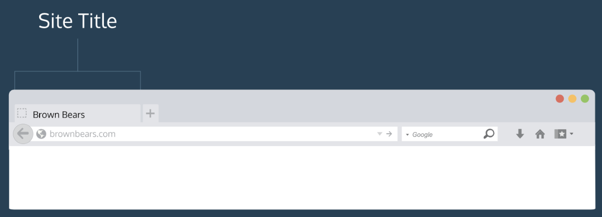
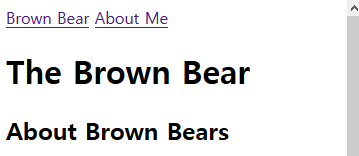

## HTML 2장

- **How to set up an HTML file**

```html
<!DOCTUPE html>
```

얘는 꼭 첫 번째 라인에 있어야한다. html로 선언이 되었기에 제일 최신 버전인 HTML5 로 인지되고 저장될 때 확장자 .html 로 저장된다. 그러니 꼭 처음에 서류를 작성할 때 위의 선언을 하도록 하자.

- **html tag**

```html
<!DOCTYPE html>
<html>
    
</html>
```

HTML 구조와 conten를 만들려면 html 태그를 넣어야한다. 저 사이에 들어가는 건 어떤 거든 html으로 번역된다. 얘 없으면 HTML 코드를 잘 읽지 못한다.

- **The Head**

head 기억하제? 웹페이지에 대한 metadata를 담고 있는 애가 head element이다. metadata는 직접적으로 보여지지 않는 페이지에 대한 정보인데 body라는 다르게 메타데이터는 페이지 그 자체의 정보를 가지고 있다. opening closing tag를 쓰고, HTML tag 이후에 쓴다.

```html
<head>
    
</head>
```

- **Page Title**

head element가 어떤 metadata를 담을 수 있을까? title tag를 통해서 웹페이지의 title을 설정할 수 있다. title 태그는 항상 head 안에 와야한다.

```html
<!DOCTYPE html>
<html>
    <head>
        <head>
            My Coding Journal
        </head>
    </head>
</html>
```

HTML 코드를 소유한 파일을 열고 싶으면 My Coding Journal을 보면된다 (단, 탭 타이틀 안에서만)

- **근데 어디에 Title이 나타나요?**

Codecademy에서는 title 안보여줌, 아마 다른 곳에서는 보여 줄거야!


- **링크 넣기**

anchor element를 추가하면 link를 넣을 수 있다.

```html
<a>This Is A Link To Wikipedia</a>
```

opening과 closing tags 사이에 text를 집어 넣을 수 있다. 근데 위에 아직 완성된거 아니다. 어떻게 URL을 집어넣을 수 있을까? href를 쓰면된다.

```html
<a href="https://www.wikipedia.org/">This Is A Link To Wikipedia</a>
```


- **새로운 창 안에 링크 넣기**

target attribute는 어떻게 링크를 오픈하는지 명시해준다. 긍까, 어떤 유저들이 링크 들어갔다가 너의 웹페이저에 돌아오고 싶을 때 target atrribut를 쓰면 매우 효과적이다.

```html
<a href="http://www.wikipedia.org/wiki/Brown_bear" target="_balnk">The Brown Bear</a>
```

위에 보다시피 저렇게 하면은 새로운 창에서 링크가 뜬다. 최신 브라우저에서 링크타고 들어가면 새로운 창 뜨면서 하는거랑 똑같다.


- **관계된 페이지와 연결시키기**

많은 사이트가 사이트 내부에서 링크를 띄우는데, 우리도 해보자. 멀티 페이지 웹사이트를 만들 때 웹 개발자는 html 파일을 root directory에 저장하거나 메인 폴더에 저장한다. 사이즈가 점점 커지기 때문에 추가 폴더를 메인 프로젝트 폴더 안에 코드로 사용할 수 있다.

```html
project-folder/
|-- about.html
|-- contact.html
|-- index.html
```

위에 예시에서 볼 수 있듯이 폴더 안에 3가지의 html 파일이 들어있다.

HTML 파일들은 같은 폴더에 종종 저장이 된다. 위에 예시 보다시피. 만약 브라우저가 index.html을 알고 있으면 같은 폴더 안에 있는 다른 html도 알 수 있다. 왜냐면, 전부 같은 폴더에 저장이 되어있으니까

```html
<a href="./contact.html">Contact</a>
```

위에 예시에서보면 contact.html 파일을 불러오고 Contact라는 표시가 웹 상에 뜰 것이다. 아마 path가 뜰 건데 ./index.html이 path로 뜰거다. 

```html
<body>
  <a href="./index.html">Brown Bear</a> ==> 얘가 추가된 애임
  <a href="./aboutme.html">About Me</a> ==> 얘가 추가된 애임
  <h1>The Brown Bear</h1>
  <div id="introduction">
    <h2>About Brown Bears</h2>
```

결과로 이런 창이 뜰거다.



- 

