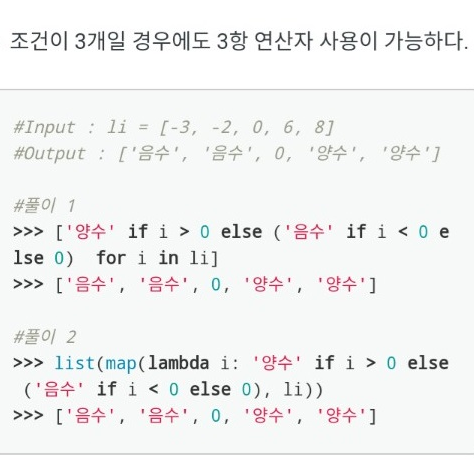

## 파이썬

-  a=[1,2,3,4,5 ....]

  이처럼 끝을 알기 어려운 리스트가 있다면 a[-1]이 마지막 인덱스이다.

- a=[1,2,3,4,5,6]

  for i in a:

  ​	print(i)

  위에를 출력하면

  1

  2

  3

  4

  5

  6

  이렇게 나오는데

  for i in a:

  ​	print(i,end='') # end =''를 추가하면

  123456 이렇게 한 줄로 출력된다

- reverse() 얘 reverse 한 값을 주는게 아니라 그냥 바꿔주는 애다. x.reverse() 하더라도 출력 해주는 값은 없다. 그걸 주의하도록

```python
x=[1,2,3,4]
y=x
z=x.reverse()

x=[4,3,2,1]
y=[4,3,2,1]
z=None
```

- 10진수를 2진수로 바꿀 떈 10진수를 2를 나눈 몫과 나머지를 주의하면 되고 1을 2로 나눈 몫은 0이 되니까 그걸 주의해서 풀면 쉬운문제다. 밑에 예제는 reverse()의 예제도 되니까 주의 깊게 보도록

```python
a=int(input("10진수:"))
b=[]
while a !=0:
    b.append(a%2)
    a=a//2
b.reverse() #만약 z=b.reverse()로 z에 값을 넣었다면 z는 None이 되어서 for문을 돌릴 수 없었을 것이다.
for i in b:
    print(i,end="")
```

- 우측정렬할 때 {:>} 하면되고 5자리의 값에 우측정렬 하려면 {:>5}로 하면 된다.
- while과 if 문은 조건문이 참이면 실행하는 구조이다. (이거 많이 헷갈림)
- str 뒤집는 방법

```python
x='a string'
print(x[::-1]) # ::(숫자) 숫자만큼 징검다리로 뽑아내겠다는 뜻

####결과값####
gnirts a
```

- 한꺼번에 많은 input 받는 법

```python
a,b,c,d = input().split(" ")
print(a)
print(b)
print(c)
print(d)

#입력값:이순신 가위 원빈 바위
#결과값
이순신
가위
원빈
바위
```

- set 함수

```python
# set 함수는 중복된 리스트 밸류를 솎아내주고 set 타입으로 변경시키는 애이다.
# set 함수를 적용하면 list에 정수형만 있으면 알아서 오름차순으로 바꿔준다.
# 정수형이랑 문자형이 섞여져있으면 정수형은 순서대로 바꿔주지만 문자형은 순서대로 바꿔주지 않는다.
# set 적용 후 다시 list 형식으로 바꿔주고 싶다면 list(set())을 써주면 된다.

lis=[1,2,3,2,4,1,2,3,1]
print(set(lis))
type(set(lis))
#결과값
{1,2,3,4}
<class 'set>'
```

- ### 리스트 안에 있는 문자열애들을 정수로 바꾸는 법 !

map(function, iterable)은 함수(function)와 반복 가능한(iterable) 자료형을 입력으로 받는다. map은 입력받은 자료형의 각 요소가 함수(function)에 의해 수행 된 결과를 묶어서 리턴하는 함수이다.

```python
number = ['1','2','3','4','3','2','1']
result = list(map(int, number)) # 파이썬 3 이상부턴 map의 결과를 list로 바꿔야한다.
print(result)

# 결과
[1,2,3,4,3,2,1]

def two_times(x):
    return x*2

list(map(two_times,[1,2,3,4]))

#결과
[2,4,6,8]

#만약에 map 함수에서 함수를 사용하고 싶으면 lambda를 이용한다.
total = sum(list(map(lambda a: a**2, list (range(1,101)))))
#리스트 객체 전체에 제곱을 각자 시키기
```

- input 한꺼번에 받는법

```python
a,b = input().split(' ') # 이까지 하면 a, b가 각각 문자열로 나온다.
a,b = [int(a),int(b)] # 이러면 a,b 가 정수형으로 뽑힌다.
c = [int(a),int(b)]
print(a)
print(b)
print(c)
print(type(c))

#결과값
2
3
[2,3]
<class list>

#그렇다면 3개도 될까? 된다 !
a,b,c = input().split(' ')
a,b,c=[int(a),int(b),int(c)]
print(a)
print(b)
print(c)
```

- list의 위치와 값을 동시에 뽑는 법

```python
data = [1,2,3]
for i in enumerate(data):
    print("data[{}] : {}".format(*i)) #*i는 i의 값 2개를 순서대로 {} 집어넣는거
    
#결과 값
data[0] : 1
data[1] : 2
data[2] : 3
    
names = ["철수","영희","동훈"]
for i,name in enumerate(names):
    print("{}번 : {}".format(i+1,name))
```

- **lambda 함수로 다중 if문 작성하는 법**

```python
a=list(map(lambda x: '4' if x=='A' else ('3' if x=='B' else ('2' if x=='C' else '1' if x=='D' else 0)), lis))
```



- 사용자의 입력이 숫자인지 문자인지 확인이 가능한가?


- isdigit은 숫자 문자인지 검사하는 함수이다. 숫자 문자의 경우 True를 반환하고 문자열이 입력된 경우 False를 반환한다.

- 각각 떨어져있는 리스트 내부의 문자열을 하나로 합치는 법

```python
sen =['P','y','t','h','o','n']
result = [''.join(sen[:])]
print(result[0])

#결과
Python

items = ['a','b','c','d','e','f','g','h']
items[3:6] = [''.join(items[3:6])]
items = ['a','b','c','def','g','h']
result = [''.join(items[3:6])]
result = ['def']
```

- **파이썬 리스트 인덱스 삭제하면 변화하는 리스트 어떻게 해결하나요?**

```python
result = [[3,6,9],[2,6,9]]
for i in result:
    for j in i:
        if j%3==0:
            i.remove(j)
print(result)
[[6], [2, 9]] #3이 삭제가 되면서 인덱스가 밀리니까 이 전에 두 번째인 6이 삭제 안되고 이 후의 두 번째인 9가 삭제되었다.

result = [[3,6,9],[2,6,9]]
for i in result:
    for j in i[:]: #i의 복사본을 두자 !
        if j%3==0:
            i.remove(j)
print(result)
[[],[2]]
```

- **리스트 내포로 인풋 여러개 받는 방법(되게 간단)**

```python
lis = [int(input('')) for a in range(1,6)]
print("입력된 값은 {}입니다.".format(lis))
#입력 값
10
10
20
30
40
#출력 값
입력된 값은 [10, 10, 20, 30, 40]입니다.
```

- 리스트 내부에 있는 인덱스 혹은 값 없애기, 추가하기, 인덱스 위치 알기

```python
lis = [1,2,3]
#인덱스로 골라서 없애기
del lis[1] #인덱스로 접근하려면 []을 써야한다.

#값을 골라서 없애기
lis.remove(2) #값을 접근하려면 ()

print(lis)
#결과
lis =[1,3]

#추가하기
lis.append(4) 혹은
lis = lis + [4] #리스트에 리스트를 더해서 연결해주었다.

#인덱스 위치 알아내기
lis.index(2)
#결과
1
```

- 리스트에 값이 있는지 없는지 확인하는 코드

```python
list1 = [1,2,3,4,5,6,9,12]
n = 12
if n in list1: #list1에 12가 있으면 print문이 실행됩니다.
    print("{}가 리스트에 있다.".format(n))
```

- 모듈 쓰기

```python
import math # math 모듈을 사용해줘야한다.
print("파이의 값은 {}입니다.".format(math.pi)) #모듈이름.모듈안의 구성요소

import datetime #날짜모듈
print(datetime.date.today()) #오늘 날짜 나옴 2019-01-03
datetime.datetime.now() #이렇게 하면 현재 년도 날짜 시간 다나온다.
#근데 datetime.datetime은 귀찮으니까 import 할때 from datetime import datetime as dt를 하면 dt.now()로 축약이 가능하다. 여기서 dt.now().month를 하면 월이 나오고 dt.now().day를 하면 일이 나온다.

import random
list1=[1,2,3,4,5]
random.choice(list1) # 리스트 중 하나 뽑는 것

number = random.randint(2,5) # 2<=number<=5 중에 하나 뽑는거

random.shuffle(list1) #list1의 배열을 무작위로 섞는 것
```

- dictionary 수정하는 법, **update() 유용한 함수**

```python
dict = {"1월":31,"2월":28,"3월":31}
dict["2월"]=29 #값 수정
dict["4월"]=31 #값 추가

del dict["1월"] #값 삭제 혹은
del(dict["1월"]) #둘 다 됨
dict.pop("1월") #얘도 되고

dict.clear() # 딕셔너리의 내용을 전부 삭제

products = {"풀":800, "딱풀":1200, "색종이":1000,"색연필":5000,"스케치북":3500}
catalog = {"겨울용 실내화":12000, "잠자리채":8000, "딱풀":1400}
#products가 catalog의 정보를 반영하고 싶다면? update 함수를 쓴다.
products.update(catalog)
print(products)
#결과
{'풀': 800, '딱풀': 1400, '색종이': 1000, '색연필': 5000, '스케치북': 3500, '겨울용 실내화': 12000, '잠자리채': 8000}
```

- 튜플

```python
tuple1 = (1,2,3)
tuple2 = 1,2,3
list1 = [1,2,3]
tuple3 = tuple(list1)
#위에 트리오 다 똑같이 튜플이다.

ages = {'Tod':35,'Jane':23,'Paul':62}
for a in ages.items(): #items()를 통해서 딕셔너리의 값을 튜플로 받아온다.
    print('{}의 나이는:{}'.format(ages[0],ages[1]))
#혹은
for a in ages.items():
    print('{}의 나이는:{}'.format(*ages)) #둘 다 같다.
```

- break와 continue

```python
#break는 반복문을 종료시키는 기능을 가지고 있다.
list = [1, 2, 3, 5, 7, 2, 5, 237, 55]
for val in list:
    if val % 3 ==0:
        print(val)
        break
#3의 배수 하나만 찾고 끝

#continue는 반복문의 나머지 부분을 보지 않고, 반복문의 처음으로 돌아가는 기능이다.
for i in range(10):
    if i % 2 ==0:
        continue
    print(i)
#홀수만 찾는 코드
```

- try except

```python
try:
    a = 3/0 #에러가 발생할 가능성이 있는 코드
except Exception: #에러 종류
    print("에러입니다.") #에러가 발생 했을 경우 처리할 코드
    
#근데 예외 이름을 모를 땐 어떻게 해?
try:
    a = 5
    b = 0
    c = a/b
except Exception as ex: #ex가 에러 종류를 담아주었다. as를 통해서 굳이 Exception as ex가 필요 없지만 없으면 어떤 에러인지 파악하기가 어렵다. Index에러인지, Value에러인지 모름
    print("{} 에러입니다.".format(ex)) #ex는 발생한 에러의 이름을 받아오는 변수
    
#중첩 반복에서 for문을 아예 중단시키고 싶을 경우에 에러를 일부러 발생하기도 한다.
shops = {
    "송일문방구": {"가위": 500, "크레파스": 3000},
    "알파문구": {"풀": 800, "도화지": 300, "A4용지": 8000},
    "다이소": {"풀": 500, "목공본드": 2000, "화분": 3000}
}
try:
    for shop, products in shops.items():
        for product, price in products.items():
            if product =='풀':
                print("{}: {}원".format(shop, price))
                raise StopIteration #raise 에러종류를 해준다.
except StopIteration: #except 에러종류를 해준다.
    print("에러입니다.")
    
#결과
알파문구: 800원
에러입니다.

#만약 에러를 일으키지 않고 break를 쓴다면?
for shop, products in shops.items():
    for product, price in products.items():
       if product =='풀':
            print("{}: {}원".format(shop, price))
            break
#결과
알파문구: 800원
다이소: 500원
#이렇게 해버리면 break 내의 for문은 중단되더라도 그보다 더 상위의 break는 종료되지 않는다.
```

- bool값과 논리연산

`or`연산의 결과는 앞의 값이 True이면 앞의 값을, 앞의 값이 False이면 뒤의 값을 따른다.

```python
a = True or 1 #True 앞의 값이 True니까 앞의 값을 가져온다.
b = False or 0 #0   앞의 값이 False니까 뒤에 값을 가져온다.
c = 0 or False #False 앞의 값이 0 이니까 뒤에 값을 가져온다.
d = 1 or False #1   앞의 값이 True라서 앞의 값을 가져온다.
```

- list의 다양한 기능들

```python
#list에서 값을 이용해서 위치를 찾고 싶을 땐 index()을 이용하자
list1=[135, 462, 27, 2753, 234]
print(list1.index(27))
#index()에서 에러가 발생하지 않도록 처리하려면 value가 my_list안에 있는지 미리 확인하거나, try/except문을 활용하자.

#원하는 위치에 값을 추가하는 법
#list.insert(index,value)
list = [1,2,3]
list.insert(3,4) #list = [1,2,3,4]

#값을 순서대로 정렬
list = [3,5,2,1,4]
list.sort() #list = [1,2,3,4,5]

#값을 역순으로 정렬
list =[1,2,3,4,5]
list.reverse() #list = [5,4,3,2,1]
```

- **str** : split과 join, str자르기

```python
str = "10:35:27"
lis = str.split(":") #문자열을 ":"기준으로 리스트화
new_str = ":".join(lis) #리스트를 ":"기준으로 문자열화

#또 다른 예
lis = ["오늘","날씨는","맑음"]
new_str = " ".join(lis)
print(new_str)
#결과
오늘 날씨는 맑음

>>>"hello"[1:5]
'ello'
>>>"hello"[1:3]
'el'
>>>"hello"[4:5]
'o'
>>>"hello"[4]
'o'
>>>"hello"[:4]
'hell'
>>>"hello".replace("o","s")
'hells'
>>>"hello"[4] = "s"
Error
```

- 기원센세의 마지막 가르침

```python
def leehyolee(sys):
    return str(sys == sys[::-1])

#이렇게하면 sys에 변수를 대입하면 자동으로 bool 형으로 True or False를 반환해주고 이 것은 bool 형식이라서 str 형으로 바꿔주면 굳이 if문 안써도 뿅 나옴

@app.route("/leehyolee/<sys>")
def leehyolee(sys):
    if sys == sys[::-1]: #[::-1] 문자열 뒤집기이다. 리스트도 뒤집어짐
        return "True"
    else:
        return "False"

#내가 했던 무식한 방법, 굳이 이렇게 어렵게 안해도 된다.

#삼항연산자로도 해결할 수 있다.
#참거짓 : 참일때 실행할 문장 : 거짓일때 실행할 문장
def leehyolee(sys):
    return "True" if sys == sys[::-1] else "False"
```

- **파이썬 입출력 속도 증가시키기**

  - Python에서 `import sys`를 하면 `input() `대신에 `sys.stdin.readline`을 사용할 수 있다. 만약 문자열을 저장하고 싶을 경우 `.rstruo()`을 추가로 해 주는 것이 좋다.
  - 또한 int 변환이나 split()을 그대로 할 수 있다.

  ```python
  int(sys.stdin.readlines()) #이라던가
  sys.stdin.readlines().split() #을 사용할 수 있다.
  
  #주로 input=sys.stdin.readline을 쓴다.
  
  #근데 문장이 기니까 input을 바꿔줘도 상관없다.
  input=sys.stdin.readlines #이렇게
  ```

  - sys.stdin과 sys.stdin.readlines()의 차이점

  ```python
  import sys
  
  for i in sys.stdin.readline():
      print(i)
  #입력 abc
  #출력
  a
  b
  c
  
  for i in sys.stdin:
      print(i)
  #입력 abc
  #출력
  abc #그리고 입력이 종료가 안됨 계속 반복함 도르마무
  
  #즉, 두개의 차이점은 sys.stdin.readline()은 문자 하나로 받아주고 sys.stdin은 한 줄이 아예 하나의 인덱스가 되어서 i가 그 하나의 인덱스를 출력해준다.
  ```


- **각 자릿 수 더하는 방법**

  - 어떤 수의 각 자릿수를 다 더하는 방법을 찾아보자

    ```python
    #10000의 자리일 때의 어떤 수 i일 때
    i//10000 + (i//1000)%10 + (i//100)%10 + (i//10) % 10 + i % 10
    
    #근데 이 수가 점점 올라간다면 골치가 많이 아프다. 따라서 이 방법이 있다.
    result = 0
    n=i
    while n !=0:
        result += n%10
        n = n//10
    print(result)
    
    #참고로 이렇게 해도 자릿수가 나온다.
    m=9876
    #1000의 자리
    int(m/1000)
    m=m//10
    #100의 자리
    int(m/100)
    ```

- **함수 에러**

  ```python
  x=10
  def func():
      x += 1
      print(x)
  func()
  #결과
  UnboundLocalError: local variable 'x' referenced before assignment
      
  #전역 변수를 지역 범위에서 사용하고 싶으면 global 표현을 사용해야한다.
  
  x=10
  def func():
      global x
      x += 1
      print(x)
  func()
  ```

- 쉽게 10진법에서 n진법으로 바꾸기

  ```python
  n='3212' #문자열이여야함
  base = 5 #5진수
  int(n,base)
  432
  ```

- if, elif

  ```python
  for i in range(1,10):
      if ---:
          ---
      if ---:
          --- #위의 if가 결과가 뭐든 간에 밑에 if도 같이 실행됨
  
          
  for i in range(1,10):
      if ---:
          ---
      elif ---:
          --- #위의 if가 결과가 True이면 elif는 실행안됨
  ```

- dictionary (key, value 추가하는 법)

  ```python
  dic = {'a':1}
  dic['b'] = 1 #key 값이 기존에 dic에 없어도 그냥 입벌리고 집어넣어버림
  dic = {'a':1,'b':1} #뿅
  ```

- **dictionary를 인자로 넘기는 방법**

  `**dict`를 통해 함수에 인자로 넘길 수 있다.

  ```python
  def d(a,b,c):
      return "{} {} {}".format(a,b,c)
  a = {'a':1,'b':2,'c':3}
  print(d(**a))
  #결과
  1 2 3 #값은 keys로 받지만 뱉는건 values 값을 뱉는 것을 유의하자.
  ```

- map, filter, reduce

  ```python
  #map
  result = list(map(lambda x:x**2, range(1, 11)))
  [1, 4, 9, 16, 25, 36, 49, 64 ,81, 100]
  #밑에 식과 같다.
  result = [(lambda x:x**2)(i) for i in range(1, 11)]
  ```

  ```python
  #filter
  result = [1, 4, 9, 16, 25, 36, 49, 64 ,81, 100]
  filter_result=list(filter(lambda x : x< 50, result))
  [1, 4, 9, 16, 25, 36, 49]
  ```

  ```python
  #reduce
  from functools import reduce #reduce는 이거 해줘야한다.
  reduce_result = reduce(lambda x,y: x+y,result)
  385
  
  reduce_result = reduce(lambda x,y: if x<y else y, result)
  1
  ```
