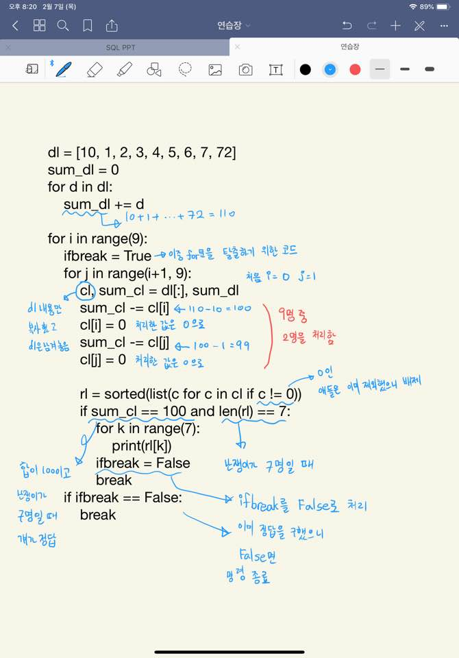

# 2019-02-07 목요일 스터디 정리

## 백준 - 2309 일곱 난쟁이

- 준혁이 형 코드 (**부분 집합 사용**)

```python
nums = [0] * 9
for i in range(9):
    nums[i] = int(input())
for i in range(1 << len(nums)):
    total = 0
    result = [0] * 7
    cnt = 0
    for j in range(len(nums)):
        if i & (1<<j):
            total += nums[j]
            if cnt<7:
                result[cnt] = nums[j]
            cnt += 1
    if cnt == 7 and total == 100:
        result.sort()
        for e in result:
            print(e)
        break
```

- 동훈이 코드 (**부분 집합 사용**)

```python
lis = [int(input()) for i in range(9)] # 9명 인풋 받는다.
def my_sum(lis): #7명 합 할 함수 만든다.
    result=0
    for i in lis:
        result+=i
    return result

def my_sorted(lis): #문제에서 정렬해서 출력하니까 버블정렬로 정렬함수를 만든다.
    for i in range(len(lis)-1,-1,-1):
        for j in range(0,i):
            if lis[j]>lis[j+1]:
                lis[j],lis[j+1]=lis[j+1],lis[j]
    return lis

for i in range(1<<len(lis)): #2**9의 탐색을 위해서 비트로 표현함
    result = [] #결과를 담을 result를 만들고
    for j in range(len(lis)): #비트 탐색 시작
        if i & 1<<j: #같아지면
            result += [lis[j]] #result 리스트에 그 난쟁이를 추가한다.
    if my_sum(result) == 100 and len(result) == 7: #result 리스트 내부에 애들의 키의 합이 100이 되고 결과값이 7명이 되면 그 놈이 정답
        result = my_sorted(result) #정렬하고
        for k in result:
            print(k) #출력한다.
```

- 혜희 코드 (**이중 for문 사용**)



## KMP (백준 1786 찾기 문제를 참고하였다.)

```python
# P='ABABBABABCABB'
# T='ABABC'
# P='ABCDABCDABDEABCDABD'
# T='ABCDABD'
# P='ABC ABCDAB ABCDABCDABDE'
# T='ABCDABD'
# P='CAAAABCBABC'
# T='AAAAAA'
# 위에는 직접만든 예제

P= input()
T= input()

#실패함수를 구하기위한 코드
result=[0]
i=0
j=0

for i in range(1,len(T)):
    j=result[i-1]
    while j>0 and T[i]!=T[j]: #j>0이 빠지면 무한루프된다.
        j=result[j-1]
    result.append(j+1 if T[i]==T[j] else j)
i=0
j=0
answer=0
answer_=''
# print(result) #실패함수가 제대로 짜졌는지 확인을 위한 result
######################################################################################

while i<len(P) and j<len(T): #완전탐색의 시작과 똑같다.
    if j>0 and P[i] != T[j]: #위에서 했던 실패함수 조작과 거의 유사하다.
        j = result[j-1]
    if(P[i]==T[j]): #만약 두 수가 같으면 처리하는 것이 위에랑 다르다.
        if j==len(T)-1:
            answer+=1
            answer_+= str(i-j+1) + ' ' #answer, answer_ 구하는 것은 내가 답을 찾기 위한건데 얘들이 없으면 순수 KMP 알고리즘이다.
            j=result[len(T)-1]
        else:
            j += 1
    i+=1 #i는 계속 증가하고 j만 변화하면서 비교하는 것을 유시하자.
print(answer)
print(answer_)
```

- 패턴과 텍스트 비교를 while문으로 비교한 이유는 결국 **고지식한 패턴 알고리즘(브르투 포스)**에서 한 칸씩 비교하던 것을 그 한칸에 내가 알아논 실패 함수의 값을 넣으면 중간 부분을 뛰어넘게되니까 **고지식한 패턴 알고리즘**을 이용하고자 사용했다.